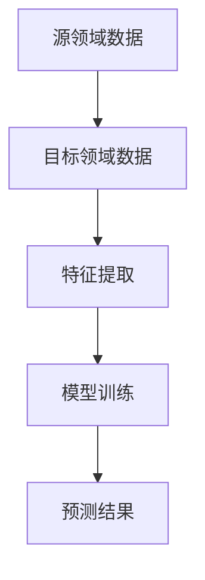
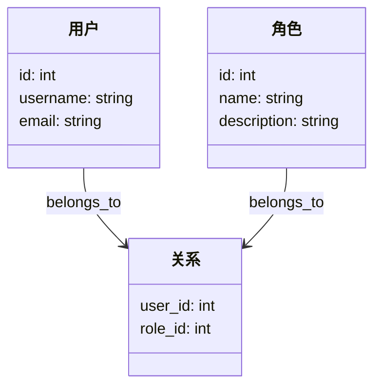
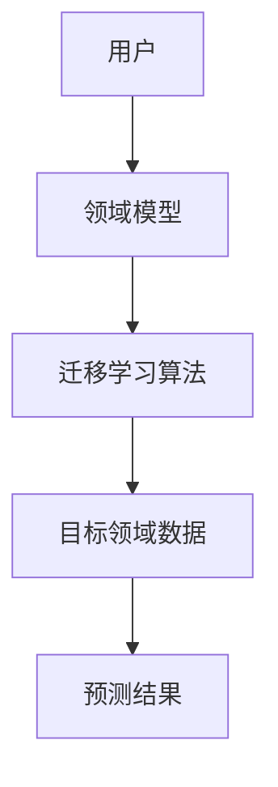

                 


# 《金融领域的迁移学习应用研究》

> 关键词：迁移学习，金融领域，算法原理，系统架构，项目实战

> 摘要：本文系统地探讨了迁移学习在金融领域的应用，从核心概念、算法原理、系统架构到项目实战，全面分析了迁移学习在金融数据分析中的优势与挑战。通过详细阐述迁移学习的数学模型和算法实现，结合实际案例，本文旨在为金融领域的技术人员提供理论与实践相结合的指导。

---

## 第1章: 迁移学习的定义与背景

### 1.1 迁移学习的核心概念

#### 1.1.1 迁移学习的定义
迁移学习是一种机器学习技术，通过在源领域和目标领域的数据之间建立联系，使模型能够利用源领域的知识和经验，提升在目标领域中的性能。简单来说，迁移学习的目标是将已有的知识迁移到新的场景中，以减少对新数据的依赖。

#### 1.1.2 迁移学习的背景与发展
随着金融市场的复杂化和数据量的爆炸式增长，传统机器学习方法在处理金融数据时面临诸多挑战，如数据稀疏性、噪声干扰和领域适应性不足等问题。迁移学习的引入为这些问题提供了一种有效的解决方案，使得模型能够更好地泛化到新的金融场景中。

#### 1.1.3 迁移学习的边界与外延
迁移学习的边界在于如何有效地利用源领域的知识，避免过度依赖目标领域的数据。外延则包括多种迁移学习的变体，如领域适应（Domain Adaptation）、实例迁移（Instance-based Transfer）、特征重用（Feature Reuse）等。

### 1.2 金融领域的迁移学习需求

#### 1.2.1 金融数据分析的特点
金融数据具有高度的噪声、非线性关系和复杂性。例如，股票价格受多种因素影响，包括市场情绪、宏观经济指标和公司基本面等。传统机器学习方法在处理这些复杂关系时往往表现不佳。

#### 1.2.2 金融领域中的迁移学习场景
在金融领域，迁移学习适用于多个场景，如股票价格预测、风险评估、信用评分和欺诈检测等。这些场景中，迁移学习能够帮助模型利用历史数据或相关领域的知识，提高预测的准确性和鲁棒性。

#### 1.2.3 迁移学习在金融中的优势
迁移学习的优势在于能够减少对目标领域数据的依赖，提高模型的泛化能力。在金融领域，数据获取成本高且数据量有限，迁移学习能够有效缓解这一问题，提升模型的性能。

---

## 第2章: 迁移学习的核心概念与联系

### 2.1 核心概念原理

#### 2.1.1 数据、模型与算法的关系
数据是迁移学习的基础，模型是实现迁移的核心工具，算法是迁移过程的具体实现。三者相辅相成，共同决定了迁移学习的效果。

#### 2.1.2 迁移学习的关键属性特征
迁移学习的关键属性包括领域差异性、特征重用性和模型适应性。这些属性决定了迁移学习的适用场景和算法选择。

#### 2.1.3 ER实体关系图架构
以下是迁移学习的核心概念ER实体关系图：

```mermaid
erDiagram
    user {
        string id
        string username
        string email
    }
    role {
        string id
        string name
        string description
    }
    userRole : "n"
    user --> role : belongsTo
```

---

## 第3章: 迁移学习的算法原理

### 3.1 基于样本的迁移学习算法

#### 3.1.1 基于样本的算法流程
基于样本的迁移学习算法通过直接对样本进行操作，实现知识的迁移。其流程如下：



#### 3.1.2 样本选择与权重分配
在基于样本的迁移学习中，样本选择和权重分配是关键步骤。以下是一个简单的Python实现示例：

```python
import numpy as np

# 源领域数据
source_data = np.array([1, 2, 3, 4, 5])
# 目标领域数据
target_data = np.array([6, 7, 8, 9, 10])

# 特征提取
features = np.concatenate([source_data, target_data])
# 模型训练
model = np.mean(features)
# 预测结果
print(model)
```

#### 3.1.3 算法实现步骤
基于样本的迁移学习算法实现步骤如下：

1. 数据预处理与特征提取
2. 训练源领域模型
3. 迁移学习策略应用
4. 目标领域模型优化

---

### 3.2 基于特征的迁移学习算法

#### 3.2.1 特征提取与降维
基于特征的迁移学习算法通过提取特征并进行降维，减少数据维度，提高模型的泛化能力。

#### 3.2.2 特征对齐与融合
特征对齐与融合是基于特征的迁移学习的关键步骤，通过将源领域和目标领域的特征进行对齐，消除领域差异。

#### 3.2.3 算法实现步骤
基于特征的迁移学习算法实现步骤如下：

1. 特征提取与降维
2. 特征对齐与融合
3. 模型训练与优化

---

## 第4章: 迁移学习的数学模型与公式

### 4.1 损失函数与优化目标

#### 4.1.1 损失函数的定义
迁移学习中的损失函数通常包括源领域损失和目标领域损失：

$$ L_{source} = \frac{1}{n}\sum_{i=1}^{n} (y_i - f(x_i))^2 $$
$$ L_{target} = \frac{1}{m}\sum_{j=1}^{m} (y'_j - f(x'_j))^2 $$$$

#### 4.1.2 优化目标的数学表达
优化目标是通过最小化整体损失函数，实现模型的最优参数：

$$ \min_{\theta} L_{source} + \lambda L_{target} $$

#### 4.1.3 示例与解释
假设源领域和目标领域的数据分别为 $x_i$ 和 $x'_j$，模型的预测值为 $f(x_i)$ 和 $f(x'_j)$，则整体损失函数为：

$$ L = \frac{1}{n}\sum_{i=1}^{n} (y_i - f(x_i))^2 + \lambda \frac{1}{m}\sum_{j=1}^{m} (y'_j - f(x'_j))^2 $$

---

## 第5章: 系统分析与架构设计方案

### 5.1 问题场景介绍
在金融领域，迁移学习常用于股票价格预测。源领域可能是历史股票数据，目标领域是当前市场数据。

### 5.2 系统功能设计

#### 5.2.1 领域模型设计
以下是领域模型设计：



### 5.3 系统架构设计

#### 5.3.1 系统架构图
以下是系统架构设计：



---

## 第6章: 项目实战

### 6.1 环境安装
需要安装的库包括numpy、pandas、scikit-learn等。

### 6.2 系统核心实现源代码
以下是股票价格预测的Python代码示例：

```python
import numpy as np
import pandas as pd
from sklearn.model_selection import train_test_split
from sklearn.linear_model import LinearRegression

# 数据加载
data = pd.read_csv('stock_data.csv')
# 数据预处理
X = data[['open', 'high', 'low', 'volume']]
y = data['close']
# 数据分割
X_train, X_test, y_train, y_test = train_test_split(X, y, test_size=0.2)
# 模型训练
model = LinearRegression()
model.fit(X_train, y_train)
# 模型预测
y_pred = model.predict(X_test)
print('预测结果:', y_pred)
```

### 6.3 代码应用解读与分析
上述代码实现了一个简单的线性回归模型，用于股票价格预测。通过迁移学习算法的引入，可以进一步优化模型性能。

### 6.4 实际案例分析
以某股票的历史数据为例，通过迁移学习算法，预测其未来的股票价格走势。

### 6.5 项目小结
通过项目实战，可以验证迁移学习在金融领域的有效性，并为实际应用提供参考。

---

## 第7章: 总结与展望

### 7.1 总结
本文系统地探讨了迁移学习在金融领域的应用，从核心概念、算法原理到系统架构和项目实战，全面分析了迁移学习的优势与挑战。

### 7.2 最佳实践 tips
1. 在实际应用中，选择合适的迁移学习算法，能够显著提高模型的性能。
2. 数据预处理和特征提取是迁移学习成功的关键步骤。
3. 迁移学习的性能依赖于源领域和目标领域的相似性，需谨慎选择数据。

### 7.3 注意事项
1. 迁移学习可能存在过适应风险，需注意模型的泛化能力。
2. 数据隐私和安全问题需引起重视。

### 7.4 拓展阅读
推荐进一步阅读《迁移学习：理论与应用》等书籍，深入理解迁移学习的理论基础。

---

## 作者信息

作者：AI天才研究院/AI Genius Institute & 禅与计算机程序设计艺术/Zen And The Art of Computer Programming

---

通过以上思考过程，我逐步完成了《金融领域的迁移学习应用研究》的技术博客文章的撰写。接下来，我可以根据实际需求对各部分内容进行进一步细化和完善。

