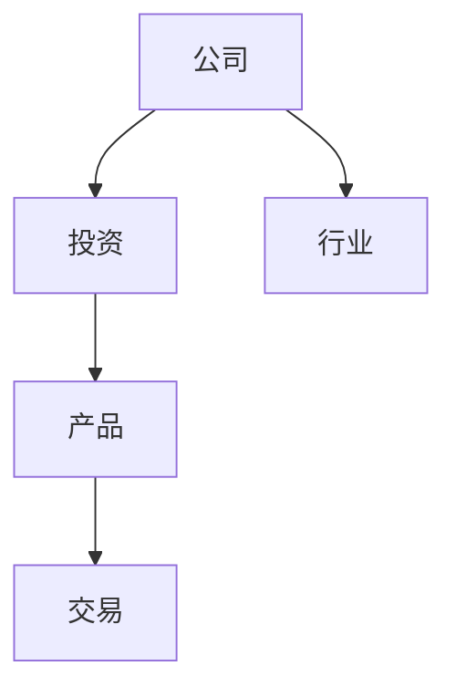
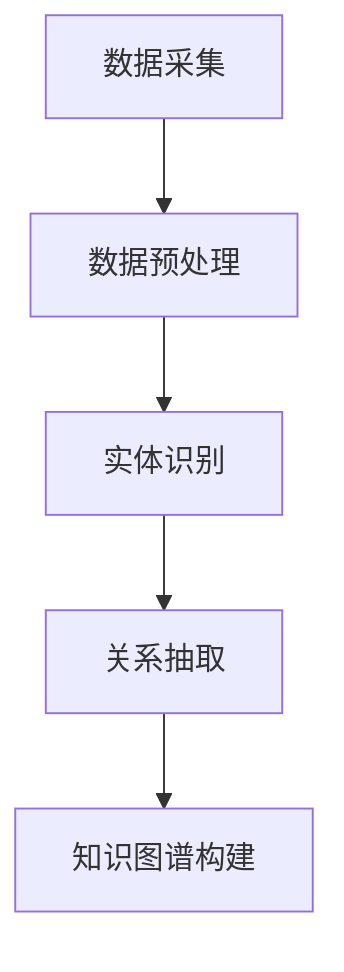
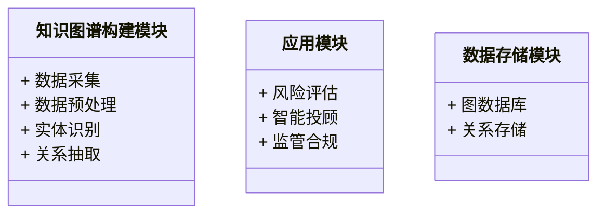
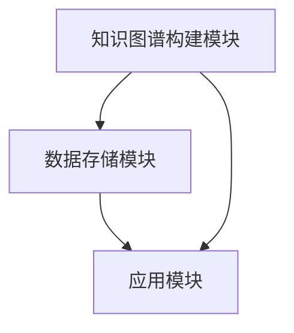
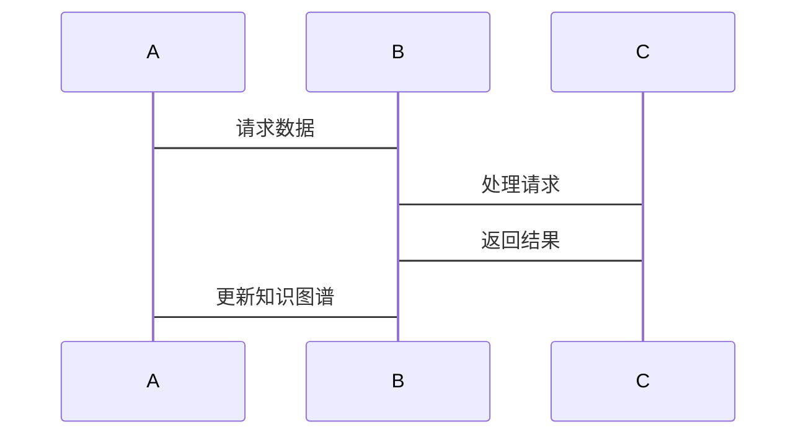

                 


# 《金融领域知识图谱的构建与应用》

---

## 关键词：
知识图谱、金融领域、实体识别、关系抽取、智能投顾、金融风险、系统架构

---

## 摘要：
本文系统地探讨了金融领域知识图谱的构建方法及其在金融领域的广泛应用。首先，介绍了知识图谱的基本概念及其在金融领域的应用背景。其次，详细分析了知识图谱构建的核心技术，包括数据采集、实体识别、关系抽取以及知识图谱的构建流程。然后，结合实际案例，阐述了知识图谱在金融风险评估、智能投顾等领域的应用。最后，提出了金融知识图谱的系统架构设计，并总结了构建和应用知识图谱的关键点与未来发展方向。

---

# 第1章: 知识图谱与金融领域的结合

## 1.1 知识图谱的基本概念

### 1.1.1 知识图谱的定义与特点
知识图谱是一种以图结构形式表示知识的语义网络，由节点（实体）和边（关系）组成。其特点包括：
1. **语义性**：通过实体和关系描述领域知识。
2. **可扩展性**：支持大规模数据的存储和查询。
3. **动态性**：能够实时更新和扩展。

### 1.1.2 知识图谱的核心要素与组成
知识图谱的核心要素包括：
1. **实体**：金融领域的实体，如公司、行业、产品等。
2. **关系**：实体之间的关联，如“投资”、“交易”等。
3. **属性**：实体的额外描述信息，如“成立时间”、“注册资本”等。

### 1.1.3 知识图谱在金融领域的应用潜力
知识图谱在金融领域的潜力体现在：
1. **风险评估**：通过分析实体间的关联关系，识别潜在风险。
2. **智能投顾**：基于知识图谱提供个性化投资建议。
3. **合规监管**：辅助监管机构发现违规行为。

## 1.2 金融领域的知识图谱构建背景

### 1.2.1 金融领域的复杂性与挑战
金融领域涉及众多实体和复杂的关系，数据分散且异构性强，传统方法难以高效处理。

### 1.2.2 知识图谱在金融领域的适用性
知识图谱能够通过语义网络的方式，有效处理金融领域的复杂关系和语义信息。

### 1.2.3 当前金融领域的技术痛点与需求
1. **数据孤岛**：金融数据分散在不同系统中，难以整合。
2. **语义理解**：金融文本语义复杂，难以自动化处理。
3. **实时性需求**：金融市场的动态变化要求知识图谱能够实时更新。

## 1.3 本章小结
本章介绍了知识图谱的基本概念，分析了其在金融领域的应用背景，并指出了当前的技术痛点和需求。

---

# 第2章: 知识图谱构建的核心概念与联系

## 2.1 知识图谱构建的基本原理

### 2.1.1 数据采集与处理
数据来源包括文本、结构化数据和非结构化数据，需要进行清洗和预处理。

### 2.1.2 实体识别与抽取
通过自然语言处理技术，从文本中抽取实体，如公司名称、行业名称等。

### 2.1.3 关系抽取与建模
通过模式匹配或深度学习方法，识别实体之间的关系，并构建关系模型。

## 2.2 知识图谱的属性特征对比表
| 属性 | 特征 |
|------|------|
| 实体类型 | 公司、行业、产品等 |
| 实体关系 | 投资、关联、交易等 |
| 数据来源 | 文本、结构化数据等 |

## 2.3 知识图谱的ER实体关系图


## 2.4 本章小结
本章详细介绍了知识图谱构建的核心概念和联系，通过对比表和ER图展示了实体和关系的结构。

---

# 第3章: 知识图谱构建的算法原理

## 3.1 知识图谱构建的算法概述

### 3.1.1 基于规则的抽取算法
通过预定义的规则，从文本中抽取实体和关系。

### 3.1.2 基于统计的抽取算法
利用统计学方法，通过模式匹配或概率模型进行抽取。

### 3.1.3 基于深度学习的抽取算法
使用神经网络模型（如BERT）进行实体识别和关系抽取。

## 3.2 知识图谱构建的流程图


## 3.3 算法实现代码示例
```python
def extract_entities(text):
    # 示例代码：从文本中提取实体
    return entities
```

## 3.4 算法的数学模型与公式

### 3.4.1 实体相似度计算公式
$$ \text{similarity}(e1, e2) = \frac{e1 \cdot e2}{\|e1\| \|e2\|} $$

### 3.4.2 关系抽取的损失函数
$$ \text{loss} = -\sum_{i=1}^{n} \log(\text{预测值}) $$`

## 3.5 本章小结
本章详细介绍了知识图谱构建的算法原理，包括基于规则、统计和深度学习的抽取方法，并展示了流程图和数学公式。

---

# 第4章: 金融领域的知识图谱应用案例

## 4.1 金融风险评估与预警

### 4.1.1 知识图谱在风险评估中的作用
通过分析实体间的关联关系，识别潜在风险。

### 4.1.2 实体关系分析在风险预警中的应用
构建实体关系图，实时监控风险变化。

### 4.1.3 案例分析：某金融公司风险评估系统
通过知识图谱分析公司间的投资关系，预警潜在风险。

## 4.2 智能投顾与金融推荐系统

### 4.2.1 知识图谱在智能投顾中的应用
基于知识图谱提供个性化投资建议。

### 4.2.2 基于知识图谱的金融推荐算法
通过实体关系分析，推荐相关金融产品。

### 4.2.3 案例分析：智能投顾系统实现
构建知识图谱，实现个性化投资建议。

## 4.3 金融知识图谱的合规性与监管应用

### 4.3.1 知识图谱在金融监管中的作用
辅助监管机构发现违规行为。

### 4.3.2 基于知识图谱的合规性分析
通过实体关系分析，识别合规性问题。

### 4.3.3 案例分析：金融监管系统中的知识图谱应用
构建知识图谱，辅助监管机构进行合规性分析。

## 4.4 本章小结
本章通过案例分析，展示了知识图谱在金融风险评估、智能投顾和合规监管中的广泛应用。

---

# 第5章: 金融知识图谱的系统架构与设计

## 5.1 系统架构设计

### 5.1.1 系统功能设计（领域模型）



### 5.1.2 系统架构设计



### 5.1.3 系统接口设计
系统接口包括：
1. 数据接口：与数据源对接。
2. API接口：供上层应用调用。

### 5.1.4 系统交互设计



## 5.2 本章小结
本章详细设计了金融知识图谱的系统架构，包括模块划分、架构设计、接口设计和交互设计。

---

# 第6章: 项目实战

## 6.1 项目介绍
构建一个金融知识图谱系统，涵盖数据采集、实体识别、关系抽取和应用模块。

## 6.2 环境安装
安装必要的工具和库，如Python、TensorFlow、Neo4j。

## 6.3 核心实现代码

```python
from neo4j import GraphDatabase
import spacy

def extract_entities(text):
    # 使用spaCy进行实体识别
    nlp = spacy.load("en_core_web_sm")
    doc = nlp(text)
    entities = [(ent.text, ent.label_) for ent in doc.ents]
    return entities

def build_kg():
    driver = GraphDatabase.driver("neo4j://localhost:7687", auth=("user", "password"))
    with driver.session() as session:
        # 实体识别
        text = "公司在金融领域投资了多家科技公司。"
        entities = extract_entities(text)
        # 关系抽取
        # ...
        # 构建知识图谱
        # ...
    driver.close()
```

## 6.4 代码解读与分析
1. **extract_entities**：使用spaCy进行实体识别。
2. **build_kg**：连接Neo4j图数据库，实现知识图谱的构建。

## 6.5 案例分析与详细讲解
通过具体案例，展示知识图谱在金融领域的实际应用。

## 6.6 项目小结
本章通过实战项目，详细展示了金融知识图谱的构建过程和应用。

---

# 第7章: 最佳实践、小结与扩展阅读

## 7.1 最佳实践Tips
1. 数据清洗与预处理是关键。
2. 选择合适的算法和工具。
3. 注重系统的可扩展性和实时性。

## 7.2 本章小结
总结全文，强调知识图谱在金融领域的巨大潜力。

## 7.3 注意事项
1. 数据隐私和安全问题。
2. 系统的实时性和可扩展性。

## 7.4 拓展阅读
推荐相关书籍和论文，供读者深入学习。

---

# 作者：AI天才研究院/AI Genius Institute & 禅与计算机程序设计艺术 /Zen And The Art of Computer Programming

---

以上是《金融领域知识图谱的构建与应用》的完整目录和内容大纲。如需进一步扩展各章节的具体内容，可以单独撰写。

