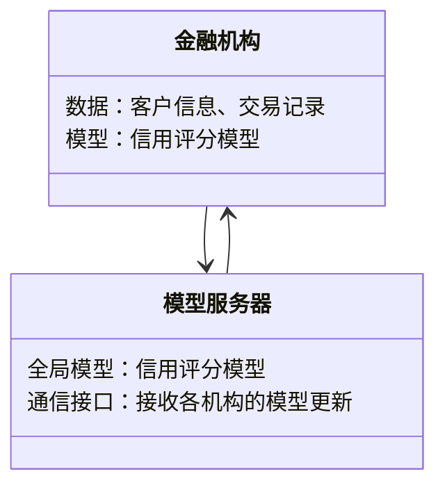

                 


# 《金融领域联邦学习在跨机构信用评分与风险管理中的应用》

**关键词**：联邦学习，金融，信用评分，风险管理，数据隐私，分布式系统，机器学习

**摘要**：  
随着金融行业对数据驱动决策的需求不断增加，跨机构合作在信用评分和风险管理中的重要性日益凸显。然而，数据隐私和安全问题成为了跨机构合作的主要障碍。联邦学习（Federated Learning）作为一种新兴的人工智能技术，能够在保护数据隐私的前提下，实现跨机构的数据协作与模型训练。本文将详细探讨联邦学习在金融领域中的应用，特别是其在信用评分与风险管理中的潜力和挑战。通过理论分析、算法推导和实际案例，本文将为读者提供一个全面的视角，理解如何在金融行业中高效、安全地应用联邦学习技术。

---

## 第1章: 联邦学习与金融应用概述

### 1.1 联邦学习的定义与核心概念

#### 1.1.1 联邦学习的定义  
联邦学习是一种分布式机器学习技术，允许多个参与方在不共享原始数据的情况下，协同训练一个共享的模型。其核心思想是“数据不动，模型动”，即数据保留在本地，仅在模型训练过程中交换加密的梯度信息或模型参数。

#### 1.1.2 联邦学习的核心概念  
- **数据隐私保护**：通过加密技术（如同态加密、差分隐私）确保数据在传输和计算过程中的隐私性。  
- **通信机制**：定义参与方之间的数据交换方式，确保数据仅用于模型训练，不泄露原始数据。  
- **模型同步**：通过聚合各参与方的局部模型更新，生成全局模型，实现模型的迭代优化。  

#### 1.1.3 联邦学习与传统数据共享的区别  
| **特性**       | **传统数据共享**                     | **联邦学习**                          |
|----------------|------------------------------------|-------------------------------------|
| 数据共享方式   | 数据集中到中央服务器                | 数据保持本地，仅交换模型更新          |
| 数据隐私风险   | 高，数据泄露风险大                 | 低，数据隐私得到保护                  |
| 计算效率       | 低，数据预处理和存储成本高          | 高，数据无需移动，计算在本地进行      |

---

### 1.2 金融领域的数据隐私挑战

#### 1.2.1 金融数据隐私的重要性  
金融数据通常包含敏感信息，如客户身份信息、交易记录等，一旦泄露可能导致严重的经济损失和声誉损害。

#### 1.2.2 跨机构数据共享的难点  
- 数据孤岛现象：不同金融机构的数据分散存储，难以形成合力。  
- 数据隐私法律约束：如《通用数据保护条例》（GDPR）要求数据主体对其数据有高度的控制权。  
- 数据格式不统一：不同机构的数据结构和格式差异大，增加了数据整合的难度。  

#### 1.2.3 联邦学习在金融领域的适用性  
联邦学习能够满足金融行业对数据隐私保护的需求，同时支持跨机构协作，为信用评分和风险管理提供高效解决方案。

---

## 第2章: 联邦学习的核心概念与联系

### 2.1 联邦学习的核心原理

#### 2.1.1 数据隐私保护机制  
- **加密技术**：使用同态加密或差分隐私技术，确保数据在计算过程中不被泄露。  
- **联邦加密**：通过多方安全计算（MPC）实现数据隐私保护，确保多个参与方在不共享数据的情况下协同训练模型。  

#### 2.1.2 联邦学习的通信机制  
- **数据交换协议**：定义参与方之间的数据交互方式，确保数据仅用于模型训练。  
- **模型同步协议**：通过联邦聚合算法（如加权平均）将各参与方的局部模型更新整合为全局模型。  

#### 2.1.3 联邦学习的模型同步方法  
- **同步频率**：模型更新可以在每一步迭代后同步，或按固定周期同步。  
- **同步方式**：支持异步和同步更新，异步更新可以提高训练效率，但可能引入通信延迟。  

---

### 2.2 联邦学习的核心概念对比

#### 2.2.1 数据隐私保护与数据可用性的平衡  
- 过度保护数据可能降低模型训练的效率，而过度开放数据则可能违反隐私保护法规。  
- 联邦学习通过加密和差分隐私技术，在保护数据隐私的同时，最大化数据的可用性。  

#### 2.2.2 联邦学习与其他数据共享技术的对比  
| **技术**       | **数据共享方式**             | **隐私保护**   | **计算效率** |
|----------------|-----------------------------|----------------|--------------|
| 数据集中化     | 数据集中到中央服务器         | 低             | 高           |
| 联邦学习       | 数据保持本地，仅交换模型更新 | 高             | 中           |
| 分布式计算     | 数据分布式存储，计算在本地进行| 中             | 中           |

#### 2.2.3 联邦学习的实体关系图  

```mermaid
graph TD
    A[金融机构1] --> B[模型服务器]
    C[金融机构2] --> B
    D[金融机构3] --> B
    B --> A, C, D
```

---

## 第3章: 联邦学习在信用评分中的应用

### 3.1 联邦学习在信用评分中的问题场景

#### 3.1.1 跨机构信用评分的难点  
- 数据孤岛问题：不同金融机构的客户数据分散，难以形成统一的信用评分模型。  
- 数据隐私限制：客户数据包含敏感信息，无法直接共享。  
- 模型泛化能力：单一机构的数据量有限，模型泛化能力不足。  

#### 3.1.2 联邦学习在信用评分中的优势  
- 支持跨机构协作，利用多方数据提升模型精度。  
- 在保护数据隐私的前提下，实现数据的联合利用。  

---

### 3.2 联邦学习在信用评分中的具体实现

#### 3.2.1 数据预处理与加密  
- 数据清洗：去除冗余数据，处理缺失值。  
- 数据加密：对敏感字段（如收入、职业）进行加密处理。  

#### 3.2.2 分布式模型训练  
- 使用联邦学习框架（如Federated Averaging）进行模型训练。  
- 各机构在本地数据上训练模型，并将梯度更新上传到模型服务器。  

#### 3.2.3 模型聚合与优化  
- 通过加权平均等方式聚合各机构的模型更新，生成全局模型。  
- 对模型进行优化，提升预测精度和泛化能力。  

---

## 第4章: 联邦学习在风险管理中的应用

### 4.1 联邦学习在风险管理中的问题场景

#### 4.1.1 风险管理的难点  
- 数据分散：不同机构的风险数据分散，难以进行全局风险评估。  
- 数据隐私限制：风险管理需要整合多方数据，但数据隐私问题限制了数据共享。  

#### 4.1.2 联邦学习在风险管理中的优势  
- 支持跨机构风险数据的联合分析。  
- 在保护数据隐私的前提下，提升风险评估的准确性。  

---

### 4.2 联邦学习在风险管理中的具体实现

#### 4.2.1 风险评估模型设计  
- 设计分布式风险评估模型，支持多机构数据的联合训练。  
- 使用联邦学习框架进行模型训练和优化。  

#### 4.2.2 风险预警机制  
- 基于联邦学习模型，实时监控风险指标，进行风险预警。  
- 通过模型迭代优化，提升风险预警的准确性和及时性。  

---

## 第5章: 联邦学习的数学模型与公式

### 5.1 联邦学习的优化问题

#### 5.1.1 联邦学习的数学模型  
全局模型参数为 $\theta$，各机构的局部模型参数为 $\theta_i$。全局模型通过聚合各机构的局部更新得到：

$$ \theta_{new} = \sum_{i=1}^{n} w_i \theta_i $$

其中，$w_i$ 为机构 $i$ 的权重。

#### 5.1.2 模型聚合的数学公式  
假设各机构的局部模型更新为 $\Delta\theta_i$，全局模型更新为 $\Delta\theta$，则：

$$ \Delta\theta = \sum_{i=1}^{n} w_i \Delta\theta_i $$

其中，$w_i$ 为机构 $i$ 的权重。

---

## 第6章: 联邦学习的算法实现

### 6.1 联邦学习的算法实现流程

#### 6.1.1 数据预处理与加密  
- 数据清洗：处理缺失值、异常值等。  
- 数据加密：对敏感字段进行加密处理。  

#### 6.1.2 分布式模型训练  
- 各机构在本地数据上训练模型，并将梯度更新上传到模型服务器。  

#### 6.1.3 模型聚合与优化  
- 聚合各机构的模型更新，生成全局模型。  
- 对模型进行优化，提升预测精度和泛化能力。  

---

## 第7章: 联邦学习的系统架构设计

### 7.1 系统功能设计

#### 7.1.1 领域模型（Mermaid 类图）  



#### 7.1.2 系统架构（Mermaid 架构图）  

```mermaid
container 联邦学习系统 {
    数据预处理模块
    模型训练模块
    模型聚合模块
    通信接口模块
}
```

---

## 第8章: 联邦学习的项目实战

### 8.1 环境配置与代码实现

#### 8.1.1 环境配置  
- 安装必要的库：`federated-learning`, `numpy`, `tensorflow`等。  

#### 8.1.2 核心代码实现  

```python
import numpy as np
from fed_avg import FederatedAveraging

# 初始化联邦学习框架
fed_avg = FederatedAveraging(num_clients=3, learning_rate=0.1)

# 各机构进行本地训练
for _ in range(num_epochs):
    for client in clients:
        client_model_update = client.train()
        fed_avg.receive_update(client_model_update)

    # 聚合模型更新
    global_model = fed_avg.aggregate()

    # 更新全局模型
    model.set_weights(global_model)
```

---

## 第9章: 总结与展望

### 9.1 总结  
联邦学习为金融行业提供了跨机构数据协作的高效解决方案，能够在保护数据隐私的前提下，提升信用评分和风险管理的准确性。

### 9.2 未来展望  
随着技术的不断发展，联邦学习在金融领域的应用将更加广泛，尤其是在实时风险预警、智能投顾等领域，联邦学习将发挥更大的作用。

---

**作者：AI天才研究院/AI Genius Institute & 禅与计算机程序设计艺术 /Zen And The Art of Computer Programming**

---

以上是《金融领域联邦学习在跨机构信用评分与风险管理中的应用》的技术博客文章目录大纲及部分具体内容。每个章节和小节的内容可以根据实际需求进一步扩展和详细阐述。

