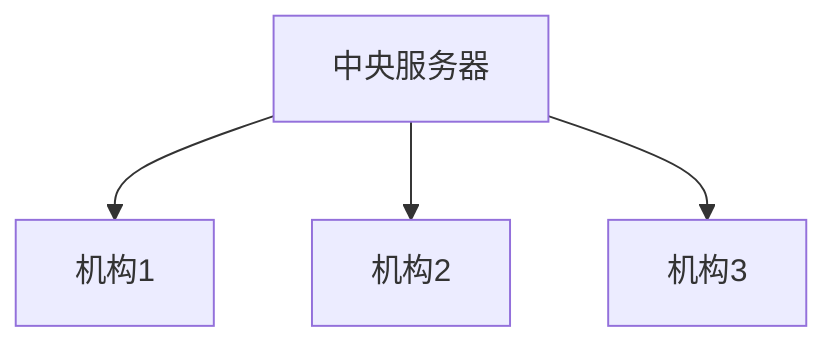

                 


```
# 《金融领域联邦学习在跨机构信用评分中的应用》

> 关键词：联邦学习，跨机构信用评分，数据隐私，机器学习，金融应用，联合建模

> 摘要：本文深入探讨了联邦学习在金融领域中的应用，特别是其在跨机构信用评分中的重要性。通过分析联邦学习的核心原理、算法实现以及实际案例，本文揭示了如何在保护数据隐私的同时，实现跨机构的高效信用评分。文章从背景介绍、核心概念、算法原理、数学模型、系统架构、项目实战等多个维度展开，全面解析联邦学习在金融领域的潜力与挑战，为行业提供理论支持与实践指导。

---

## 第1章: 联邦学习与跨机构信用评分概述

### 1.1 联邦学习的定义与背景
#### 1.1.1 联邦学习的定义
联邦学习（Federated Learning）是一种分布式机器学习技术，允许多个参与方在不共享原始数据的情况下， collaboratively train a shared model. 它通过在各个机构本地数据上进行模型训练，并将模型参数上传到中央服务器或通过其他通信方式，最终生成一个全局模型。

#### 1.1.2 联邦学习的背景与意义
在金融领域，数据隐私和安全是重中之重。传统的集中式信用评分模型需要将所有机构的数据集中到一个地方进行训练，这不仅违反了数据隐私保护的法律，还存在数据泄露的风险。联邦学习通过在本地数据上进行模型训练，并仅传输模型参数，有效解决了这一问题。

#### 1.1.3 跨机构信用评分的定义与挑战
跨机构信用评分是指在不共享原始数据的情况下，多个金融机构共同参与构建一个联合信用评分模型。其挑战主要在于如何在保护数据隐私的同时，确保模型的准确性和泛化能力。

---

### 1.2 金融领域中的数据隐私问题
#### 1.2.1 金融数据的敏感性
金融数据通常包含客户的身份信息、交易记录、财务状况等敏感信息，这些数据一旦泄露，可能会导致严重的经济损失和声誉损害。

#### 1.2.2 数据隐私保护的法律与合规要求
金融行业受到严格的数据隐私保护法规约束，例如欧盟的《通用数据保护条例》（GDPR）和中国的《个人信息保护法》等。这些法规要求金融机构在处理客户数据时必须采取严格的安全措施。

#### 1.2.3 跨机构协作中的数据共享难题
金融机构之间通常存在竞争关系，共享原始数据可能会泄露商业机密。此外，数据格式、样本分布等差异也可能影响模型的训练效果。

---

### 1.3 联邦学习在信用评分中的应用价值
#### 1.3.1 提高信用评分的准确性
通过联邦学习，多个机构可以共同训练一个全局模型，充分利用各机构的数据优势，提高信用评分的准确性。

#### 1.3.2 增强模型的泛化能力
联邦学习可以在不同机构的数据上进行模型训练，使得模型能够更好地泛化到不同机构的客户群体，避免过拟合某一机构的数据。

#### 1.3.3 保护数据隐私的同时实现协作
联邦学习通过在本地数据上进行模型训练，并仅传输模型参数，有效保护了数据隐私，同时实现了跨机构的协作。

---

## 第2章: 联邦学习的核心概念与原理

### 2.1 联邦学习的基本原理
#### 2.1.1 联邦学习的通信机制
联邦学习通过在各个机构本地进行模型训练，并将模型参数上传到中央服务器或通过其他通信方式，最终生成一个全局模型。通信机制可以是同步或异步的。

#### 2.1.2 联邦学习的同步与异步模式
- **同步模式**：所有机构同时进行模型训练，并定期同步模型参数。
- **异步模式**：机构可以在不同的时间进行模型训练，并将模型参数上传到中央服务器。

#### 2.1.3 联邦学习的模型聚合方法
联邦学习的核心是将各个机构的本地模型参数聚合起来，形成一个全局模型。常用的聚合方法包括加权平均和联邦平均（FedAvg）等。

---

### 2.2 联邦学习中的数据隐私保护
#### 2.2.1 加密计算与安全协议
联邦学习可以通过加密计算技术（如同态加密、差分隐私）来保护数据隐私。此外，安全协议（如多方计算）也可以用于确保通信过程的安全性。

#### 2.2.2 差分隐私与同态加密
- **差分隐私**：通过在数据中添加噪声，确保单个数据点的贡献无法被识别。
- **同态加密**：允许在加密数据上进行计算，同时保持数据的隐私性。

#### 2.2.3 联邦学习中的身份认证与权限管理
为了确保只有授权的机构可以参与联邦学习，需要进行严格的身份认证和权限管理。

---

### 2.3 联邦学习的核心算法与实现
#### 2.3.1 联邦平均（FedAvg）算法
联邦平均是一种常见的联邦学习算法，其基本思想是将各个机构的本地模型参数进行加权平均，形成一个全局模型。

#### 2.3.2 联邦直推（FedProx）算法
联邦直推是一种基于 proximal 的联邦学习算法，适用于非独立同分布（non-i.i.d）的数据分布。

#### 2.3.3 联邦学习中的优化策略
为了提高联邦学习的效率和模型性能，可以采用多种优化策略，如动量优化、自适应学习率等。

---

## 第3章: 联邦学习在信用评分中的应用

### 3.1 信用评分的核心指标与模型
#### 3.1.1 信用评分的主要指标
信用评分通常包括还款能力、信用历史、交易行为等多个指标。

#### 3.1.2 传统信用评分模型的局限性
传统信用评分模型通常基于单一机构的数据，难以充分利用跨机构的数据优势。

#### 3.1.3 联邦学习在信用评分中的优势
联邦学习可以在多个机构的数据上进行模型训练，提高信用评分的准确性和泛化能力。

---

### 3.2 联邦学习在信用评分中的具体实现
#### 3.2.1 联邦学习的数据准备与预处理
数据预处理包括数据清洗、特征提取、数据增强等步骤。

#### 3.2.2 联邦学习的模型训练与优化
模型训练可以在各个机构的本地数据上进行，并通过联邦学习的通信机制进行参数聚合。

#### 3.2.3 联邦学习的模型评估与部署
模型评估包括准确率、召回率、F1分数等指标。模型部署可以在云服务器或边缘设备上进行。

---

### 3.3 联邦学习在信用评分中的实际案例
#### 3.3.1 某银行的信用评分系统改造
通过联邦学习，某银行成功实现了与多家机构的联合信用评分模型，显著提高了模型的准确性和泛化能力。

#### 3.3.2 联邦学习在信用评分中的效果对比
与传统信用评分模型相比，联邦学习模型在准确率和召回率方面均表现更优。

#### 3.3.3 联邦学习在信用评分中的未来发展方向
未来，联邦学习在信用评分中的应用将更加广泛，技术也将更加成熟。

---

## 第4章: 联邦学习的算法原理与数学模型

### 4.1 联邦平均（FedAvg）算法
#### 4.1.1 算法的基本思想
FedAvg算法通过在各个机构的本地数据上进行模型训练，并将模型参数上传到中央服务器，最终通过加权平均生成全局模型。

#### 4.1.2 算法的实现步骤
1. 初始化全局模型参数。
2. 每个机构在本地数据上进行模型训练，更新本地模型参数。
3. 将本地模型参数上传到中央服务器。
4. 中央服务器对所有机构的模型参数进行加权平均，生成新的全局模型参数。
5. 重复步骤2-4，直到模型收敛。

#### 4.1.3 算法的优缺点分析
- **优点**：简单易实现，适合大规模数据分布。
- **缺点**：需要中央服务器作为协调节点，可能存在单点故障风险。

---

### 4.2 联邦直推（FedProx）算法
#### 4.2.1 算法的基本思想
FedProx算法基于 proximal 方法，适用于非独立同分布的数据分布。

#### 4.2.2 算法的实现步骤
1. 初始化全局模型参数。
2. 每个机构在本地数据上进行模型训练，更新本地模型参数。
3. 将本地模型参数上传到中央服务器。
4. 中央服务器对所有机构的模型参数进行聚合，生成新的全局模型参数。
5. 重复步骤2-4，直到模型收敛。

#### 4.2.3 算法的优缺点分析
- **优点**：适用于非独立同分布的数据分布。
- **缺点**：实现复杂度较高。

---

### 4.3 联邦学习中的加密算法
#### 4.3.1 同态加密的基本原理
同态加密允许在加密数据上进行计算，同时保持数据的隐私性。

#### 4.3.2 差分隐私的实现方法
差分隐私通过在数据中添加噪声，确保单个数据点的贡献无法被识别。

#### 4.3.3 加密算法在联邦学习中的应用
加密算法可以用于保护联邦学习中的数据通信和模型参数传输。

---

## 第5章: 联邦学习的数学模型与公式

### 5.1 联邦平均（FedAvg）算法的数学模型
$$
\text{全局模型参数更新公式：} \theta_{\text{new}} = \frac{1}{K} \sum_{k=1}^{K} \theta_k
$$
其中，$\theta_k$ 表示第 $k$ 个机构的模型参数，$K$ 表示机构数量。

### 5.2 联邦直推（FedProx）算法的数学模型
$$
\text{优化目标：} \min_{\theta} \sum_{k=1}^{K} \left( \mathcal{L}_k(\theta) + \lambda \|\theta - \theta_{\text{prev}}\|^2 \right)
$$
其中，$\mathcal{L}_k$ 表示第 $k$ 个机构的损失函数，$\lambda$ 表示正则化参数，$\theta_{\text{prev}}$ 表示前一轮的全局模型参数。

### 5.3 联邦学习中的加密算法的数学模型
#### 5.3.1 同态加密的加法同态加密公式
$$
\text{加密数据加法：} E(a + b) = E(a) + E(b)
$$
其中，$a$ 和 $b$ 表示明文数据，$E(a)$ 表示加密后的数据。

#### 5.3.2 差分隐私的噪声添加公式
$$
\text{噪声添加：} y = x + \text{Laplace}(0, \epsilon)
$$
其中，$x$ 表示原始数据，$\text{Laplace}(0, \epsilon)$ 表示拉普拉斯分布生成的噪声，$\epsilon$ 表示隐私预算。

---

## 第6章: 系统分析与架构设计方案

### 6.1 系统功能设计
#### 6.1.1 系统架构图


#### 6.1.2 系统功能模块
- 数据预处理模块
- 模型训练模块
- 模型聚合模块
- 模型评估模块

### 6.2 系统架构设计


### 6.3 系统接口设计
- 数据接口：数据预处理和特征提取。
- 模型接口：模型训练和参数上传。
- 通信接口：模型参数聚合和全局模型生成。

---

## 第7章: 项目实战

### 7.1 环境安装
- 安装Python和相关库（如TensorFlow、Keras等）。
- 安装联邦学习框架（如Federated Learningsuite）。

### 7.2 系统核心实现
```python
# 联邦平均算法实现
def fed_avg(global_model, local_models):
    return sum(local_models) / len(local_models)

# 联邦直推算法实现
def fed_prox(global_model, local_models, prev_model, lambda_val):
    return sum([model + lambda_val * (model - prev_model) for model in local_models]) / len(local_models)
```

### 7.3 案例分析与详细解读
- 数据集：跨机构客户数据。
- 模型训练：使用联邦平均算法训练全局模型。
- 模型评估：对比传统信用评分模型和联邦学习模型的性能。

---

## 第8章: 总结与最佳实践

### 8.1 总结
联邦学习在跨机构信用评分中的应用具有重要意义。通过保护数据隐私，联邦学习可以在不共享原始数据的情况下，实现高效的信用评分模型。

### 8.2 最佳实践 tips
- 数据预处理是关键，确保数据质量和一致性。
- 选择合适的联邦学习算法，根据数据分布和应用场景进行优化。
- 严格遵守数据隐私保护的法律法规，确保合规性。

### 8.3 小结
本文详细探讨了联邦学习在金融领域中的应用，特别是其在跨机构信用评分中的重要性。通过分析联邦学习的核心原理、算法实现以及实际案例，本文揭示了如何在保护数据隐私的同时，实现跨机构的高效信用评分。

---

## 作者：AI天才研究院/AI Genius Institute & 禅与计算机程序设计艺术 /Zen And The Art of Computer Programming
```

