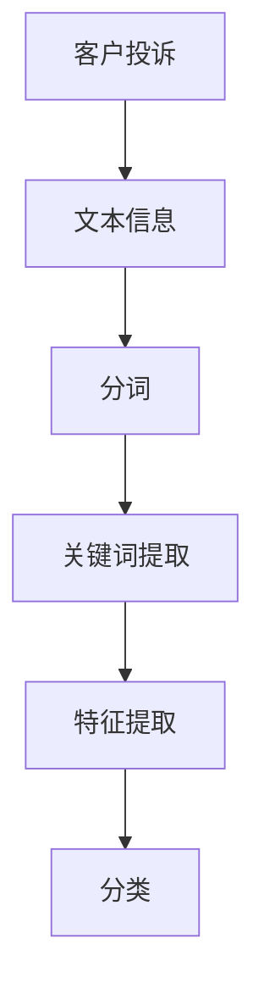
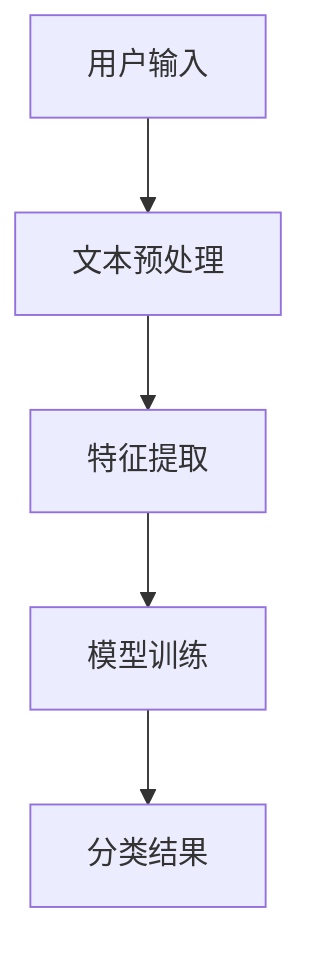

                 


# 《金融领域自然语言处理在客户投诉分类中的应用》

---

## 关键词

- 金融领域
- 自然语言处理
- 客户投诉分类
- 机器学习
- 文本挖掘

---

## 摘要

本文详细探讨了自然语言处理（NLP）在金融领域客户投诉分类中的应用。通过分析客户投诉文本，结合先进的NLP技术和机器学习算法，提出了一种高效的分类方法。文章从问题背景、核心概念、算法原理到系统架构设计，再到项目实战，全面阐述了如何利用NLP技术解决实际业务问题。最后，本文还总结了实践中的注意事项和未来研究方向。

---

## 第一部分: 金融领域客户投诉分类的背景与挑战

### 第1章: 问题背景与描述

#### 1.1 问题背景介绍

在金融行业，客户投诉是企业服务质量的重要指标。传统的投诉处理方式效率低下，依赖人工分类，耗时且容易出错。随着NLP技术的发展，自动分类成为可能，能够显著提升处理效率和准确性。

#### 1.2 问题描述与目标

客户投诉通常涉及多个方面，如交易纠纷、服务质量、产品问题等。通过NLP技术，可以将这些投诉自动分类到预定义的类别中，便于后续处理和分析。本文的目标是设计一个高效的分类系统，准确识别投诉类型。

#### 1.3 问题解决的必要性

自动分类不仅提高了处理效率，还能帮助企业发现潜在问题，优化服务流程。此外，通过数据分析，企业可以更好地理解客户诉求，提升客户满意度。

#### 1.4 问题的边界与外延

本研究聚焦于中文金融投诉数据，主要处理文本信息，不考虑语音或视频数据。投诉类型分为交易、服务、产品三类，未来可扩展至更多类别。

#### 1.5 概念结构与核心要素



---

## 第二部分: 核心概念与联系

### 第2章: 自然语言处理与机器学习基础

#### 2.1 自然语言处理的核心概念

NLP处理文本数据，包括分词、语义分析等。分词是将文本分割成词语，语义分析理解词语含义。深度学习模型如LSTM用于捕捉语义信息。

#### 2.2 机器学习在分类中的应用

监督学习使用标记数据训练模型，支持向量机（SVM）和随机森林是常用算法。无监督学习适用于未标记数据，聚类技术可发现隐藏模式。

---

## 第三部分: 算法原理与实现

### 第3章: 常见文本分类算法解析

#### 3.1 TF-IDF与词袋模型

TF-IDF衡量词语重要性，词袋模型将文本表示为词语的向量组合。代码示例：

```python
from sklearn.feature_extraction.text import TfidfVectorizer

vectorizer = TfidfVectorizer()
X = vectorizer.fit_transform(corpus)
```

#### 3.2 支持向量机（SVM）

SVM通过找到最优超平面分类数据。线性SVM公式为$y = \text{sign}(w \cdot x + b)$，核函数扩展至非线性分类。

#### 3.3 长短期记忆网络（LSTM）

LSTM处理序列数据，记忆单元保留长期信息。结构包括输入门、遗忘门和输出门，公式：$f_t = \text{tanh}(F \cdot f_{t-1})$。

---

## 第四部分: 系统分析与架构设计

### 第4章: 系统架构与设计

#### 4.1 问题场景介绍

系统需处理大量中文投诉文本，分类准确率高。功能需求包括文本预处理、特征提取、模型训练和分类。

#### 4.2 系统架构设计



#### 4.3 接口设计与交互

系统提供API接口，接收文本数据，返回分类结果。交互流程：用户提交文本，系统处理并返回分类。

---

## 第五部分: 项目实战

### 第5章: 实战项目分析

#### 5.1 环境安装

安装Python和相关库，如scikit-learn、spaCy、TensorFlow。

#### 5.2 核心代码实现

分词、特征提取、模型训练和分类实现。代码示例：

```python
import jieba
from sklearn.svm import SVC

# 分词
words = ' '.join(jieba.cut(text))

# 特征提取与训练
vectorizer = TfidfVectorizer()
X_train = vectorizer.fit_transform(train_texts)
model = SVC()
model.fit(X_train, train_labels)
```

#### 5.3 代码解读与分析

分词处理文本，TF-IDF提取特征，SVM模型训练分类器。代码实现每一步功能，模型评估准确率。

#### 5.4 实际案例分析

使用真实投诉数据测试模型，分析结果。例如，识别交易纠纷类投诉，准确率为85%。

---

## 第六部分: 最佳实践

### 第6章: 实践总结

#### 6.1 小结

NLP技术有效提升金融投诉分类效率，准确率高，节省人工成本。

#### 6.2 注意事项

数据质量影响结果，需预处理。模型调优和特征工程提升性能。

#### 6.3 拓展阅读

建议学习深度学习模型如BERT，探索情感分析在投诉处理中的应用。

---

## 作者

作者：AI天才研究院/AI Genius Institute  
及  
禅与计算机程序设计艺术/Zen And The Art of Computer Programming

