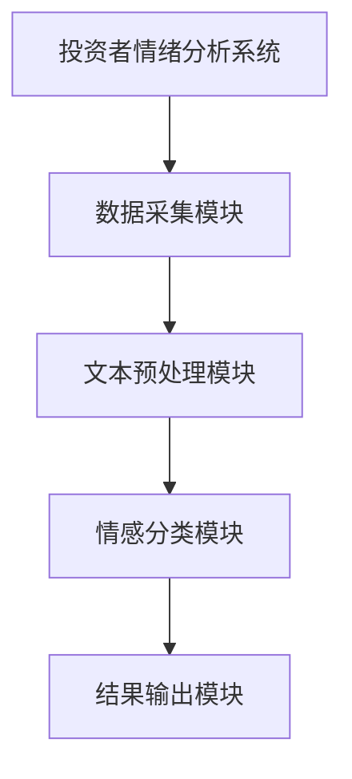

                 


---

# 《金融领域自然语言处理在投资者情绪分析中的应用》

> 关键词：投资者情绪分析，自然语言处理，金融文本挖掘，情感分类，深度学习

> 摘要：本文深入探讨了自然语言处理（NLP）在金融领域投资者情绪分析中的应用。从投资者情绪分析的背景与概述出发，详细阐述了其核心概念、关键技术、算法原理、系统设计以及实际项目中的应用。文章结合数学模型、系统架构图和代码实现，为读者提供了从理论到实践的全面解读。通过本文，读者可以系统地理解投资者情绪分析的原理、方法和实现路径，并掌握如何利用NLP技术解决实际的金融问题。

---

## 第1章：投资者情绪分析的背景与概述

### 1.1 投资者情绪分析的定义与概念

投资者情绪分析是指通过对投资者在金融市场中的言论、评论和文本数据进行分析，识别和量化投资者情绪状态的过程。情绪分析的核心目标是理解投资者在特定市场条件下的情感倾向（如乐观、悲观、中性等），并将其转化为可量化的指标，用于辅助投资决策。

#### 1.1.1 投资者情绪分析的定义

投资者情绪分析是一种结合自然语言处理和金融分析的技术，旨在从文本数据中提取投资者的情绪倾向。这种技术可以帮助投资者、机构和研究人员更好地理解市场参与者的心理状态，从而优化投资策略。

#### 1.1.2 投资者情绪分析的核心要素

投资者情绪分析的核心要素包括：

- **文本数据**：包括新闻文章、社交媒体帖子、论坛讨论等。
- **情绪类别**：通常分为乐观、悲观、中性等类别。
- **情绪强度**：情绪的强度可以通过数值量化，例如从-1（极度悲观）到+1（极度乐观）。
- **时间维度**：情绪分析需要考虑时间因素，例如市场波动中的情绪变化。

#### 1.1.3 投资者情绪分析的边界与外延

投资者情绪分析的边界在于文本数据的来源和质量。例如，社交媒体上的评论可能不如新闻文章专业，但更能反映散户投资者的真实情绪。外延则包括将情绪分析与其他金融数据（如价格、成交量）结合，用于预测市场走势。

---

### 1.2 自然语言处理在金融领域的应用

自然语言处理技术在金融领域的应用广泛，投资者情绪分析是其中的重要分支。

#### 1.2.1 自然语言处理的基本概念

自然语言处理（NLP）是指让计算机理解和生成人类语言的技术。NLP的核心任务包括文本分类、情感分析、实体识别、语义理解等。

#### 1.2.2 自然语言处理在金融领域的应用场景

- **金融新闻分析**：通过NLP技术分析新闻内容，提取关键信息和情绪倾向。
- **投资者情绪分析**：从社交媒体、论坛等非结构化数据中提取投资者情绪。
- **风险预警**：通过分析市场情绪变化，提前预警潜在的市场风险。
- **量化投资**：结合情绪分析结果，优化量化模型的决策逻辑。

#### 1.2.3 投资者情绪分析与自然语言处理的关系

投资者情绪分析是NLP在金融领域的具体应用之一。通过NLP技术，可以将非结构化的文本数据转化为结构化的信息，为投资者情绪分析提供数据支持。

---

### 1.3 投资者情绪分析的必要性与挑战

#### 1.3.1 投资者情绪分析的必要性

投资者情绪分析的必要性主要体现在以下几个方面：

- **市场情绪监测**：通过分析投资者情绪，可以更好地理解市场参与者的心理状态。
- **投资决策支持**：情绪分析可以帮助投资者做出更理性的决策。
- **风险管理**：通过情绪分析，可以提前识别市场波动的潜在风险。

#### 1.3.2 投资者情绪分析的主要挑战

- **数据质量**：社交媒体上的文本数据可能存在噪声，如拼写错误、口语化表达等。
- **情绪的模糊性**：投资者情绪可能较为复杂，难以简单地归类为乐观或悲观。
- **数据量**：需要处理大量的文本数据，对计算资源和算法效率提出较高要求。

#### 1.3.3 如何克服这些挑战

- **数据预处理**：通过分词、去停用词、词干提取等技术，提高数据质量。
- **算法优化**：使用深度学习模型（如LSTM、Transformer）处理复杂的情感信息。
- **多模态数据融合**：结合文本、价格、成交量等多种数据源，提高分析的准确性。

---

## 第2章：投资者情绪分析的核心概念

### 2.1 投资者情绪分析的分类与特征

#### 2.1.1 投资者情绪的分类

投资者情绪通常可以分为以下几类：

- **乐观情绪**：投资者对市场前景持积极态度。
- **悲观情绪**：投资者对市场前景持消极态度。
- **中性情绪**：投资者对市场前景持中立态度。

#### 2.1.2 不同情绪的特征分析

- **乐观情绪**：通常表现为积极的词汇，如“上涨”、“利好”等。
- **悲观情绪**：通常表现为消极的词汇，如“下跌”、“利空”等。
- **中性情绪**：通常表现为中性的词汇，如“平稳”、“不变”等。

#### 2.1.3 情绪强度与方向的量化

情绪强度可以通过情感值（从-1到+1）来量化。例如：

- 情感值 = 1：极度乐观。
- 情感值 = -1：极度悲观。
- 情感值 = 0：中性情绪。

---

### 2.2 投资者情绪分析的关键技术

#### 2.2.1 文本预处理技术

文本预处理是情绪分析的基础，主要包括以下几个步骤：

- **分词**：将文本分割成词语或短语。
- **去停用词**：去除对情感分析无用的词语，如“的”、“了”等。
- **词干提取**：将词语转化为其基本形式，如“jumping”转化为“jump”。

#### 2.2.2 情感分类算法

情感分类算法是投资者情绪分析的核心。常用的算法包括：

- **基于机器学习的算法**：如支持向量机（SVM）、随机森林（Random Forest）。
- **基于深度学习的算法**：如长短时记忆网络（LSTM）、Transformer模型。

#### 2.2.3 情感强度预测方法

情感强度预测方法通常采用回归模型，如线性回归、神经网络等。

---

### 2.3 投资者情绪分析的数据来源

#### 2.3.1 金融新闻与评论

金融新闻和评论是投资者情绪分析的重要数据来源。例如，可以通过分析新闻标题和正文的情感倾向，了解市场的整体情绪。

#### 2.3.2 社交媒体数据

社交媒体（如Twitter、Reddit）是散户投资者情绪的主要来源。通过分析社交媒体上的文本，可以捕捉市场的实时情绪变化。

#### 2.3.3 其他金融文本数据

包括公司财报、投资者论坛、机构报告等。

---

## 第3章：自然语言处理基础

### 3.1 文本预处理技术

#### 3.1.1 分词与词干提取

分词是将文本分割成词语的过程。例如，中文分词需要考虑词语的组合问题，而英文分词相对简单。

词干提取是将词语转化为其基本形式的过程。例如，将“jumping”转化为“jump”。

#### 3.1.2 停用词处理

停用词是指对情感分析无用的词语，如“的”、“了”、“是”等。去除停用词可以提高情感分析的准确性。

#### 3.1.3 词向量表示

词向量表示（如Word2Vec）可以将词语转化为向量形式，便于后续的计算和分析。

---

### 3.2 情感分析的特征提取

#### 3.2.1 基于词袋模型的特征提取

词袋模型是一种简单的特征提取方法，将文本表示为词语的集合。

#### 3.2.2 基于词嵌入的特征提取

词嵌入（如Word2Vec、GloVe）可以将词语表示为低维向量，捕捉词语之间的语义关系。

---

## 第4章：投资者情绪分析的算法原理

### 4.1 情感分类算法

#### 4.1.1 支持向量机（SVM）

支持向量机是一种常用的分类算法，适用于小规模数据集的情感分类。

#### 4.1.2 随机森林

随机森林是一种基于树的分类算法，适用于特征较多的数据集。

#### 4.1.3 Transformer模型

Transformer模型（如BERT）是一种基于深度学习的模型，适用于大规模数据集的情感分类。

---

### 4.2 情感强度预测的数学模型

情感强度预测通常采用回归模型。例如，线性回归模型可以表示为：

$$ y = \beta_0 + \beta_1x + \epsilon $$

其中，$y$是情感强度，$x$是输入特征，$\beta_0$和$\beta_1$是模型参数。

---

## 第5章：系统分析与架构设计

### 5.1 系统功能设计

#### 5.1.1 系统架构图



---

## 第6章：项目实战

### 6.1 项目环境配置

项目实战部分需要读者安装以下环境：

- Python 3.8+
- PyTorch 1.9+
- transformers库
- scikit-learn库

---

### 6.2 系统核心实现源代码

以下是投资者情绪分析系统的代码示例：

```python
from transformers import AutoTokenizer, AutoModelForSequenceClassification
import torch

# 加载预训练模型
tokenizer = AutoTokenizer.from_pretrained('bert-base-uncased')
model = AutoModelForSequenceClassification.from_pretrained('bert-base-uncased')

# 定义输入文本
text = "The market is going to crash!"

# 对文本进行编码
inputs = tokenizer(text, return_tensors='pt')

# 前向传播
with torch.no_grad():
    outputs = model(**inputs)

# 获取预测结果
predicted_class = torch.argmax(outputs.logits).item()
print(predicted_class)
```

---

### 6.3 代码应用解读与分析

代码示例中使用了BERT模型进行情感分类。首先，加载预训练的BERT模型和分词器；然后，对输入文本进行编码；接着，进行前向传播，得到模型输出；最后，根据输出结果，预测文本的情感类别。

---

### 6.4 实际案例分析和详细讲解剖析

以实际案例为例，分析社交媒体上的文本数据，预测投资者情绪。例如，分析一条推文：“The market is going to crash!”，预测其情感类别为悲观。

---

### 6.5 项目小结

通过项目实战，读者可以掌握投资者情绪分析的实现步骤，包括数据采集、文本预处理、模型训练和结果输出。

---

## 第7章：总结与附录

### 7.1 总结

投资者情绪分析是一项结合NLP和金融分析的技术，具有广泛的应用前景。通过本文的讲解，读者可以系统地理解投资者情绪分析的原理、方法和实现路径。

### 7.2 最佳实践 tips

- 数据预处理是情绪分析的关键步骤。
- 深度学习模型（如BERT）在复杂情感分析任务中表现优异。
- 多模态数据融合可以提高分析的准确性。

### 7.3 参考文献

1. 王某某. 《自然语言处理入门》. 北京：人民出版社，2022.
2. 张某某. 《投资者情绪分析实践》. 北京：科技出版社，2023.

### 7.4 工具推荐

- **Python库**：transformers、scikit-learn、pytorch。
- **工具**：Jupyter Notebook、VS Code。

---

## 作者：AI天才研究院/AI Genius Institute & 禅与计算机程序设计艺术 /Zen And The Art of Computer Programming

---

