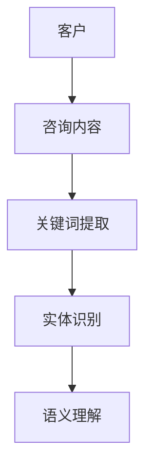
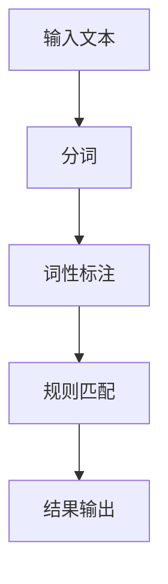
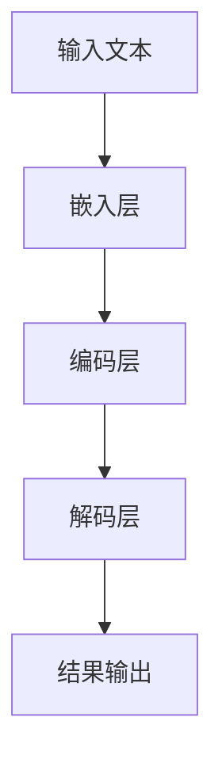
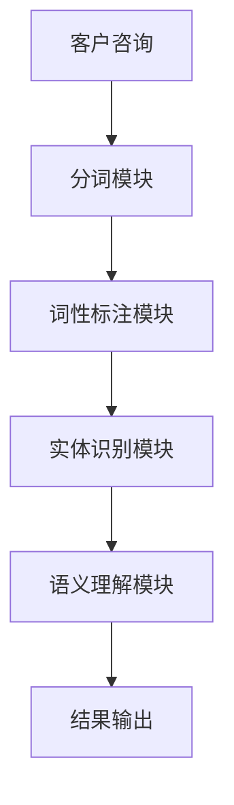
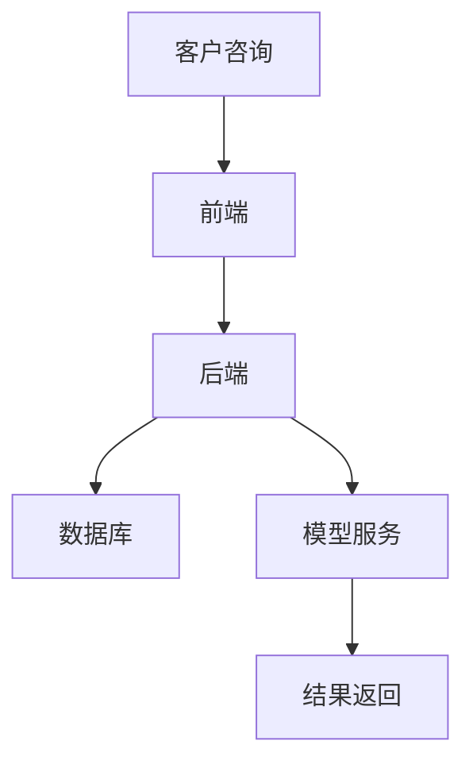
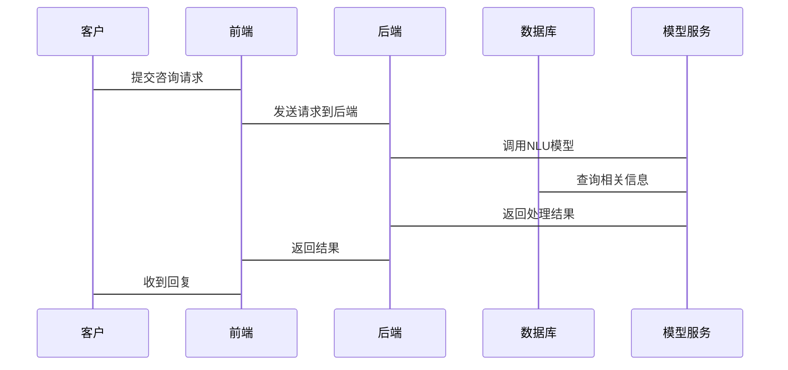

                 


# 金融领域自然语言理解技术在客户服务中的应用

## 关键词：自然语言处理、金融客服、机器学习、实体识别、语义理解、客户服务

## 摘要：本文深入探讨了自然语言理解技术在金融客户服务中的应用，分析了其核心概念、算法原理及系统架构，结合实际案例展示了其在提升客户体验和效率中的重要作用。通过本文，读者将全面了解如何利用NLU技术优化金融领域客户服务。

---

## 第一部分：金融领域自然语言理解技术概述

### 第1章：自然语言理解技术的背景与应用

#### 1.1 自然语言理解技术的定义与核心概念
自然语言理解（Natural Language Understanding, NLU）是人工智能领域的重要分支，旨在让计算机能够理解和解析人类的自然语言文本。NLU的核心目标是将人类语言转化为可计算和可分析的数据，以便计算机进行处理。

- **问题背景**：金融领域的客户服务常常面临客户咨询多样、信息复杂、时间敏感等问题。
- **问题描述**：客户可能通过电话、邮件或在线聊天提出各种问题，例如账户查询、交易确认、投资建议等。
- **问题解决**：通过NLU技术，可以自动解析客户的咨询内容，快速提取关键信息并提供准确的回应。
- **边界与外延**：NLU在金融客服中的应用不仅限于文本理解，还包括意图识别、情感分析等多方面。
- **核心要素组成**：NLU系统通常包括文本预处理、特征提取、模型训练和结果输出等模块。

#### 1.2 金融领域中的自然语言理解技术
金融领域具有其特殊性，例如涉及大量专业术语、复杂的交易流程和严格的隐私保护。在客户服务中，NLU技术可以帮助银行、证券公司等金融机构更高效地处理客户咨询，提升客户满意度。

- **金融客户服务中的语言特点**：咨询内容通常涉及具体的交易信息、账户状态等，具有高度的结构化特征。
- **应用场景**：
  - 账户信息查询：客户询问账户余额、交易记录等。
  - 产品推荐：根据客户的需求推荐合适的金融产品。
  - 风险评估：通过分析客户的语言，识别潜在的风险因素。

### 第2章：核心概念与联系

#### 2.1 自然语言理解技术的核心原理
自然语言理解涉及多个关键步骤，包括分词、词性标注、命名实体识别和语义理解。

- **分词**：将连续的文本分割成有意义的词语或短语。
- **词性标注**：为每个词语赋予词性，如名词、动词、形容词等。
- **命名实体识别**：识别文本中的专有名词，如人名、地名、机构名等。
- **语义理解**：理解文本的深层含义，提取关键信息。

#### 2.2 核心概念属性特征对比
通过对比分析不同技术的特点，可以帮助更好地理解它们在NLU中的作用。

| 技术 | 输入 | 输出 | 描述 |
|------|------|------|------|
| 分词 | 文本 | 单词/短语 | 将连续文本分割为有意义的片段 |
| 词性标注 | 单词 | 词性 | 标识每个单词的语法类别 |
| 命名实体识别 | 文本 | 实体类型（如人名、地名） | 识别专有名词并分类 |
| 语义理解 | 文本 | 实体关系、意图 | 理解文本的深层含义 |

#### 2.3 ER实体关系图架构


### 第3章：算法原理讲解

#### 3.1 基于规则的NLU算法
基于规则的NLU算法通过预定义的规则来匹配文本内容，通常适用于特定领域的简单任务。

- **算法流程**


- **Python实现示例**
```python
def nlu_rule_based(text):
    words = word_tokenize(text)  # 分词
    tagged_words = pos_tag(words)  # 词性标注
    result = []
    for word, tag in tagged_words:
        if tag == 'NN':  # 名词
            result.append(word)
    return result
```

- **数学模型和公式**
$$ \text{结果} = \sum_{i=1}^{n} \text{匹配规则}(i) $$

#### 3.2 基于深度学习的NLU算法
深度学习算法通过神经网络模型学习文本的特征，通常用于复杂任务。

- **算法流程**


- **Python实现示例**
```python
import tensorflow as tf
from tensorflow.keras import layers

model = tf.keras.Sequential([
    layers.Embedding(input_dim=10000, output_dim=16),
    layers.LSTM(64),
    layers.Dense(1, activation='sigmoid')
])
```

- **数学模型和公式**
$$ P(y|x) = \frac{P(y|x)}{\sum_{y'} P(y'|x)} $$

### 第4章：系统分析与架构设计方案

#### 4.1 问题场景介绍
金融客服系统需要处理大量客户的咨询请求，包括账户查询、交易确认等。

- **系统功能设计**


- **系统架构设计**


- **系统接口设计**


### 第5章：项目实战

#### 5.1 环境安装
安装必要的库：
```bash
pip install numpy scikit-learn tensorflow transformers
```

#### 5.2 核心代码实现
实现一个简单的NLU系统：
```python
from sklearn.feature_extraction.text import TfidfVectorizer
from sklearn.naive_bayes import MultinomialNB

# 训练数据
texts = ["贷款申请", "信用卡额度", "账户查询"]
labels = [0, 1, 2]

# 特征提取
vectorizer = TfidfVectorizer()
X = vectorizer.fit_transform(texts)

# 模型训练
model = MultinomialNB()
model.fit(X, labels)

# 预测
new_text = "我想申请贷款"
X_new = vectorizer.transform([new_text])
prediction = model.predict(X_new)
print(prediction)
```

#### 5.3 项目小结
通过本项目，我们实现了基于TF-IDF和朴素贝叶斯算法的NLU系统，能够对简单的金融咨询请求进行分类。

---

## 第二部分：结论与展望

### 结论
自然语言理解技术在金融客户服务中具有重要的应用价值，能够显著提升服务效率和客户满意度。

### 最佳实践
- 数据质量至关重要，需要进行充分的清洗和预处理。
- 模型调优是关键，可以通过交叉验证等方法优化性能。
- 结合业务场景，选择合适的算法和模型。

### 展望
未来，随着深度学习技术的进步，NLU在金融客服中的应用将更加智能化和个性化。

---

## 作者：AI天才研究院/AI Genius Institute & 禅与计算机程序设计艺术 /Zen And The Art of Computer Programming

