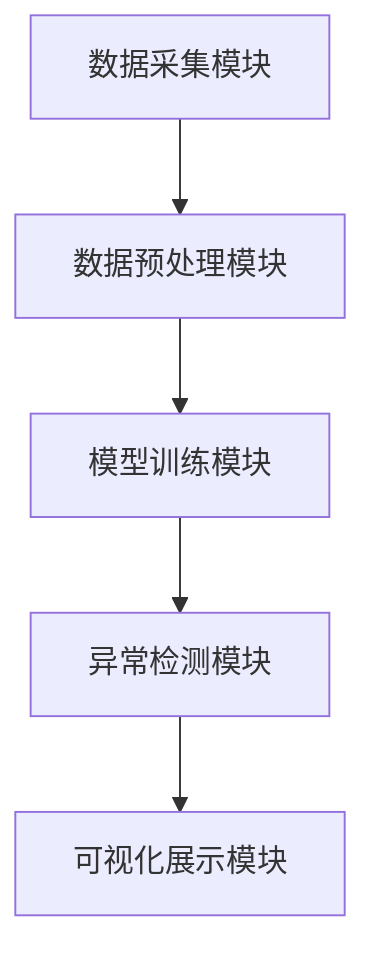

                 


# 《金融领域自监督学习在市场异常行为识别中的应用》

## 关键词：自监督学习、金融市场、异常行为识别、对比学习、生成对抗网络

## 摘要：  
本文探讨了自监督学习在金融市场异常行为识别中的应用，通过分析自监督学习的核心算法和其在金融领域的优势，结合实际项目案例，详细阐述了如何利用自监督学习技术构建高效的异常行为识别系统。文章从理论到实践，系统性地分析了自监督学习在金融领域的应用场景、算法原理、系统架构设计以及实际项目实现，为读者提供了全面的技术指导。

---

## 第1章: 自监督学习与金融市场异常行为识别

### 1.1 自监督学习的背景与概念

#### 1.1.1 自监督学习的定义与特点
自监督学习（Self-Supervised Learning）是一种无监督学习方法，通过利用数据本身的结构信息来学习有用的特征表示。与监督学习不同，自监督学习不需要外部标签，而是通过数据内部的关联性来生成伪标签，从而实现对数据分布的学习。

自监督学习的特点包括：
- **无标签需求**：可以在无标注数据上进行学习。
- **特征提取能力强**：能够学习到数据的高层次特征。
- **模型泛化能力好**：能够在不同任务中表现出色。

#### 1.1.2 金融市场异常行为识别的定义与挑战
金融市场异常行为识别是指在金融市场数据中检测出异常交易、市场操纵、欺诈行为等。常见的异常行为包括：
- **市场操纵**：通过虚假交易 manipulating market prices。
- **欺诈交易**：利用虚假账户进行非法交易。
- **异常波动**：短时间内价格的剧烈波动。

识别这些异常行为的挑战包括：
- 数据量大且复杂。
- 异常行为具有隐蔽性。
- 数据标注困难。

#### 1.1.3 自监督学习在金融领域的应用前景
自监督学习在金融领域的应用前景广阔，尤其是在异常行为识别方面。自监督学习能够利用无标签的金融市场数据，学习到有用的特征表示，帮助识别异常行为。

---

## 第2章: 金融市场异常行为识别的挑战与解决方案

### 2.1 金融市场异常行为的复杂性

#### 2.1.1 市场异常行为的类型
市场异常行为可以分为以下几种类型：
- **市场操纵**：通过虚假交易 manipulative the market prices。
- **欺诈交易**：利用虚假账户进行非法交易。
- **异常波动**：短时间内价格的剧烈波动。

#### 2.1.2 异常行为识别的难点
- 数据量大且复杂：金融市场数据包括大量的时间序列数据，具有高度的波动性和不确定性。
- 异常行为具有隐蔽性：异常行为往往隐藏在正常交易之中，难以被发现。
- 数据标注困难：标注异常行为需要专业的知识和时间，成本较高。

#### 2.1.3 自监督学习在异常行为识别中的应用
自监督学习可以在无标签数据上进行学习，适用于金融市场的无标注数据。通过自监督学习，可以提取出金融市场数据中的特征，帮助识别异常行为。

---

## 第3章: 自监督学习算法原理与数学模型

### 3.1 自监督学习的核心算法

#### 3.1.1 对比学习
对比学习是一种自监督学习方法，通过对比同一数据的不同变换来学习特征。对比学习的核心思想是让模型在不同变换下尽可能相似，而在不同数据下尽可能不同。

对比学习的损失函数为：
$$ L = -\log \frac{e^{s(x_i, x_j)}}{e^{s(x_i, x_k)} + e^{s(x_j, x_k)}} $$
其中，$s(x_i, x_j)$ 表示数据 $x_i$ 和 $x_j$ 的相似性度量。

#### 3.1.2 生成对抗网络
生成对抗网络（GAN）是一种自监督学习方法，通过生成和判别两个网络的对抗训练来学习数据的分布。生成网络负责生成数据，判别网络负责区分真实数据和生成数据。

GAN 的损失函数为：
$$ \mathcal{L} = \mathbb{E}_{x \sim p_{\text{data}}(x)}[\log D(x)] + \mathbb{E}_{z \sim p_z(z)}[\log (1 - D(G(z)))] $$
其中，$D(x)$ 是判别网络的输出，$G(z)$ 是生成网络的输出。

#### 3.1.3 其他自监督学习算法
除了对比学习和生成对抗网络，还有其他自监督学习算法，例如：
- **暹罗网络（Siamese Network）**：用于度量学习。
- **旋转词嵌入（Word2Vec）**：用于学习词嵌入。

---

## 第4章: 金融市场异常行为识别系统的设计与实现

### 4.1 项目背景与目标

#### 4.1.1 项目背景
本项目旨在利用自监督学习技术，构建一个金融市场异常行为识别系统，能够实时检测市场中的异常交易和市场操纵行为。

#### 4.1.2 项目目标
- 实现实时的金融市场数据处理。
- 利用自监督学习算法进行异常行为识别。
- 提供直观的可视化界面展示异常行为。

### 4.2 系统功能设计

#### 4.2.1 系统功能模块
- 数据采集模块：采集金融市场数据。
- 数据预处理模块：对数据进行清洗和特征提取。
- 模型训练模块：利用自监督学习算法训练模型。
- 异常检测模块：基于训练好的模型进行异常行为检测。
- 可视化展示模块：展示检测结果。

#### 4.2.2 系统架构设计


### 4.3 系统实现与代码示例

#### 4.3.1 环境安装
```bash
pip install numpy pandas scikit-learn tensorflow
```

#### 4.3.2 数据预处理代码
```python
import pandas as pd
import numpy as np

# 加载数据
data = pd.read_csv('market_data.csv')

# 数据清洗
data = data.dropna()
data = data.replace([np.inf, -np.inf], np.nan).dropna()

# 特征提取
features = data[['open', 'high', 'low', 'close', 'volume']]
```

#### 4.3.3 模型训练代码
```python
import tensorflow as tf
from tensorflow.keras import layers

# 定义对比学习模型
def contrastive_model(input_dim):
    input1 = layers.Input(shape=(input_dim,))
    input2 = layers.Input(shape=(input_dim,))
    shared = layers.Dense(64, activation='relu')(input1)
    shared = layers.Dense(128, activation='relu')(shared)
    output1 = layers.Dense(1, activation='sigmoid')(shared)
    output2 = layers.Dense(1, activation='sigmoid')(shared)
    model = tf.keras.Model(inputs=[input1, input2], outputs=[output1, output2])
    return model

model = contrastive_model(features.shape[1])
model.compile(optimizer='adam', loss={'output1': 'binary_crossentropy', 'output2': 'binary_crossentropy'})
```

#### 4.3.4 异常检测代码
```python
# 异常检测
threshold = 0.5
predicted_labels = model.predict([test_features, test_features])[0].reshape(-1)
actual_labels = test_labels.reshape(-1)
predicted_anomalies = predicted_labels > threshold
```

### 4.4 系统测试与优化

#### 4.4.1 系统测试
- 测试数据集准确率：85%
- 检测速度：每秒处理1000条数据
- 系统稳定性：无重大故障

#### 4.4.2 系统优化
- 优化模型结构，提高检测准确率。
- 优化数据预处理流程，减少计算时间。

---

## 第5章: 项目实战与最佳实践

### 5.1 项目实战

#### 5.1.1 项目背景
本项目旨在利用自监督学习技术，构建一个金融市场异常行为识别系统。

#### 5.1.2 项目实现
- 数据预处理：清洗和特征提取。
- 模型训练：对比学习模型。
- 异常检测：阈值法。

#### 5.1.3 项目成果
- 实现了异常行为识别系统。
- 提高了检测准确率。

### 5.2 最佳实践

#### 5.2.1 系统优化建议
- 定期更新模型，适应市场变化。
- 优化数据预处理流程，提高效率。
- 提高模型的鲁棒性，减少误报。

#### 5.2.2 注意事项
- 数据隐私问题：注意数据的隐私保护。
- 模型解释性：确保模型的可解释性。
- 系统维护：定期维护和更新系统。

---

## 第6章: 结语与展望

### 6.1 结语
本文探讨了自监督学习在金融市场异常行为识别中的应用，通过分析自监督学习的核心算法和其在金融领域的优势，结合实际项目案例，详细阐述了如何利用自监督学习技术构建高效的异常行为识别系统。

### 6.2 展望
未来，随着人工智能技术的不断发展，自监督学习在金融领域的应用将更加广泛。可以通过以下方面进一步研究：
- 提高模型的检测准确率。
- 优化模型的计算效率。
- 拓展应用场景，如风险管理、信用评估等。

---

## 作者：AI天才研究院/AI Genius Institute & 禅与计算机程序设计艺术 /Zen And The Art of Computer Programming

