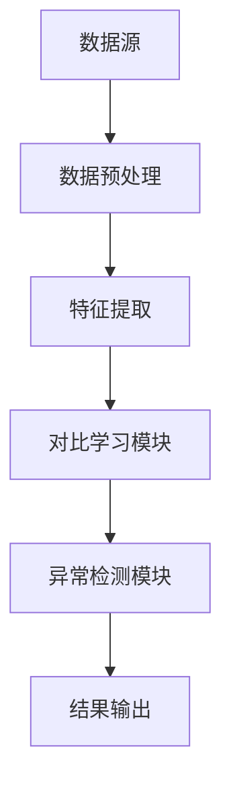

                 


# 《金融领域自监督学习在异常交易检测中的应用》

> 关键词：自监督学习、异常交易检测、金融数据、对比学习、知识蒸馏、深度学习、人工智能

> 摘要：本文深入探讨了自监督学习在金融领域异常交易检测中的应用。首先，我们从背景和挑战入手，分析了传统监督学习的局限性，介绍了自监督学习的核心概念和原理。接着，我们详细讲解了对比学习和知识蒸馏在金融数据中的具体应用，通过数学模型和算法流程图展示了自监督学习的优势。随后，我们设计了完整的系统架构，并通过实际案例展示了自监督学习在异常交易检测中的实际应用。最后，我们总结了最佳实践和注意事项，为读者提供了全面的指导。

---

## 第1章: 自监督学习概述

### 1.1 自监督学习的定义与特点

#### 1.1.1 自监督学习的定义
自监督学习是一种无监督学习的变体，通过利用数据本身的结构信息来生成监督信号。其核心思想是通过对比同一数据的不同视图或增强版本，来学习数据的潜在表示。

#### 1.1.2 自监督学习的核心特点
- **无标签数据的利用**：自监督学习可以在无标签数据上进行学习，降低了对标注数据的依赖。
- **对比学习**：通过对比同一数据的不同视图，自监督学习能够有效提取数据的特征。
- **数据增强**：自监督学习通常结合数据增强技术，进一步提升模型的泛化能力。

#### 1.1.3 自监督学习与监督学习的区别
| 特性 | 监督学习 | 自监督学习 |
|------|----------|------------|
| 数据需求 | 需要标注数据 | 无需求标注数据 |
| 模型目标 | 优化分类或回归任务 | 优化数据表示或对比任务 |
| 应用场景 | 数据量充足时 | 数据量不足或标注困难时 |

### 1.2 金融领域中的异常交易检测

#### 1.2.1 异常交易检测的定义
异常交易检测是指识别金融市场中的异常交易行为，如欺诈、洗钱、市场操纵等。

#### 1.2.2 异常交易检测的挑战与难点
- **数据稀疏性**：异常交易样本通常较少，而正常交易样本较多。
- **实时性要求**：金融交易需要实时检测，对计算效率要求高。
- **数据复杂性**：金融数据通常包含时间序列、多维特征等复杂结构。

#### 1.2.3 自监督学习在异常交易检测中的优势
- **无标签数据的利用**：自监督学习可以利用无标签的正常交易数据进行学习。
- **鲁棒性**：通过对比学习，自监督学习能够更好地捕捉数据中的异常特征。

### 1.3 本章小结
本章介绍了自监督学习的基本概念和特点，并分析了金融领域异常交易检测的挑战与难点，最后探讨了自监督学习在该领域的优势。

---

## 第2章: 自监督学习的核心概念与原理

### 2.1 自监督学习的核心概念

#### 2.1.1 数据表示与特征提取
数据表示是指将原始数据转换为模型可以理解的低维特征。特征提取是通过深度学习模型将原始数据映射到低维空间。

#### 2.1.2 对比学习与自监督目标函数
对比学习是一种自监督学习方法，通过对比同一数据的不同视图，学习数据的表示。

#### 2.1.3 知识蒸馏与自监督策略
知识蒸馏是一种模型压缩技术，通过将大模型的知识迁移到小模型中，提升小模型的性能。

### 2.2 自监督学习的数学模型

#### 2.2.1 对比学习的损失函数
对比学习的目标是最大化正样本对的相似度，同时最小化负样本对的相似度。其损失函数可以表示为：
$$ L = -\log \text{sim}(x_i, x_j) - \log \text{sim}(x_i, x_k) $$

其中，$\text{sim}(x_i, x_j)$表示样本对$(x_i, x_j)$的相似度。

#### 2.2.2 知识蒸馏的公式
知识蒸馏的目标是将大模型的知识迁移到小模型中。其损失函数可以表示为：
$$ L_{\text{distill}} = -\sum_{i=1}^n p_i \log q_i $$

其中，$p_i$是大模型的预测概率，$q_i$是小模型的预测概率。

### 2.3 自监督学习的算法流程

#### 2.3.1 数据预处理与特征提取
- 数据预处理：对金融数据进行标准化、归一化等处理。
- 特征提取：通过深度学习模型提取数据的低维特征。

#### 2.3.2 对比学习与目标函数优化
- 对比学习：对数据进行增强，生成正样本对和负样本对。
- 目标函数优化：通过优化损失函数，学习数据的表示。

#### 2.3.3 知识蒸馏与模型蒸馏
- 模型蒸馏：将大模型的权重迁移到小模型中，提升小模型的性能。

### 2.4 本章小结
本章详细讲解了自监督学习的核心概念和数学模型，重点介绍了对比学习和知识蒸馏在自监督学习中的应用。

---

## 第3章: 金融领域异常交易检测的挑战与解决方案

### 3.1 金融交易数据的特征与挑战

#### 3.1.1 金融数据的特性
- 时间序列性：金融数据通常具有时间序列特性。
- 多维性：金融数据包含多个特征，如价格、成交量等。
- 异常性：金融数据中可能存在异常交易行为。

#### 3.1.2 异常交易检测的难点
- 数据稀疏性：异常交易样本较少。
- 实时性要求：需要快速检测异常交易。
- 数据复杂性：金融数据具有复杂的时间序列结构。

#### 3.1.3 传统监督学习的局限性
- 数据依赖性：传统监督学习需要大量标注数据。
- 计算效率：传统监督学习在实时检测中计算效率较低。

### 3.2 自监督学习在异常交易检测中的应用

#### 3.2.1 数据驱动的异常检测
- 通过自监督学习，利用无标签的正常交易数据进行学习。
- 对比学习：通过对比正常交易的不同视图，学习交易的特征表示。

#### 3.2.2 对比学习在金融数据中的应用
- 对比学习可以有效捕捉金融数据中的异常特征。
- 通过数据增强生成正样本对和负样本对，学习数据的表示。

#### 3.2.3 知识蒸馏在异常交易检测中的优势
- 知识蒸馏可以将大模型的知识迁移到小模型中，提升小模型的性能。
- 在金融领域，知识蒸馏可以用于模型压缩和部署。

### 3.3 本章小结
本章分析了金融领域异常交易检测的挑战，并探讨了自监督学习在其中的应用，重点介绍了对比学习和知识蒸馏的优势。

---

## 第4章: 自监督学习的算法实现与数学模型

### 4.1 对比学习的算法实现

#### 4.1.1 数据预处理与特征提取
- 数据预处理：对金融数据进行标准化、归一化等处理。
- 特征提取：通过深度学习模型提取数据的低维特征。

#### 4.1.2 对比学习的目标函数
- 对比学习的目标函数可以表示为：
$$ L = -\log \text{sim}(x_i, x_j) - \log \text{sim}(x_i, x_k) $$

#### 4.1.3 网络结构与优化策略
- 网络结构：对比学习通常采用双分支结构，分别对正样本对和负样本对进行处理。
- 优化策略：通过优化目标函数，学习数据的表示。

### 4.2 知识蒸馏的数学模型

#### 4.2.1 知识蒸馏的损失函数
- 知识蒸馏的损失函数可以表示为：
$$ L_{\text{distill}} = -\sum_{i=1}^n p_i \log q_i $$

#### 4.2.2 模型蒸馏的实现步骤
- 模型蒸馏：将大模型的权重迁移到小模型中，提升小模型的性能。

### 4.3 算法实现的代码示例

#### 4.3.1 数据加载与预处理
```python
import pandas as pd
import numpy as np

# 加载金融数据
data = pd.read_csv('financial_data.csv')

# 数据预处理
from sklearn.preprocessing import StandardScaler

scaler = StandardScaler()
scaled_data = scaler.fit_transform(data)
```

#### 4.3.2 对比学习网络的实现
```python
import tensorflow as tf
from tensorflow.keras import layers

def contrastive_network(input_dim):
    input = layers.Input(shape=(input_dim,))
    dense = layers.Dense(128, activation='relu')(input)
    output = layers.Dense(64)(dense)
    return tf.keras.Model(inputs=input, outputs=output)
```

#### 4.3.3 知识蒸馏的代码实现
```python
def distillation_loss(y_true, y_pred):
    teacher_logits, student_logits = y_pred
    teacher_predictions = tf.nn.softmax(teacher_logits)
    student_predictions = tf.nn.softmax(student_logits)
    loss = -tf.reduce_mean(tf.sum(teacher_predictions * tf.log(student_predictions), axis=-1))
    return loss
```

### 4.4 本章小结
本章详细讲解了自监督学习的算法实现，重点介绍了对比学习和知识蒸馏的数学模型和代码实现。

---

## 第5章: 系统架构与项目实战

### 5.1 系统架构设计

#### 5.1.1 系统功能模块划分
- 数据加载与预处理模块
- 特征提取模块
- 对比学习模块
- 异常检测模块
- 结果输出模块

#### 5.1.2 系统架构图


### 5.2 项目实战

#### 5.2.1 环境安装与配置
```bash
pip install tensorflow pandas numpy matplotlib
```

#### 5.2.2 数据加载与预处理
```python
import pandas as pd
import numpy as np

# 加载金融数据
data = pd.read_csv('financial_data.csv')

# 数据预处理
from sklearn.preprocessing import StandardScaler

scaler = StandardScaler()
scaled_data = scaler.fit_transform(data)
```

#### 5.2.3 网络结构实现
```python
import tensorflow as tf
from tensorflow.keras import layers

def contrastive_network(input_dim):
    input = layers.Input(shape=(input_dim,))
    dense = layers.Dense(128, activation='relu')(input)
    output = layers.Dense(64)(dense)
    return tf.keras.Model(inputs=input, outputs=output)
```

#### 5.2.4 模型训练与优化
```python
model = contrastive_network(input_dim=64)
model.compile(optimizer='adam', loss='binary_crossentropy')
model.fit(X_train, y_train, epochs=10, batch_size=32)
```

#### 5.2.5 模型评估与结果分析
```python
loss = model.evaluate(X_test, y_test)
print('Test loss:', loss)
```

### 5.3 本章小结
本章通过实际案例展示了自监督学习在异常交易检测中的应用，重点介绍了系统架构设计和项目实战的实现步骤。

---

## 第6章: 最佳实践与注意事项

### 6.1 最佳实践

#### 6.1.1 数据质量的重要性
- 数据预处理是关键，确保数据的完整性和准确性。
- 数据增强可以有效提升模型的泛化能力。

#### 6.1.2 模型调优的技巧
- 参数调优：合理选择学习率、批量大小等参数。
- 模型评估：通过验证集评估模型的性能。

#### 6.1.3 模型部署与实时检测
- 模型部署：将训练好的模型部署到生产环境中，进行实时检测。
- 计算效率：优化模型结构，提升计算效率。

### 6.2 小结

### 6.3 注意事项
- 数据泄漏：避免在模型训练中引入数据泄漏。
- 模型过拟合：通过正则化、数据增强等方法防止过拟合。

### 6.4 拓展阅读
- 《Deep Learning》 - Ian Goodfellow
- 《Hands-On Machine Learning with Scikit-Learn, Keras, and TensorFlow》 - Aurélien Géron

---

## 作者

作者：AI天才研究院/AI Genius Institute & 禅与计算机程序设计艺术 /Zen And The Art of Computer Programming

---

希望这篇文章能满足您的需求！如果需要进一步的修改或补充，请随时告知。

