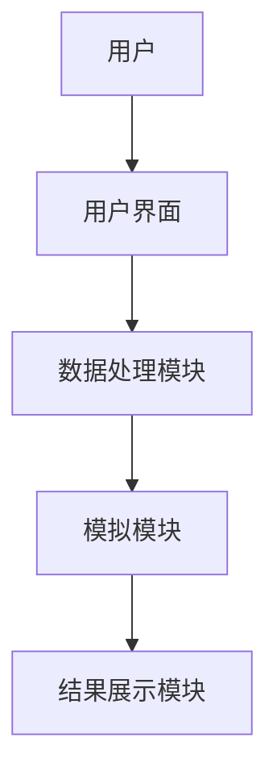

                 


# 《金融风险压力测试模型设计》

**关键词**：金融风险，压力测试，模型设计，算法原理，系统架构，风险管理

**摘要**：  
金融风险压力测试是评估金融机构在极端市场条件下的表现和韧性的重要工具。本文从压力测试的基本概念出发，详细探讨压力测试模型的设计方法，包括输入变量的选择、模型构建逻辑、常用算法原理（如蒙特卡洛模拟和历史情景模拟）以及系统架构设计。通过实际案例分析，本文深入讲解如何利用压力测试模型进行风险评估和管理，并结合代码实现和数学公式，帮助读者全面理解压力测试的理论与实践。

---

## 第一部分：金融风险压力测试模型设计基础

### 第1章：金融风险压力测试概述

#### 1.1 什么是金融风险压力测试？
金融风险压力测试（Stress Testing）是一种用于评估金融机构在极端市场条件下可能面临的风险和损失的分析方法。通过模拟不同的极端情景（如市场崩盘、经济衰退等），压力测试帮助机构了解其资产组合、流动性、资本充足性等关键指标在极端条件下的表现，从而制定相应的风险管理策略。

#### 1.2 压力测试的背景与发展
- **背景**：2008年全球金融危机后，压力测试成为金融监管的重要工具，用于评估银行和其他金融机构在极端市场条件下的稳健性。
- **发展**：随着金融市场的复杂化，压力测试从简单的假设情景分析发展为结合定量分析和定性判断的综合性方法。

#### 1.3 压力测试的目的与意义
- **目的**：评估金融机构在极端市场条件下的风险敞口，验证其资本和流动性是否充足。
- **意义**：帮助机构识别潜在风险，制定应对策略，增强市场信心。

---

### 第2章：压力测试的核心概念

#### 2.1 金融风险的分类
| 风险类型 | 定义 | 示例 |
|----------|------|------|
| 市场风险 | 资产价格波动导致的损失 | 股票价格下跌 |
| 信用风险 | 债务人违约导致的损失 | 企业债券违约 |
| 流动性风险 | 无法及时变现资产导致的损失 | 债券市场流动性不足 |
| 操作风险 | 内部错误或外部欺诈导致的损失 | 系统故障导致交易失败 |

#### 2.2 压力测试的情景假设
压力测试的情景假设是模型的核心输入之一，常见的假设包括：
- **市场崩盘**：股票指数下跌30%，债券收益率上升。
- **经济衰退**：GDP下降2%，失业率上升5%。
- **流动性危机**：货币市场基金赎回率激增。

#### 2.3 压力测试的输入变量
- **资产组合**：金融机构持有的资产，如股票、债券、贷款等。
- **市场数据**：历史价格、收益率、波动率等。
- **模型参数**：相关系数、波动率、收益率均值等。

---

## 第二部分：压力测试模型的设计与实现

### 第3章：压力测试模型的设计原则

#### 3.1 模型的简洁性与可解释性
- 简洁性：避免过于复杂的模型，确保结果易于解释。
- 可解释性：模型的输入和输出必须清晰，便于决策者理解。

#### 3.2 模型的鲁棒性与稳定性
- 鲁棒性：模型在极端条件下的表现稳定，不会因小的参数变化而失效。
- 稳定性：模型在多次测试中的结果一致，避免随机波动。

#### 3.3 模型的可扩展性
- 可扩展性：模型能够适应新的资产类别或市场情景的变化。

---

### 第4章：压力测试模型的实现方法

#### 4.1 模型的输入与输出
- **输入**：资产组合、市场数据、情景假设。
- **输出**：资产组合在极端情景下的表现，如价值变化、流动性变化等。

#### 4.2 模型的构建逻辑
1. 确定测试情景。
2. 收集相关数据。
3. 模拟资产组合在不同情景下的表现。
4. 计算风险指标，如VaR（在险值）和CVaR（条件在险值）。

---

## 第三部分：压力测试模型的算法原理

### 第5章：压力测试的核心算法

#### 5.1 Monte Carlo 模拟
- **原理**：通过随机抽样模拟市场情景，计算资产组合的可能损失。
- **公式**：$$ E[X] = \int_{-\infty}^{\infty} x f(x) dx $$
- **代码示例**：
```python
import numpy as np
np.random.seed(42)
returns = np.random.normal(0, 1, 1000)
```

#### 5.2 历史情景模拟
- **原理**：基于历史市场数据，模拟极端情景。
- **公式**：$$ P(X) = \frac{N(X)}{T} $$
- **代码示例**：
```python
import pandas as pd
df = pd.read_csv('market_data.csv')
slices = df['returns'].values
```

---

## 第四部分：系统架构设计

### 第6章：压力测试系统的架构

#### 6.1 系统功能设计
- **用户界面**：输入测试情景，选择资产组合。
- **数据处理模块**：收集和清洗市场数据。
- **模拟模块**：执行压力测试模拟。
- **结果展示模块**：输出测试结果。

#### 6.2 系统架构图


---

## 第五部分：项目实战

### 第7章：压力测试模型的实现

#### 7.1 环境安装
- 安装Python和相关库（如NumPy、Pandas、Matplotlib）。

#### 7.2 核心代码实现
```python
import numpy as np
import pandas as pd

def monte_carlo_simulation(n_simulations):
    np.random.seed(42)
    returns = np.random.normal(0, 1, n_simulations)
    return returns

def calculate_vaR(returns, confidence_level=0.05):
    sorted_returns = np.sort(returns)
    var_index = int(n_simulations * confidence_level)
    var = sorted_returns[var_index]
    return var

n_simulations = 1000
returns = monte_carlo_simulation(n_simulations)
var = calculate_vaR(returns)
print(f"VaR at {confidence_level} confidence level: {var}")
```

---

## 第六部分：总结与展望

### 第8章：总结

#### 8.1 核心内容回顾
- 压力测试的基本概念和方法。
- 压力测试模型的设计原则和实现方法。
- 压力测试系统的架构设计和实际应用。

#### 8.2 展望
- 结合机器学习和大数据技术，提升压力测试的准确性和效率。
- 探索更多复杂情景下的压力测试方法。

---

**作者：AI天才研究院/AI Genius Institute & 禅与计算机程序设计艺术 /Zen And The Art of Computer Programming**

