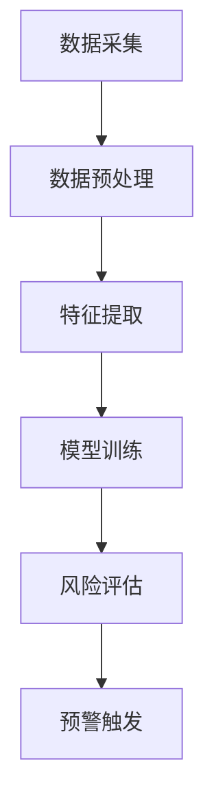
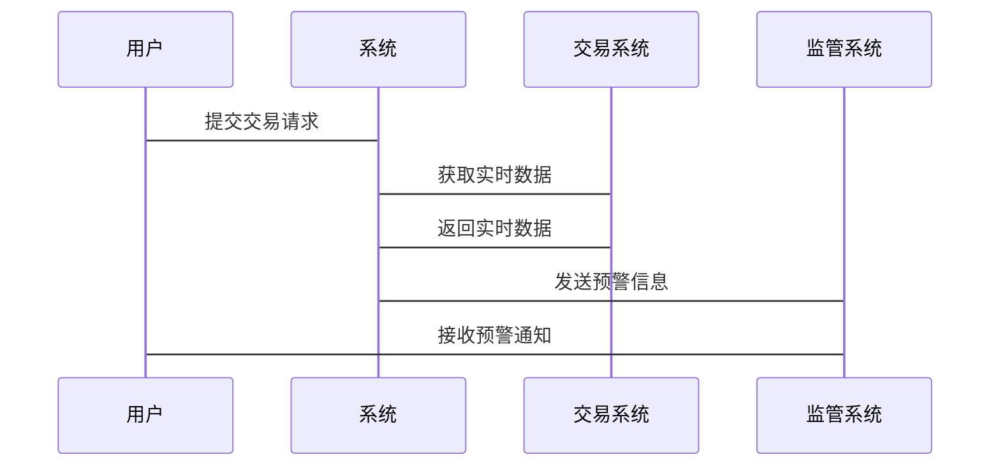

                 


# 金融风险限额突破预警系统

## 关键词：金融风险、限额预警、风险管理、系统架构、机器学习、风险评估

## 摘要：金融风险限额预警系统是一种利用先进的数据分析和机器学习技术，实时监控和评估金融风险，并在风险突破预设限额时及时预警的系统。本文从背景、核心概念、算法原理、系统架构、项目实战、最佳实践等多方面详细探讨该系统的构建与实现。

---

# 第一部分: 金融风险限额预警系统概述

## 第1章: 金融风险限额预警系统背景介绍

### 1.1 问题背景与目标

#### 1.1.1 金融风险的定义与类型
金融风险是指在金融活动中，由于各种不确定性因素导致的损失可能性。常见的金融风险类型包括市场风险、信用风险、流动性风险和操作风险。

- 市场风险：由于市场价格波动导致的损失。
- 信用风险：由于交易对手违约导致的损失。
- 流动性风险：无法及时以合理价格买卖资产导致的损失。
- 操作风险：由于内部操作失误或外部事件导致的损失。

#### 1.1.2 限额管理的重要性
限额管理是金融机构控制风险的重要手段，通过设定风险敞口的上限，确保在市场波动或其他不利情况下，金融机构的损失控制在可承受范围内。

#### 1.1.3 限额突破的潜在风险
当风险敞口突破预设限额时，可能引发以下问题：
- 资本损失：超过限额的部分可能造成重大财务损失。
- 声誉风险：频繁突破限额可能损害机构声誉。
- 法律风险：可能面临监管处罚或诉讼。

### 1.2 问题描述与解决思路

#### 1.2.1 限额突破预警的核心问题
金融机构需要实时监控风险敞口，并在接近或突破限额时发出预警，以便及时采取措施。

#### 1.2.2 现有解决方案的局限性
传统的限额管理通常依赖静态模型和人工监控，存在以下问题：
- 数据采集不实时：无法捕捉市场快速变化。
- 模型简单：难以应对复杂多变的市场环境。
- 预警不及时：人工监控容易出现延迟。

#### 1.2.3 本系统的创新点与目标
本系统通过引入实时数据采集、机器学习算法和自动化预警机制，实现对金融风险的智能化监控和管理。目标是提高预警的准确性和及时性，降低风险敞口突破限额的可能性。

### 1.3 问题解决思路

#### 1.3.1 数据驱动的预警方法
通过实时采集市场数据、交易数据和客户数据，构建全面的风险评估体系。

#### 1.3.2 统计分析与机器学习结合
结合统计分析方法和机器学习模型，提高风险评估的准确性和鲁棒性。

#### 1.3.3 多维度风险评估模型
从多个维度（市场、信用、流动性等）综合评估风险，确保预警的全面性。

### 1.4 系统边界与外延

#### 1.4.1 系统功能边界
系统主要功能包括：
- 数据采集与处理
- 风险评估与预警
- 预警信息通知

#### 1.4.2 系统与外部系统的交互
系统需要与交易系统、数据源和监管系统进行交互，确保数据的实时性和准确性。

#### 1.4.3 系统适用的金融场景
适用于股票、债券、外汇、衍生品等多种金融市场的风险监控。

### 1.5 核心概念与组成

#### 1.5.1 风险数据采集模块
负责采集市场数据、交易数据和客户数据。

#### 1.5.2 风险评估模型
基于机器学习算法，对风险进行评估和预测。

#### 1.5.3 预警触发机制
当风险敞口接近或突破限额时，触发预警通知。

## 1.6 本章小结

---

## 第2章: 金融风险限额预警系统核心概念

### 2.1 核心概念原理

#### 2.1.1 风险数据的特征提取
从海量数据中提取关键特征，如波动率、VaR（在险值）等。

#### 2.1.2 风险评估的数学模型
使用VaR、CVaR（条件在险值）等模型评估风险。

#### 2.1.3 预警触发的逻辑
基于风险评估结果，设定预警阈值，当风险敞口超过阈值时触发预警。

### 2.2 核心概念属性对比

| 概念         | 属性                     | 描述                             |
|--------------|--------------------------|----------------------------------|
| 风险数据     | 数据源                   | 市场数据、交易数据、客户数据     |
|              | 数据特征                 | 波动率、相关性、分布特征         |
| 风险评估模型 | 模型类型                 | 统计模型、机器学习模型           |
|              | 模型输入                 | 市场数据、客户数据               |
|              | 模型输出                 | 风险评分、预警信号               |
| 预警触发机制 | 触发条件                 | 风险敞口超过限额                 |
|              | 预警级别                 | 一级（最高优先级）、二级、三级   |

### 2.3 ER实体关系图

```mermaid
erDiagram
    actor 用户 {
        <属性> 用户ID
        <属性> 用户角色
    }
    actor 系统管理员 {
        <属性> 管理员ID
        <属性> 管理权限
    }
    system 风险预警系统 {
        <属性> 风险评估模型
        <属性> 数据采集模块
        <属性> 预警触发模块
    }
    用户 --> 风险预警系统 : 使用系统
    系统管理员 --> 风险预警系统 : 管理系统
```

### 2.4 本章小结

---

## 第3章: 系统算法原理

### 3.1 算法原理概述

#### 3.1.1 统计分析方法
常用统计方法包括均值、方差、标准差等，用于描述数据的分布特征。

#### 3.1.2 机器学习模型
- 随机森林：用于分类和回归，适合处理高维数据。
- XGBoost：梯度提升树，适合处理非线性关系。

#### 3.1.3 深度学习应用
使用LSTM（长短期记忆网络）处理时间序列数据，捕捉市场波动中的复杂模式。

### 3.2 算法流程图



### 3.3 风险评估模型

#### 3.3.1 风险评分模型
$$ \text{风险评分} = \alpha \times \text{波动率} + \beta \times \text{VaR} + \gamma \times \text{相关性} $$

其中，$\alpha$、$\beta$、$\gamma$为权重系数，通过训练数据确定。

#### 3.3.2 预警阈值设定
预警阈值根据历史数据和机构风险承受能力设定，例如：
$$ \text{预警阈值} = \text{当前风险敞口} + k \times \text{标准差} $$

其中，$k$为预警系数，通常取1.96（对应95%置信水平）。

### 3.4 本章小结

---

## 第4章: 系统分析与架构设计方案

### 4.1 系统功能设计

#### 4.1.1 风险数据采集模块
负责采集市场数据、交易数据和客户数据。

#### 4.1.2 风险评估模块
基于机器学习模型对风险进行评估和预测。

#### 4.1.3 预警触发模块
根据风险评估结果，触发预警通知。

### 4.2 系统架构设计

#### 4.2.1 系统架构图

```mermaid
subgraph 数据层
    system 数据库 {
        <属性> 风险数据表
        <属性> 用户数据表
    }
end

subgraph 业务逻辑层
    system 风险评估模块 {
        <属性> 统计分析模块
        <属性> 机器学习模块
    }
end

subgraph 表现层
    system 预警触发模块 {
        <属性> 预警通知
        <属性> 预警记录
    }
end

数据库 --> 风险评估模块
风险评估模块 --> 预警触发模块
```

### 4.3 系统接口设计

#### 4.3.1 数据接口
- 数据采集接口：从交易系统获取实时数据。
- 数据存储接口：将数据存储到数据库。

#### 4.3.2 预警接口
- 预警触发接口：当风险敞口超过限额时，触发预警通知。
- 预警通知接口：将预警信息发送给相关人员。

### 4.4 系统交互设计

#### 4.4.1 交互流程图



### 4.5 本章小结

---

## 第5章: 项目实战

### 5.1 环境安装

#### 5.1.1 系统环境
- 操作系统：Linux/Windows/MacOS
- 语言：Python 3.8+
- 工具：Jupyter Notebook、PyCharm

#### 5.1.2 依赖安装
```bash
pip install pandas numpy scikit-learn xgboost matplotlib
```

### 5.2 核心代码实现

#### 5.2.1 数据采集模块
```python
import pandas as pd
import requests

def get_market_data(api_key):
    url = f"https://api.example.com/markets?api_key={api_key}"
    response = requests.get(url)
    return pd.DataFrame(response.json())
```

#### 5.2.2 风险评估模块
```python
from sklearn.ensemble import RandomForestClassifier
from xgboost import XGBClassifier

def train_model(X_train, y_train):
    # 使用随机森林模型
    rf_model = RandomForestClassifier()
    rf_model.fit(X_train, y_train)
    
    # 使用XGBoost模型
    xgb_model = XGBClassifier()
    xgb_model.fit(X_train, y_train)
    
    return rf_model, xgb_model
```

#### 5.2.3 预警触发模块
```python
def trigger_warning(threshold, current_value):
    if current_value > threshold:
        print("风险预警：当前值{}超过阈值{}！".format(current_value, threshold))
    else:
        print("当前风险在可控范围内。")
```

### 5.3 案例分析

#### 5.3.1 数据分析
分析历史数据，发现某资产的风险敞口接近限额。

#### 5.3.2 模型评估
使用回测数据验证模型的准确性和稳定性。

#### 5.3.3 预警触发
当风险敞口超过设定阈值时，系统自动触发预警通知。

### 5.4 本章小结

---

## 第6章: 最佳实践与注意事项

### 6.1 最佳实践

#### 6.1.1 数据质量管理
确保数据的准确性和完整性，定期清洗和更新数据。

#### 6.1.2 模型优化
根据市场变化和数据特征，定期更新和优化风险评估模型。

#### 6.1.3 预警机制调整
根据实际情况调整预警阈值和触发条件，确保预警的及时性和准确性。

### 6.2 注意事项

#### 6.2.1 数据隐私与安全
确保数据的安全性和合规性，防止数据泄露和滥用。

#### 6.2.2 系统稳定性
确保系统的高可用性和稳定性，避免因系统故障导致预警延迟或遗漏。

#### 6.2.3 人员培训
对相关人员进行培训，确保他们能够正确理解和使用预警系统。

### 6.3 小结

---

## 第7章: 总结与展望

### 7.1 本文总结
本文详细探讨了金融风险限额预警系统的构建与实现，从背景、核心概念、算法原理、系统架构到项目实战，全面阐述了系统的各个方面。

### 7.2 未来展望
随着人工智能和大数据技术的不断发展，金融风险预警系统将更加智能化和自动化。未来的研究方向包括：
- 更加复杂的机器学习模型，如深度学习和强化学习。
- 多模态数据的融合，提高风险评估的准确性。
- 自动化决策系统，实现风险的实时管理和应对。

---

## 作者：AI天才研究院/AI Genius Institute & 禅与计算机程序设计艺术 /Zen And The Art of Computer Programming

---

以上是《金融风险限额突破预警系统》的技术博客文章的完整目录和内容概要。

