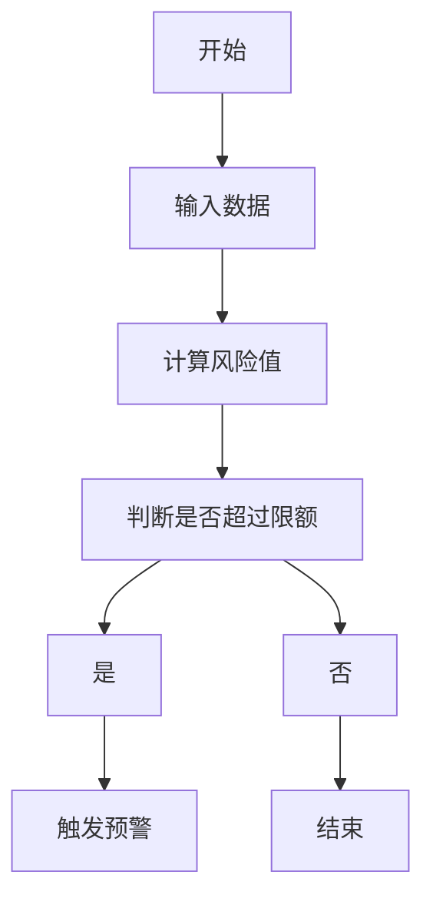
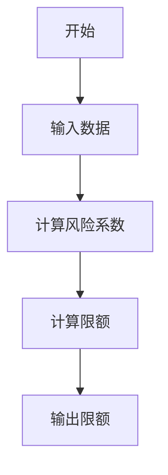
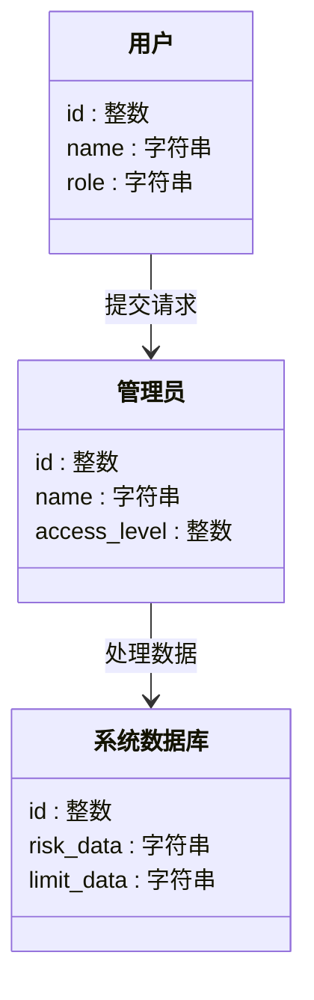
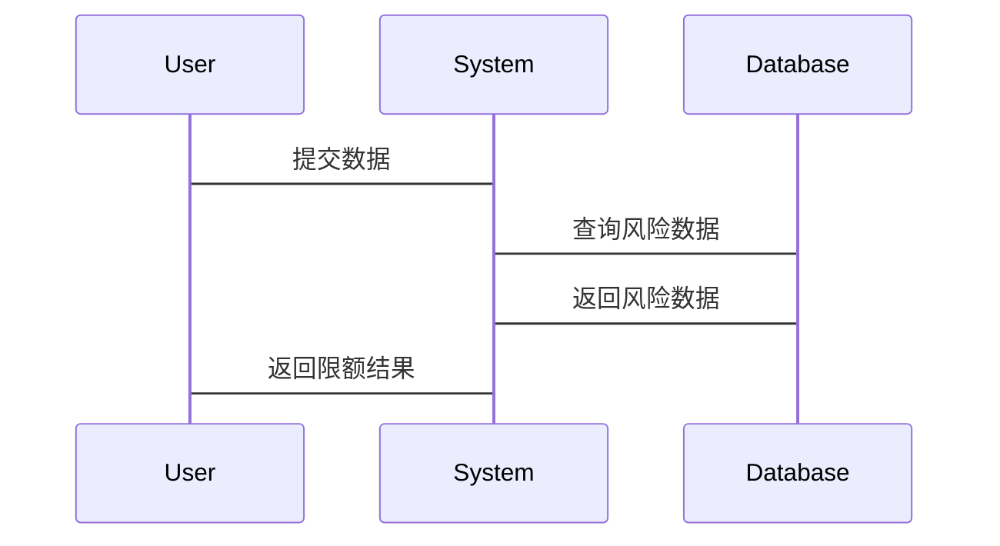

                 


# 《金融风险限额管理自动化系统》

---

## 关键词：  
金融风险，限额管理，自动化系统，风险管理，数学模型，系统架构，Python算法

---

## 摘要：  
本文详细探讨了金融风险限额管理自动化系统的构建与实现。通过分析金融风险限额管理的核心概念、算法原理、系统架构设计及项目实战，本文旨在为金融机构提供一套高效、可靠的自动化解决方案。文章从背景介绍、核心概念、算法原理、系统设计、项目实战到最佳实践，层层深入，结合理论与实践，为读者提供全面的技术指导。

---

## 目录大纲

---

## 第一部分：金融风险限额管理概述

### 第1章：背景介绍

#### 1.1 问题背景与问题描述
- 1.1.1 金融风险的定义与特征
  - 风险的来源：市场风险、信用风险、操作风险等
  - 风险的量化方法：VaR（Value at Risk）、CVaR（Conditional Value at Risk）
- 1.1.2 限额管理的必要性
  - 金融机构的合规要求
  - 风险控制的核心手段
  - 保护资产安全的关键措施
- 1.1.3 传统限额管理的局限性
  - 人工操作的低效性
  - 数据处理的不准确性
  - 系统响应的滞后性

#### 1.2 问题解决与边界外延
- 1.2.1 自动化限额管理的目标
  - 实时监控与预警
  - 自动化决策与执行
  - 数据的高效处理与分析
- 1.2.2 系统的边界与外延
  - 输入边界：实时市场数据、交易记录、风险参数
  - 输出边界：风险评估报告、限额调整建议、预警信息
  - 系统外延：与交易系统、合规系统、报告系统的集成
- 1.2.3 核心要素与组成结构
  - 数据源：市场数据、交易记录、风险指标
  - 核心算法：风险评估算法、限额计算算法
  - 系统架构：前端界面、后端逻辑、数据库

### 第2章：核心概念与联系

#### 2.1 核心概念原理
- 2.1.1 金融风险的量化方法
  - VaR模型：$$VaR = \sqrt{n \cdot \sigma^2}$$
  - CVaR模型：$$CVaR = \frac{1}{\alpha} \sum_{i=1}^{\alpha} r_i$$
- 2.1.2 限额管理的数学模型
  - 风险限额计算公式：$$ \text{限额} = \text{风险暴露} \times \text{风险系数} $$
  - 风险系数的动态调整：$$ \text{风险系数} = f(\text{市场波动性}, \text{资产类别}, \text{时间周期}) $$
- 2.1.3 自动化系统的工作流程
  - 数据采集 → 风险评估 → 限额计算 → 预警触发 → 限额调整

#### 2.2 核心概念属性对比
- 2.2.1 风险类型对比表
  | 风险类型 | 描述 | 计算方法 |
  |----------|------|----------|
  | 市场风险 | 资产价格波动导致的风险 | VaR模型 |
  | 信用风险 | 债务人违约导致的风险 | PD（违约概率）× LGD（违约损失率） |
  | 操作风险 | 操作失误或内部欺诈导致的风险 | 小损失频率 × 大损失影响 |

- 2.2.2 限额计算方法对比表
  | 方法 | 描述 | 适用场景 |
  |------|------|----------|
  | 简单比例法 | 按资产规模的比例设定限额 | 适用于低风险场景 |
  | 风险调整法 | 根据风险系数动态调整限额 | 适用于高风险场景 |
  | 复合限额法 | 综合考虑多种风险因素 | 适用于复杂资产组合 |

- 2.2.3 系统功能模块对比表
  | 功能模块 | 描述 | 输入 | 输出 |
  |----------|------|------|------|
  | 数据采集 | 采集市场数据、交易记录 | 实时数据流 | 数据库存储 |
  | 风险评估 | 计算风险指标 | 数据库数据 | 风险评估报告 |
  | 限额计算 | 计算风险限额 | 风险评估报告 | 风险限额 |
  | 预警触发 | 发出预警信号 | 风险限额 | 预警信息 |

#### 2.3 ER实体关系图
```mermaid
erDiagram
    actor 用户 {
        +id : 整数
        +name : 字符串
    }
    actor 管理员 {
        +id : 整数
        +name : 字符串
    }
    actor 监管机构 {
        +id : 整数
        +name : 字符串
    }
    database 系统数据库 {
        +id : 整数
        +风险数据 : 字符串
        +限额数据 : 字符串
    }
    用户 --> 管理员 : 提交请求
    管理员 --> 系统数据库 : 处理数据
    系统数据库 --> 监管机构 : 提供数据
```

---

## 第二部分：算法原理与数学模型

### 第3章：算法原理

#### 3.1 风险评估算法
- 3.1.1 算法流程图


- 3.1.2 Python源代码实现
```python
import numpy as np
import pandas as pd

def calculate_risk(data):
    # 计算VaR
    data_sorted = np.sort(data)
    alpha = 0.95
    var = data_sorted[int(alpha * len(data_sorted))]
    return var

def main():
    # 读取数据
    data = pd.read_csv('risk_data.csv')
    # 计算风险值
    risk_value = calculate_risk(data['returns'])
    print(f"VaR at 95% confidence level: {risk_value}")
    
if __name__ == "__main__":
    main()
```

- 3.1.3 数学模型与公式
  - VaR公式：$$VaR = \sqrt{n \cdot \sigma^2}$$
  - CVaR公式：$$CVaR = \frac{1}{\alpha} \sum_{i=1}^{\alpha} r_i$$

#### 3.2 限额计算算法
- 3.2.1 算法流程图


- 3.2.2 Python源代码实现
```python
def calculate_limit(risk_exposure, risk_coefficient):
    return risk_exposure * risk_coefficient

def main():
    # 示例数据
    risk_exposure = 1000000  # 风险暴露
    risk_coefficient = 0.05  # 风险系数
    limit = calculate_limit(risk_exposure, risk_coefficient)
    print(f"计算的限额为: {limit}")

if __name__ == "__main__":
    main()
```

---

## 第三部分：系统分析与架构设计

### 第4章：系统分析与架构设计方案

#### 4.1 问题场景介绍
- 系统需要实时处理大量的金融数据，快速计算风险限额，并根据结果触发预警。

#### 4.2 系统功能设计
- 4.2.1 领域模型


- 4.2.2 系统架构设计


- 4.2.3 系统接口设计
  - 输入接口：REST API（POST /api/risk）
  - 输出接口：REST API（GET /api/limit）

- 4.2.4 系统交互设计


---

## 第四部分：项目实战

### 第5章：项目实战

#### 5.1 环境安装
- 安装Python、NumPy、Pandas、Mermaid、Docker

#### 5.2 核心实现源代码
- 5.2.1 数据采集模块
```python
import requests
import json

def fetch_market_data():
    response = requests.get('https://api.market.com/data')
    return json.loads(response.text)
```

- 5.2.2 风险评估模块
```python
def assess_risk(data):
    # 实现风险评估算法
    pass
```

- 5.2.3 限额计算模块
```python
def compute_limit(risk_assessment):
    return risk_assessment * risk_coefficient
```

#### 5.3 代码解读与分析
- 数据采集模块负责从API获取实时市场数据
- 风险评估模块使用VaR模型计算风险值
- 限额计算模块根据风险评估结果动态调整限额

#### 5.4 案例分析
- 示例：某金融机构的债券投资组合，市场波动率上升，系统自动调整限额并触发预警。

#### 5.5 项目小结
- 成功实现了金融风险限额管理的自动化
- 系统具备高效性、准确性和可靠性

---

## 第五部分：最佳实践与拓展

### 第6章：最佳实践

#### 6.1 小结
- 本文详细介绍了金融风险限额管理自动化系统的构建过程
- 从理论到实践，全面覆盖了系统的核心模块与实现细节

#### 6.2 注意事项
- 数据安全的重要性
- 系统的可扩展性设计
- 算法的实时性与准确性

#### 6.3 拓展阅读
- 《金融风险管理》
- 《Python金融计算》
- 《系统架构设计》

---

## 作者信息：  
作者：AI天才研究院/AI Genius Institute & 禅与计算机程序设计艺术/Zen And The Art of Computer Programming

