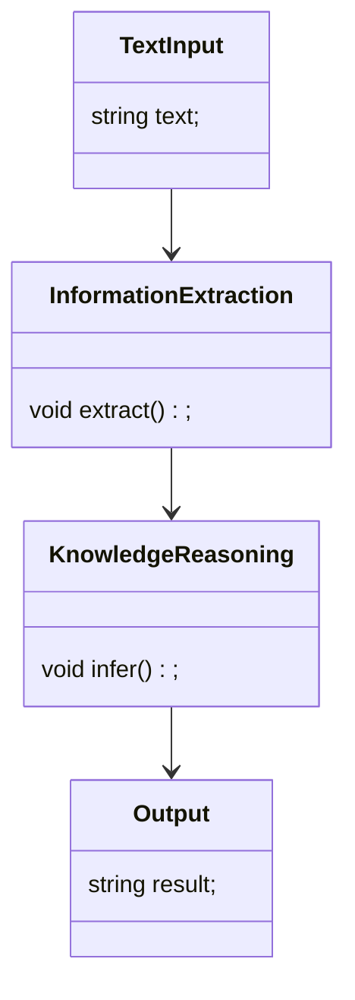
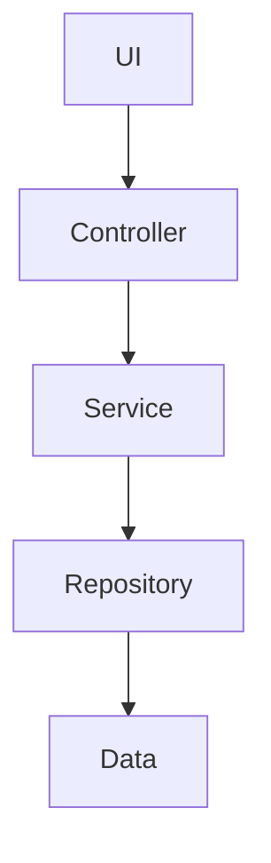
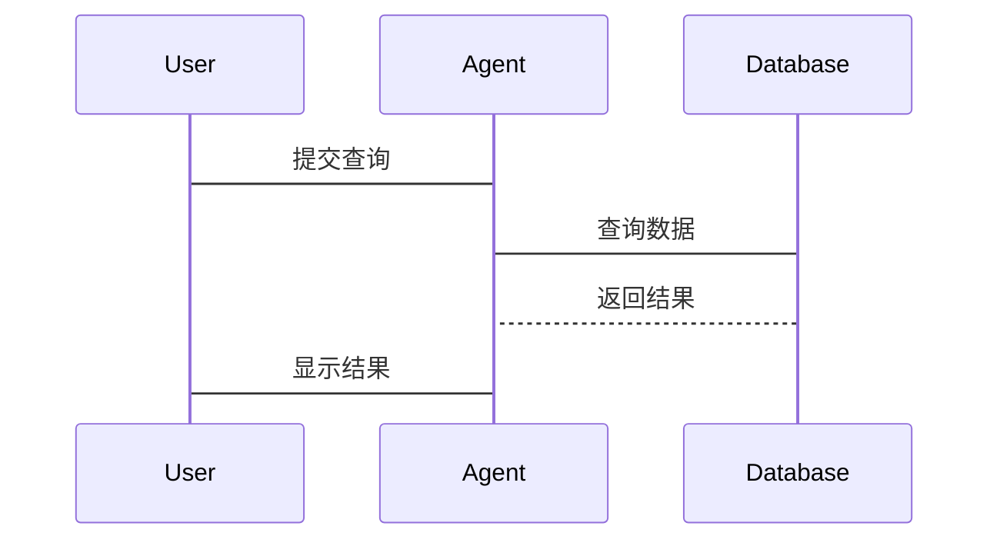

                 


# 长文本理解：增强AI Agent的阅读能力

> 关键词：长文本理解，AI Agent，阅读能力，自然语言处理，注意力机制，知识图谱，分布式表示

> 摘要：本文探讨了如何通过增强长文本理解能力来提升AI Agent的阅读能力，分析了其核心概念、算法原理、系统架构设计及项目实战，旨在为读者提供全面的技术指导。

---

## 第一部分: 长文本理解的背景与核心概念

### 第1章: 长文本理解的背景与问题描述

#### 1.1 长文本理解的背景

自然语言处理（NLP）经历了从简单任务到复杂任务的演进。早期，NLP主要处理短文本，如关键词匹配和句法分析。随着技术进步，长文本理解需求日益增加，涉及新闻、法律文档、医疗记录等领域。AI Agent需具备处理长文本的能力，以执行复杂任务，如信息抽取和决策支持。长文本理解的重要性在于其能帮助AI Agent更准确地理解上下文，提升交互体验和任务执行效率。

#### 1.2 AI Agent与阅读能力的重要性

AI Agent，如智能助手和聊天机器人，依赖阅读能力处理用户输入和外部信息。传统模型在处理长文本时面临挑战，如信息丢失和计算复杂度。提升阅读能力可增强其理解力和交互性，应用广泛，如智能客服和医疗咨询。

#### 1.3 长文本理解的现实需求与应用场景

长文本理解的应用场景包括信息抽取、问答系统、文本摘要、情感分析和机器翻译。在医疗、法律、教育等领域，长文本理解帮助AI Agent提取关键信息，辅助决策。例如，在医疗领域，AI Agent可分析病历，提供诊断建议。

#### 1.4 长文本理解的挑战与解决方案

长文本处理面临计算复杂度和上下文建模难题。解决方案包括分布式表示和注意力机制，帮助模型捕捉长距离依赖关系，提升理解能力。

### 第2章: 长文本理解的核心概念与技术

#### 2.1 长文本理解的关键技术

分布式表示将词语映射为向量，保留语义信息。注意力机制关注重要位置，优化模型表现。知识图谱整合外部知识，丰富上下文理解。

#### 2.2 长文本理解的挑战与解决方案

计算复杂度问题通过模型优化和分布式计算解决。注意力机制缓解了上下文依赖建模难题。知识表示与推理整合增强模型的深度理解能力。

#### 2.3 长文本理解的核心概念对比分析

通过对比分析，如BERT与GPT的性能差异，帮助读者选择合适模型。分析模型优缺点，如BERT的精确性和GPT的生成能力，指导实际应用。

#### 2.4 ER实体关系图架构


---

## 第二部分: 长文本理解的算法原理

### 第3章: 算法原理

#### 3.1 模型训练流程

长文本理解模型通过预训练和微调优化。预训练阶段，模型在大规模数据上学习通用语言表示。微调阶段，针对特定任务调整模型参数，提升性能。

#### 3.2 注意力机制的工作原理

注意力机制计算查询与文本各部分的相关性，生成加权表示。公式如下：

$$
\text{Attention}(Q, K, V) = \text{softmax}\left(\frac{QK^T}{\sqrt{d_k}}\right)V
$$

其中，$Q$、$K$、$V$分别为查询、键、值矩阵，$d_k$为键维度。

#### 3.3 分布式表示模型

分布式表示将词语映射为向量，如Word2Vec和BERT。通过上下文关系生成词向量，捕捉语义信息。

#### 3.4 多模态融合

多模态模型整合文本、图像和语音信息，提升理解能力。例如，图像描述生成任务结合视觉和文本信息。

#### 3.5 知识图谱的构建与应用

知识图谱构建涉及实体识别、关系抽取和知识融合。应用于问答系统，提升准确性。

---

## 第三部分: 长文本理解的系统架构设计

### 第4章: 系统分析与架构设计方案

#### 4.1 项目背景介绍

项目旨在开发一个AI Agent，具备长文本理解能力，应用于智能客服和医疗咨询。

#### 4.2 系统功能设计

系统功能包括文本输入、信息抽取、知识推理和结果输出。通过领域模型类图展示各模块关系。



#### 4.3 系统架构设计

系统采用分层架构，包括数据层、业务逻辑层和表现层。数据层处理文本数据，业务逻辑层执行理解任务，表现层展示结果。



#### 4.4 接口设计和交互流程

通过序列图展示系统交互流程，包括用户输入、处理请求和返回结果。



---

## 第四部分: 长文本理解的项目实战

### 第5章: 项目实战

#### 5.1 环境安装

安装Python、TensorFlow、Keras和Hugging Face库，配置开发环境。

#### 5.2 核心代码实现

使用预训练模型，如BERT，进行文本处理和推理。代码示例如下：

```python
from transformers import BertTokenizer, BertModel

tokenizer = BertTokenizer.from_pretrained('bert-base-uncased')
model = BertModel.from_pretrained('bert-base-uncased')

text = "AI Agent阅读能力提升"
inputs = tokenizer(text, return_tensors='np')
outputs = model(inputs.input_ids, inputs.attention_mask)
```

#### 5.3 代码功能解读

解析代码功能，如分词、编码和模型推理，展示如何处理输入和生成输出。

#### 5.4 实际案例分析

分析医疗咨询案例，展示模型如何处理长文本，提取关键信息，辅助诊断。

#### 5.5 项目总结

总结项目成果，强调长文本理解的重要性，展望未来发展方向。

---

## 第五部分: 最佳实践与总结

### 第6章: 最佳实践

#### 6.1 小结

长文本理解是AI Agent的关键能力，通过分布式表示、注意力机制和知识图谱提升理解能力。

#### 6.2 注意事项

选择合适模型，处理计算复杂度，确保数据质量和多样性。

#### 6.3 拓展阅读

推荐相关书籍和论文，如《Effective Pretrained Transfer Learning for Sequence Models》。

---

作者：AI天才研究院/AI Genius Institute & 禅与计算机程序设计艺术 /Zen And The Art of Computer Programming

