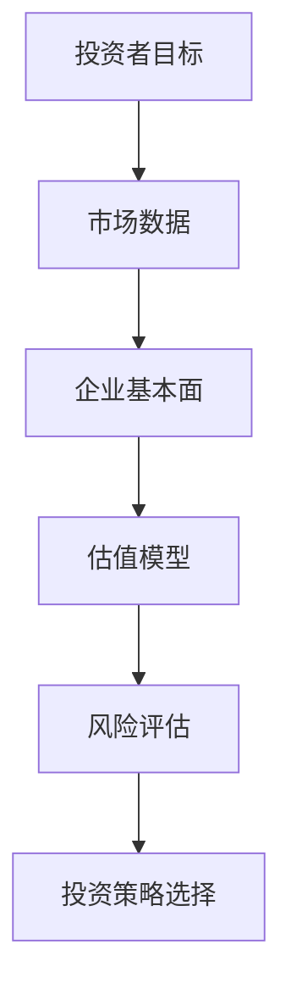

                 


# 长期持有vs频繁交易：巴菲特的选择

---

## 关键词：长期持有、巴菲特、价值投资、交易成本、风险管理、投资策略

---

## 摘要：  
本文深入探讨了长期持有与频繁交易两种投资策略的对比，分析了巴菲特为何选择长期持有的投资哲学，并从数学模型、系统架构、案例分析等多维度展开，帮助读者理解长期持有的优势和适用场景。文章结合技术与投资的视角，为投资者提供了深度的理论支持和实操建议。

---

# 第一部分：引言

## 第1章：投资的基本概念

### 1.1 投资的基本定义  
投资是指将资金投入某一资产或项目，期望在未来获得收益或资本增值的行为。投资可以分为实物投资（如房地产、企业股权）和金融投资（如股票、债券、基金等）。金融投资是最常见的投资形式，本文将重点讨论金融投资中的股票投资策略。

### 1.2 长期持有与频繁交易的定义  
- **长期持有**：投资者买入某只股票后，持有数年甚至更长时间，不因短期市场波动而频繁调整仓位。  
- **频繁交易**：投资者频繁买卖股票，试图通过短期价格波动获利。  

### 1.3 投资策略的分类  
- **价值投资**：寻找被市场低估的股票，长期持有，等待其价值回归。  
- **趋势投资**：根据市场趋势进行买卖，适合技术分析派。  
- **指数投资**：通过投资指数基金，获得市场平均收益。  

---

## 第2章：长期持有与频繁交易的对比分析

### 2.1 长期持有的优势  
- **时间复利效应**：长期持有可以最大化复利效应，实现财富的指数级增长。  
- **避免交易成本**：频繁交易会产生佣金、税费等成本，长期持有可以有效降低这些成本。  
- **心理优势**：长期持有减少了短期市场波动带来的心理压力，避免了追涨杀跌的错误行为。  

### 2.2 频繁交易的劣势  
- **交易成本高**：频繁买卖会增加佣金、税费等成本，对小散户尤其不利。  
- **交易摩擦**：市场存在买卖价差、信息不对称等摩擦，频繁交易难以保证收益。  
- **心理劣势**：频繁交易容易受到市场情绪影响，导致决策失误。  

### 2.3 两种策略的适用场景  
- **长期持有**：适合价值投资者，尤其是寻找优质企业的巴菲特式投资。  
- **频繁交易**：适合短线交易者，或在市场趋势明显时的操作。  

---

# 第二部分：长期持有的核心概念

## 第3章：价值投资的原理

### 3.1 价值投资的定义  
价值投资是一种投资策略，强调以低于内在价值的价格买入股票，并长期持有，等待市场重新认识其价值。  

### 3.2 巴菲特的价值投资策略  
- **选股标准**：寻找具有持续竞争优势、良好管理和强大护城河的企业。  
- **安全边际**：买入价格低于内在价值，确保安全空间。  
- **长期持有**：避免频繁交易，降低交易成本和心理压力。  

### 3.3 价值投资的数学模型  
内在价值公式：  
$$ V = \frac{CF}{r - g} $$  
其中，$CF$ 是现金流，$r$ 是折现率，$g$ 是增长率。  

---

## 第4章：长期持有的风险管理

### 4.1 风险管理的基本概念  
风险管理是通过科学的方法识别、评估和控制风险，以确保投资目标的实现。  

### 4.2 长期持有的风险管理策略  
- **分散投资**：避免将所有资金投入单一资产或行业。  
- **定期复盘**：定期检查持仓，评估企业的基本面变化。  
- **仓位管理**：根据市场环境调整持仓比例，避免过度集中。  

### 4.3 风险管理的数学模型  
风险价值（VaR）计算公式：  
$$ VaR = \mu + z \cdot \sigma $$  
其中，$\mu$ 是平均值，$z$ 是标准正态分布的分位数，$\sigma$ 是标准差。  

---

## 第5章：长期持有与频繁交易的对比模型

### 5.1 对比分析的数学模型  
- 长期持有收益公式：  
$$ R_{\text{long}} = (1 + r)^t \cdot P_0 - P_0 $$  
- 频繁交易收益公式：  
$$ R_{\text{short}} = \sum_{i=1}^{n} (P_i - P_{i-1}) \cdot Q_i $$  

### 5.2 交易成本对比分析  
- 长期持有成本：主要为买入时的佣金和卖出时的税费。  
- 频繁交易成本：包括多次佣金、税费，以及买卖价差。  

---

# 第三部分：系统架构与项目实战

## 第6章：系统架构设计

### 6.1 投资决策框架  
- 输入：市场数据、企业基本面、投资者目标。  
- 处理：估值模型、风险评估、策略选择。  
- 输出：投资决策（长期持有或频繁交易）。  

### 6.2 系统架构图  


## 第7章：项目实战

### 7.1 环境安装  
- 数据来源：Yahoo Finance API  
- 工具：Python、Pandas、Matplotlib  

### 7.2 核心代码实现  
```python
import pandas as pd
import numpy as np

# 计算内在价值
def calculate_intrinsic_value(enterprise_value, revenue, growth_rate, discount_rate):
    if revenue == 0:
        return 0
    return enterprise_value / (discount_rate - growth_rate)

# 案例分析：茅台
df = pd.read_csv('maotai_stock.csv')
cf = df['现金流'].mean()
r = 0.1
g = 0.05
intrinsic_value = calculate_intrinsic_value(cf, r, g)
print(f"内在价值：{intrinsic_value}")
```

---

# 第四部分：最佳实践与总结

## 第8章：最佳实践

### 8.1 长期持有的优势  
- 稳定收益、降低交易成本、减少心理压力。  

### 8.2 风险管理技巧  
- 分散投资、定期复盘、控制仓位。  

### 8.3 心态管理  
- 长期持有需要耐心和信心，避免被短期波动干扰。  

---

## 第9章：小结

### 9.1 总结  
长期持有是一种更适合普通投资者的投资策略，尤其适合价值投资者。巴菲特的成功证明了长期持有策略的有效性，但投资者需要结合自身情况选择适合的策略。  

### 9.2 注意事项  
- 长期持有并非盲目持有，需要定期评估企业的基本面变化。  
- 频繁交易适合短线高手，普通投资者应谨慎尝试。  

### 9.3 拓展阅读  
- 巴菲特的《致股东的信》  
- 《投资最重要的事》  

---

## 作者：  
**AI天才研究院/AI Genius Institute**  
**禅与计算机程序设计艺术 /Zen And The Art of Computer Programming**

