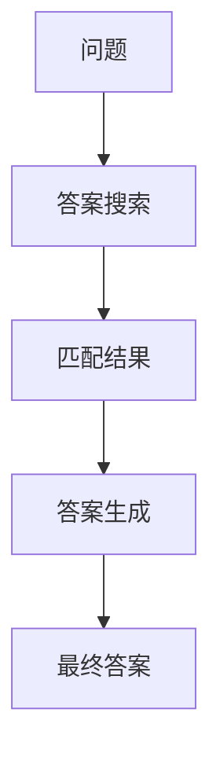
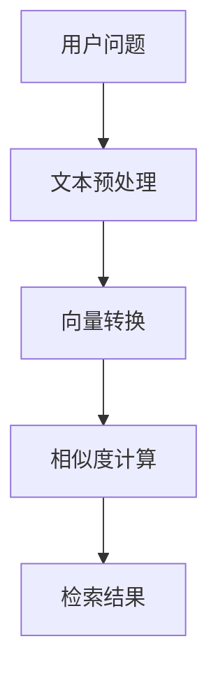
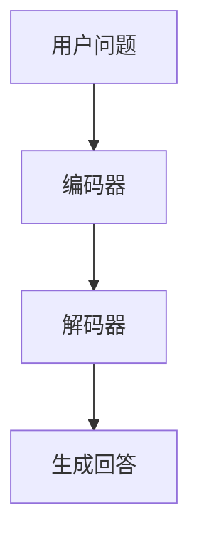
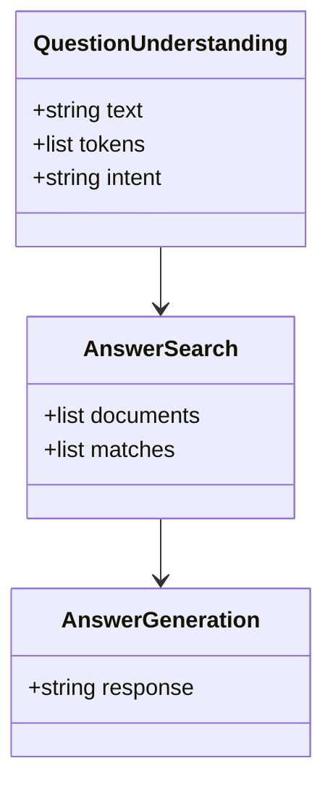
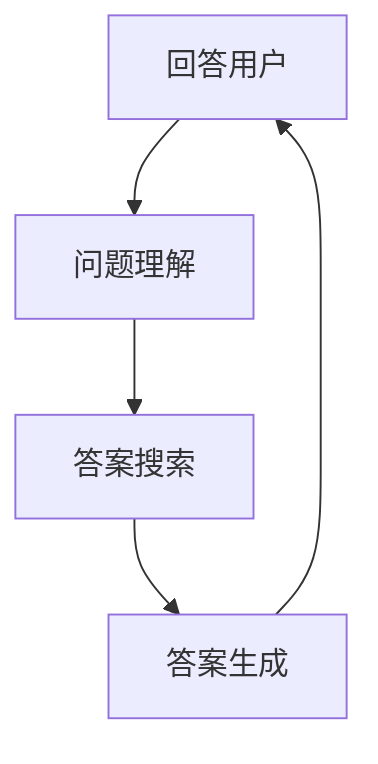

                 


# 问答系统实现：打造高效的信息检索助手

> 关键词：问答系统，自然语言处理，信息检索，机器学习，文本挖掘，对话系统

> 摘要：问答系统是一种结合了自然语言处理和信息检索技术的智能系统，旨在通过理解和分析用户的问题，提供准确、简洁的答案。本文将从问答系统的背景与概述、核心概念与联系、算法原理、系统架构设计、项目实战以及优化与调优等方面，详细讲解如何打造一个高效的信息检索助手。通过理论与实践相结合，帮助读者全面掌握问答系统的实现方法。

---

## # 第1章: 问答系统背景与概述

### 1.1 问答系统定义与核心概念

#### 1.1.1 问答系统的基本定义

问答系统（Question Answering System, QAS）是一种能够理解和回答用户提出问题的人工智能系统。它通过自然语言处理技术，将用户的提问转化为可计算的形式，并结合信息检索或生成模型，找到最合适的答案。

#### 1.1.2 问答系统的核心要素

- **问题理解**：解析用户提问的语义和意图。
- **答案搜索**：从知识库或外部数据中检索相关答案。
- **答案生成**：基于检索结果或生成模型，输出自然流畅的回答。

#### 1.1.3 问答系统的主要应用场景

- 智能客服
- 智能助手（如Siri、Alexa）
- 知识库问答
- 教育辅助

### 1.2 问答系统的历史发展与技术挑战

#### 1.2.1 问答系统的发展历程

- **早期阶段**：基于规则的问答系统，依赖人工编写规则。
- **发展阶段**：基于统计的问答系统，利用模式匹配和关键词提取。
- **当前阶段**：基于深度学习的问答系统，结合神经网络和大规模数据训练。

#### 1.2.2 当前问答系统的技术难点

- **语义理解**：如何准确理解用户的意图。
- **知识表示**：如何高效存储和检索知识。
- **回答生成**：如何生成自然流畅的回答。

#### 1.2.3 问答系统的未来趋势

- **多模态问答**：结合图像、视频等多种信息源。
- **实时问答**：快速响应用户的实时需求。
- **个性化问答**：根据用户偏好定制回答。

---

## # 第2章: 问答系统的核心概念与联系

### 2.1 问答系统的核心概念

#### 2.1.1 问题理解与分析

- **问题类型**：事实性问题、选择性问题、解释性问题等。
- **问题分解**：将复杂问题拆解为多个简单问题。
- **问题表示**：将问题转化为计算机可处理的形式（如向量表示）。

#### 2.1.2 答案搜索与匹配

- **知识库搜索**：从结构化知识库中检索答案。
- **文本匹配**：通过语义相似度匹配答案。
- **模糊匹配**：处理不完全匹配的情况。

#### 2.1.3 答案生成与优化

- **答案生成**：基于生成模型生成回答。
- **答案优化**：通过语言模型优化回答的流畅性。
- **答案验证**：验证答案的准确性和相关性。

### 2.2 核心概念对比与ER实体关系图

#### 2.2.1 问题与答案的关系对比

| 属性         | 问题         | 答案         |
|--------------|--------------|--------------|
| 类型         | 描述性       | 解释性       |
| 长度         | 较短         | 可长可短     |
| 目的         | 获取信息     | 提供信息     |

#### 2.2.2 实体关系图（Mermaid流程图）



---

## # 第3章: 问答系统算法原理

### 3.1 基于检索的问答系统

#### 3.1.1 检索模型的数学模型

- **余弦相似度**：衡量两个向量的相似程度。
  $$ \cos{\theta} = \frac{\vec{A} \cdot \vec{B}}{|\vec{A}| |\vec{B}|} $$
- **BM25算法**：基于统计的文本检索算法。

#### 3.1.2 检索算法的实现流程



#### 3.1.3 检索算法的优缺点分析

- **优点**：高效、准确。
- **缺点**：依赖于高质量的知识库。

#### 3.1.4 Python代码示例

```python
from sklearn.feature_extraction.text import TfidfVectorizer
from sklearn.metrics.pairwise import cosine_similarity

# 示例文本
texts = ["How old is the sun?", "What is the capital of France?"]
vectorizer = TfidfVectorizer()
vectors = vectorizer.fit_transform(texts)

# 计算余弦相似度
similarity = cosine_similarity(vectors)
print(similarity)
```

### 3.2 基于生成的问答系统

#### 3.2.1 生成模型的数学模型

- **Transformer模型**：基于自注意力机制的生成模型。
  $$ \text{Attention}(Q,K,V) = \text{softmax}\left(\frac{QK^T}{\sqrt{d_k}}\right)V $$

#### 3.2.2 生成算法的实现流程



#### 3.2.3 生成算法的优缺点分析

- **优点**：生成的回答更自然。
- **缺点**：生成的内容可能不够准确。

#### 3.2.4 Python代码示例

```python
import torch
from torch import nn

# 示例模型
class SimpleGenerator(nn.Module):
    def __init__(self, input_dim, output_dim):
        super(SimpleGenerator, self).__init__()
        self.fc = nn.Linear(input_dim, output_dim)
    
    def forward(self, x):
        return self.fc(x)

model = SimpleGenerator(10, 5)
print(model)
```

---

## # 第4章: 问答系统架构设计

### 4.1 系统功能设计

#### 4.1.1 领域模型设计（Mermaid类图）



#### 4.1.2 系统功能模块划分

- **问题理解模块**：解析用户问题。
- **答案搜索模块**：检索相关答案。
- **答案生成模块**：生成最终回答。

#### 4.1.3 功能模块之间的交互关系

- **顺序关系**：问题理解 → 答案搜索 → 答案生成。
- **反馈机制**：根据用户反馈优化回答。

### 4.2 系统架构设计

#### 4.2.1 系统架构设计（Mermaid架构图）



#### 4.2.2 系统分层设计

- **表现层**：用户界面。
- **业务逻辑层**：处理用户请求。
- **数据访问层**：访问知识库。

#### 4.2.3 系统接口设计

- **输入接口**：接收用户提问。
- **输出接口**：返回系统回答。

---

## # 第5章: 问答系统项目实战

### 5.1 环境搭建与配置

#### 5.1.1 开发环境安装

- **Python**：安装Python 3.8及以上版本。
- **依赖库**：安装numpy、scikit-learn、transformers等。

#### 5.1.2 依赖库安装与配置

```bash
pip install numpy scikit-learn transformers
```

#### 5.1.3 数据集准备与预处理

- 数据清洗：去除噪声数据。
- 数据分词：将文本分词处理。

### 5.2 核心算法实现

#### 5.2.1 基于检索的问答系统实现

```python
from sklearn.feature_extraction.text import TfidfVectorizer
from sklearn.metrics.pairwise import cosine_similarity

def question_answering(question, context):
    vectorizer = TfidfVectorizer()
    q_vector = vectorizer.fit_transform([question])
    c_vector = vectorizer.transform([context])
    similarity = cosine_similarity(q_vector, c_vector)
    return similarity[0][0]

# 示例调用
print(question_answering("What is the capital of France?", "Paris is the capital of France."))
```

#### 5.2.2 基于生成的问答系统实现

```python
import torch
from torch import nn

class SimpleGenerator(nn.Module):
    def __init__(self, input_dim, output_dim):
        super(SimpleGenerator, self).__init__()
        self.fc = nn.Linear(input_dim, output_dim)
    
    def forward(self, x):
        return self.fc(x)

model = SimpleGenerator(10, 5)
print(model)
```

#### 5.2.3 算法对比与优化

- **对比分析**：基于检索的问答系统在准确率上更优，但生成的回答可能不够自然。
- **优化建议**：结合检索和生成模型的优点，构建混合型问答系统。

### 5.3 项目小结

- **项目总结**：通过本章的学习，读者可以掌握问答系统的实现方法，并能够通过实际案例理解系统的整体架构。
- **注意事项**：在实际项目中，需要根据具体需求选择合适的算法，并进行充分的测试和优化。

---

## # 第6章: 优化与调优

### 6.1 系统性能优化

#### 6.1.1 检索效率优化

- **索引优化**：使用倒排索引提高检索速度。
- **缓存机制**：缓存高频查询结果。

#### 6.1.2 生成模型优化

- **模型压缩**：减少模型参数量，降低计算成本。
- **在线优化**：根据用户反馈动态优化模型。

#### 6.1.3 系统资源分配优化

- **负载均衡**：合理分配计算资源。
- **资源监控**：实时监控系统资源使用情况。

### 6.2 系统稳定性与可扩展性

#### 6.2.1 系统容错与纠错机制

- **错误检测**：检测系统运行中的错误。
- **自动恢复**：在检测到错误后，自动进行修复。

#### 6.2.2 系统扩展设计

- **水平扩展**：通过增加服务器数量提高处理能力。
- **垂直扩展**：通过升级单台服务器的性能提高处理能力。

#### 6.2.3 系统监控与日志管理

- **监控工具**：使用Prometheus、Grafana等工具监控系统运行状态。
- **日志管理**：收集和分析系统日志，快速定位问题。

### 6.3 最佳实践 tips

- **模型选择**：根据具体需求选择合适的模型。
- **数据质量**：确保数据的准确性和完整性。
- **系统维护**：定期更新模型和优化系统性能。

---

## 作者：AI天才研究院/AI Genius Institute & 禅与计算机程序设计艺术 /Zen And The Art of Computer Programming

---

通过以上目录，您将能够系统地学习问答系统的实现方法，并通过实际案例理解其核心原理和应用技巧。

