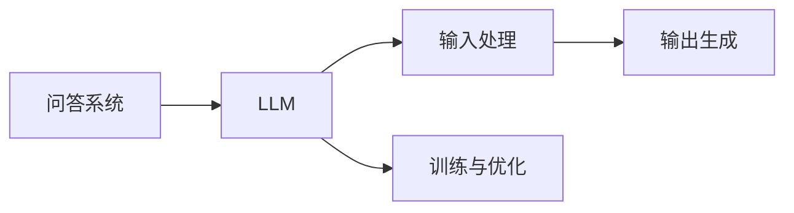
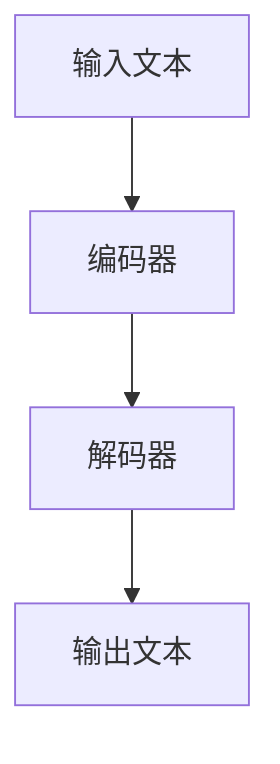
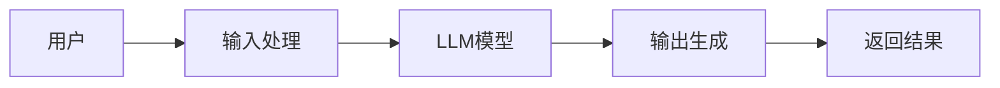
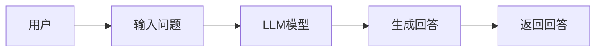

                 


# 问答系统：构建基于LLM的智能问答Agent

> **关键词**：问答系统、LLM、智能问答、自然语言处理、深度学习  
>
> **摘要**：本文深入探讨了基于大语言模型（LLM）构建智能问答系统的各个方面，从基础概念到算法原理，再到系统设计与项目实战。通过分析问答系统的背景、核心概念、基于LLM的问答系统的优势及其算法原理，详细讲解了如何构建一个高效的智能问答Agent。文章还通过实际案例展示了如何在项目中应用这些技术，并提供了最佳实践和注意事项。

---

## 第一部分：问答系统背景与基于LLM的智能问答系统概述

### 第1章：问答系统的基本概念与问题背景

#### 1.1 问答系统的基本概念

问答系统是一种自然语言处理（NLP）技术，旨在通过理解和生成自然语言文本，回答用户提出的问题。它可以分为**规则-based**、**检索-based**和**生成-based**三类。

- **规则-based**：依赖于预定义的规则和知识库，通常用于封闭领域的问题。
- **检索-based**：基于现有的文档或知识库，通过关键词匹配或语义相似度检索答案。
- **生成-based**：利用机器学习模型生成回答，通常基于序列到序列（seq2seq）模型。

#### 1.2 问题背景与问题描述

随着NLP技术的进步，问答系统逐渐从基于规则和检索的方式转向基于生成模型的方式。基于生成模型的问答系统能够处理更复杂的问题，并生成更自然的回答。然而，这些系统也面临以下挑战：

- **数据需求**：需要大量高质量的训练数据。
- **计算资源**：训练和推理需要高性能的计算资源。
- **准确性**：回答的准确性和相关性需要保证。

#### 1.3 基于LLM的问答系统的优势

基于大语言模型（LLM）的问答系统具有以下优势：

- **强大的上下文理解**：LLM能够理解上下文关系，生成连贯的回答。
- **灵活的回答方式**：能够处理多种语言和领域的问题。
- **自我学习能力**：通过大量的数据训练，模型可以不断优化自身的回答能力。

---

### 第2章：基于LLM的问答系统核心概念与联系

#### 2.1 LLM的基本原理

大语言模型（LLM）通过以下步骤处理输入并生成回答：

1. **输入处理**：将用户的问题输入模型，通常经过词嵌入（word embedding）转换为向量表示。
2. **解码过程**：模型通过解码器（decoder）生成回答，通常使用注意力机制（attention）来捕捉输入中的重要信息。
3. **输出生成**：模型生成最终的回答，通常会经过语言模型的优化，以确保回答的流畅性和合理性。

#### 2.2 核心概念对比

以下是问答系统与LLM的对比分析：

| **特性**       | **问答系统**                     | **LLM**                        |
|----------------|----------------------------------|---------------------------------|
| 输入类型        | 文本或结构化数据                | 文本                            |
| 输出类型        | 文本或结构化数据                | 文本                            |
| 模型复杂度      | 较低，依赖规则或检索            | 较高，基于深度学习模型          |
| 应用场景        | 适用于封闭领域或特定任务        | 适用于多种语言和领域            |
| 训练数据需求    | 较少，依赖规则或现有知识库        | 需要大量标注数据                |

#### 2.3 实体关系图

以下是一个简化的实体关系图，展示了问答系统与LLM之间的关系：



---

## 第二部分：基于LLM的问答系统算法原理

### 第3章：基于LLM的问答系统算法原理

#### 3.1 LLM的训练过程

大语言模型的训练通常包括以下几个步骤：

1. **监督微调**：在预训练好的模型上，使用特定领域的数据进行微调。
2. **强化学习**：通过强化学习策略，优化模型的回答质量。
3. **生成策略**：定义生成策略，如贪心搜索或随机采样。

#### 3.2 算法流程图

以下是一个简化的LLM训练流程图：



#### 3.3 Python代码实现

以下是一个简单的基于LLM的问答系统代码示例：

```python
import torch
import torch.nn as nn

# 定义模型
class SimpleLLM(nn.Module):
    def __init__(self, input_size, hidden_size, output_size):
        super(SimpleLLM, self).__init__()
        self.encoder = nn.Embedding(input_size, hidden_size)
        self.decoder = nn.Linear(hidden_size, output_size)
    
    def forward(self, input):
        encoded = self.encoder(input)
        output = self.decoder(encoded)
        return output

# 初始化模型
input_size = 100
hidden_size = 512
output_size = 50
model = SimpleLLM(input_size, hidden_size, output_size)

# 定义损失函数和优化器
criterion = nn.CrossEntropyLoss()
optimizer = torch.optim.Adam(model.parameters(), lr=0.001)

# 训练过程
for epoch in range(num_epochs):
    for batch in batches:
        inputs, targets = batch
        outputs = model(inputs)
        loss = criterion(outputs, targets)
        optimizer.zero_grad()
        loss.backward()
        optimizer.step()
```

#### 3.4 数学模型与公式

以下是LLM训练过程中的一些关键公式：

- **损失函数**：
  $$ L = -\sum_{i=1}^{n} \log p(y_i | x_i) $$
  
- **参数更新**：
  $$ \theta = \theta - \eta \frac{\partial L}{\partial \theta} $$

- **注意力机制**：
  $$ \text{Attention}(Q, K, V) = \text{softmax}\left(\frac{QK^T}{\sqrt{d_k}}\right)V $$

---

## 第三部分：基于LLM的问答系统系统分析

### 第4章：智能问答Agent的系统设计

#### 4.1 系统功能设计

智能问答Agent的主要功能包括：

1. **用户交互**：接收用户输入的问题。
2. **问题理解**：解析用户的问题，生成适当的回答。
3. **知识库管理**：管理相关的知识库或外部数据源。
4. **回答生成**：基于LLM生成回答，并返回给用户。

#### 4.2 系统架构设计

以下是智能问答Agent的系统架构图：



#### 4.3 系统接口设计

智能问答Agent的接口设计包括：

- **输入接口**：接收用户的自然语言输入。
- **输出接口**：返回生成的回答或提示用户输入更多信息。

#### 4.4 系统交互流程图

以下是智能问答Agent的交互流程图：



---

## 第四部分：项目实战

### 第5章：基于LLM的问答系统项目实现

#### 5.1 环境安装

安装所需的库：

```bash
pip install torch transformers
```

#### 5.2 核心代码实现

以下是基于LLM的问答系统的核心代码：

```python
from transformers import AutoTokenizer, AutoModelForQuestionAnswering

# 初始化模型和tokenizer
model_name = "bert-large-uncased-whole-word-masking-finetuned-squad"
tokenizer = AutoTokenizer.from_pretrained(model_name)
model = AutoModelForQuestionAnswering.from_pretrained(model_name)

# 定义回答问题的函数
def answer_question(question, context):
    inputs = tokenizer.encode_plus(question + " " + context, return_tensors="pt")
    outputs = model.generate(inputs.input_ids, max_length=100, num_beams=5)
    answer = tokenizer.decode(outputs[0], skip_special_tokens=True)
    return answer

# 示例
question = "What is the capital of France?"
context = "France's capital is Paris."
print(answer_question(question, context))
```

#### 5.3 实际案例分析

以下是一个实际案例：

**问题**：What is the capital of France?  
**上下文**：France's capital is Paris.

**回答**：Paris.

---

## 第五部分：最佳实践与总结

### 第6章：最佳实践与总结

#### 6.1 小结

基于LLM的问答系统具有强大的自然语言处理能力，能够生成高质量的回答。然而，其训练和推理需要大量的计算资源，并且需要高质量的数据进行微调。

#### 6.2 注意事项

- 确保训练数据的多样性和高质量。
- 定期优化模型，以适应新的数据和需求。
- 处理用户输入时，确保模型的安全性和鲁棒性。

#### 6.3 拓展阅读

建议读者进一步学习以下内容：

- 大语言模型的微调技术。
- 多轮对话的实现。
- 问答系统的性能评估指标。

---

**作者：AI天才研究院/AI Genius Institute & 禅与计算机程序设计艺术 /Zen And The Art of Computer Programming**

