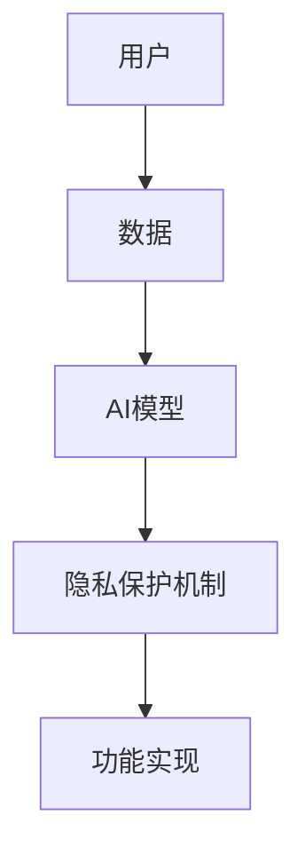
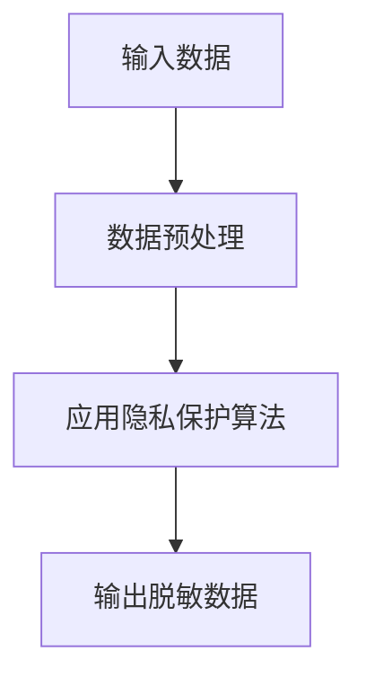
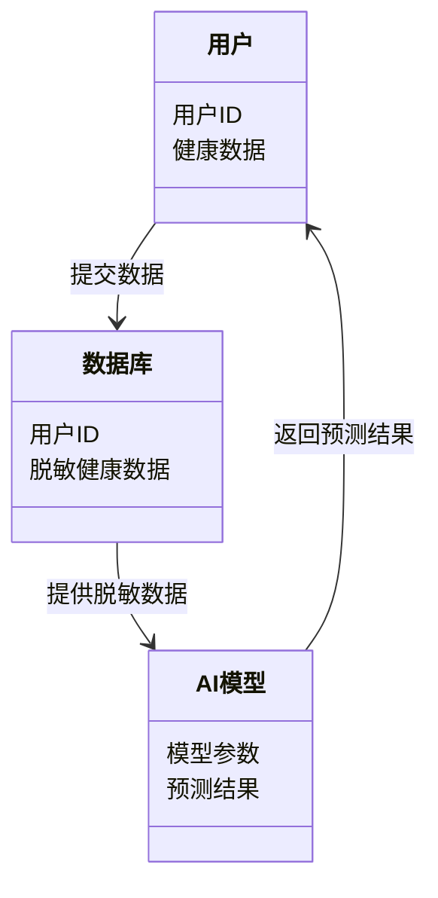
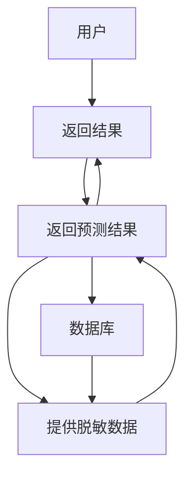
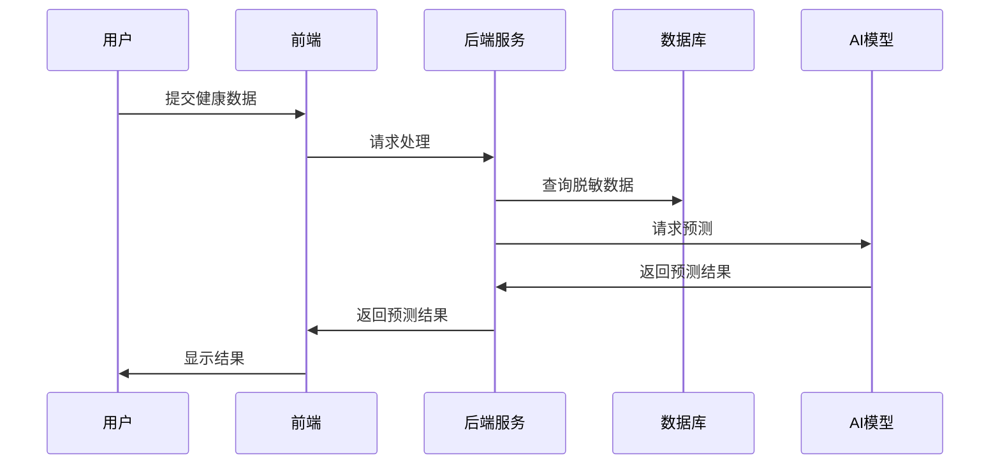

                 


# 隐私保护AI：在数据安全与功能之间寻找平衡

> 关键词：隐私保护、人工智能、数据安全、差分隐私、同态加密、系统架构

> 摘要：随着人工智能技术的快速发展，数据隐私保护成为一个重要课题。本文详细探讨了隐私保护AI的核心概念、算法原理、数学模型、系统架构设计以及实际应用案例，分析了在数据安全与AI功能之间的平衡点，为实际应用提供了指导和建议。

---

# 第一部分: 隐私保护AI的背景与核心概念

## 第1章: 隐私保护AI的背景与问题背景

### 1.1 人工智能的发展与隐私问题的凸显

#### 1.1.1 人工智能技术的快速发展
人工智能（AI）技术近年来取得了显著进展，从图像识别、自然语言处理到自动驾驶，AI已经渗透到各个领域。然而，这些技术的进步依赖于大量数据的收集和处理，这就带来了隐私泄露的风险。

#### 1.1.2 隐私保护的重要性与挑战
数据是AI系统的生命线，但数据的收集和使用也伴随着隐私泄露的风险。近年来，数据泄露事件频发，用户隐私保护已成为社会关注的焦点。如何在AI功能需求和数据隐私之间找到平衡点，成为技术开发者面临的重要挑战。

#### 1.1.3 隐私保护AI的核心问题背景
隐私保护AI的目标是通过技术手段保护数据隐私，同时确保AI系统能够正常运行。这需要在数据处理的各个环节中引入隐私保护机制，如数据脱敏、差分隐私和同态加密等。

---

## 第2章: 隐私保护AI的核心概念与原理

### 2.1 隐私保护AI的核心概念

#### 2.1.1 数据脱敏
数据脱敏是一种通过技术手段将敏感数据转化为非敏感数据的过程，同时保持数据的可用性。例如，将真实姓名替换为代号，或将地址信息部分隐藏。

#### 2.1.2 差分隐私
差分隐私是一种通过在数据中添加噪声来保护个体隐私的技术。其核心思想是在数据集中添加足够的噪声，使得单个数据点的变化无法被检测到，从而保护个体隐私。

#### 2.1.3 同态加密
同态加密是一种允许在加密状态下对数据进行计算的技术。通过这种技术，可以在不泄露原始数据的情况下进行数据处理和分析。

### 2.2 隐私保护AI的原理与机制

#### 2.2.1 数据脱敏的实现原理
数据脱敏通常通过数据替换、数据隐藏或数据泛化等方式实现。例如，使用哈希函数将敏感字段映射为随机值，同时保持数据的唯一性和完整性。

#### 2.2.2 隐私保护算法的分类
隐私保护算法主要分为基于概率的差分隐私、基于加密的同态加密以及基于数据变换的数据脱敏等。

#### 2.2.3 隐私保护AI的数学模型
隐私保护AI的数学模型通常涉及概率论、加密算法和数据处理技术。例如，差分隐私可以通过概率分布模型实现，而同态加密则基于数论和模运算。

---

## 第3章: 隐私保护AI的核心概念与联系

### 3.1 隐私保护AI的核心概念原理

#### 3.1.1 数据脱敏的实现原理
数据脱敏通过将原始数据转换为不可逆的形式，确保未经授权的第三方无法还原出原始数据。例如，使用随机化算法对数据进行变形处理。

#### 3.1.2 差分隐私的数学模型
差分隐私通过在数据中添加噪声，使得单个数据点的改变对整体统计结果的影响可以忽略不计。其数学模型通常基于概率分布和拉普拉斯分布。

#### 3.1.3 同态加密的基本原理
同态加密允许在加密数据上进行计算，而不需要解密。其基本原理是通过模运算实现数据的加法和乘法操作。

### 3.2 核心概念属性特征对比

| **概念**      | **描述**                                                                 |
|----------------|--------------------------------------------------------------------------|
| 数据脱敏       | 通过数据变换保护隐私，保持数据可用性。                                 |
| 差分隐私       | 通过添加噪声保护隐私，确保数据的统计性质不被泄露。                   |
| 同态加密       | 在加密状态下进行数据计算，保护原始数据的隐私。                         |

### 3.3 ER实体关系图架构



---

# 第二部分: 隐私保护AI的算法原理与数学模型

## 第4章: 隐私保护AI的算法原理

### 4.1 隐私保护AI的算法概述

#### 4.1.1 隐私保护AI的算法分类
隐私保护算法主要分为基于概率的差分隐私、基于加密的同态加密以及基于数据变换的数据脱敏等。

#### 4.1.2 常见的隐私保护算法
- 数据脱敏算法：随机化算法、哈希函数、数据泛化。
- 差分隐私算法：拉普拉斯噪声添加、指数机制。
- 同态加密算法：基于RSA的同态加密、基于格的同态加密。

#### 4.1.3 算法的优缺点分析
- 数据脱敏：优点是简单易实现，缺点是无法保证数据的可逆性。
- 差分隐私：优点是保护性强，缺点是会引入噪声，影响数据准确性。
- 同态加密：优点是保护性高，缺点是计算复杂度高，性能较低。

### 4.2 隐私保护AI的数学模型

#### 4.2.1 数据脱敏的数学模型
$$脱敏数据 = f(原始数据)$$

#### 4.2.2 差分隐私的数学模型
$$P(f(x) = y) \leq P(f(x+\Delta) = y) + \epsilon$$

#### 4.2.3 同态加密的数学模型
$$E(x) = x^k \mod n$$

### 4.3 隐私保护AI的算法流程图



---

## 第5章: 隐私保护AI的数学模型与公式

### 5.1 数据脱敏的数学模型
- 数据脱敏公式：
$$脱敏数据 = f(原始数据)$$
其中，$f$ 是一种不可逆的变换函数。

### 5.2 差分隐私的数学模型
- 差分隐私公式：
$$P(f(x) = y) \leq P(f(x+\Delta) = y) + \epsilon$$
其中，$\epsilon$ 是隐私预算，控制隐私泄露的概率。

### 5.3 同态加密的数学模型
- 同态加密公式：
$$E(x) = x^k \mod n$$
其中，$k$ 是加密密钥，$n$ 是模数。

---

# 第三部分: 隐私保护AI的系统分析与架构设计

## 第6章: 隐私保护AI的系统分析与架构设计

### 6.1 问题场景介绍
在医疗领域，患者的健康数据是非常敏感的信息。如何在保护患者隐私的前提下，利用AI技术进行疾病预测和诊断，是隐私保护AI的重要应用场景。

### 6.2 系统功能设计

#### 6.2.1 领域模型


#### 6.2.2 系统架构设计


#### 6.2.3 系统交互设计


---

## 第7章: 项目实战与总结

### 7.1 项目实战

#### 7.1.1 环境安装
- 安装Python和必要的库（如numpy、pandas、scikit-learn）。

#### 7.1.2 核心代码实现

```python
import numpy as np

def data_mia(x):
    return x + np.random.laplace(0, 1, x.shape)

x = np.array([1, 2, 3, 4, 5])
x_mia = data_mia(x)
print("原始数据:", x)
print("脱敏数据:", x_mia)
```

### 7.2 总结与最佳实践

#### 7.2.1 总结
隐私保护AI在数据安全与功能之间找到了平衡点，为实际应用提供了有效的解决方案。

#### 7.2.2 最佳实践
- 在数据预处理阶段引入隐私保护机制。
- 根据具体场景选择合适的隐私保护算法。
- 定期进行数据安全评估和隐私风险分析。

---

# 第四部分: 结语与展望

## 第8章: 结语与展望

### 8.1 结语
隐私保护AI是人工智能技术发展中的重要方向，通过技术创新和应用实践，可以在保护数据隐私的同时，充分发挥AI的潜力。

### 8.2 展望
未来，随着技术的进步，隐私保护AI将在更多领域得到应用，如金融、医疗、教育等。同时，隐私保护技术也将更加多样化，如结合区块链和联邦学习等新兴技术，进一步提升隐私保护能力。

---

# 作者：AI天才研究院/AI Genius Institute & 禅与计算机程序设计艺术 /Zen And The Art of Computer Programming

---

这篇文章系统地介绍了隐私保护AI的核心概念、算法原理、系统架构设计和实际应用案例。通过详细分析数据脱敏、差分隐私和同态加密等技术，为读者提供了全面的视角和深入的见解。

