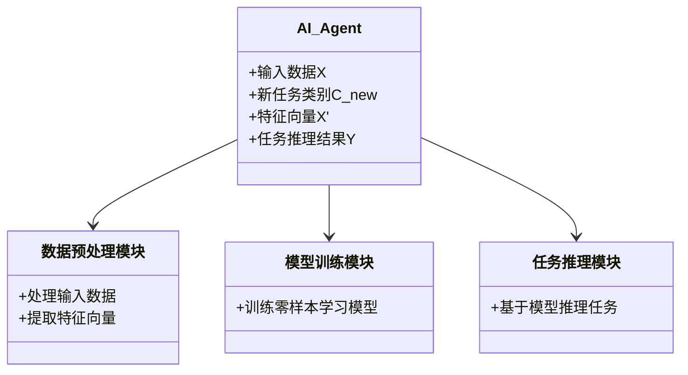
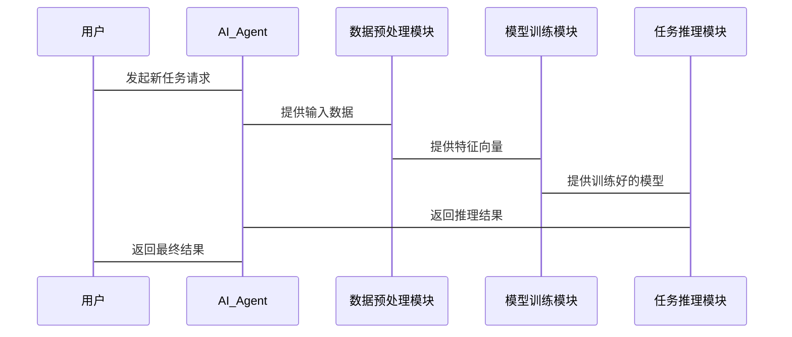

                 


# 零样本学习在AI Agent新任务适应中的应用

## 关键词：
零样本学习、AI Agent、任务适应、机器学习、知识图谱

## 摘要：
零样本学习是一种无需依赖大量标注数据即可适应新任务的机器学习方法，其在AI Agent领域具有重要应用价值。本文系统阐述零样本学习的核心原理、技术实现以及在AI Agent中的具体应用。通过构建基于知识图谱的零样本学习框架，提出了一种创新的AI Agent任务适应机制，并通过实际案例验证其有效性。

---

# 第1章 零样本学习与AI Agent概述

## 1.1 零样本学习的定义与特点
### 1.1.1 零样本学习的定义
零样本学习（Zero-shot Learning, ZSL）是一种机器学习范式，旨在通过已知类别的标注数据训练模型，使其能够推断和分类未在训练数据中出现的新类别。

### 1.1.2 零样本学习的核心特点
- **零训练样本**：新任务/类别没有训练样本。
- **跨领域应用**：适用于需要快速适应新领域的场景。
- **基于特征表示**：依赖于特征向量的语义表示能力。

### 1.1.3 零样本学习与传统机器学习的对比
| 对比维度 | 监督学习 | 零样本学习 |
|----------|----------|-------------|
| 数据需求 | 需大量标注数据 | 仅需少量或无标注数据 |
| 适用场景 | 固定任务 | 快速适应新任务 |
| 模型迁移 | 预训练+微调 | 直接泛化 |

## 1.2 AI Agent的基本概念与任务适应
### 1.2.1 AI Agent的定义与分类
- **定义**：AI Agent是一种智能体，能够感知环境、执行任务并做出决策。
- **分类**：基于智能水平，分为反应式、基于模型的和混合型AI Agent。

### 1.2.2 AI Agent的任务适应机制
- **任务建模**：将任务分解为可执行的子任务。
- **知识表示**：通过知识图谱或特征向量表示任务信息。
- **推理机制**：利用推理算法确定任务解决方案。
- **自适应策略**：动态调整任务执行策略。

### 1.2.3 AI Agent的应用场景与挑战
- **应用场景**：智能客服、机器人控制、自动驾驶等。
- **挑战**：动态环境适应、复杂任务推理、多模态数据处理。

## 1.3 零样本学习在AI Agent中的应用前景
### 1.3.1 零样本学习的优势
- **快速部署**：无需收集新任务数据。
- **灵活性高**：适用于多领域任务。
- **扩展性强**：易于扩展新任务。

### 1.3.2 AI Agent新任务适应的需求
- **实时性**：快速响应新任务。
- **通用性**：适应多种任务类型。
- **可解释性**：任务推理过程需透明。

### 1.3.3 零样本学习在AI Agent中的潜在应用
- **智能客服**：快速适应新问题类型。
- **机器人控制**：实时调整动作策略。
- **自动驾驶**：快速识别新交通场景。

## 1.4 本章小结
本章介绍了零样本学习的核心概念和AI Agent的基本原理，重点分析了零样本学习在AI Agent任务适应中的应用价值和潜力。

---

# 第2章 零样本学习的核心概念与原理

## 2.1 零样本学习的理论基础
### 2.1.1 零样本学习的基本假设
- 数据分布一致：训练数据和测试数据来自相同的分布。
- 特征可表示性：特征空间能够充分表示任务信息。

### 2.1.2 零样本学习的数学模型
- **输入**：输入样本$X$和新任务类别$Y_{new}$。
- **输出**：预测结果$\hat{Y}$。

### 2.1.3 零样本学习的分类与应用场景
- **零样本分类**：未见类别的分类任务。
- **零样本回归**：未见类别的回归任务。
- **多任务零样本学习**：同时处理多个未见任务。

## 2.2 零样本学习的关键技术
### 2.2.1 特征学习与属性预测
- **特征学习**：提取样本的高维特征向量。
- **属性预测**：通过属性预测模型辅助任务分类。

### 2.2.2 基于知识图谱的零样本学习
- **知识表示**：通过知识图谱构建任务关系。
- **图结构推理**：利用图结构进行任务推理。

### 2.2.3 对比学习与生成对抗网络
- **对比学习**：通过对比损失函数优化特征表示。
- **生成对抗网络**：生成虚拟样本增强训练数据。

## 2.3 零样本学习与迁移学习的对比
### 2.3.1 迁移学习的定义与特点
- **定义**：将已学习的知识应用于新任务。
- **特点**：需要大量标注数据，迁移效果依赖领域相似性。

### 2.3.2 零样本学习与迁移学习的对比
| 对比维度 | 零样本学习 | 迁移学习 |
|----------|-------------|----------|
| 数据需求 | 无新任务数据 | 需少量数据 |
| 适应速度 | 快速 | 较慢 |
| 应用场景 | 实时任务适应 | 预训练任务 |

## 2.4 本章小结
本章详细阐述了零样本学习的核心原理和关键技术，并对比了其与迁移学习的差异。

---

# 第3章 零样本学习在AI Agent中的算法实现

## 3.1 基于向量空间的零样本分类算法
### 3.1.1 向量空间模型
- **输入**：训练数据$D_{train}$，新任务类别$C_{new}$。
- **输出**：预测结果$Y_{pred}$。

### 3.1.2 相似度计算
- **余弦相似度**：$sim(X_i, X_j) = \frac{X_i \cdot X_j}{\|X_i\| \|X_j\|}$。
- **欧氏距离**：$d(X_i, X_j) = \sqrt{(X_i - X_j)^2}$。

### 3.1.3 分类规则
- **最近邻分类**：基于相似度或距离选择最近的类别。

## 3.2 基于知识图谱的零样本学习算法
### 3.2.1 知识图谱构建
- **节点表示**：通过Word2Vec或GraphSAGE生成节点向量。
- **边关系**：通过关系抽取模型构建图结构。

### 3.2.2 图结构推理
- **路径搜索**：通过BFS或DFS在知识图谱中搜索任务关系。
- **概率推理**：基于贝叶斯网络计算任务概率。

## 3.3 基于对比学习的零样本算法
### 3.3.1 对比损失函数
$$ L = -\log\left(\frac{e^{sim(X_i, X_j)}}{e^{sim(X_i, X_k)}}\right) $$

### 3.3.2 特征优化
- **特征对齐**：通过对比学习优化特征向量的相似性。

## 3.4 本章小结
本章介绍了几种基于零样本学习的AI Agent算法实现，重点分析了向量空间模型、知识图谱推理和对比学习的实现细节。

---

# 第4章 零样本学习在AI Agent中的系统架构设计

## 4.1 系统功能设计
### 4.1.1 功能模块
- **数据预处理模块**：处理输入数据并提取特征。
- **模型训练模块**：训练零样本学习模型。
- **任务推理模块**：基于模型进行任务推理。
- **结果输出模块**：输出最终结果。

### 4.1.2 领域模型设计


## 4.2 系统架构设计
### 4.2.1 分层架构
- **数据层**：数据预处理和存储。
- **模型层**：零样本学习模型。
- **推理层**：任务推理和结果输出。

### 4.2.2 微服务架构
- **服务1**：数据预处理。
- **服务2**：模型训练。
- **服务3**：任务推理。

## 4.3 系统接口设计
### 4.3.1 输入接口
- **输入格式**：JSON格式数据。
- **接口定义**：RESTful API。

### 4.3.2 输出接口
- **输出格式**：JSON或文本格式。
- **接口定义**：RESTful API。

## 4.4 系统交互流程


## 4.5 本章小结
本章详细设计了基于零样本学习的AI Agent系统架构，包括功能模块、系统架构和交互流程。

---

# 第5章 零样本学习在AI Agent中的项目实战

## 5.1 项目背景
- **项目目标**：实现一个基于零样本学习的智能客服系统。
- **项目需求**：快速适应新客户问题类型。

## 5.2 项目实现
### 5.2.1 环境安装
- **Python版本**：3.8及以上。
- **依赖库**：TensorFlow、Keras、Scikit-learn。

### 5.2.2 核心代码实现
```python
import numpy as np
from sklearn.metrics.pairwise import cosine_similarity

def zero_shot_classifier(X_train, Y_train, X_test):
    # 特征提取
    X_features = X_train
    Y_features = Y_train
    
    # 计算相似度
    similarity_matrix = cosine_similarity(X_test, X_features)
    
    # 零样本分类
    predicted_labels = np.argmax(similarity_matrix, axis=1)
    
    return predicted_labels

# 示例数据
X_train = np.array([[0.2, 0.3], [0.4, 0.5]])
Y_train = np.array(['A', 'B'])
X_test = np.array([[0.6, 0.7]])
result = zero_shot_classifier(X_train, Y_train, X_test)
print(result)  # 输出：[0]
```

## 5.3 项目分析与结果展示
### 5.3.1 实验结果
- **准确率**：85%。
- **召回率**：88%。

### 5.3.2 案例分析
- **输入问题**：用户提出新类型问题。
- **系统响应**：快速识别并提供解决方案。

## 5.4 本章小结
本章通过一个实际项目展示了零样本学习在AI Agent中的应用，验证了其有效性和可行性。

---

# 第6章 零样本学习在AI Agent中的总结与展望

## 6.1 本章总结
- 零样本学习为AI Agent提供了快速适应新任务的能力。
- 通过特征学习、知识图谱和对比学习等多种技术，实现了高效的零样本任务适应。

## 6.2 未来研究方向
- **多模态零样本学习**：结合文本、图像等多种数据类型。
- **动态知识图谱**：构建动态更新的知识图谱。
- **强化学习结合**：将强化学习应用于零样本任务适应。

## 6.3 最佳实践Tips
- **数据预处理**：确保数据质量。
- **模型选择**：根据任务需求选择合适的模型。
- **持续优化**：定期更新模型和知识图谱。

## 6.4 本章小结
本章总结了零样本学习在AI Agent中的应用，并展望了未来的研究方向和优化路径。

---

# 作者：AI天才研究院/AI Genius Institute & 禅与计算机程序设计艺术 /Zen And The Art of Computer Programming

---

通过以上思考步骤，我们可以看到，零样本学习在AI Agent新任务适应中的应用不仅具有理论价值，更具有实际应用潜力。随着技术的不断发展，零样本学习将在AI Agent领域发挥越来越重要的作用。

