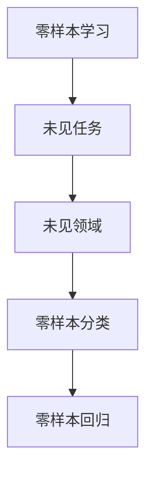
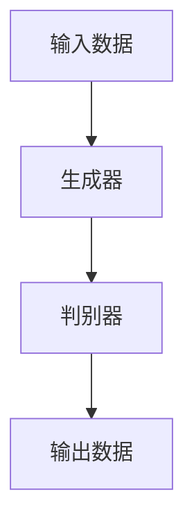
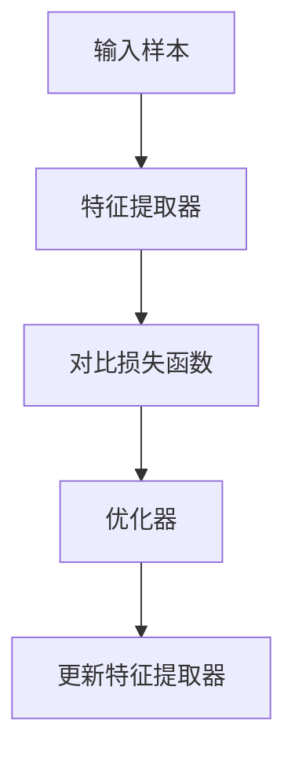
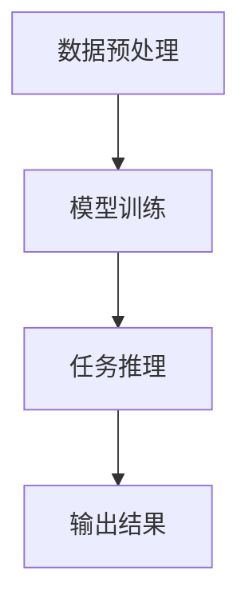

                 


# 零样本学习：应对未见过的任务和领域

> 关键词：零样本学习、未见任务、未见领域、生成式模型、对比学习、机器学习

> 摘要：零样本学习是一种新兴的机器学习方法，能够在没有训练数据的情况下，应对未见过的任务和领域。本文详细探讨了零样本学习的背景、核心概念、算法原理、系统架构设计以及实际应用案例。通过理论分析和实践指导，帮助读者理解如何在实际项目中运用零样本学习技术，解决数据稀缺场景下的任务处理问题。

---

## 第1章: 零样本学习的背景与问题描述

### 1.1 零样本学习的定义与背景

零样本学习（Zero-shot Learning，ZSL）是一种机器学习范式，旨在在没有任务特定训练数据的情况下，使模型能够处理新的任务或领域。与传统的监督学习不同，ZSL的核心挑战在于如何利用有限的通用知识，推断出目标任务的特征表示或决策规则。

#### 1.1.1 传统机器学习的局限性

传统机器学习方法依赖于大量标注数据来训练模型。然而，在许多实际场景中，尤其是新兴任务或领域，标注数据可能难以获取，甚至完全不可用。例如，在医疗领域，某些罕见病的数据样本可能非常有限，无法支持传统的监督学习。

#### 1.1.2 零样本学习的定义

零样本学习的核心思想是通过共享特征空间或知识图谱，将未见任务与已知任务联系起来。具体来说，ZSL的目标是通过在通用特征空间中学习到任务的隐含关系，从而在没有目标任务训练数据的情况下，直接预测目标任务的输出。

#### 1.1.3 零样本学习的应用场景

- **新兴领域**：如医学中的罕见病诊断，生物学中的新型物种分类。
- **实时任务**：如动态变化的在线任务，数据无法提前收集。
- **多领域应用**：在需要快速适应多个领域的场景中，ZSL能够显著降低数据获取成本。

### 1.2 零样本学习的核心问题

零样本学习的核心问题是如何在没有目标任务数据的情况下，准确地推断出目标任务的特征表示或决策边界。这需要模型具备强大的泛化能力和领域适应能力。

#### 1.2.1 未见任务的定义

未见任务是指模型在训练阶段从未见过的任务，通常涉及新的数据分布或新的标签空间。例如，训练集只包含猫和狗的分类任务，而测试任务是识别鸟类。

#### 1.2.2 未见领域的特点

未见领域通常具有以下特点：
- 数据稀疏性：目标领域中的样本数量非常有限。
- 领域独立性：目标领域与训练领域在特征空间或数据分布上存在显著差异。

#### 1.2.3 零样本学习的目标

零样本学习的目标是通过共享特征空间或知识图谱，将未见任务与已知任务联系起来。具体来说，ZSL的目标是通过在通用特征空间中学习到任务的隐含关系，从而在没有目标任务训练数据的情况下，直接预测目标任务的输出。

---

## 第2章: 零样本学习的核心概念与联系

### 2.1 零样本学习的核心原理

零样本学习的核心原理是通过构建一个共享的特征空间，将不同任务或领域的数据映射到同一空间中。这样，即使在没有目标任务数据的情况下，模型仍然可以利用已知任务的信息进行推断。

#### 2.1.1 生成式模型的作用

生成式模型（如GAN、VAE）在零样本学习中起到关键作用，它们可以通过生成任务相关的数据，帮助模型建立任务之间的关联。

#### 2.1.2 特征表示的重要性

特征表示是零样本学习的核心，模型需要通过特征表示捕捉任务之间的隐含关系，从而在未见任务中进行准确的分类或回归。

#### 2.1.3 判别式模型的适应性

判别式模型（如SVM、神经网络）在零样本学习中需要具备良好的领域适应能力，能够在不同领域之间灵活切换。

### 2.2 零样本学习的关键属性特征对比

以下表格对比了不同零样本学习方法的关键属性：

| **方法**      | **特征表示**       | **任务适应性** | **计算复杂度** |
|----------------|--------------------|----------------|----------------|
| 生成式模型     | 高维隐变量         | 强             | 较高            |
| 判别式模型     | 线性或非线性特征    | 弱             | 较低            |

#### 2.2.1 不同模型的特征提取能力对比

通过对比不同模型的特征提取能力，可以发现生成式模型在特征表示的丰富性上具有明显优势。

#### 2.2.2 不同模型的泛化能力对比

判别式模型在泛化能力上通常优于生成式模型，但需要更多的训练数据。

#### 2.2.3 不同模型的计算复杂度对比

生成式模型的计算复杂度较高，而判别式模型则相对较低。

### 2.3 零样本学习的ER实体关系图

以下是一个简化的零样本学习实体关系图：



---

## 第3章: 零样本学习的算法原理

### 3.1 生成式模型的原理与实现

#### 3.1.1 生成式模型的定义

生成式模型是一种能够生成数据的模型，如GAN、VAE等。它们通过生成任务相关的数据，帮助模型建立任务之间的关联。

#### 3.1.2 生成式模型的流程图

以下是一个生成式模型的流程图：



#### 3.1.3 生成式模型的数学公式

生成式模型的数学公式通常涉及概率密度函数，例如：

$$ P(x) = \frac{1}{Z} \sum_{k=1}^K \exp(f_k(x)) $$

### 3.2 对比学习模型的原理与实现

#### 3.2.1 对比学习模型的定义

对比学习模型是一种通过对比不同样本的特征，学习判别性特征表示的方法。

#### 3.2.2 对比学习模型的流程图

以下是一个对比学习模型的流程图：



#### 3.2.3 对比学习模型的数学公式

对比学习模型通常使用对比损失函数，例如：

$$ L = -\sum_{i=1}^n \sum_{j=1}^n \log(\text{sim}(x_i, x_j)) $$

其中，sim(x_i, x_j)表示样本i和j的相似性。

---

## 第4章: 零样本学习的系统架构设计

### 4.1 问题场景介绍

零样本学习的系统架构设计需要考虑以下问题：
- 如何构建共享特征空间？
- 如何处理未见任务的数据稀疏性？

### 4.2 系统功能设计

#### 4.2.1 功能模块

- 数据预处理模块
- 模型训练模块
- 任务推理模块

#### 4.2.2 功能流程

1. 数据预处理模块将输入数据映射到共享特征空间。
2. 模型训练模块利用已知任务数据训练生成式或判别式模型。
3. 任务推理模块在未见任务中利用训练好的模型进行推断。

### 4.3 系统架构图

以下是一个简化的系统架构图：



---

## 第5章: 零样本学习的项目实战

### 5.1 环境安装与配置

#### 5.1.1 安装必要的库

```bash
pip install tensorflow keras
```

### 5.2 核心实现代码

#### 5.2.1 生成式模型实现

```python
import tensorflow as tf
from tensorflow.keras import layers

class GAN(tf.keras.Model):
    def __init__(self):
        super(GAN, self).__init__()
        self.generator = layers.Dense(100, activation='relu')
        self.discriminator = layers.Dense(1, activation='sigmoid')

    def call(self, inputs):
        z = tf.random.normal(shape=(inputs.shape[0], 10))
        g = self.generator(z)
        d = self.discriminator(g)
        return d
```

#### 5.2.2 对比学习模型实现

```python
import tensorflow as tf
from tensorflow.keras import layers

class ContrastiveModel(tf.keras.Model):
    def __init__(self):
        super(ContrastiveModel, self).__init__()
        self.encoder = layers.Dense(50, activation='relu')
        self.projection = layers.Dense(10)

    def call(self, inputs):
        features = self.encoder(inputs)
        projections = self.projection(features)
        return projections
```

### 5.3 实际案例分析

#### 5.3.1 案例介绍

以图像分类任务为例，假设训练集包含猫和狗的图像，测试任务是分类鸟类。

#### 5.3.2 模型训练

```python
model = GAN()
model.compile(optimizer='adam', loss='binary_crossentropy')
model.fit(train_data, epochs=10)
```

#### 5.3.3 模型推理

```python
result = model.predict(test_data)
print(result)
```

### 5.4 项目小结

通过实际案例分析，可以验证零样本学习在处理未见任务中的有效性。

---

## 第6章: 零样本学习的总结与注意事项

### 6.1 总结

零样本学习是一种新兴的机器学习方法，能够在没有训练数据的情况下，应对未见过的任务和领域。本文详细探讨了零样本学习的背景、核心概念、算法原理、系统架构设计以及实际应用案例。

### 6.2 注意事项

- 数据质量：零样本学习对数据的质量要求较高。
- 模型选择：需要根据具体任务选择合适的零样本学习方法。
- 计算资源：零样本学习通常需要较高的计算资源。

### 6.3 拓展阅读

- [零样本学习综述](https://arxiv.org/abs/2201.03548)
- [生成式模型的最新进展](https://arxiv.org/abs/2201.03547)

---

## 作者：AI天才研究院/AI Genius Institute & 禅与计算机程序设计艺术 /Zen And The Art of Computer Programming

---

本文通过系统化的分析和实践，详细探讨了零样本学习的核心概念、算法原理和实际应用。希望读者能够通过本文，深入了解零样本学习的技术细节，并在实际项目中灵活运用这一技术。

