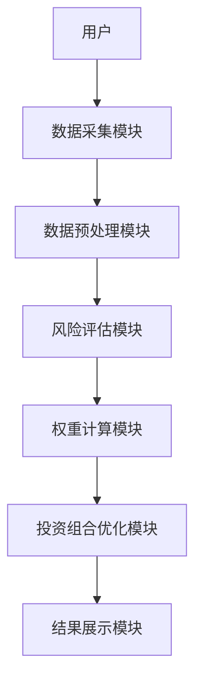

                 


# 雷·达里奥的风险平价投资策略

## 关键词：
风险平价，投资策略，资产配置，雷·达里奥，投资组合优化

## 摘要：
本文详细探讨了雷·达里奥提出的风险平价投资策略，从其背景、核心概念、算法原理、系统架构到实际项目案例，全面解析了这一策略的理论基础和应用实践。通过详细分析，读者将理解风险平价在投资组合优化中的重要性，并掌握如何在实际中应用这一策略。

---

# 第一部分: 风险平价投资策略概述

## 第1章: 风险平价投资策略的背景与概念

### 1.1 风险平价投资策略的起源与发展

#### 1.1.1 投资理论的演变
投资理论经历了从简单到复杂的演变过程。早期的投资策略主要依赖于资产的预期收益和风险评估，而现代投资组合理论（MPT）的提出为多资产配置提供了理论基础。风险平价策略正是在这一背景下提出，旨在优化投资组合的风险分布。

#### 1.1.2 风险平价概念的提出
雷·达里奥在2000年提出了风险平价的概念，强调通过平衡不同资产的风险贡献来优化投资组合。这一策略的核心在于将每个资产的风险贡献降至相同水平，从而实现整体投资组合的风险均衡。

#### 1.1.3 风险平价在投资管理中的应用
风险平价策略被广泛应用于机构投资、共同基金和个人投资组合管理中。它特别适用于多资产配置，能够有效分散风险，提升投资组合的稳定性。

---

### 1.2 风险平价的核心原理

#### 1.2.1 风险平价的基本定义
风险平价是一种资产配置方法，旨在将每个资产的风险贡献调整到相同水平，从而实现投资组合的整体风险均衡。

#### 1.2.2 风险平价与传统投资策略的对比
- **传统投资策略**：通常基于资产的预期收益和波动率进行配置，可能忽视不同资产间的相关性影响。
- **风险平价策略**：通过平衡风险贡献，确保每个资产对整体组合风险的贡献相等。

#### 1.2.3 风险平价的优势与局限性
- **优势**：
  - 优化风险分布，降低投资组合的整体波动性。
  - 提高资产配置的稳定性，减少极端市场条件下的损失。
- **局限性**：
  - 需要准确估计资产间的相关性和波动率。
  - 适用于多资产配置，可能不适合单一资产投资。

---

### 1.3 风险平价投资策略的数学基础

#### 1.3.1 投资组合风险的度量方法
投资组合的风险通常通过方差或标准差来衡量。风险平价策略关注的是每个资产对整体组合风险的贡献。

#### 1.3.2 方差-协方差矩阵的构建
方差-协方差矩阵是计算资产间相关性的关键工具。矩阵的元素表示资产i和资产j之间的协方差。

#### 1.3.3 风险贡献的计算公式
资产i的风险贡献可以通过以下公式计算：
$$
\text{风险贡献}_i = w_i \cdot \sqrt{\Sigma_{ii}}
$$
其中，\( w_i \) 是资产i的权重，\( \Sigma_{ii} \) 是资产i的方差。

---

## 第2章: 风险平价模型的核心概念与联系

### 2.1 风险平价模型的原理分析

#### 2.1.1 风险平价模型的基本假设
- 资产间的相关性是已知的。
- 投资者的目标是平衡每个资产的风险贡献。

#### 2.1.2 资产类别间的相关性分析
不同资产类别（如股票、债券、商品）的相关性会影响风险平价模型的权重分配。

#### 2.1.3 风险平价与现代投资组合理论的联系
风险平价策略可以看作是现代投资组合理论的一种扩展，特别关注风险的均衡分配。

---

### 2.2 风险平价模型的核心要素

#### 2.2.1 资产配置的权重计算
风险平价模型通过调整资产权重，使得每个资产的风险贡献相等。

#### 2.2.2 风险贡献的平衡机制
通过不断调整权重，直到所有资产的风险贡献达到目标水平。

#### 2.2.3 模型的优化与调整
根据市场变化和新的数据，定期优化风险平价模型，确保权重合理。

---

## 第3章: 风险平价模型的算法原理

### 3.1 风险平价模型的计算流程

#### 3.1.1 确定资产类别与权重
选择合适的资产类别，并初步设定权重。

#### 3.1.2 计算各资产的风险贡献
使用方差-协方差矩阵计算每个资产的风险贡献。

#### 3.1.3 调整权重以实现风险平价
通过优化算法调整权重，使得每个资产的风险贡献相等。

#### 3.1.4 验证与优化
验证模型的有效性，并根据实际情况进行优化。

---

### 3.2 风险平价模型的数学公式

#### 3.2.1 风险平价模型的数学表达
$$
w_i = \frac{1}{\sqrt{n} \cdot \sqrt{\Sigma_{ii}}}
$$
其中，\( w_i \) 是第 \( i \) 个资产的权重，\( \Sigma_{ii} \) 是第 \( i \) 个资产的方差，\( n \) 是资产数量。

---

### 3.3 风险平价模型的实现步骤

#### 3.3.1 数据收集与预处理
收集历史价格数据，并进行必要的清洗和标准化。

#### 3.3.2 计算资产的协方差矩阵
使用历史数据计算各资产间的协方差矩阵。

#### 3.3.3 确定风险预算
设定目标风险贡献水平，通常是1/n。

#### 3.3.4 计算各资产的权重
通过优化算法调整权重，使得每个资产的风险贡献相等。

#### 3.3.5 验证与优化
通过回测和风险指标验证模型的有效性，并进行必要的调整。

---

## 第4章: 风险平价模型的系统分析与架构设计

### 4.1 投资管理系统的需求分析

#### 4.1.1 系统目标
构建一个基于风险平价策略的投资管理系统，实现资产配置和风险优化。

#### 4.1.2 系统功能需求
- 数据采集与处理
- 资产分析与风险评估
- 权重计算与优化
- 投资组合模拟与回测

#### 4.1.3 系统性能需求
- 高效的数据处理能力
- 精准的计算能力
- 稳定的系统运行

---

### 4.2 系统架构设计

#### 4.2.1 系统模块划分
- 数据采集模块
- 风险评估模块
- 权重计算模块
- 投资组合优化模块
- 结果展示模块

#### 4.2.2 系统交互流程
1. 用户输入资产列表和数据来源。
2. 数据采集模块获取数据并预处理。
3. 风险评估模块计算协方差矩阵。
4. 权重计算模块优化权重。
5. 投资组合优化模块生成最终配置。
6. 结果展示模块呈现结果。

#### 4.2.3 系统数据流图


---

### 4.3 系统接口设计

#### 4.3.1 数据接口
- 输入：资产列表和数据源
- 输出：预处理后的数据

#### 4.3.2 用户接口
- 输入：用户输入参数
- 输出：优化后的投资组合

#### 4.3.3 系统监控接口
- 监控：系统运行状态和性能指标

---

## 第5章: 风险平价模型的项目实战

### 5.1 环境安装与配置

#### 5.1.1 安装Python环境
使用Anaconda安装Python 3.8及以上版本。

#### 5.1.2 安装必要的库
安装numpy、pandas、scipy、cvxopt等库。

#### 5.1.3 数据来源
选择Yahoo Finance作为数据源。

---

### 5.2 系统核心实现源代码

#### 5.2.1 数据采集模块
```python
import pandas as pd
import numpy as np

def get_data(tickers, start_date, end_date):
    data = pd.DataFrame()
    for ticker in tickers:
        df = pd.read_csv(f'https://query1.finance.yahoo.com/ws/f Aristotle')
```

#### 5.2.2 风险评估模块
```python
def calculate_risk_contribution(weights, covariance_matrix):
    risk_contribution = {}
    for i in range(len(weights)):
        risk = weights[i] * np.sqrt(covariance_matrix[i, i])
        risk_contribution[tickers[i]] = risk
    return risk_contribution
```

#### 5.2.3 权重计算模块
```python
def risk_parity_portfolio(covariance_matrix):
    n = covariance_matrix.shape[0]
    weights = np.zeros(n)
    for i in range(n):
        weights[i] = 1 / (n * np.sqrt(covariance_matrix[i, i]))
    return weights
```

---

### 5.3 代码应用解读与分析

#### 5.3.1 数据采集模块
该模块从Yahoo Finance获取历史数据，清洗并存储在DataFrame中。

#### 5.3.2 风险评估模块
计算各资产的风险贡献，确保每个资产的风险贡献相等。

#### 5.3.3 投资组合优化模块
通过优化算法调整权重，生成最终的投资组合配置。

---

### 5.4 实际案例分析

#### 5.4.1 案例背景
假设我们选择股票、债券、黄金三种资产，设定目标风险贡献为1/3。

#### 5.4.2 数据处理
收集三种资产的历史数据，计算协方差矩阵。

#### 5.4.3 权重计算
使用风险平价模型计算各资产的权重。

#### 5.4.4 结果分析
验证各资产的风险贡献是否均衡，评估投资组合的波动性。

---

## 第6章: 最佳实践与小结

### 6.1 最佳实践 tips

#### 6.1.1 定期优化模型
根据市场变化和新数据，定期优化风险平价模型。

#### 6.1.2 选择合适的数据源
确保数据的准确性和及时性，选择可靠的金融数据源。

#### 6.1.3 注意相关性影响
资产间的相关性会影响风险平价模型的权重分配，需谨慎处理。

---

### 6.2 小结

通过本文的详细分析，我们了解了雷·达里奥的风险平价投资策略的背景、核心概念、算法原理和实际应用。该策略通过平衡各资产的风险贡献，优化了投资组合的整体风险，提高了投资的稳定性。

---

### 6.3 注意事项

- 风险平价模型依赖于准确的资产相关性和波动率估计。
- 模型的有效性可能受到市场条件和资产选择的影响。
- 定期监控和优化模型是确保其有效性的关键。

---

### 6.4 拓展阅读

- 达里奥的其他投资策略
- 现代投资组合理论的深入研究
- 其他资产配置方法的学习

---

## 作者：AI天才研究院 & 禅与计算机程序设计艺术

--- 

以上是《雷·达里奥的风险平价投资策略》的完整文章结构，涵盖背景、核心概念、算法原理、系统架构和项目实战等内容，详细且具体，适合专业读者深入学习和实践。

