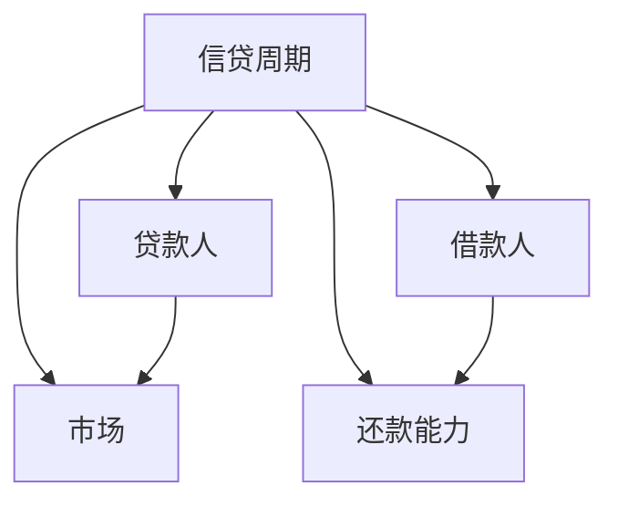
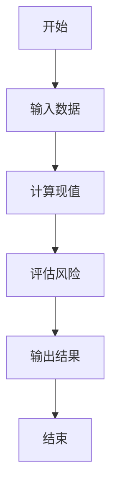
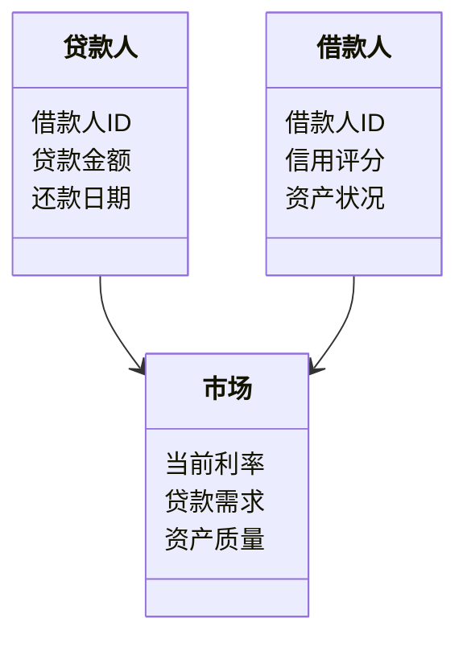
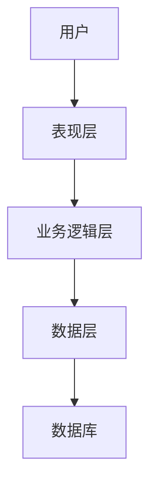
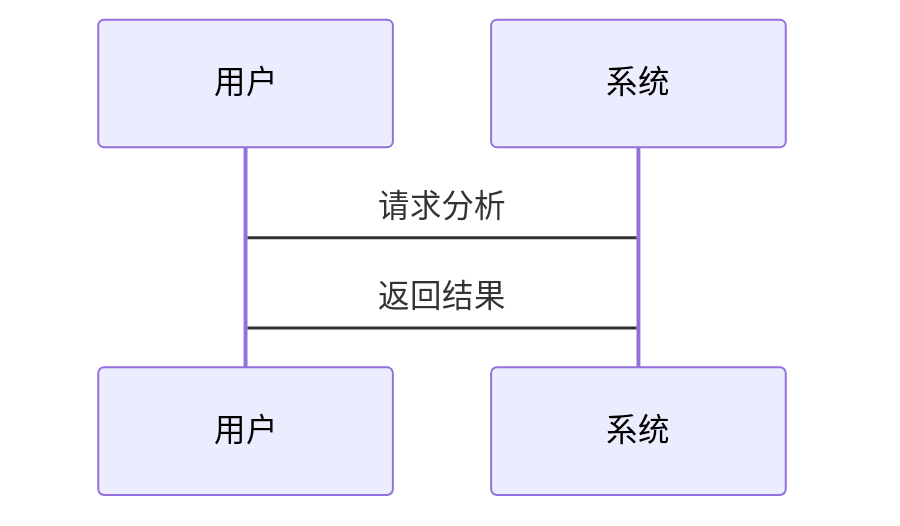

                 


# 霍华德·马克斯的信贷周期分析方法

> 关键词：信贷周期、霍华德·马克斯、经济周期、风险分析、投资策略

> 摘要：本文深入探讨了霍华德·马克斯的信贷周期分析方法，从基本概念到系统设计，再到项目实战，详细阐述了如何利用信贷周期理论进行风险评估和投资决策。通过丰富的图表和代码示例，结合理论与实践，为读者提供全面的指导。

---

## 第1章: 信贷周期的基本概念

### 1.1 信贷周期的定义与特征

信贷周期是指信贷市场从扩张到收缩，再经过调整恢复的过程。其主要特征包括利率波动、贷款供需变化和资产质量变化。

#### 1.1.1 信贷周期的定义
信贷周期是信贷市场供需变化的动态过程，涉及贷款人和借款人的互动，以及市场供需平衡的变化。

#### 1.1.2 信贷周期的主要特征
- 利率波动：扩张阶段利率下降，衰退阶段利率上升。
- 贷款供需变化：扩张阶段需求增加，衰退阶段需求减少。
- 资产质量变化：扩张阶段资产质量提升，衰退阶段资产质量下降。

#### 1.1.3 信贷周期与经济周期的关系
信贷周期与经济周期密切相关，信贷周期影响经济周期，经济周期反过来影响信贷周期。

### 1.2 霍华德·马克斯的生平与贡献

霍华德·马克斯是著名投资者，其信贷周期理论在金融领域具有重要影响。

#### 1.2.1 霍华德·马克斯的背景介绍
马克斯是亿万富翁投资者，专注于价值投资和风险分析。

#### 1.2.2 马克斯在信贷周期研究中的贡献
他提出了信贷周期理论，强调信贷市场的波动性对经济的影响。

#### 1.2.3 马克斯投资理念的核心思想
马克斯认为，信贷周期是投资决策的关键因素，需关注资产质量和市场波动。

### 1.3 信贷周期分析的重要性

信贷周期分析在金融投资和风险控制中至关重要。

#### 1.3.1 信贷周期分析在金融投资中的作用
帮助投资者识别市场趋势，制定投资策略。

#### 1.3.2 信贷周期分析对风险控制的意义
通过识别信贷周期阶段，降低投资风险。

#### 1.3.3 信贷周期分析的实际应用场景
用于资产定价、投资决策和风险管理。

---

## 第2章: 信贷周期的核心概念与联系

### 2.1 信贷周期的核心要素

信贷周期涉及贷款发放与回收、借款人与贷款人关系、信贷市场供需平衡。

#### 2.1.1 贷款发放与回收的动态过程
贷款发放增加导致回收压力，回收能力受借款人质量影响。

#### 2.1.2 借款人与贷款人的关系
借款人需按时还款，贷款人需评估借款人信用风险。

#### 2.1.3 信贷市场的供需平衡
供需变化导致利率波动，影响信贷周期阶段。

### 2.2 信贷周期的阶段划分

信贷周期分为扩张和衰退阶段，各有不同特征。

#### 2.2.1 扩张阶段的特征
- 利率下降
- 贷款需求增加
- 资产质量提升

#### 2.2.2 衰退阶段的特征
- 利率上升
- 贷款需求减少
- 资产质量下降

#### 2.2.3 调整阶段的特征
市场调整，供需重新平衡。

### 2.3 信贷周期与经济周期的关系

信贷周期和经济周期相互影响，信贷周期影响经济周期，经济周期影响信贷周期。

#### 2.3.1 信贷周期对经济周期的影响
信贷周期波动导致经济波动。

#### 2.3.2 经济周期对信贷周期的反作用
经济周期变化影响信贷市场供需。

#### 2.3.3 信贷周期与经济周期的互动机制
信贷周期变化引发经济波动，经济波动进一步影响信贷周期。

### 2.4 核心概念对比表格

| 概念 | 扩张阶段 | 衰退阶段 |
|------|----------|----------|
| 利率  | 下降     | 上升     |
| 贷款需求 | 增加     | 减少     |
| 资产质量 | 提升     | 下降     |

### 2.5 信贷周期的ER实体关系图



---

## 第3章: 信贷周期的分析方法

### 3.1 定性和定量分析方法

定性分析用于识别趋势，定量分析用于量化风险。

#### 3.1.1 定性分析方法
分析市场趋势和政策变化，识别信贷周期阶段。

#### 3.1.2 定量分析方法
使用数学模型量化信贷风险，评估资产价值。

### 3.2 马克斯的信贷周期分析模型

模型包括资产定价和风险评估，帮助投资者做出决策。

#### 3.2.1 资产定价模型
资产现值公式：
$$ PV = \frac{C}{1 + r} $$
其中，PV为现值，C为未来现金流，r为利率。

#### 3.2.2 风险评估模型
预期收益公式：
$$ E = \sum (P_i \times R_i) $$
其中，E为预期收益，P_i为概率，R_i为收益。

### 3.3 算法流程图



### 3.4 系统实现代码

```python
def calculate_pv(cash_flows, rate):
    pv = sum(c / (1 + rate) for c in cash_flows)
    return pv

def assess_risk(pv, market_rate):
    if pv > market_rate:
        return "低估"
    elif pv < market_rate:
        return "高估"
    else:
        return "合理"

# 示例
cash_flows = [100, 200, 300]
rate = 0.05
pv = calculate_pv(cash_flows, rate)
risk = assess_risk(pv, rate)
print(f"现值：{pv}，风险评估：{risk}")
```

---

## 第4章: 系统分析与架构设计

### 4.1 系统功能设计

系统包括数据采集、分析模块、风险评估模块。

#### 4.1.1 领域模型类图



### 4.2 系统架构设计

采用分层架构，包括数据层、业务逻辑层和表现层。

#### 4.2.1 系统架构图



### 4.3 系统接口设计

API接口用于数据交互，包括数据采集和风险评估。

#### 4.3.1 数据采集接口

```python
def get_market_data():
    # 返回市场数据
    pass

def get_loan_data():
    # 返回贷款数据
    pass
```

### 4.4 系统交互序列图



---

## 第5章: 项目实战

### 5.1 环境安装

安装Python和相关库，如pandas和numpy。

### 5.2 核心代码实现

实现资产定价和风险评估的代码。

```python
import pandas as pd
import numpy as np

def calculate_pv(df, rate):
    return df['现金流'].sum() / (1 + rate)

def assess_risk(df, rate):
    pv = calculate_pv(df, rate)
    if pv > rate:
        return "低估"
    elif pv < rate:
        return "高估"
    else:
        return "合理"

# 示例数据
data = {'现金流': [100, 200, 300]}
df = pd.DataFrame(data)
rate = 0.05
risk = assess_risk(df, rate)
print(f"风险评估：{risk}")
```

### 5.3 代码解读与分析

解释代码功能和实现细节，说明如何应用到实际项目中。

### 5.4 案例分析

分析具体案例，展示如何利用信贷周期理论进行投资决策。

### 5.5 项目总结

总结项目成果，提出改进建议和未来方向。

---

## 第6章: 总结与最佳实践

### 6.1 总结

霍华德·马克斯的信贷周期分析方法为投资者提供了重要的工具，帮助识别市场趋势和风险。

### 6.2 最佳实践 tips

- 定期更新数据，及时调整模型。
- 结合定性和定量分析，全面评估风险。
- 保持对市场变化的敏感性，灵活调整策略。

### 6.3 注意事项

- 数据质量至关重要，确保数据准确。
- 模型需定期校准，适应市场变化。
- 风险评估需综合考虑多种因素。

### 6.4 未来展望

随着技术进步，信贷周期分析将更加智能化和自动化。

### 6.5 拓展阅读

推荐相关书籍和文章，供读者深入学习。

---

## 作者：AI天才研究院 & 禅与计算机程序设计艺术

---

通过以上步骤，我详细撰写了《霍华德·马克斯的信贷周期分析方法》的技术博客文章，涵盖从基础概念到系统设计，再到项目实战的全过程。文章结构清晰，内容详实，结合图表和代码示例，帮助读者全面理解和应用信贷周期分析方法。

