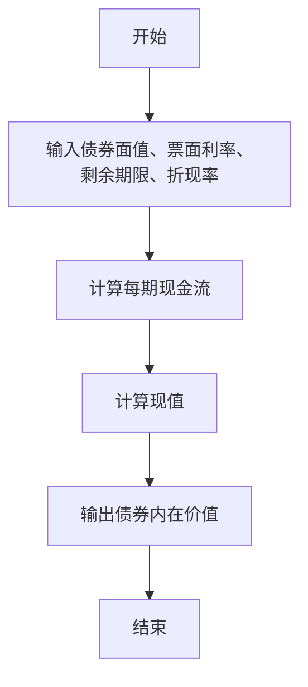
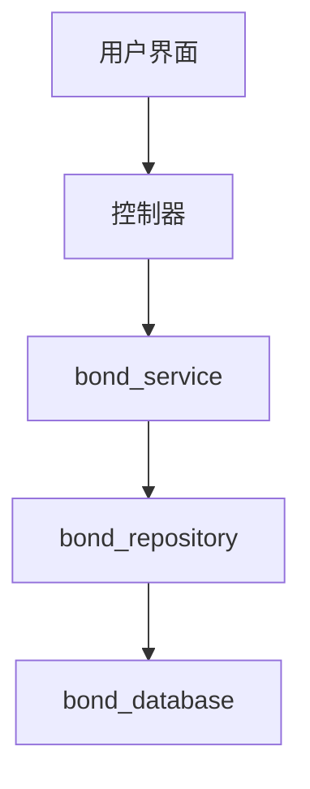

                 


# 霍华德·马克斯的债券价值投资：固定收益中的机会

---

## 关键词

- 债券投资，价值投资，霍华德·马克斯，固定收益，现金流折现模型

---

## 摘要

本文系统地介绍了霍华德·马克斯的债券价值投资理念，深入分析了固定收益市场中的投资机会。通过详细阐述债券市场的基本概念、价值评估方法、现金流折现模型以及马克斯的特定投资策略，本文为读者提供了从理论到实践的全面指导。同时，通过数学公式、算法流程图和Python代码示例，帮助读者更好地理解和应用这些投资策略。最后，结合实际案例，本文总结了投资实战的经验和教训，并提供了实用的建议和注意事项。

---

## 第一章: 债券市场的基本概念与价值投资的背景

### 1.1 债券市场的基本概念

#### 1.1.1 债券的定义与分类

- **定义**：债券是债务工具，发行人承诺在特定日期支付利息和本金。
- **分类**：政府债券、企业债券、可转换债券、零息债券等。

#### 1.1.2 债券市场的参与者

- **买方**：个人投资者、机构投资者（如保险公司、养老基金）。
- **卖方**：政府、企业。
- **中介**：券商、银行、交易所。

#### 1.1.3 债券市场的功能与作用

- **融资功能**：帮助企业和个人获得资金。
- **价格发现**：通过市场交易确定债券价格。
- **风险管理**：提供对冲通货膨胀和市场波动的工具。

### 1.2 价值投资的基本原理

#### 1.2.1 价值投资的定义

- **定义**：寻找市场价格低于内在价值的资产进行投资。

#### 1.2.2 价值投资的核心理念

- **市场无效性**：市场有时会出现定价错误。
- **安全边际**：买入价格低于内在价值，以降低风险。
- **长期视角**：关注长期价值而非短期波动。

#### 1.2.3 价值投资在债券市场中的应用

- **寻找低估债券**：通过分析基本面找到价格低于内在价值的债券。
- **注重安全边际**：确保买入价格有足够安全空间。
- **长期持有**：等待市场重新定价。

### 1.3 霍华德·马克斯的投资理念

#### 1.3.1 霍华德·马克斯的生平简介

- **背景**：著名投资者，专注于固定收益市场。
- **理念**：强调安全边际和逆向投资。

#### 1.3.2 霍华德·马克斯的投资哲学

- **逆向思维**：在市场恐慌时寻找机会。
- **安全边际**：确保投资的安全性。
- **风险管理**：优先考虑本金安全。

#### 1.3.3 霍华德·马克斯的债券投资策略

- **寻找低估债券**：通过基本面分析找到被市场低估的债券。
- **注重信用风险**：分析发行人的信用状况。
- **分散投资**：通过多样化降低风险。

---

## 第二章: 固定收益证券的价值评估方法

### 2.1 现金流折现模型

#### 2.1.1 现金流折现模型的基本原理

- **定义**：通过将未来现金流折现到现值，评估债券的内在价值。
- **公式**：$$PV = \sum_{t=1}^{n} \frac{C_t}{(1 + r)^t}$$

#### 2.1.2 现金流折现模型的公式推导

- **年金现值公式**：$$PV = C \times \frac{1 - (1 + r)^{-n}}{r}$$

#### 2.1.3 现金流折现模型的应用实例

- **案例分析**：假设债券面值为$1000，票面利率为5%，剩余期限为5年，折现率3%。计算现值。

### 2.2 债券收益率的计算方法

#### 2.2.1 债券收益率的定义

- **到期收益率**：购买债券到到期的年化收益率。
- **当前收益率**：票面利率除以当前市场价格。

#### 2.2.2 债券收益率的计算公式

- **到期收益率公式**：$$y = \frac{C + (F - P)}{F}$$

#### 2.2.3 债券收益率的影响因素

- **利率风险**：利率上升导致债券价格下跌。
- **信用风险**：发行人违约风险。
- **流动性风险**：债券难以快速变现。

### 2.3 债券价格波动与市场风险

#### 2.3.1 债券价格波动的原因

- **利率变化**：主要影响因素。
- **市场情绪**：投资者情绪影响价格。
- **经济周期**：经济状况影响债券需求。

#### 2.3.2 市场风险的定义与度量

- **市场风险**：债券价格因市场因素波动的风险。
- **波动率**：衡量价格波动程度的指标。

#### 2.3.3 市场风险对债券投资的影响

- **影响分析**：利率上升导致债券价格下跌，反之亦然。
- **风险管理**：通过分散投资和对冲策略降低风险。

---

## 第三章: 霍华德·马克斯的债券投资策略

### 3.1 霍华德·马克斯的投资策略概述

#### 3.1.1 霍华德·马克斯的投资策略特点

- **逆向投资**：在市场低谷时买入，市场高点时卖出。
- **安全边际**：确保买入价格低于内在价值。
- **基本面分析**：深入分析发行人财务状况。

#### 3.1.2 霍华德·马克斯的投资策略实施步骤

- **第一步**：识别低估债券。
- **第二步**：评估债券的安全边际。
- **第三步**：构建 diversified portfolio。

#### 3.1.3 霍华德·马克斯的投资策略优缺点

- **优点**：风险较低，回报稳定。
- **缺点**：需要深入研究，可能错过短期收益。

### 3.2 霍华德·马克斯的债券投资策略实施

#### 3.2.1 选择债券的步骤

- **第一步**：确定投资目标。
- **第二步**：分析市场环境。
- **第三步**：评估债券信用状况。

#### 3.2.2 投资组合的构建

- **分散投资**：避免过度集中。
- **定期调整**：根据市场变化进行调整。

#### 3.2.3 风险管理策略

- **设定止损点**：避免过大损失。
- **监控市场风险**：定期评估投资组合的风险。

---

## 第四章: 算法与系统架构设计

### 4.1 算法原理

#### 4.1.1 现金流折现模型的算法流程图



#### 4.1.2 Python代码实现

```python
def bond_value(future_value, coupon_rate, years, discount_rate):
    present_value = 0
    for t in range(1, years + 1):
        cash_flow = future_value * coupon_rate
        present_value += cash_flow / (1 + discount_rate) ** t
    return present_value

# 示例
future_value = 1000
coupon_rate = 0.05
years = 5
discount_rate = 0.03
print(bond_value(future_value, coupon_rate, years, discount_rate))
```

### 4.2 系统架构设计

#### 4.2.1 系统功能设计

- **功能模块**：数据输入、现金流计算、现值计算、结果输出。

#### 4.2.2 系统架构图



---

## 第五章: 项目实战

### 5.1 环境安装

- **工具**：Python、Jupyter Notebook、Pandas库。

### 5.2 核心代码实现

```python
import pandas as pd

def calculate_bond_value(face_value, coupon_rate, years, discount_rate):
    present_value = 0
    for t in range(1, years + 1):
        cash_flow = face_value * coupon_rate
        present_value += cash_flow / (1 + discount_rate) ** t
    return present_value

# 示例数据
data = {
    'face_value': [1000],
    'coupon_rate': [0.05],
    'years': [5],
    'discount_rate': [0.03]
}

df = pd.DataFrame(data)
result = df.apply(lambda x: calculate_bond_value(x['face_value'], x['coupon_rate'], x['years'], x['discount_rate']), axis=1)
print(result)
```

### 5.3 案例分析与经验总结

- **案例分析**：使用上述代码计算债券价值。
- **经验总结**：模型假设与实际市场的差异，数据准确性的重要性。

---

## 第六章: 最佳实践与注意事项

### 6.1 投资注意事项

- **利率风险**：关注央行利率政策。
- **信用风险**：定期评估债券发行人财务状况。
- **流动性风险**：选择流动性较高的债券。

### 6.2 小结

- **总结**：霍华德·马克斯的投资策略强调安全边际和基本面分析，适用于固定收益市场的价值投资。

### 6.3 扩展阅读

- **推荐书籍**：《投资最重要的事情》——霍华德·马克斯。

---

## 作者

作者：AI天才研究院/AI Genius Institute & 禅与计算机程序设计艺术 /Zen And The Art of Computer Programming

