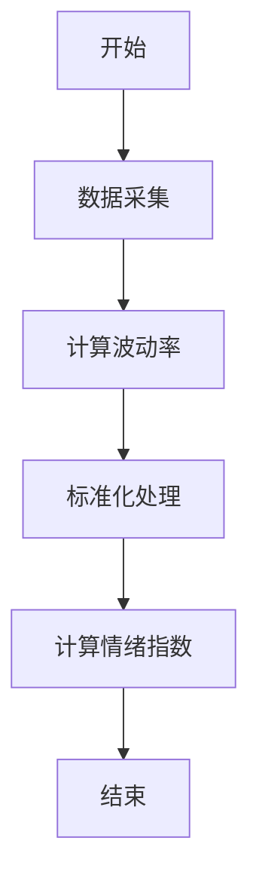
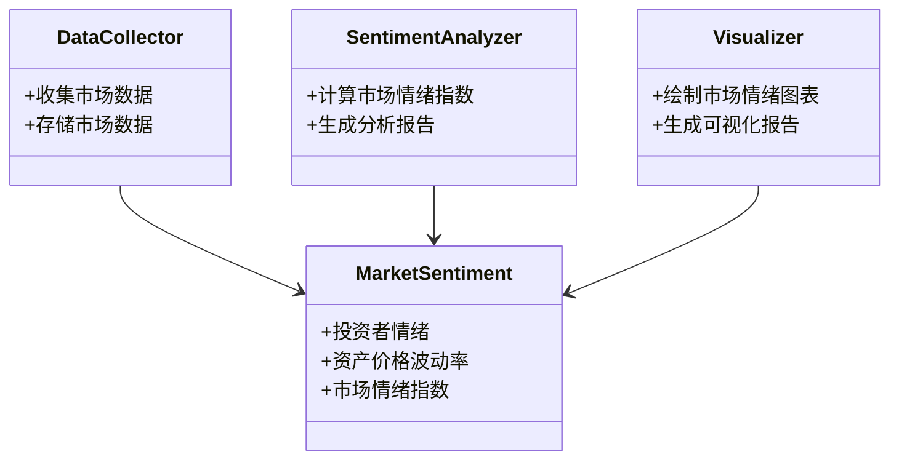
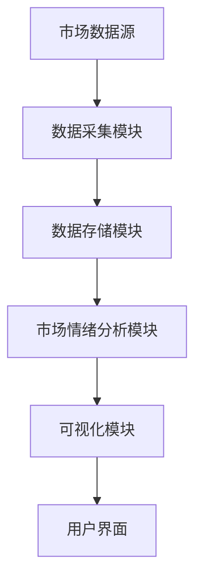
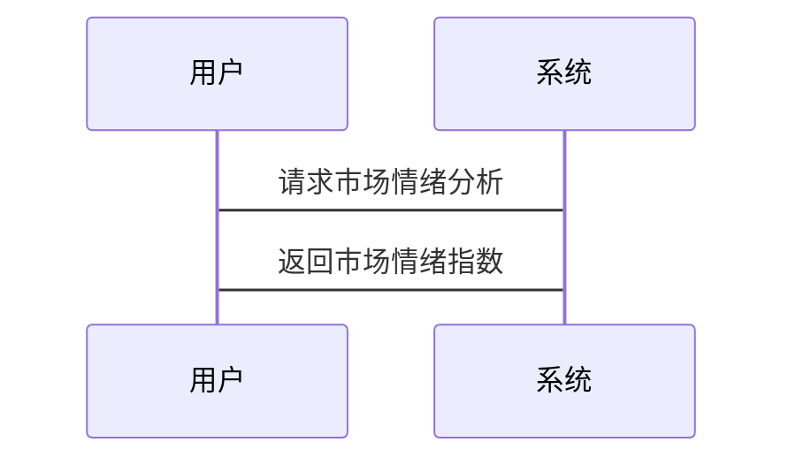

                 


# 霍华德·马克斯的市场情绪指标

## 关键词：市场情绪指标，霍华德·马克斯，投资者心理，资产价格波动，投资决策

## 摘要：本文详细探讨了霍华德·马克斯的市场情绪指标，分析了其在投资决策中的作用，介绍了其核心概念、算法原理和系统架构设计，并通过实际案例展示了其在项目中的应用，帮助投资者更好地理解市场情绪对资产配置的影响。

---

# 第一部分: 市场情绪指标的背景与概述

## 第1章: 市场情绪指标的背景与重要性

### 1.1 市场情绪指标的定义与作用

#### 1.1.1 市场情绪指标的定义
市场情绪指标是用于量化市场参与者情绪状态的工具，反映了投资者对市场的乐观或悲观程度。通过分析这些指标，投资者可以更好地理解市场行为和趋势。

#### 1.1.2 市场情绪指标在投资中的作用
市场情绪指标能够帮助投资者预测市场的波动性，识别市场泡沫和底部，优化资产配置策略。它在风险管理、投资组合管理和交易决策中具有重要作用。

#### 1.1.3 市场情绪与资产价格的关系
市场情绪直接影响投资者的决策，从而影响资产价格。当市场情绪高涨时，资产价格可能被高估；当市场情绪低落时，资产价格可能被低估。

### 1.2 霍华德·马克斯的市场情绪理论

#### 1.2.1 霍华德·马克斯的投资者心理分析
霍华德·马克斯认为，投资者心理是市场波动的主要驱动因素。他强调，投资者在市场繁荣时过于乐观，在市场低迷时过于悲观，这种情绪波动导致市场的非理性波动。

#### 1.2.2 市场情绪周期理论
市场情绪呈现周期性变化，从乐观到悲观，再从悲观到乐观，形成一个循环。马克斯通过分析市场情绪周期，帮助投资者识别市场的高低点。

#### 1.2.3 市场情绪与资产泡沫的关系
市场情绪的过度高涨可能导致资产泡沫，而泡沫破裂时，市场情绪迅速转向悲观，引发资产价格的大幅下跌。

### 1.3 市场情绪指标的核心要素

#### 1.3.1 市场参与度
市场参与度反映了投资者的活跃程度，高参与度通常意味着市场情绪高涨。

#### 1.3.2 投资者情绪波动
投资者情绪波动是指市场情绪在一定时期内的波动情况，可以通过分析市场参与者的行为数据来量化。

#### 1.3.3 市场情绪与资产配置的关系
市场情绪影响投资者的资产配置决策，当市场情绪高涨时，投资者倾向于增加风险资产的配置；当市场情绪低落时，投资者倾向于转向防御性资产。

### 1.4 本章小结
本章介绍了市场情绪指标的定义、作用及其与资产价格的关系，重点分析了霍华德·马克斯的市场情绪理论，强调了市场情绪在投资决策中的重要性。

---

## 第2章: 市场情绪指标的核心概念与联系

### 2.1 市场情绪指标的核心概念

#### 2.1.1 市场情绪的量化方法
市场情绪的量化可以通过分析投资者的行为数据、新闻媒体的情绪分析、市场成交量等多种方式实现。

#### 2.1.2 市场情绪的分类与层次
市场情绪可以分为乐观、中性和悲观三个层次，每个层次对应不同的市场行为和资产价格变化。

#### 2.1.3 市场情绪的动态变化
市场情绪是一个动态变化的过程，受多种因素影响，包括经济数据、政策变化、市场事件等。

### 2.2 核心概念的属性特征对比

#### 2.2.1 表格对比：市场情绪指标的属性特征
以下表格对比了不同市场情绪指标的属性特征：

| 指标名称         | 计算方法                     | 数据来源         | 时间窗口 | 指标范围 |
|------------------|------------------------------|------------------|----------|----------|
| 市场成交量       | 累计成交量                  | 交易所数据       | 每日/每周 | 高/低    |
| 投资者情绪指数   | 情绪调查问卷数据            | 投资者调查机构   | 每周/每月 | 0-100    |
| 资产价格波动率   | 标准差/波动率               | 市场价格数据     | 每日/每周 | 高/低    |

#### 2.2.2 市场情绪指标的ER实体关系图
以下是市场情绪指标的ER实体关系图：

```mermaid
er
actor: 投资者
actor: 市场情绪指标
actor: 资产价格
```

### 2.3 本章小结
本章详细探讨了市场情绪指标的核心概念及其属性特征，通过对比分析和ER图展示了市场情绪指标的结构和关系。

---

## 第3章: 市场情绪指标的算法原理

### 3.1 市场情绪指标的计算方法

#### 3.1.1 市场情绪指标的数学模型
市场情绪指数可以通过以下公式计算：

$$ 情绪指数 = \frac{资产价格波动率}{市场平均波动率} $$

其中，资产价格波动率是资产价格的波动程度，市场平均波动率是市场整体的波动程度。

#### 3.1.2 市场情绪指标的计算流程
以下是市场情绪指标的计算流程图：



### 3.2 算法实现与代码示例

#### 3.2.1 Python代码实现
以下是一个计算市场情绪指数的Python代码示例：

```python
import pandas as pd
import numpy as np

def calculate_market_sentiment(prices):
    volatility = np.std(prices.pct_change().dropna())
    average_volatility = np.mean([np.std(p.pct_change().dropna()) for p in prices])
    sentiment_index = volatility / average_volatility
    return sentiment_index
```

#### 3.2.2 算法原理的数学公式
情绪指数的计算公式为：

$$ 情绪指数 = \frac{\sigma_{price}}{\mu_{\sigma_{price}}} $$

其中，$\sigma_{price}$ 是资产价格的波动率，$\mu_{\sigma_{price}}$ 是市场整体波动率的平均值。

### 3.3 本章小结
本章详细介绍了市场情绪指标的计算方法和算法实现，通过Python代码示例和数学公式，帮助读者理解情绪指数的计算过程。

---

## 第4章: 市场情绪指标的系统分析与架构设计

### 4.1 系统分析

#### 4.1.1 问题场景介绍
市场情绪指标的应用场景包括投资组合管理、风险管理、交易策略制定等。通过分析市场情绪，投资者可以更好地做出投资决策。

#### 4.1.2 项目介绍
本项目旨在开发一个基于霍华德·马克斯市场情绪理论的指标分析系统，帮助投资者理解和应用市场情绪指标。

### 4.2 系统功能设计

#### 4.2.1 领域模型类图
以下是系统功能设计的领域模型类图：



### 4.3 系统架构设计

#### 4.3.1 系统架构图
以下是系统架构设计的架构图：



### 4.4 系统接口设计

#### 4.4.1 API接口设计
以下是系统的主要API接口：

1. `getData()`: 获取市场数据。
2. `calculateSentiment()`: 计算市场情绪指数。
3. `generateReport()`: 生成分析报告。

### 4.5 系统交互设计

#### 4.5.1 交互流程图
以下是系统交互的流程图：



### 4.6 本章小结
本章详细分析了市场情绪指标的系统架构设计，包括功能模块、接口设计和交互流程，为后续的系统实现提供了理论基础。

---

## 第5章: 项目实战

### 5.1 环境安装

#### 5.1.1 安装Python和必要的库
安装Python和以下库：
- `pandas`
- `numpy`
- `mermaid`

### 5.2 核心代码实现

#### 5.2.1 数据采集模块
以下是数据采集模块的代码示例：

```python
import pandas as pd

def collect_data(start_date, end_date):
    # 数据采集逻辑
    return data
```

#### 5.2.2 情绪分析模块
以下是情绪分析模块的代码示例：

```python
def calculate_sentiment(data):
    # 情绪分析逻辑
    return sentiment_index
```

### 5.3 代码应用解读与分析

#### 5.3.1 代码解读
通过解读代码，读者可以理解市场情绪指标的计算过程和实现方法。

#### 5.3.2 案例分析
以下是一个市场情绪指标的案例分析：

假设我们有某只股票的价格数据，我们可以通过以下步骤计算其市场情绪指数：
1. 计算股票价格的波动率。
2. 计算市场整体波动率的平均值。
3. 计算市场情绪指数。

### 5.4 项目小结
本章通过实际案例展示了市场情绪指标的应用，帮助读者理解其在投资决策中的实际价值。

---

## 第6章: 最佳实践、小结、注意事项和拓展阅读

### 6.1 最佳实践 tips

1. 定期更新数据和模型，以适应市场变化。
2. 结合其他市场指标，进行全面的市场分析。
3. 风险提示：市场情绪指标仅为参考，投资需谨慎。

### 6.2 小结
本文详细探讨了霍华德·马克斯的市场情绪指标，从理论到实践，全面分析了其在投资中的应用。

### 6.3 注意事项

1. 市场情绪指标仅反映市场参与者的心理状态，不能完全预测市场走势。
2. 投资者应结合其他因素进行综合分析。
3. 风险管理是投资决策的重要部分。

### 6.4 拓展阅读

1. 霍华德·马克斯的《投资最重要的事》。
2. 其他市场情绪指标的研究和应用。

---

# 结语

霍华德·马克斯的市场情绪指标为投资者提供了一个重要的工具，帮助他们在复杂的市场环境中做出更明智的投资决策。通过理解和应用这些指标，投资者可以更好地识别市场趋势，优化资产配置，降低投资风险。

作者：AI天才研究院/AI Genius Institute & 禅与计算机程序设计艺术 /Zen And The Art of Computer Programming

