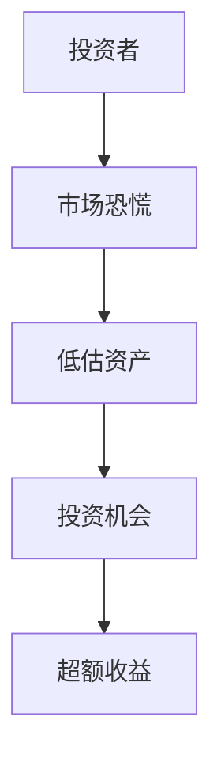
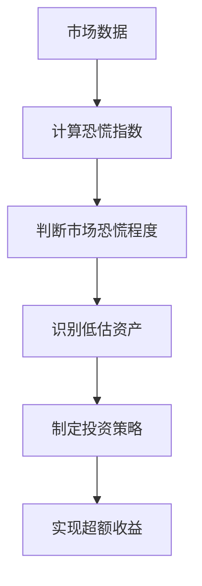
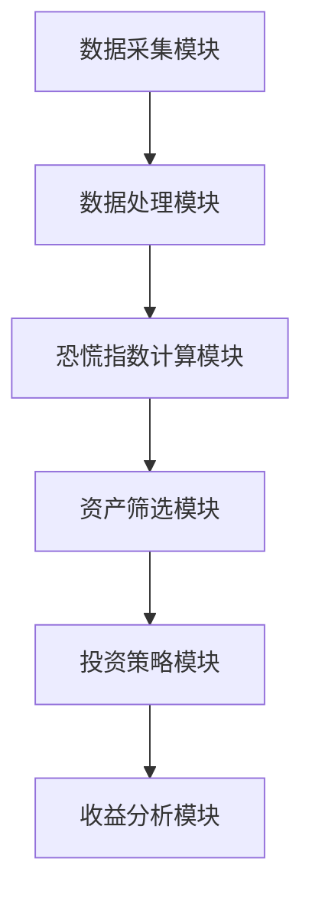
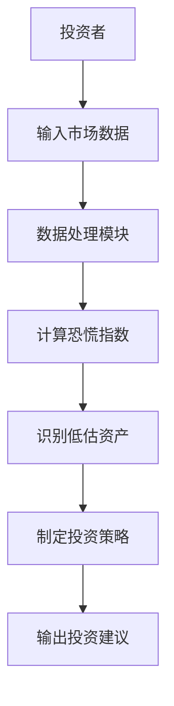

                 


# 霍华德·马克斯的逆向价值投资：在市场恐慌中寻找机会

## 关键词：逆向投资，霍华德·马克斯，价值投资，市场恐慌，投资策略

## 摘要：  
霍华德·马克斯的逆向价值投资是一种在市场恐慌时寻找低估资产并进行投资的策略，旨在通过在市场低谷时买入，在市场高点时卖出，实现超额收益。本文将从逆向投资的背景、核心概念、算法原理、系统架构、项目实战以及最佳实践等方面，详细阐述逆向投资的理论与实践。

---

## 第一部分: 逆向投资的背景与理念

### 第1章: 逆向投资的背景与核心理念

#### 1.1 逆向投资的基本概念  
逆向投资是一种与市场情绪相反的投资策略。当市场恐慌、投资者情绪低落时，资产价格往往被低估，此时是买入的好时机；而当市场情绪高涨、资产价格被高估时，应考虑卖出。逆向投资的核心在于利用市场的非理性波动，寻找价格与价值的偏差。

#### 1.2 霍华德·马克斯的投资理念  
霍华德·马克斯是逆向投资的代表人物，他强调在市场恐慌时寻找具有内在价值的资产。他认为，市场情绪是价格波动的主要驱动因素，而价值投资者应关注资产的内在价值，而非市场情绪。

#### 1.3 市场恐慌中的投资机会  
市场恐慌会导致资产价格的非理性下跌，从而为逆向投资者提供低价买入的机会。通过分析市场恐慌的根源和影响，投资者可以在市场底部找到优质资产，实现长期收益。

---

### 第2章: 逆向投资的核心概念与联系

#### 2.1 逆向投资的原理与机制  
逆向投资的原理在于市场情绪的非理性波动。当市场恐慌时，投资者的恐惧情绪导致资产价格被低估，而逆向投资者通过分析资产的内在价值，识别出具有投资价值的资产。

#### 2.2 核心概念对比分析  
通过对比逆向投资与其他投资策略（如价值投资、趋势投资和套利投资），分析其优缺点和适用场景。

#### 2.3 实体关系图  


---

### 第3章: 逆向投资的算法原理

#### 3.1 逆向投资的数学模型  
逆向投资的核心在于计算市场恐慌指数，常用指标包括波动率、恐慌指数（VIX）等。通过数学模型分析这些指标，识别市场恐慌的程度。

#### 3.2 市场恐慌指数的计算  
恐慌指数（VIX）的计算公式如下：
$$ VIX = \sqrt{\frac{1}{N}\sum_{i=1}^{N}(R_i - \mu)^2} $$
其中，\( R_i \) 是资产的收益率，\( \mu \) 是平均收益率，\( N \) 是样本数量。

#### 3.3 逆向投资策略的流程图  


---

### 第4章: 逆向投资的系统分析与架构设计

#### 4.1 投资决策系统的功能设计  
系统功能包括数据采集、恐慌指数计算、资产筛选、策略制定和收益分析。

#### 4.2 系统架构图  


#### 4.3 接口设计  
系统接口包括数据输入接口、恐慌指数计算接口和投资策略输出接口。

#### 4.4 交互流程图  


---

### 第5章: 逆向投资的项目实战

#### 5.1 环境安装  
安装必要的数据处理和分析工具，如Python、Pandas、Matplotlib等。

#### 5.2 核心代码实现  
```python
import pandas as pd
import numpy as np

def calculate_vix(returns):
    mu = np.mean(returns)
    var = np.var(returns)
    vix = np.sqrt(var)
    return vix

# 示例数据
returns = [0.02, -0.01, 0.03, -0.02, 0.01]
vix = calculate_vix(returns)
print(f"恐慌指数: {vix}")
```

#### 5.3 案例分析  
以2008年金融危机为例，分析逆向投资策略在市场恐慌中的应用，展示如何通过识别低估资产实现超额收益。

---

### 第6章: 最佳实践与注意事项

#### 6.1 投资策略的优化  
通过历史数据分析和回测，不断优化逆向投资策略，提高收益稳定性。

#### 6.2 风险管理  
设置止损和止盈点，控制投资风险，避免过度杠杆和非理性操作。

#### 6.3 长期投资的重要性  
逆向投资需要耐心和纪律，市场恐慌时的买入机会往往需要时间才能显现价值。

---

## 结语  
霍华德·马克斯的逆向价值投资为投资者提供了一种在市场恐慌中寻找机会的策略。通过理解市场情绪、分析资产价值和制定科学的投资策略，投资者可以在市场波动中实现长期收益。

---

## 作者：AI天才研究院/AI Genius Institute & 禅与计算机程序设计艺术 /Zen And The Art of Computer Programming

