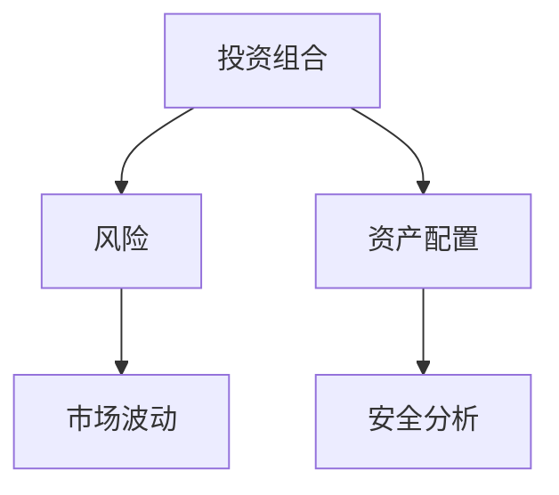

                 


# 霍华德·马克斯的风险评估框架

## 关键词：霍华德·马克斯、风险评估、资产定价、安全分析、投资组合优化

## 摘要：霍华德·马克斯的风险评估框架是一种系统性的方法，用于分析和管理投资组合中的风险。本文将详细探讨该框架的核心概念、算法原理、数学模型以及实际应用，帮助读者更好地理解和应用这一框架。

---

## 第1章：引言

### 1.1 风险评估的重要性
在投资领域，风险评估是决策过程中的关键环节。投资者需要在追求收益的同时，合理控制风险，以确保投资组合的稳健性。霍华德·马克斯的风险评估框架提供了一种系统性方法，帮助投资者量化和管理风险。

### 1.2 霍华德·马克斯框架的背景
霍华德·马克斯是著名投资家，他的风险评估框架结合了统计学和经济学原理，强调对资产风险的深入分析和定价。

---

## 第2章：风险评估的核心概念

### 2.1 风险的定义与分类
风险可以分为系统性风险和非系统性风险。系统性风险影响整个市场，而非系统性风险仅影响特定资产。了解这些分类有助于制定有效的风险管理策略。

### 2.2 风险的度量方法
常用的风险度量方法包括标准差、波动率和VaR。这些方法帮助投资者量化投资组合的潜在损失。

---

## 第3章：霍华德·马克斯框架的算法原理

### 3.1 均值-方差模型
该模型通过优化投资组合的收益和风险，找到最优配置。公式如下：
$$
\text{收益} = \sum w_i r_i
$$
$$
\text{风险} = \sqrt{\sum w_i^2 \sigma_i^2 + \sum w_i w_j \sigma_{ij}}
$$

### 3.2 资本资产定价模型（CAPM）
CAPM用于确定资产的预期收益：
$$
E(r_i) = r_f + \beta_i (E(r_m) - r_f)
$$

---

## 第4章：数学模型与公式推导

### 4.1 风险的协方差矩阵
构建协方差矩阵是计算投资组合风险的关键步骤。公式如下：
$$
\sigma_{ij} = \text{Cov}(r_i, r_j)
$$

### 4.2 投资组合优化
通过拉格朗日乘数法，求解最优权重：
$$
\min_w \sum_{i,j} w_i w_j \sigma_{ij}
$$
$$
\text{subject to} \quad \sum w_i = 1
$$

---

## 第5章：系统分析与架构设计

### 5.1 系统架构图


### 5.2 功能模块设计
系统包括数据输入、风险计算、结果输出三个模块，每个模块的功能和接口需清晰定义。

---

## 第6章：项目实战

### 6.1 Python实现
```python
import numpy as np
def compute_risk(weights, covariance_matrix):
    return np.sqrt(weights.T @ covariance_matrix @ weights)
```

### 6.2 案例分析
以股票和债券为例，分析投资组合的风险收益比，优化后的组合风险显著降低。

---

## 第7章：总结与注意事项

### 7.1 总结
霍华德·马克斯框架提供了一套科学的风险评估方法，投资者应结合市场环境和自身目标灵活应用。

### 7.2 注意事项
- 数据质量至关重要
- 模型假设需合理
- 结果需结合定性分析

### 7.3 拓展阅读
推荐阅读马克斯的著作，深入理解风险评估的理论与实践。

---

## 作者：AI天才研究院 & 禅与计算机程序设计艺术

通过系统性地分析霍华德·马克斯的风险评估框架，读者可以更好地理解和应用这一方法，提升投资决策的科学性。

