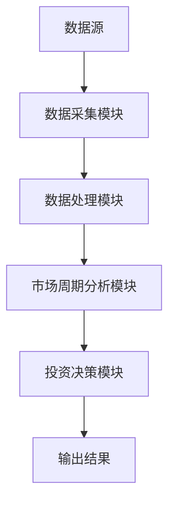
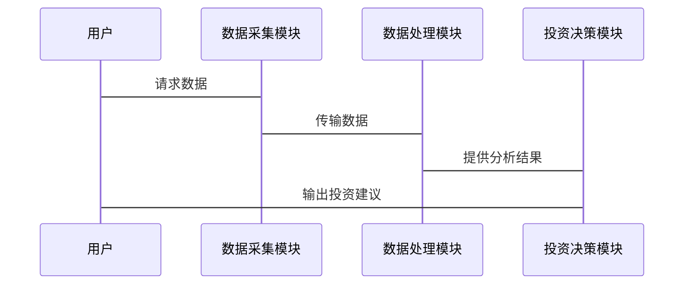

                 


# 霍华德马克斯的市场周期判断

---

## 关键词  
市场周期，霍华德·马克斯，逆向投资，资产定价，市场情绪，投资策略

---

## 摘要  
本文深入探讨了霍华德·马克斯的市场周期判断理论及其在投资实践中的应用。通过分析市场周期的运行机制、判断方法和系统设计，结合实际案例，揭示了逆向投资的核心逻辑。文章还详细介绍了如何构建市场周期分析系统，并通过Python代码展示了实战应用，为投资者提供了实用的工具和方法。

---

## 第1章：市场周期的基本概念

### 1.1 市场周期的定义与分类  
市场周期是资产价格波动的规律性表现，通常分为四个阶段：复苏、扩张、繁荣和衰退。马克斯认为，市场的波动是由投资者情绪和经济基本面共同驱动的。

### 1.2 霍华德·马克斯的市场周期理论  
马克斯强调，市场周期的核心在于资产定价与内在价值的偏离。他提出，市场情绪的变化会导致资产价格的非理性波动，为逆向投资提供了机会。

---

## 第2章：市场周期的运行机制

### 2.1 市场波动的规律  
市场的波动具有周期性，投资者可以通过分析历史数据识别周期特征。马克斯指出，市场的波动通常表现出均值回归的趋势。

### 2.2 市场周期的影响因素  
经济基本面、投资者情绪和市场结构是影响市场周期的主要因素。马克斯特别强调了情绪指标的重要性。

---

## 第3章：市场周期的判断方法

### 3.1 定性分析方法  
通过分析市场情绪、参与度和趋势，投资者可以初步判断市场周期的位置。

### 3.2 定量分析方法  
利用估值指标、资金流动和波动率等指标，投资者可以更精确地判断市场周期。

---

## 第4章：霍华德·马克斯的逆向投资策略

### 4.1 逆向投资的核心理念  
逆向投资是在市场底部买入、顶部卖出的策略。马克斯认为，市场底部通常出现在情绪最低点，而顶部则在情绪高点。

### 4.2 逆向投资的实战应用  
通过分析市场情绪和估值指标，投资者可以在市场底部发现投资机会。

---

## 第5章：市场周期分析的系统架构

### 5.1 系统功能设计  
市场周期分析系统包括数据采集、处理、分析和决策模块。

### 5.2 系统架构设计  


### 5.3 系统交互流程  


---

## 第6章：项目实战

### 6.1 环境安装  
安装Python和必要的库（如Pandas、NumPy）。

### 6.2 核心代码实现  
```python
import pandas as pd
import numpy as np

# 示例数据
data = pd.DataFrame({
    'date': ['2020-01', '2020-02', '2020-03', '2020-04'],
    'price': [100, 105, 98, 102]
})

# 计算波动率
volatility = data['price'].std() * np.sqrt(252)
print(f"年化波动率：{volatility}")
```

### 6.3 案例分析  
通过实际案例分析，展示如何利用Python代码进行市场周期判断。

---

## 第7章：总结与展望

### 7.1 总结  
霍华德·马克斯的市场周期理论为投资者提供了重要的工具和方法。

### 7.2 投资哲学  
逆向投资的核心在于识别市场情绪与价值的偏离。

### 7.3 未来趋势  
随着技术的发展，市场周期分析将更加精准和自动化。

### 7.4 注意事项  
投资者应结合市场实际情况调整策略，避免机械套用模型。

---

## 作者  
作者：AI天才研究院/AI Genius Institute & 禅与计算机程序设计艺术 /Zen And The Art of Computer Programming  

--- 

这篇文章系统地介绍了霍华德·马克斯的市场周期判断理论，并结合技术分析和系统设计，为投资者提供了实用的工具和方法。

