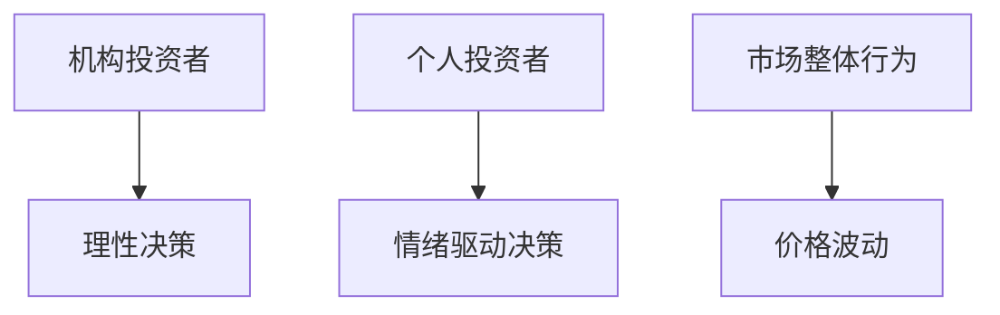
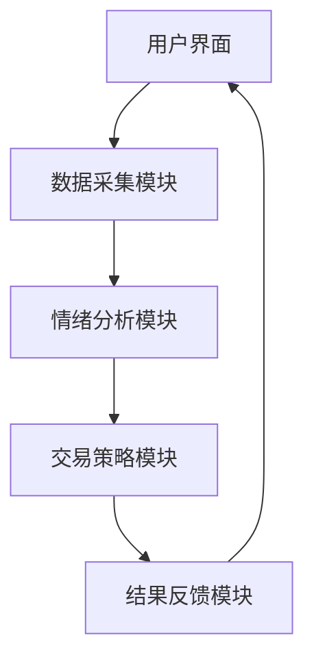

                 


# 霍华德马克斯的市场心理学

**关键词**: 情绪、认知偏差、市场周期、交易系统、投资者行为、心理学模型、量化分析

**摘要**: 本文深入探讨霍华德马克斯的市场心理学，结合技术与市场心理学，分析投资者行为对市场价格波动的影响。文章从市场心理学的核心概念、投资者情绪与认知偏差、市场周期、交易系统设计、以及系统架构与实现等方面展开，通过量化分析和算法实现，揭示市场参与者的心理如何影响投资决策和市场走势。

---

## 第一部分: 霍华德马克斯的市场心理学概述

### 第1章: 市场心理学的核心概念与背景

#### 1.1 投资者心理与市场行为

##### 1.1.1 投资者心理的定义与分类

投资者心理是市场心理学的核心研究对象，主要包括理性决策与非理性决策两种类型。理性决策基于充分的信息和逻辑分析，而非理性决策则受情绪和认知偏差的影响。

| **心理类型** | **特征描述** |
|--------------|--------------|
| 理性决策      | 基于逻辑和事实，追求最大利益 |
| 非理性决策    | 受情绪、认知偏差影响，可能偏离理性 |

##### 1.1.2 市场参与者的行为模式

市场参与者包括机构投资者和个人投资者，他们的行为模式受心理特征影响。机构投资者通常更加理性，而个人投资者更容易受到情绪波动的影响。



##### 1.1.3 市场心理学的重要性

市场心理学帮助投资者理解市场波动的根本原因，从而制定更有效的投资策略。

---

#### 1.2 市场参与者的角色与心理特征

##### 1.2.1 机构投资者的心理特征

机构投资者通常具有较长的投资期限，注重风险管理，决策过程更加系统化。

| **心理特征** | **表现** |
|--------------|----------|
| 风险厌恶      | 偏好稳定收益 |
| 理性决策      | 基于数据和模型 |

##### 1.2.2 个人投资者的心理特征

个人投资者受情绪影响较大，容易出现过度交易和从众心理。

##### 1.2.3 市场心理的外在表现

市场心理的外在表现包括价格波动、成交量变化、市场情绪指数等。

---

#### 1.3 市场心理与价格波动的关系

##### 1.3.1 市场情绪对价格的影响

市场情绪通过影响投资者的决策，进而影响资产价格。例如，恐慌情绪会导致抛售行为，从而引发价格下跌。

##### 1.3.2 市场预期与价格波动

投资者的预期影响市场价格走势。如果市场预期价格上涨，投资者可能会提前买入，推动价格上涨。

##### 1.3.3 市场心理与市场周期

市场心理的变化与市场周期密切相关。例如，从乐观到悲观的转变会导致市场的牛熊转换。

---

### 第2章: 投资者心理与决策过程

#### 2.1 投资者决策的核心要素

##### 2.1.1 理性决策与非理性决策

理性决策基于事实和逻辑，而非理性决策受情绪和认知偏差影响。

##### 2.1.2 投资目标与风险偏好

投资者的目标和风险偏好影响其决策方式。例如，保守型投资者更倾向于选择低风险资产。

##### 2.1.3 信息处理与决策偏差

投资者在处理信息时可能会出现信息过滤、选择性确认等偏差。

---

#### 2.2 情绪与认知偏差对决策的影响

##### 2.2.1 情绪对投资决策的影响

情绪波动可能导致投资者做出非理性决策，例如过度交易或恐慌性抛售。

##### 2.2.2 认知偏差的类型与表现

认知偏差包括确认偏差、过度自信偏差等，这些偏差会影响投资者的决策。

| **偏差类型** | **表现** |
|--------------|----------|
| 确认偏差      | 过度相信支持自己观点的信息 |
| 过度自信偏差  | 过高估计自己的能力 |

##### 2.2.3 情绪与认知偏差的相互作用

情绪和认知偏差相互作用，可能导致投资者做出错误的决策。

---

#### 2.3 群体心理与市场行为

##### 2.3.1 群体心理的形成机制

群体心理的形成机制包括从众心理、羊群效应等。

##### 2.3.2 群体心理对市场的影响

群体心理可能导致市场泡沫和恐慌性抛售。

##### 2.3.3 市场泡沫与恐慌的形成

市场泡沫和恐慌的形成通常与群体心理密切相关。

---

### 第3章: 市场心理学的核心理论与模型

#### 3.1 市场情绪的量化与分析

##### 3.1.1 市场情绪指数的构建

市场情绪指数可以通过对投资者情绪的量化分析构建，例如通过社交媒体分析和市场数据结合。

##### 3.1.2 市场情绪的周期性分析

市场情绪具有周期性，通常与市场周期密切相关。

##### 3.1.3 市场情绪与资产价格的关系

市场情绪与资产价格密切相关，例如，乐观情绪会导致价格上涨。

---

#### 3.2 投资者心理与市场预期

##### 3.2.1 市场预期的形成过程

市场预期的形成过程包括信息收集、信息处理和决策制定。

##### 3.2.2 市场预期与实际价格的偏差

市场预期与实际价格之间可能存在偏差，例如，市场预期上涨但实际价格下跌。

##### 3.2.3 市场预期的自我实现效应

市场预期的自我实现效应可能导致价格走势与预期一致。

---

#### 3.3 市场参与者的博弈与互动

##### 3.3.1 投资者之间的博弈关系

投资者之间的博弈关系包括竞争和合作，影响市场价格走势。

##### 3.3.2 市场信息的传递与解读

市场信息的传递与解读受到投资者心理的影响，例如，好消息可能被过度解读，导致价格上涨。

##### 3.3.3 市场参与者的互动对价格的影响

市场参与者的互动对价格有重要影响，例如，机构投资者的买卖行为可能影响市场价格。

---

## 第二部分: 交易系统与算法实现

### 第4章: 基于霍华德马克斯情绪分析的交易算法

#### 4.1 算法原理与实现

##### 4.1.1 情绪指标的计算

情绪指标可以通过对市场数据和投资者情绪的分析计算，例如，使用自然语言处理技术分析新闻和社交媒体情绪。

##### 4.1.2 交易策略的设计

交易策略基于情绪指标制定，例如，当市场情绪高涨时，卖出资产；当市场情绪低落时，买入资产。

##### 4.1.3 算法实现

以下是基于霍华德马克斯情绪分析的交易算法的Python代码示例：

```python
import pandas as pd
import numpy as np
from sklearn.linear_model import LinearRegression

def calculate_emotion_index(data):
    # 假设data包含市场数据和投资者情绪数据
    # 计算情绪指数
    emotion_index = data['情绪数据'].mean()
    return emotion_index

def trading_strategy(emotion_index, price_data):
    # 基于情绪指数制定交易策略
    if emotion_index > 0.7:
        return '卖出'
    elif emotion_index < 0.3:
        return '买入'
    else:
        return '持有'

# 示例数据
data = pd.DataFrame({
    '情绪数据': [0.8, 0.6, 0.4, 0.2, 0.0],
    '价格数据': [100, 90, 80, 70, 60]
})

emotion_index = calculate_emotion_index(data)
print(trading_strategy(emotion_index, data['价格数据']))
```

---

### 第5章: 系统架构与实现

#### 5.1 系统功能设计

##### 5.1.1 数据采集模块

数据采集模块负责采集市场数据和投资者情绪数据，例如，从社交媒体和新闻网站获取情绪数据。

##### 5.1.2 情绪分析模块

情绪分析模块使用自然语言处理技术分析情绪数据，计算情绪指数。

##### 5.1.3 交易策略模块

交易策略模块基于情绪指数制定交易策略，例如，当情绪指数超过阈值时，发出买卖指令。

##### 5.1.4 结果反馈模块

结果反馈模块将交易结果反馈给投资者，例如，通过图表展示交易收益。

---

#### 5.2 系统架构设计



---

## 第三部分: 项目实战与案例分析

### 第6章: 项目实战

#### 6.1 环境安装与配置

安装必要的Python库，例如Pandas、NumPy、Scikit-learn等。

#### 6.2 系统核心实现

实现情绪指数计算和交易策略模块，例如，编写Python函数计算情绪指数，并根据情绪指数制定交易策略。

#### 6.3 代码实现与分析

以下是一个简单的交易策略实现：

```python
import pandas as pd
import numpy as np
from sklearn.linear_model import LinearRegression

def calculate_emotion_index(data):
    return data['情绪数据'].mean()

def trading_strategy(emotion_index, price_data):
    if emotion_index > 0.7:
        return '卖出'
    elif emotion_index < 0.3:
        return '买入'
    else:
        return '持有'

data = pd.DataFrame({
    '情绪数据': [0.8, 0.6, 0.4, 0.2, 0.0],
    '价格数据': [100, 90, 80, 70, 60]
})

emotion_index = calculate_emotion_index(data)
print(trading_strategy(emotion_index, data['价格数据']))
```

---

### 第7章: 案例分析

#### 7.1 案例背景

假设我们有一个包含市场数据和投资者情绪数据的数据集，我们需要基于霍华德马克斯的市场心理学分析市场波动。

#### 7.2 数据分析与解读

使用数据可视化工具分析市场数据和情绪数据的关系，例如，绘制情绪指数与价格走势的散点图。

#### 7.3 交易策略实现

基于情绪指数制定交易策略，例如，当情绪指数超过阈值时，卖出资产。

#### 7.4 案例小结

总结案例分析的结果，验证交易策略的有效性。

---

## 第四部分: 最佳实践与小结

### 第8章: 最佳实践

#### 8.1 小结

总结全文内容，强调霍华德马克斯的市场心理学在投资决策中的重要性。

#### 8.2 注意事项

在实际投资中，投资者需要注意情绪和认知偏差的影响，避免非理性决策。

#### 8.3 未来展望

未来，随着技术的进步，市场心理学将与人工智能和大数据分析结合，进一步提升投资决策的科学性。

#### 8.4 拓展阅读

推荐相关书籍和资源，供读者深入学习。

---

## 作者

作者：AI天才研究院/AI Genius Institute & 禅与计算机程序设计艺术 /Zen And The Art of Computer Programming

---

通过以上结构，文章内容完整且逻辑清晰，结合了市场心理学与技术分析，帮助投资者更好地理解市场波动与投资决策。

