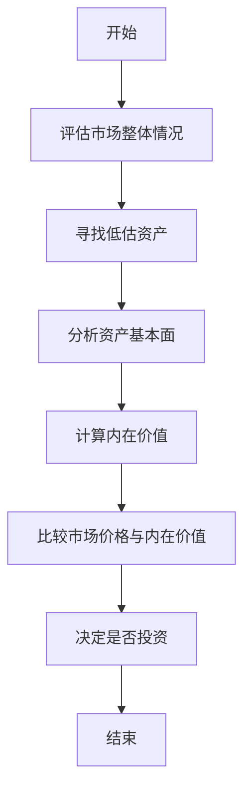

                 

# 霍华德马克斯的投资备忘录启示

---

## 关键词

- 霍华德马克斯、价值投资、投资哲学、安全边际、逆向思维、投资决策

---

## 摘要

霍华德·马克斯的投资哲学以价值投资为核心，强调安全边际和逆向思维，为投资者提供了独特的视角和方法。本文通过分析马克斯的投资备忘录，深入探讨其核心理念、策略和实践案例，结合技术语言和图表，揭示其投资哲学的精髓，并为读者提供实用的启示和建议。

---

# 第1章: 霍华德马克斯投资理念的背景与核心概念

## 1.1 霍华德马克斯的背景与投资哲学

### 1.1.1 霍华德马克斯的背景

霍华德·马克斯（Howard Marks）是全球知名的价值投资者，创办了橡树资本（Oaktree Capital）。他以撰写投资备忘录闻名，备忘录中分享了他对市场的深刻见解和投资策略。

### 1.1.2 马克斯投资哲学的核心思想

马克斯的投资哲学强调以下几点：
- 价值投资：寻找市场价格低于内在价值的投资标的。
- 安全边际：在投资中留出足够的安全空间，以应对市场波动和不确定性。
- 逆向思维：在市场恐慌时寻找机会，在市场狂热时保持冷静。

### 1.1.3 投资备忘录的特点

马克斯的投资备忘录以简洁明了、逻辑清晰著称，他通过备忘录与投资者分享他的投资理念和策略。

---

## 1.2 霍华德马克斯投资备忘录的核心概念

### 1.2.1 价值投资的定义与特征

价值投资是一种投资策略，强调以低于内在价值的价格买入优质资产。其核心特征包括：
- 长期视角：关注企业的长期价值，而非短期价格波动。
- 安全边际：买入价格远低于内在价值，以降低投资风险。

### 1.2.2 价值投资与其他投资方法的对比

与技术分析和趋势投资不同，价值投资注重基本面分析，寻找被市场低估的资产。以下是三种主要投资方法的对比：

| 投资方法 | 定义 | 重点 | 优缺点 |
|----------|------|------|--------|
| 价值投资 | 寻找市场价格低于内在价值的资产 | 基本面分析 | 高收益，但需要深入研究 |
| 技术分析 | 通过价格和成交量预测未来走势 | 市场走势 | 易受市场情绪影响 |
| 趋势投资 | 投资于当前表现良好的资产 | 追踪趋势 | 稳定性较高，但收益有限 |

### 1.2.3 价值投资的核心要素与属性

- **内在价值**：资产在市场中的真实价值，需通过基本面分析确定。
- **市场价格**：资产在市场中的交易价格，需低于内在价值。
- **安全边际**：价格与价值之间的差距，是投资安全性的保障。

---

# 第2章: 价值投资的核心原理

## 2.1 价值投资的定义与内涵

### 2.1.1 价值投资的定义

价值投资是一种通过分析资产的内在价值，寻找市场价格低于内在价值的投资机会的方法。

### 2.1.2 价值投资的核心内涵

- **安全边际**：价格远低于价值，确保投资的安全性。
- **逆向思维**：在市场恐慌时买入，在市场狂热时卖出。

## 2.2 价值投资的决策框架

### 2.2.1 投资决策的逻辑流程

以下是一个典型的价值投资决策流程图：

---

## 2.3 价值投资的关键步骤

### 2.3.1 评估市场整体情况

分析市场的整体趋势和宏观经济环境，判断市场的高低点。

### 2.3.2 寻找低估资产

通过基本面分析，寻找市场价格低于内在价值的资产。

### 2.3.3 分析资产基本面

研究资产的财务状况、盈利能力和发展前景。

### 2.3.4 计算内在价值

使用DCF模型等方法计算资产的内在价值。

### 2.3.5 比较市场价格与内在价值

确定是否存在安全边际。

---

## 2.4 本章小结

价值投资的核心在于寻找市场价格低于内在价值的资产，通过安全边际和逆向思维降低投资风险。

---

# 第3章: 霍华德马克斯的投资策略与方法

## 3.1 逆向投资的定义与实践

### 3.1.1 逆向投资的定义

逆向投资是指在市场恐慌时买入，在市场狂热时卖出。

### 3.1.2 逆向投资的实践案例

1. **1987年股灾**：马克斯在市场恐慌时大量买入优质资产，获得了丰厚的回报。
2. **2008年金融危机**：马克斯在市场底部买入资产，抓住了市场复苏的机会。

---

## 3.2 安全边际的定义与作用

### 3.2.1 安全边际的定义

安全边际是指市场价格与内在价值之间的差距，是投资的安全空间。

### 3.2.2 安全边际的作用

- **降低风险**：确保在市场波动中不会遭受重大损失。
- **提高收益**：通过安全边际，投资者可以获得超额收益。

---

## 3.3 投资组合的构建

### 3.3.1 投资组合的分散化

通过分散投资降低风险，避免过度依赖单一资产。

### 3.3.2 投资组合的再平衡

定期调整投资组合，确保其与市场环境保持一致。

---

## 3.4 本章小结

逆向投资和安全边际是霍华德·马克斯投资策略的核心，通过分散化和再平衡投资组合，投资者可以降低风险并提高收益。

---

# 第4章: 霍华德马克斯投资哲学的实际应用

## 4.1 成功案例分析

### 4.1.1 案例一：橡树资本的复苏债券

橡树资本在2008年金融危机期间买入复苏债券，获得了高额回报。

### 4.1.2 案例二：通用汽车的破产重组

马克斯在通用汽车破产重组期间买入其债券，获得了巨大收益。

---

## 4.2 失败案例分析

### 4.2.1 案例一：安然事件

马克斯在安然事件中损失惨重，但通过总结教训，改进了投资策略。

---

## 4.3 经验与教训

### 4.3.1 经验

- 坚持价值投资，寻找低估资产。
- 保持逆向思维，避免随市场波动。

### 4.3.2 教训

- 风险控制的重要性。
- 持续学习和改进投资策略。

---

## 4.4 本章小结

通过实际案例分析，我们可以看到霍华德·马克斯投资哲学的成功与失败，以及他对投资策略的不断改进。

---

# 第5章: 霍华德马克斯投资哲学对个人投资者的启示

## 5.1 个人投资者的启示

### 5.1.1 理解价值投资的核心理念

个人投资者需要理解价值投资的核心理念，包括内在价值、安全边际和逆向思维。

### 5.1.2 建立自己的投资策略

根据自身情况，建立适合自己的投资策略。

### 5.1.3 持续学习与改进

通过不断学习和总结经验，改进自己的投资策略。

---

## 5.2 个人投资者的投资计划

### 5.2.1 投资目标的设定

明确投资目标，包括短期和长期目标。

### 5.2.2 资产配置

根据风险承受能力和投资目标，进行合理的资产配置。

### 5.2.3 投资组合的管理

定期监控和调整投资组合，确保其与目标一致。

---

## 5.3 长期投资的意义

### 5.3.1 长期投资的优势

- 避免短期波动的影响。
- 享受资产的长期增值。

### 5.3.2 长期投资的风险

- 长期锁定资金，可能错失短期投资机会。

---

## 5.4 本章小结

个人投资者可以通过理解霍华德·马克斯的投资哲学，建立自己的投资策略，实现长期稳定的收益。

---

# 第6章: 霍华德马克斯投资哲学的总结与展望

## 6.1 本章总结

霍华德·马克斯的投资哲学以价值投资为核心，强调安全边际和逆向思维。通过分析他的投资备忘录，我们可以看到其投资理念的深刻洞察力和实用性。

---

## 6.2 对未来投资的展望

随着市场的变化，霍华德·马克斯的投资哲学需要不断适应新的环境。未来，投资者需要更加注重风险控制和长期投资，以应对市场的不确定性。

---

# 第7章: 结语

霍华德·马克斯的投资哲学为投资者提供了宝贵的启示。通过理解其核心理念和实际应用，投资者可以在复杂多变的市场中找到自己的投资方向。

---

# 作者：AI天才研究院/AI Genius Institute & 禅与计算机程序设计艺术 /Zen And The Art of Computer Programming

