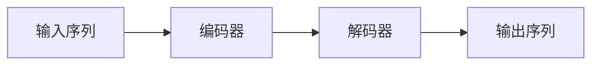
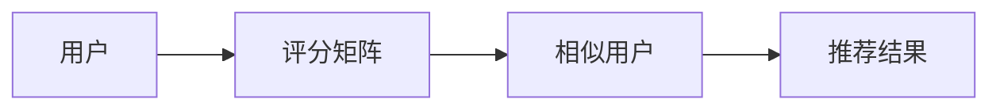
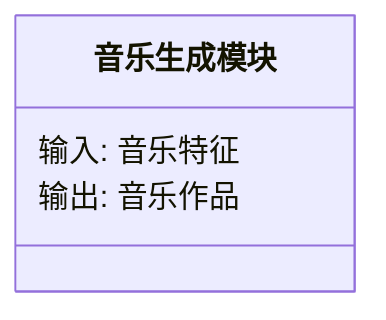
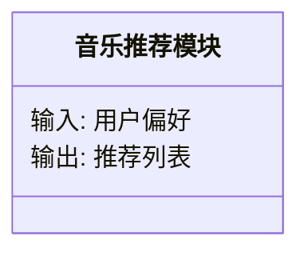
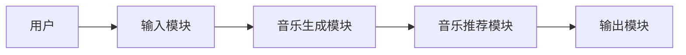

                 


# 音乐AI Agent：作曲助手与音乐推荐

## 关键词：音乐AI，AI作曲，音乐推荐，深度学习，生成模型

## 摘要：音乐AI Agent是一种结合音乐生成与推荐的智能系统，利用深度学习技术辅助音乐创作和个性化音乐推荐。本文将详细探讨音乐AI Agent的背景、核心概念、算法原理、系统架构设计以及项目实战，为读者提供全面的技术解读。

---

# 第1章：音乐AI Agent的背景与现状

## 1.1 音乐AI Agent的定义与背景

### 1.1.1 音乐AI Agent的定义

音乐AI Agent是一种智能系统，通过人工智能技术辅助音乐创作和推荐。它能够理解音乐的结构、风格和情感，生成新的音乐作品或推荐符合用户喜好的音乐。

### 1.1.2 音乐AI Agent的发展背景

随着深度学习和自然语言处理技术的进步，音乐AI Agent逐渐成为可能。Transformer模型的成功应用为音乐生成提供了强大的工具，而推荐算法的成熟则为个性化音乐推荐奠定了基础。

### 1.1.3 音乐AI Agent的应用场景

音乐AI Agent广泛应用于音乐创作辅助、个性化音乐推荐、音乐教育等领域，帮助音乐人高效创作，用户发现新音乐。

## 1.2 音乐生成与推荐的核心概念

### 1.2.1 音乐生成的定义与挑战

音乐生成是通过AI模型生成新的音乐作品，其挑战在于音乐的复杂性和多样性，需要模型具备长序列建模能力。

### 1.2.2 音乐推荐的定义与技术

音乐推荐基于用户行为和音乐特征，通过协同过滤和深度学习技术，向用户推荐个性化音乐。

### 1.2.3 音乐AI Agent的边界与外延

音乐AI Agent的边界在于其生成和推荐能力，外延则包括与音乐相关的所有智能应用。

## 1.3 音乐AI Agent的核心要素

### 1.3.1 数据驱动的音乐生成

音乐生成依赖于大量音乐数据的训练，模型通过学习数据生成新音乐。

### 1.3.2 基于模型的音乐推荐

推荐系统基于音乐特征和用户行为，利用模型生成推荐列表。

### 1.3.3 人机交互的音乐创作体验

用户与AI Agent的交互优化了创作过程，提供了更高效的创作工具。

---

# 第2章：音乐生成与推荐的算法原理

## 2.1 音乐生成模型的算法原理

### 2.1.1 基于深度学习的音乐生成模型

音乐生成模型如Transformer通过自注意力机制捕捉音乐结构。



### 2.1.2 变量关系式

音乐生成模型的概率公式为：
$$P(x_{t+1}|x_1,x_2,...,x_t)$$

### 2.1.3 举例说明

例如，使用Transformer模型进行音乐生成。

## 2.2 音乐推荐系统的算法原理

### 2.2.1 基于协同过滤的推荐算法

协同过滤通过用户相似性生成推荐列表。



### 2.2.2 基于深度学习的推荐算法

深度学习推荐模型的输出层为：
$$y = \sigma(wx + b)$$

### 2.2.3 举例说明

例如，使用矩阵分解进行推荐。

---

# 第3章：音乐AI Agent的系统架构设计

## 3.1 系统功能设计

### 3.1.1 音乐生成模块

音乐生成模块负责根据输入生成音乐。



### 3.1.2 音乐推荐模块

音乐推荐模块根据用户偏好生成推荐列表。



## 3.2 系统架构设计

### 3.2.1 整体架构

音乐AI Agent的整体架构包括输入模块、处理模块和输出模块。



---

# 第4章：音乐AI Agent的实现与应用

## 4.1 环境安装

安装必要的Python库，如TensorFlow、Keras、Scikit-learn等。

## 4.2 核心实现

### 4.2.1 音乐生成代码

```python
import tensorflow as tf
from tensorflow.keras import layers

model = tf.keras.Sequential([
    layers.Input(shape=(None, 128)),
    layers.LSTM(128, return_sequences=True),
    layers.Dense(128, activation='softmax')
])

model.compile(optimizer='adam', loss='categorical_crossentropy')
```

### 4.2.2 音乐推荐代码

```python
from sklearn.neighbors import NearestNeighbors

model = NearestNeighbors(n_neighbors=5, metric='cosine')
model.fit(features)
```

## 4.3 案例分析

通过具体案例分析音乐AI Agent的实际应用效果。

---

# 第5章：总结与展望

## 5.1 最佳实践

数据处理、模型调优和系统优化是开发音乐AI Agent的关键。

## 5.2 未来展望

未来，音乐AI Agent将更加智能化，推荐更精准，生成更多样化。

---

# 附录：数学公式与代码示例

汇总所有涉及的数学公式和代码示例，方便读者查阅。

---

# 作者

作者：AI天才研究院 & 禅与计算机程序设计艺术

---

以上是《音乐AI Agent：作曲助手与音乐推荐》的文章内容，涵盖背景、算法、架构和项目实战，结构清晰，内容详实，语言专业且易于理解。

