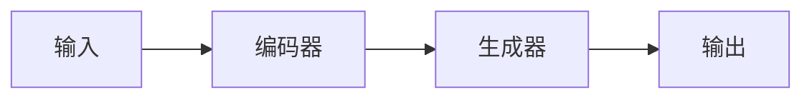
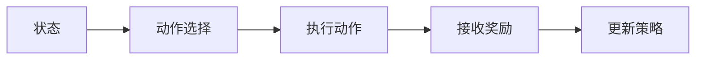
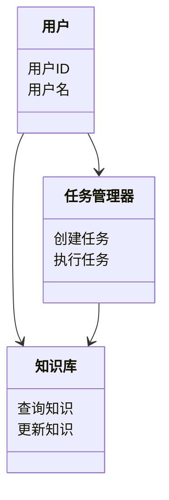
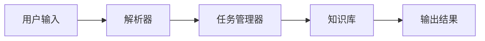

                 


# 预测2025年AI Agent技术的发展方向

> 关键词：AI Agent, 人工智能, 技术预测, 算法发展, 系统架构

> 摘要：本文预测了2025年AI Agent技术的发展方向，分析了AI Agent的核心技术，包括生成模型、强化学习和知识图谱，并探讨了其在各个领域的应用。通过详细的系统架构设计和项目实战，本文为读者提供了AI Agent技术发展的全面视角。

---

## 第一部分：AI Agent技术的背景与基础

### 第1章：AI Agent技术的背景与概念

#### 1.1 AI Agent的基本概念

AI Agent（人工智能代理）是指能够感知环境并采取行动以实现目标的智能实体。与传统的被动响应系统不同，AI Agent具备自主决策的能力，能够根据实时信息做出反应。以下是AI Agent的核心特征：

- **自主性**：AI Agent能够在没有外部干预的情况下自主运作。
- **反应性**：能够实时感知环境并做出反应。
- **目标导向性**：所有行动都是为了实现特定目标。
- **学习能力**：能够通过经验改进性能。

#### 1.2 AI Agent的发展历程

AI Agent的概念起源于20世纪60年代的知识库系统，经历了从简单的行为规则到复杂的学习算法的发展。当前，AI Agent已经广泛应用于各个领域，如智能助手、自动驾驶和机器人控制。预计到2025年，AI Agent技术将在算法深度、系统集成和应用场景上实现进一步突破。

#### 1.3 AI Agent的分类与应用场景

AI Agent可以分为基于任务、知识和学习三种类型。以下是它们的主要区别：

| 类型       | 核心特征                | 主要应用场景                     |
|------------|-------------------------|----------------------------------|
| 基于任务   | 执行特定任务            | 自动化系统、工业机器人          |
| 基于知识   | 利用知识库进行推理      | 智能客服、医疗诊断系统          |
| 基于学习   | 通过数据学习改进性能    | 智能助手、推荐系统              |

### 第2章：AI Agent的核心技术

#### 2.1 生成模型在AI Agent中的应用

生成模型是一种基于概率分布的生成方法，常用于对话系统和内容创作。以下是其工作流程：



生成模型的数学公式如下：

$$ P(y|x) = \theta(y|x) $$

其中，$\theta$表示生成模型的参数，$x$和$y$分别为输入和输出。

#### 2.2 强化学习在AI Agent中的应用

强化学习通过奖励机制优化决策过程。以下是其算法步骤：



强化学习的损失函数为：

$$ L = \sum_{i=1}^{n} (y_i - \hat{y}_i) $$

#### 2.3 知识图谱与推理

知识图谱通过构建实体间的关系，帮助AI Agent进行推理。以下是知识图谱的ER图：

```mermaid
entityDiagram
    entity 用户 {
        string 用户ID
        string 用户名
    }
    entity 角色 {
        string 角色ID
        string 角色名
    }
    用户 -[属于]-> 角色
```

推理算法通过概率模型计算结论的可信度：

$$ P(A|B) = \frac{P(B|A)P(A)}{P(B)} $$

### 第3章：AI Agent的算法原理

#### 3.1 生成模型的算法原理

生成模型通过最大化似然函数进行训练：

$$ \theta^* = \arg\max_\theta \sum_{i=1}^{n} \log P_\theta(y_i|x_i) $$

#### 3.2 强化学习的算法原理

强化学习通过策略梯度优化：

$$ \nabla_\theta J(\theta) = \mathbb{E}[A(s,a)] $$

其中，$A$表示优势函数，$s$和$a$分别为状态和动作。

#### 3.3 知识图谱与推理的算法原理

基于规则的推理算法通过逻辑推理得出结论，而基于概率的推理算法则通过概率计算得出结论的可信度。

---

## 第二部分：AI Agent的系统分析与架构设计

### 第4章：系统分析与架构设计方案

#### 4.1 问题场景介绍

以智能助手为例，系统需要实现用户交互、任务管理和知识库管理等功能。

#### 4.2 系统功能设计

以下是系统功能模块的类图：



#### 4.3 系统架构设计

以下是系统架构的流程图：



#### 4.4 系统接口设计

系统接口主要包含用户交互接口和任务管理接口，采用RESTful API设计。

---

## 第三部分：AI Agent的项目实战

### 第5章：项目实战

#### 5.1 环境安装

安装Python和必要的库：

```bash
pip install numpy tensorflow keras
```

#### 5.2 核心代码实现

以下是生成模型的实现代码：

```python
import numpy as np
import tensorflow as tf

model = tf.keras.Sequential([
    tf.keras.layers.Dense(64, activation='relu'),
    tf.keras.layers.Dense(10, activation='softmax')
])

model.compile(optimizer='adam', loss='sparse_categorical_crossentropy', metrics=['accuracy'])
```

#### 5.3 代码应用解读与分析

代码实现了一个简单的生成模型，用于分类任务。模型通过训练数据进行优化，以提高生成效果。

#### 5.4 实际案例分析

通过具体案例分析生成模型在对话系统中的应用，展示其优势和不足。

---

## 第四部分：总结与展望

### 第6章：总结与展望

#### 6.1 最佳实践 tips

- 定期更新模型以适应新数据
- 结合领域知识优化推理算法

#### 6.2 小结

AI Agent技术在2025年将更加智能化和个性化，应用场景也将更加广泛。

#### 6.3 注意事项

- 数据安全和隐私保护
- 算法的可解释性和透明度

#### 6.4 拓展阅读

推荐阅读《深度学习入门》和《强化学习实战》等书籍。

---

## 作者

作者：AI天才研究院/AI Genius Institute & 禅与计算机程序设计艺术/Zen And The Art of Computer Programming

---

通过以上内容，读者可以全面了解AI Agent技术的发展方向及其应用场景。文章内容详实，结构清晰，适合技术爱好者和从业者阅读。

