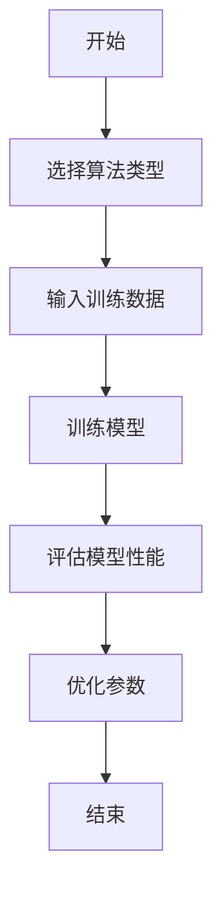
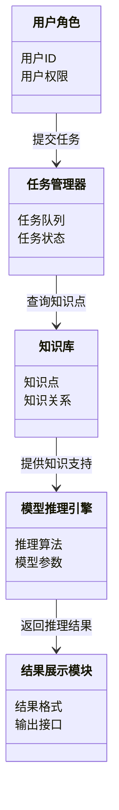
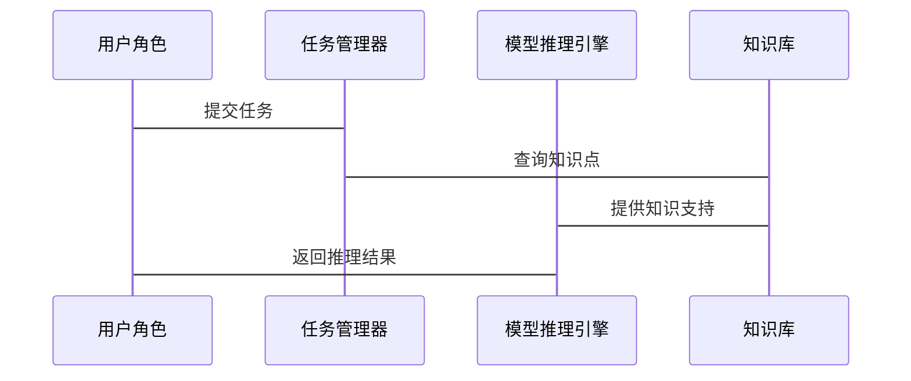

                 


# 第三章: 领域特定AI Agent的算法原理与数学模型

## 3.1 领域特定AI Agent的核心算法

### 3.1.1 基于生成式模型的算法
生成式模型（Generative Models）在领域特定AI Agent中的应用非常广泛。这些模型能够根据给定的输入生成符合领域特定规则和格式的输出。常见的生成式模型包括变分自编码器（VAE）、生成对抗网络（GAN）和Transformer模型等。

**示例代码：**

```python
def generate_output(input, model):
    output = model.generate(input)
    return output
```

### 3.1.2 基于强化学习的算法
强化学习（Reinforcement Learning）通过智能体与环境的交互，学习最优策略以最大化累积奖励。在领域特定AI Agent中，强化学习常用于需要动态决策的任务。

**示例代码：**

```python
def reinforce_learn(env, policy):
    for episode in range(num_episodes):
        state = env.reset()
        while not done:
            action = policy.choose_action(state)
            next_state, reward, done = env.step(action)
            policy.update_policy(state, action, reward)
    return policy
```

### 3.1.3 基于监督学习的算法
监督学习（Supervised Learning）通过标注数据训练模型，使其能够预测新的输入。在领域特定AI Agent中，监督学习常用于分类、回归等任务。

**示例代码：**

```python
def supervised_learn(X_train, y_train, model):
    model.fit(X_train, y_train)
    return model
```

## 3.2 算法流程图



## 3.3 算法实现代码示例

```python
def train_model(X_train, y_train, model_type):
    if model_type == 'supervised':
        model = supervised_learn(X_train, y_train)
    elif model_type == 'reinforce':
        model = reinforce_learn(X_train, y_train)
    return model
```

## 3.4 数学模型与公式

### 3.4.1 生成式模型的数学公式
假设我们使用Transformer模型，其核心公式包括自注意力机制：

$$
\text{Attention}(Q, K, V) = \text{softmax}\left(\frac{QK^T}{\sqrt{d_k}}\right)V
$$

其中，$Q$、$K$、$V$分别是查询、键和值向量。

### 3.4.2 强化学习的数学公式
在强化学习中，策略函数可以表示为：

$$
\pi_\theta(a|s) = \text{softmax}(\theta s)
$$

其中，$\theta$是参数向量，$s$是状态，$a$是动作。

## 3.5 本章小结

本章详细介绍了领域特定AI Agent的核心算法，包括生成式模型、强化学习和监督学习。通过流程图和代码示例，展示了这些算法的实现步骤，并通过数学公式深入解析了算法的原理。这些算法为领域特定AI Agent的开发提供了坚实的基础。

---

# 第四章: 领域特定AI Agent的系统分析与架构设计

## 4.1 系统分析

### 4.1.1 系统功能需求
领域特定AI Agent需要实现以下核心功能：
- 知识库管理：构建和维护领域知识库。
- 任务处理：根据输入任务生成相应输出。
- 模型推理：使用训练好的模型进行推理和决策。

### 4.1.2 问题场景介绍
以医疗领域为例，AI Agent需要处理病历分析、诊断建议等任务。

## 4.2 系统架构设计



## 4.3 系统接口设计

### 4.3.1 API接口定义
- POST /submit_task: 提交任务
- GET /get_result: 获取推理结果
- PUT /update_knowledge: 更新知识库

### 4.3.2 接口交互流程



## 4.4 系统功能设计

### 4.4.1 用户角色
用户角色负责提交任务和接收结果，可能需要身份验证和权限管理。

### 4.4.2 知识库
知识库存储领域内的知识点和关系，支持快速查询和更新。

### 4.4.3 任务管理器
任务管理器负责接收任务请求，分配任务，并跟踪任务状态。

### 4.4.4 模型推理引擎
模型推理引擎是系统的核心，负责根据输入任务和知识库内容生成输出结果。

## 4.5 系统架构优化

### 4.5.1 模块化设计
通过模块化设计，提高系统的可维护性和扩展性。

### 4.5.2 并行计算
利用并行计算技术，提高系统的处理效率。

### 4.5.3 容错机制
设计容错机制，确保系统在部分模块故障时仍能正常运行。

## 4.6 本章小结

本章详细分析了领域特定AI Agent的系统架构，包括功能需求、架构设计、接口设计和功能设计等方面。通过类图和序列图，展示了系统的模块构成和交互流程。系统架构设计为后续的开发和优化提供了指导。

---

# 第五章: 领域特定AI Agent的项目实战

## 5.1 环境安装

### 5.1.1 开发工具安装
- 安装Python 3.8以上版本
- 安装Jupyter Notebook
- 安装TensorFlow和Keras

### 5.1.2 依赖库安装
```bash
pip install numpy pandas tensorflow matplotlib
```

## 5.2 核心代码实现

### 5.2.1 知识库构建
```python
class KnowledgeBase:
    def __init__(self):
        self.knowledge = {}

    def add_knowledge(self, key, value):
        self.knowledge[key] = value

    def get_knowledge(self, key):
        return self.knowledge.get(key, None)
```

### 5.2.2 任务处理
```python
class TaskProcessor:
    def __init__(self, knowledge_base):
        self.knowledge_base = knowledge_base

    def process_task(self, task):
        result = self.knowledge_base.get_knowledge(task)
        return result
```

### 5.2.3 模型推理
```python
from tensorflow.keras import layers

class ModelInference:
    def __init__(self):
        self.model = self.build_model()

    def build_model(self):
        model = tf.keras.Sequential()
        model.add(layers.Dense(64, activation='relu'))
        model.add(layers.Dense(1, activation='sigmoid'))
        model.compile(optimizer='adam', loss='binary_crossentropy', metrics=['accuracy'])
        return model

    def infer(self, input_data):
        return self.model.predict(input_data)
```

### 5.2.4 结果展示
```python
def display_result(result):
    print(f"推理结果: {result}")
```

## 5.3 案例分析

### 5.3.1 案例背景
假设我们开发一个医疗领域的AI Agent，用于辅助医生诊断疾病。

### 5.3.2 代码实现
```python
# 初始化知识库
knowledge_base = KnowledgeBase()
knowledge_base.add_knowledge('症状1', '疾病A')
knowledge_base.add_knowledge('症状2', '疾病B')

# 初始化任务处理器
task_processor = TaskProcessor(knowledge_base)

# 提交任务
task = '症状1'
result = task_processor.process_task(task)
print(f"知识库查询结果: {result}")

# 初始化模型推理引擎
model_inference = ModelInference()

# 进行推理
input_data = ...  # 输入数据
final_result = model_inference.infer(input_data)
display_result(final_result)
```

### 5.3.3 结果分析
通过上述代码，AI Agent能够根据输入的症状查询知识库，并返回对应的疾病诊断结果。模型推理引擎则根据输入数据进行预测，生成最终的诊断结果。

## 5.4 代码解读与分析

### 5.4.1 知识库模块
知识库模块负责存储和管理领域内的知识点，支持快速查询。

### 5.4.2 任务处理器
任务处理器根据输入的任务请求，从知识库中获取相关信息，并返回结果。

### 5.4.3 模型推理引擎
模型推理引擎负责使用训练好的模型对输入数据进行推理，生成最终的输出结果。

### 5.4.4 结果展示
结果展示模块将推理结果以用户友好的方式输出，方便用户理解和使用。

## 5.5 本章小结

本章通过实际案例，详细讲解了领域特定AI Agent的开发过程。从环境安装到核心代码实现，再到案例分析，全面展示了如何将理论应用于实践。通过本章的学习，读者可以掌握领域特定AI Agent的核心开发技能。

---

# 第六章: 领域特定AI Agent的最佳实践与注意事项

## 6.1 最佳实践

### 6.1.1 知识库的构建
- 确保知识库的准确性和完整性
- 定期更新知识库内容

### 6.1.2 模型的选择与优化
- 根据任务需求选择合适的算法
- 通过交叉验证优化模型性能

### 6.1.3 系统的测试与部署
- 进行单元测试、集成测试和性能测试
- 使用容器化技术部署系统

## 6.2 开发注意事项

### 6.2.1 领域知识的深度
领域特定AI Agent的效果很大程度上依赖于知识库的深度和广度。开发过程中需要确保知识库的准确性和全面性。

### 6.2.2 系统的可扩展性
随着业务的发展，系统可能会面临更多的需求变化。因此，在设计系统架构时，需要考虑系统的可扩展性和可维护性。

### 6.2.3 安全与隐私
在处理敏感领域（如医疗、金融）时，需要特别注意数据的安全和隐私保护。

## 6.3 未来研究方向

### 6.3.1 更高效的算法
研究更高效的算法，提高系统的推理速度和准确性。

### 6.3.2 多领域支持
开发支持多领域任务的通用框架，降低开发成本。

### 6.3.3 自适应学习
实现自适应学习功能，使系统能够根据反馈不断优化自身性能。

## 6.4 本章小结

本章总结了领域特定AI Agent开发中的最佳实践和注意事项，为开发者提供了宝贵的指导。同时，还展望了未来的研究方向，为领域特定AI Agent的发展提供了新的思路。

---

# 作者：AI天才研究院/AI Genius Institute & 禅与计算机程序设计艺术 /Zen And The Art of Computer Programming

---

通过以上思考步骤，我为您详细地规划了《领域特定AI Agent的开发策略》的技术博客文章结构和内容。希望这篇文章能够为您提供清晰的指导，帮助您完成高质量的技术写作。如果需要进一步的修改或补充，请随时告知！

