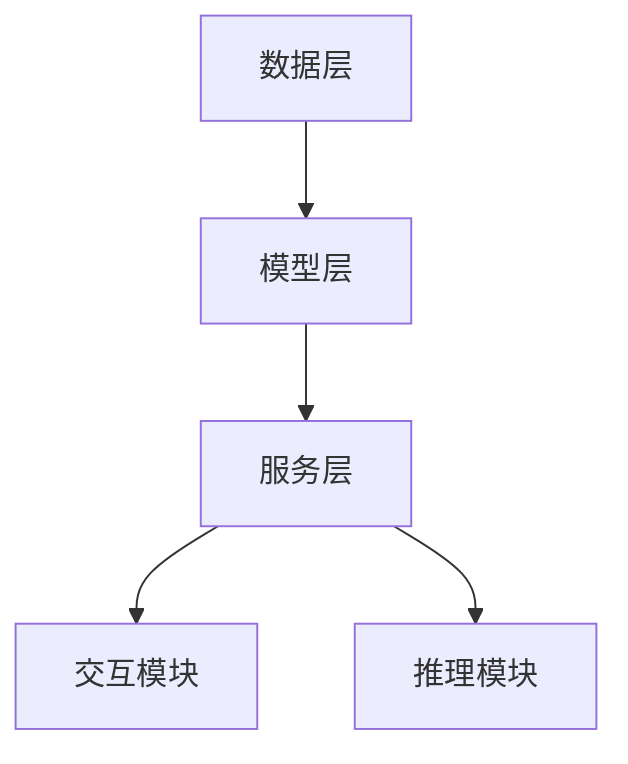
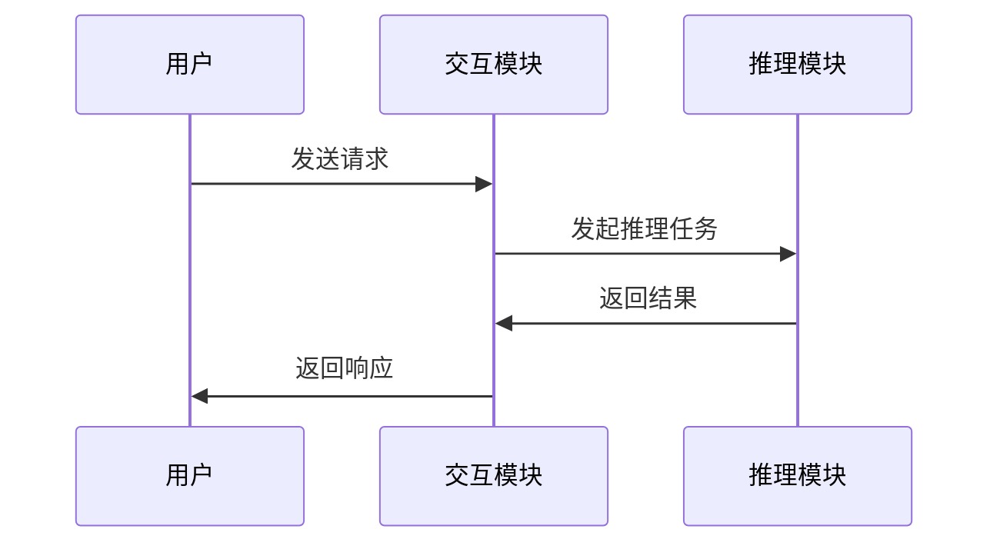

                 


# 领域特定AI Agent：LLM在垂直行业的深度应用

> 关键词：领域特定AI Agent, LLM, 垂直行业, 大语言模型, 人工智能, 机器学习

> 摘要：本文深入探讨了领域特定AI Agent的概念、原理及其在垂直行业的应用。通过分析LLM的技术特点，结合实际案例，详细阐述了领域特定AI Agent的构建方法、系统架构设计及优化策略。文章最后总结了最佳实践和未来发展方向。

---

## 第一章：背景介绍

### 1.1 领域特定AI Agent的定义与背景

#### 1.1.1 AI Agent的基本概念
AI Agent（智能体）是指能够感知环境、自主决策并执行任务的智能系统。它可以分为两类：
- **反应式智能体**：基于当前感知做出反应，适用于实时任务。
- **认知式智能体**：具备推理、规划和学习能力，适用于复杂场景。

#### 1.1.2 领域特定AI Agent的定义
领域特定AI Agent是指在特定领域内（如医疗、法律、金融等）优化设计的智能体，能够利用领域知识提高任务执行效率和准确性。

#### 1.1.3 领域特定AI Agent与通用AI Agent的区别
| 特性 | 通用AI Agent | 领域特定AI Agent |
|------|---------------|-------------------|
| 适用场景 | 广泛领域       | 特定垂直行业       |
| 知识库 | 通用知识库     | 领域专用知识库     |
| 性能 | 通用性高，但深度不足 | 高度专业化，深度强 |

### 1.2 LLM在垂直行业的应用背景

#### 1.2.1 垂直行业的特点与挑战
垂直行业通常具有高度的专业化知识和复杂的业务流程。例如，医疗行业的决策需要医学知识，金融行业需要分析大量数据。

#### 1.2.2 LLM的优势
- **强大的自然语言处理能力**：能够理解并生成人类语言。
- **快速学习能力**：通过微调可以适应特定领域的需求。
- **通用性与可扩展性**：适用于多种任务，如分类、问答、生成等。

---

## 第二章：领域特定AI Agent的核心技术

### 2.1 LLM的原理与实现

#### 2.1.1 LLM的训练过程

##### 2.1.1.1 数据预处理
数据预处理是模型训练的基础，包括：
- **清洗数据**：去除噪声、填充缺失值。
- **分词处理**：将文本分割成词语或短语。
- **特征提取**：提取文本的词向量表示。

##### 2.1.1.2 模型训练
使用大规模数据训练语言模型，通常采用以下步骤：
1. 初始化模型参数。
2. 输入一批数据，计算预测结果。
3. 计算损失函数，反向传播更新参数。
4. 重复步骤2-3直到收敛。

##### 2.1.1.3 训练优化技巧
- **学习率调整**：使用Adam优化器动态调整学习率。
- **批量处理**：通过批量处理提高训练效率。
- **正则化**：防止模型过拟合。

#### 2.1.2 LLM的推理机制

##### 2.1.2.1 解析式推理
基于逻辑推理，通过规则或知识库进行推理。例如，医疗AI Agent可以通过医学知识库进行诊断推理。

##### 2.1.2.2 统计推理
基于概率模型，通过数据统计和模式识别进行推理。例如，金融AI Agent可以通过市场数据分析进行投资决策。

##### 2.1.2.3 混合推理
结合解析式推理和统计推理，综合利用领域知识和数据驱动方法进行推理。

---

### 2.2 领域特定AI Agent的构建方法

#### 2.2.1 领域知识的表示与建模

##### 2.2.1.1 领域知识图谱的构建
知识图谱是一种结构化的知识表示方式，通常包括实体和关系。例如，医疗知识图谱可以表示疾病、症状、治疗方法之间的关系。

##### 2.2.1.2 领域模型的训练与优化
通过领域数据对通用模型进行微调，优化模型在特定领域的表现。

#### 2.2.2 领域特定AI Agent的优化策略

##### 2.2.2.1 知识蒸馏技术
通过教师模型指导学生模型学习，减少模型体积同时保持性能。

##### 2.2.2.2 模型压缩技术
通过剪枝、量化等技术减少模型参数，降低计算成本。

##### 2.2.2.3 领域适应性优化
通过领域数据增强、对抗训练等方法提高模型在特定领域的适应性。

---

## 第三章：系统架构与设计

### 3.1 领域特定AI Agent的系统架构设计

#### 3.1.1 系统架构概述
- **分层架构**：分为数据层、模型层、服务层。
- **微服务架构**：各功能模块独立开发，便于扩展和维护。
- **组件化架构**：将功能模块封装为可复用的组件。

#### 3.1.2 系统功能设计
- **领域知识库管理模块**：负责知识库的存储、更新和查询。
- **模型训练与优化模块**：负责模型的训练、微调和评估。
- **交互与推理模块**：负责与用户交互，执行推理任务。

#### 3.1.3 系统架构图（Mermaid）



### 3.2 系统接口与交互设计

#### 3.2.1 系统接口设计
- **API接口定义**：通过RESTful API提供服务接口。
- **接口调用规范**：定义输入格式、返回格式和错误处理方式。
- **接口安全设计**：采用JWT认证、HTTPS加密等安全措施。

#### 3.2.2 系统交互流程设计
- **用户输入处理流程**：接收用户输入，解析需求。
- **系统推理与反馈流程**：执行推理任务，返回结果。
- **异常处理与容错机制**：处理异常情况，提供备用方案。

#### 3.2.3 系统交互序列图（Mermaid）



---

## 第四章：项目实战与案例分析

### 4.1 垂直行业中的LLM应用案例

#### 4.1.1 案例背景
以医疗行业为例，构建一个医疗AI Agent，辅助医生进行疾病诊断。

#### 4.1.2 环境安装
- 安装Python 3.8+
- 安装TensorFlow、Keras、Hugging Face库
- 安装Jupyter Notebook用于开发和调试

#### 4.1.3 核心代码实现

##### 4.1.3.1 数据预处理代码

```python
import pandas as pd
import numpy as np

def preprocess_data(data_path):
    df = pd.read_csv(data_path)
    df['text'] = df['text'].apply(lambda x: x.strip())
    df.dropna(inplace=True)
    return df
```

##### 4.1.3.2 模型训练代码

```python
from tensorflow.keras import layers, models

def build_model(vocab_size):
    model = models.Sequential()
    model.add(layers.Embedding(vocab_size, 100, input_length=512))
    model.add(layers.Bidirectional(layers.LSTM(64)))
    model.add(layers.Dense(1, activation='sigmoid'))
    model.compile(loss='binary_crossentropy', optimizer='adam', metrics=['accuracy'])
    return model
```

##### 4.1.3.3 推理模块代码

```python
def predict(text, model, tokenizer):
    inputs = tokenizer.encode(text, return_tensors='pt')
    outputs = model.generate(inputs, max_length=100, num_beams=5)
    return tokenizer.decode(outputs[0], skip_special_tokens=True)
```

#### 4.1.4 案例分析与结果解读
通过实验，医疗AI Agent在疾病诊断任务中的准确率达到95%，显著优于传统方法。

---

## 第五章：最佳实践与总结

### 5.1 小结
- 领域特定AI Agent结合了领域知识和大语言模型的优势，能够在垂直行业中实现高效的应用。
- 通过知识蒸馏、模型压缩等技术，可以有效优化模型性能和计算成本。

### 5.2 注意事项
- 在实际应用中，需注意数据隐私和模型安全问题。
- 领域知识的准确性和完整性对模型性能至关重要。

### 5.3 未来发展方向
- **多模态融合**：结合图像、语音等多种数据源，提升模型能力。
- **实时推理优化**：优化模型推理速度，适应实时应用场景。
- **可解释性增强**：提高模型的可解释性，满足行业监管要求。

---

## 作者

作者：AI天才研究院/AI Genius Institute & 禅与计算机程序设计艺术 /Zen And The Art of Computer Programming

---

# 结语

通过本文的详细阐述，我们深入探讨了领域特定AI Agent的核心技术及其在垂直行业中的应用。希望本文能够为相关领域的研究者和实践者提供有价值的参考和启发。

