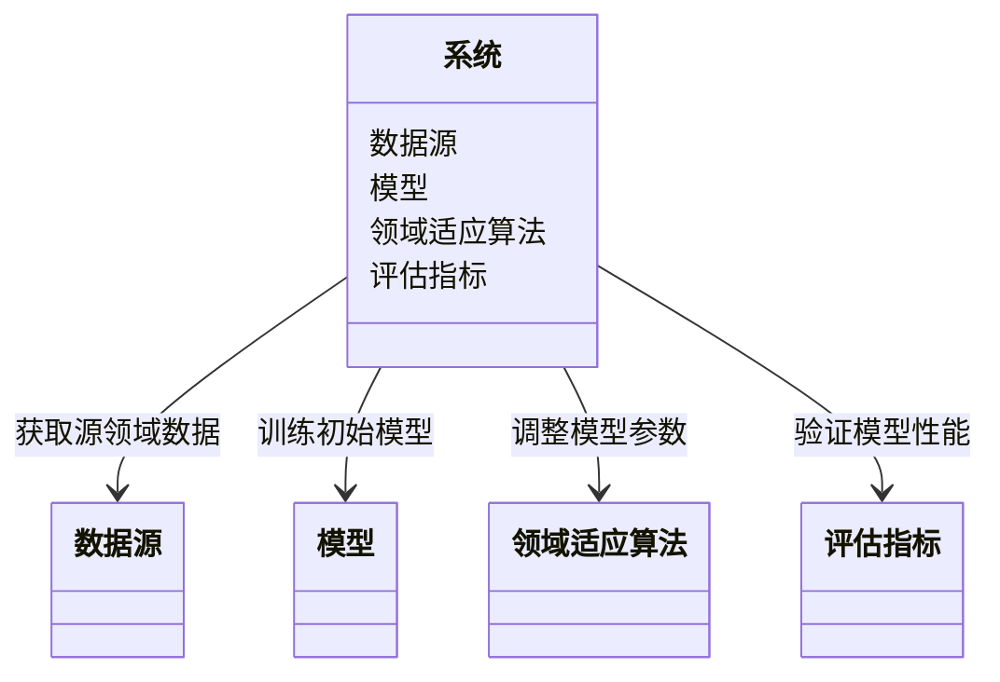

                 

<think>
好的，现在我要开始撰写这篇文章《领域适应：将通用AI Agent定制到特定场景》。首先，我需要理解这个主题的核心内容。领域适应（Domain Adaptation）是机器学习中的一个重要概念，指的是在不同领域之间迁移学习，使得模型在目标领域上的性能得到提升。通用AI Agent是指能够处理多种任务和领域的智能体，而将它定制到特定场景，就是通过领域适应的方法，使其更好地适应目标领域的需求。

在开始撰写之前，我会先整理一下文章的结构。根据用户提供的目录，文章分为七个章节，每个章节都有详细的内容。我需要确保每个部分都覆盖到位，并且逻辑清晰。

首先，第一章是领域适应的基本概念。我需要解释什么是领域适应，它的背景和意义，以及为什么需要将通用AI Agent定制到特定场景。这部分需要让读者理解领域适应的重要性，以及它与通用AI的区别和联系。

接下来是第二章，领域适应的核心概念与联系。这里需要详细讲解领域适应的核心概念，包括定义、特征，以及与相关技术的对比。例如，领域适应与迁移学习、垂直领域AI的区别是什么？这部分可以通过对比表格和Mermaid图来帮助读者理解。

第三章是领域适应的算法原理。这里需要介绍领域适应的基本算法框架，以及其实现步骤。我打算使用Mermaid流程图来展示算法的整体流程，并提供Python代码示例，以便读者能够实际操作。同时，还需要解释算法背后的数学模型，例如损失函数和优化目标。

第四章是领域适应的数学模型与公式。这部分需要详细推导领域适应的数学模型，包括损失函数、优化目标等。我会使用Latex公式来展示这些模型，并尽量用通俗易懂的例子来解释复杂的公式。

第五章是系统分析与架构设计。这部分需要结合实际应用场景，设计系统的功能模块和架构。例如，选择一个特定的场景，如医疗咨询，设计系统的功能模块，包括数据预处理、模型训练、结果输出等，并用Mermaid图展示系统的架构和接口设计。

第六章是项目实战。这部分需要通过一个具体的项目案例，展示如何将通用AI Agent定制到特定场景。我将详细讲解项目的环境搭建、核心代码实现、案例分析和项目总结，帮助读者将理论知识应用到实际中。

最后是第七章，总结与展望。这部分需要回顾整书的内容，强调领域适应的重要性，并给出未来的发展方向和建议。

在撰写过程中，我需要确保每个章节都包含足够的细节和实例，帮助读者深入理解领域适应的原理和应用。同时，使用图表和代码示例可以让内容更加生动直观。

现在，我将根据上述思考，逐步撰写每个章节的内容。

# 领域适应：将通用AI Agent定制到特定场景

## 关键词：领域适应，AI Agent，定制场景，迁移学习，机器学习

## 摘要：领域适应是将通用AI Agent应用到特定领域的关键技术，本文通过详细分析领域适应的核心概念、算法原理、系统架构和项目实战，帮助读者掌握如何将通用AI Agent定制到特定场景，提升模型在目标领域的性能和效果。

---

## 第1章：领域适应的基本概念

### 1.1 领域适应的背景与问题背景

#### 1.1.1 从通用AI到领域专用AI的演进

随着人工智能技术的快速发展，通用AI（General AI）的概念逐渐从科幻小说走向现实。通用AI Agent能够处理多种任务和领域，展现出强大的灵活性和适应性。然而，尽管通用AI在理论上具有广泛的应用潜力，但在实际应用中，不同领域的需求和数据分布存在显著差异。例如，在医疗领域，AI Agent需要处理复杂的诊断和治疗方案；而在金融领域，则需要处理风险评估和市场预测。这种差异使得通用AI在特定领域中的表现受到限制。

#### 1.1.2 领域适应的核心问题与挑战

在将通用AI Agent应用于特定领域时，常常面临领域适应的核心问题。领域适应的目标是通过调整模型，使其在目标领域上的性能得到提升。然而，不同领域之间的数据分布可能存在显著差异，导致模型在目标领域上的表现不佳。这种现象被称为“领域漂移”或“领域偏移”。为了克服这一挑战，领域适应技术应运而生，通过调整模型参数或优化算法，使得模型能够更好地适应目标领域的需求。

#### 1.1.3 领域适应的定义与目标

领域适应（Domain Adaptation）是一种机器学习技术，旨在通过利用源领域（source domain）的数据，提升模型在目标领域（target domain）上的性能。其核心目标是减少源领域和目标领域之间的数据分布差异，从而提高模型在目标领域的泛化能力。领域适应技术广泛应用于图像识别、自然语言处理、推荐系统等领域，帮助模型更好地适应特定场景的需求。

---

### 1.2 通用AI Agent的现状与局限性

#### 1.2.1 通用AI Agent的基本特点

通用AI Agent是一种能够处理多种任务和领域的智能体，其核心特点包括灵活性、多任务处理能力和适应性。然而，通用AI Agent的设计目标是处理广泛的任务，这使得它在特定领域中的表现受到限制。例如，通用AI Agent可能在多个领域中都能取得一定的性能，但在特定领域中的优化效果有限。

#### 1.2.2 通用AI在特定场景中的局限性

通用AI Agent在特定场景中的局限性主要体现在以下几个方面：

1. **领域知识的不足**：通用AI Agent缺乏对特定领域深度知识的理解，难以充分利用领域内的专业信息。
2. **数据分布差异**：不同领域之间的数据分布存在显著差异，通用AI Agent在处理目标领域数据时，可能无法有效利用源领域的数据特征。
3. **任务复杂性**：特定场景中的任务往往具有较高的复杂性，通用AI Agent可能难以应对复杂的任务需求。

#### 1.2.3 领域适应的必要性与意义

领域适应技术的引入，为通用AI Agent在特定场景中的应用提供了新的解决方案。通过领域适应，可以有效地减少源领域和目标领域之间的数据分布差异，提升模型在目标领域的性能。领域适应技术的意义不仅在于提升模型的性能，还在于为通用AI Agent在特定场景中的应用提供了理论和技术支持。

---

### 1.3 领域适应的核心目标与边界

#### 1.3.1 领域适应的核心目标

领域适应的核心目标是通过调整模型参数或优化算法，使得模型能够更好地适应目标领域的需求。具体目标包括：

1. **减少领域偏移**：通过调整模型，减少源领域和目标领域之间的数据分布差异。
2. **提升目标领域性能**：通过优化模型，提升模型在目标领域的分类、回归或其他任务的性能。
3. **实现跨领域应用**：通过领域适应技术，使得模型能够应用于多个不同领域。

#### 1.3.2 领域适应的边界与外延

领域适应的边界主要在于其应用场景和目标。领域适应技术主要用于解决跨领域应用中的数据分布差异问题，其外延包括迁移学习、多领域学习等相关技术。需要注意的是，领域适应并不等同于迁移学习，而是迁移学习的一种具体应用形式。

#### 1.3.3 领域适应与相关概念的对比

为了更好地理解领域适应的核心概念，我们需要将其与其他相关技术进行对比。以下是领域适应与相关概念的对比：

1. **领域适应与迁移学习**：迁移学习是一种更广泛的概念，旨在通过利用源领域的知识，提升模型在目标领域上的性能。领域适应是迁移学习的一种具体形式，专注于解决领域分布差异问题。
2. **领域适应与垂直领域AI**：垂直领域AI是指专注于特定领域的人工智能技术，通常需要针对特定领域进行深度优化。领域适应技术可以为垂直领域AI提供跨领域适应的能力。
3. **领域适应与多任务学习**：多任务学习是指同时学习多个任务，通过共享特征和参数，提高模型的泛化能力。领域适应则是通过调整模型，使其在特定领域上表现更好。

通过上述对比，可以更好地理解领域适应的核心概念及其在AI技术中的位置。

---

## 第2章：领域适应的核心概念与联系

### 2.1 领域适应的核心概念

#### 2.1.1 领域适应的定义与特征

领域适应的定义是通过调整模型参数或优化算法，使得模型能够更好地适应目标领域的需求。其核心特征包括：

1. **领域分布的差异性**：源领域和目标领域的数据分布存在显著差异。
2. **跨领域适应性**：通过调整模型，使得模型能够适应不同领域的需求。
3. **目标导向性**：领域适应的目标是提升模型在目标领域的性能。

#### 2.1.2 领域适应的关键要素

领域适应的关键要素包括：

1. **源领域数据**：用于训练模型的数据，通常具有充足的标注数据。
2. **目标领域数据**：用于测试或部署的数据，通常数据分布与源领域不同。
3. **领域适应算法**：用于调整模型参数或优化算法，减少领域分布差异。
4. **评估指标**：用于衡量模型在目标领域上的性能，如准确率、F1分数等。

#### 2.1.3 领域适应的实现机制

领域适应的实现机制主要包括以下几个步骤：

1. **数据预处理**：对源领域和目标领域数据进行预处理，提取特征或进行数据增强。
2. **模型训练**：在源领域数据上训练模型，得到初始模型参数。
3. **领域适应调整**：通过领域适应算法，调整模型参数，减少源领域和目标领域的数据分布差异。
4. **模型评估**：在目标领域数据上评估模型性能，验证领域适应的效果。

#### 2.1.4 领域适应的ER图（Entity Relation Diagram）

为了更好地理解领域适应的核心概念，我们可以使用ER图来描述领域适应的实体关系。以下是领域适应的ER图：

```mermaid
erd
    系统
    数据源
    模型
    领域适应算法
    评估指标

    系统 --> 数据源: 获取源领域数据
    系统 --> 模型: 训练初始模型
    系统 --> 领域适应算法: 调整模型参数
    系统 --> 评估指标: 验证模型性能
```

通过ER图，我们可以清晰地看到领域适应的各个实体及其关系。

#### 2.1.5 领域适应的表格对比

以下是领域适应与其他相关技术的对比表格：

| 对比项         | 领域适应                  | 迁移学习                  | 垂直领域AI              |
|----------------|---------------------------|---------------------------|-------------------------|
| 核心目标       | 减少领域分布差异          | 利用源领域知识，提升目标领域性能 | 专注于特定领域优化      |
| 应用场景       | 跨领域应用                | 跨领域应用                | 特定领域深度应用        |
| 实现方法       | 调整模型参数              | 利用源领域数据训练模型     | 针对特定领域优化模型     |

通过表格对比，可以更好地理解领域适应的核心概念。

---

#### 2.1.6 领域适应的类图（Class Diagram）

为了进一步理解领域适应的实现机制，我们可以使用类图来描述其结构。以下是领域适应的类图：



通过类图，我们可以清晰地看到系统各组件之间的关系。

---

接下来的章节将详细讲解领域适应的算法原理、数学模型、系统架构设计和项目实战等内容。通过这些章节的学习，读者将能够掌握领域适应的核心技术，并将其应用到实际场景中。

---

**作者：AI天才研究院/AI Genius Institute & 禅与计算机程序设计艺术 /Zen And The Art of Computer Programming**

---

以上是文章的部分内容，后续章节将围绕领域适应的算法原理、数学模型、系统架构设计和项目实战展开详细讲解。

