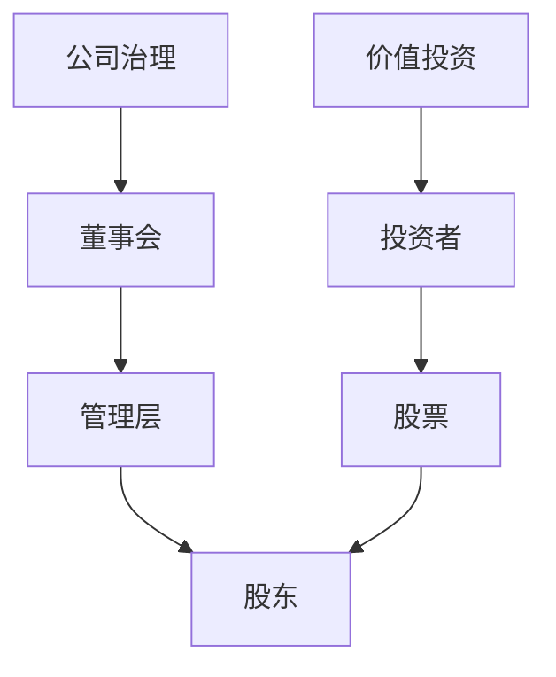
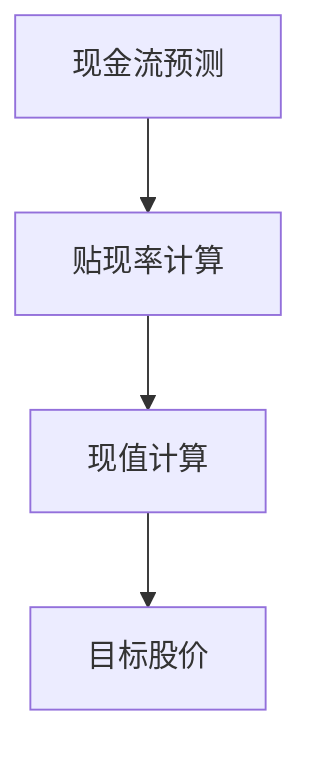
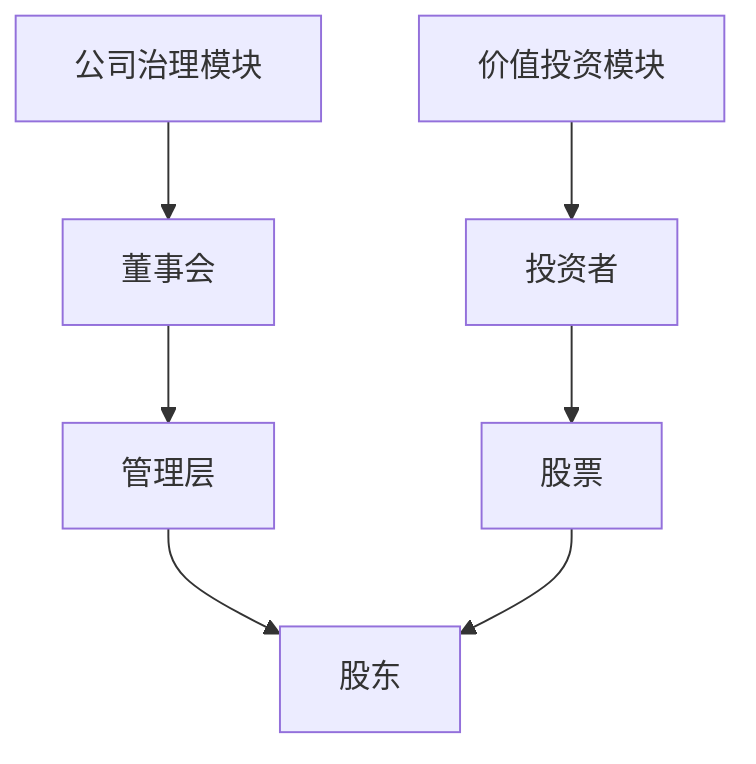
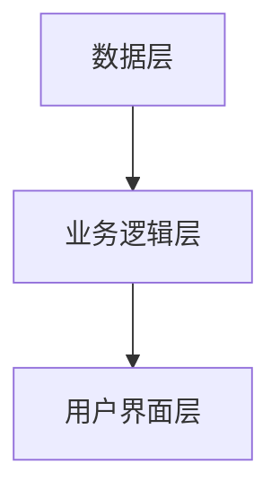

                 


# 马丁·惠特曼的公司治理价值投资：推动管理改善

> 关键词：公司治理，价值投资，管理改善，投资策略，企业价值

> 摘要：本文深入探讨了马丁·惠特曼在公司治理与价值投资领域的理论与实践，分析了价值投资如何推动公司治理的改善，以及如何通过科学的算法和系统设计实现企业价值的最大化。文章结合实际案例，详细阐述了价值投资的数学模型、系统架构设计及项目实战，为读者提供了全面的理论与实践指导。

---

# 第一部分: 公司治理与价值投资的背景与概述

## 第1章: 公司治理与价值投资的背景与概述

### 1.1 公司治理的基本概念

#### 1.1.1 公司治理的定义与内涵

公司治理是公司内部和外部利益相关者之间的关系管理，包括董事会、管理层、股东、债权人和利益相关者之间的权利、责任和利益分配。公司治理的核心目标是确保公司长期价值最大化，同时保护各利益相关者的合法权益。

#### 1.1.2 公司治理的核心要素与结构

公司治理的核心要素包括股权结构、董事会结构、管理层职责、内部控制、治理机制和外部监督。股权结构决定了公司治理的权力分配，董事会结构是公司治理的决策中心，管理层职责是公司治理的执行主体，内部控制是公司治理的风险防范机制，治理机制是公司治理的运行保障，外部监督是公司治理的外部支持。

#### 1.1.3 公司治理的演进与发展趋势

公司治理从传统的股东至上主义逐步向利益相关者资本主义转变，强调长期价值创造和社会责任。现代公司治理更加注重透明度、公平性和可持续性，同时随着数字化和全球化的深入，公司治理的复杂性和挑战也在不断增加。

### 1.2 价值投资的基本概念

#### 1.2.1 价值投资的定义与特点

价值投资是一种投资策略，强调以低于内在价值的价格购买优质资产。其特点是注重长期投资、基本面分析和安全边际，追求长期稳定的收益。价值投资的核心理念是寻找市场低估的公司，并在市场恐慌时买入，在市场乐观时卖出。

#### 1.2.2 价值投资的核心理念与原则

价值投资的核心理念是“以合理的价格买入优质的公司”，强调对公司基本面的深入分析，包括财务状况、盈利能力、竞争优势和管理层质量。其基本原则包括：寻找具有持续竞争优势的公司、注重安全边际、长期投资和分散投资。

#### 1.2.3 价值投资与公司治理的关系

价值投资与公司治理密切相关。优秀的公司治理能够为投资者提供透明的信息披露、合理的股东权益保护和高效的决策机制，从而增强投资者对公司的信任和长期投资意愿。同时，价值投资者通过长期持有优质公司，推动公司治理的持续改进。

### 1.3 公司治理与价值投资的融合

#### 1.3.1 公司治理与价值投资的内在联系

公司治理是企业价值的重要组成部分，良好的公司治理能够为价值投资提供坚实的基础。价值投资通过长期持有优质公司，推动公司治理的改进，实现企业价值的最大化。

#### 1.3.2 价值投资在公司治理中的作用

价值投资通过关注公司的基本面和长期发展潜力，推动公司治理的优化，包括提升治理透明度、增强股东权益保护和改善管理层激励机制。

#### 1.3.3 公司治理与价值投资的协同发展

公司治理与价值投资的协同发展能够实现企业价值的最大化。通过价值投资推动公司治理的改进，企业能够更好地实现长期价值创造，同时为投资者提供稳定的收益。

### 1.4 本章小结

本章介绍了公司治理和价值投资的基本概念、核心要素和内在联系，强调了公司治理与价值投资的融合对推动企业管理改善的重要性。

---

## 第2章: 公司治理与价值投资的核心概念与联系

### 2.1 公司治理与价值投资的核心概念

#### 2.1.1 公司治理的核心概念

公司治理的核心概念包括股权结构、董事会治理、管理层职责和内部控制。股权结构决定了公司治理的权力分配，董事会治理是公司治理的决策中心，管理层职责是公司治理的执行主体，内部控制是公司治理的风险防范机制。

#### 2.1.2 价值投资的核心概念

价值投资的核心概念包括内在价值、安全边际和长期投资。内在价值是公司股票的合理估值，安全边际是买入价格与内在价值的差距，长期投资是价值投资的核心策略。

#### 2.1.3 两者概念的对比分析

公司治理和价值投资在目标、主体和手段上存在差异。公司治理关注公司内部管理，价值投资关注公司外部价值。两者在目标上都追求企业价值最大化，但在实现手段上各有侧重。

| 公司治理 | 价值投资 |
|----------|----------|
| 内部管理 | 外部价值 |
| 股权结构 | 内在价值 |
| 董事会治理 | 安全边际 |
| 内部控制 | 长期投资 |

#### 2.1.4 对比分析总结

公司治理和价值投资在目标上一致，但在实现手段上各有侧重。公司治理是企业价值的基础，价值投资是企业价值的实现途径。

### 2.2 公司治理与价值投资的联系

#### 2.2.1 公司治理对价值投资的影响

公司治理的透明度、股权结构和管理层质量直接影响价值投资的决策。良好的公司治理能够提高企业的内在价值，增强投资者的信心。

#### 2.2.2 价值投资对公司治理的推动作用

价值投资通过长期持有优质公司，推动公司治理的优化，包括提升治理透明度、增强股东权益保护和改善管理层激励机制。

#### 2.2.3 两者的协同效应

公司治理与价值投资的协同效应体现在企业价值最大化和长期收益稳定性上。通过两者协同，企业能够实现可持续发展，投资者能够获得稳定的收益。

### 2.3 公司治理与价值投资的核心要素对比

#### 2.3.1 对比表格

| 公司治理 | 价值投资 |
|----------|----------|
| 股权结构 | 内在价值 |
| 董事会治理 | 安全边际 |
| 管理层职责 | 长期投资 |
| 内部控制 | 风险管理 |

#### 2.3.2 ER实体关系图



### 2.4 本章小结

本章通过对比分析，深入探讨了公司治理与价值投资的核心概念和联系，强调了两者协同对企业价值最大化的重要性。

---

## 第3章: 价值投资的算法原理与数学模型

### 3.1 价值投资的核心算法

#### 3.1.1 基于现金流贴现法的算法流程

现金流贴现法（DCF）是价值投资的核心方法之一，用于评估公司股票的内在价值。其步骤包括：预测未来现金流、计算贴现率、计算现值和确定目标股价。



#### 3.1.2 现金流贴现法的数学公式

现金流贴现法的公式如下：

$$ PV = \sum_{t=1}^{n} \frac{CF_t}{(1+r)^t} + \frac{FV}{(1+r)^n} $$

其中，\( PV \) 是现值，\( CF_t \) 是第 \( t \) 年的现金流，\( r \) 是贴现率，\( FV \) 是终值，\( n \) 是期限。

### 3.2 价值投资的数学模型

#### 3.2.1 股票估值模型

股票估值模型包括股息折现模型（DDM）和企业价值模型（EV）。股息折现模型适用于注重分红的公司，企业价值模型适用于注重整体价值的公司。

#### 3.2.2 风险调整贴现率模型

风险调整贴现率模型（Rational Pricing）通过调整贴现率来反映投资风险。

$$ r = r_f + \beta \times (r_m - r_f) $$

其中，\( r_f \) 是无风险利率，\( \beta \) 是贝塔系数，\( r_m \) 是市场平均收益率。

### 3.3 价值投资的代码实现

#### 3.3.1 环境安装

需要安装Python和相关库，如numpy和pandas。

#### 3.3.2 核心代码实现

以下是现金流贴现法的Python代码示例：

```python
import numpy as np

def discounted_cash_flow_analysis(cash_flows, discount_rate, terminal_value):
    """
    计算现金流的现值和目标股价。
    """
    n = len(cash_flows)
    pv = 0
    for t in range(n):
        pv += cash_flows[t] / (1 + discount_rate) ** t
    pv += terminal_value / (1 + discount_rate) ** n
    return pv

# 示例数据
cash_flows = [100, 150, 200, 250]
discount_rate = 0.1
terminal_value = 500

# 计算现值
pv = discounted_cash_flow_analysis(cash_flows, discount_rate, terminal_value)
print(f"现值: {pv:.2f}")
```

### 3.4 本章小结

本章通过数学模型和代码实现，详细讲解了价值投资的核心算法和实现步骤，为读者提供了理论与实践的结合。

---

## 第4章: 公司治理与价值投资的系统分析与架构设计

### 4.1 系统分析

#### 4.1.1 问题场景介绍

公司治理与价值投资的系统分析需要考虑公司的财务状况、市场环境和内部管理。

#### 4.1.2 项目介绍

通过构建公司治理与价值投资的系统，实现企业价值的最大化。

### 4.2 系统功能设计

#### 4.2.1 领域模型设计

领域模型包括公司治理模块和价值投资模块。



#### 4.2.2 系统架构设计

系统架构包括数据层、业务逻辑层和用户界面层。



### 4.3 系统接口设计

#### 4.3.1 系统接口设计

系统接口包括数据输入、数据处理和数据输出。

#### 4.3.2 系统交互设计

系统交互包括用户输入、系统处理和结果输出。

### 4.4 本章小结

本章通过系统分析与架构设计，为公司治理与价值投资的实践提供了理论支持和系统保障。

---

## 第5章: 项目实战——价值投资的实践与应用

### 5.1 项目实战

#### 5.1.1 环境安装

安装Python和相关库，如numpy和pandas。

#### 5.1.2 核心代码实现

以下是价值投资的Python代码示例：

```python
import numpy as np

def calculate_intrinsic_value(revenue, profit_margin, growth_rate, discount_rate, years):
    """
    计算公司内在价值。
    """
    fcfs = [revenue * (1 + growth_rate) * profit_margin for _ in range(years)]
    terminal_value = fcfs[-1] * (1 + growth_rate) / (discount_rate - growth_rate)
    pv = 0
    for t in range(years):
        pv += fcfs[t] / (1 + discount_rate) ** t
    pv += terminal_value / (1 + discount_rate) ** years
    return pv

# 示例数据
revenue = 1000
profit_margin = 0.2
growth_rate = 0.1
discount_rate = 0.1
years = 5

# 计算内在价值
intrinsic_value = calculate_intrinsic_value(revenue, profit_margin, growth_rate, discount_rate, years)
print(f"内在价值: {intrinsic_value:.2f}")
```

#### 5.1.3 案例分析

通过具体案例分析，验证价值投资的理论和实践。

### 5.2 本章小结

本章通过项目实战，将公司治理与价值投资的理论应用于实际，为读者提供了实践指导。

---

## 第6章: 总结与展望

### 6.1 本章总结

本文深入探讨了公司治理与价值投资的融合，分析了两者的核心概念和联系，详细讲解了价值投资的算法原理和系统设计，并通过项目实战验证了理论的可行性。

### 6.2 未来展望

未来，随着数字化和全球化的深入，公司治理与价值投资的结合将更加紧密。人工智能和大数据技术的应用将为价值投资提供新的工具和方法，推动公司治理的进一步优化。

---

# 作者：AI天才研究院/AI Genius Institute & 禅与计算机程序设计艺术/Zen And The Art of Computer Programming

---

**本文通过详细阐述公司治理与价值投资的理论与实践，为读者提供了全面的指导。通过系统分析和项目实战，帮助读者更好地理解和应用公司治理与价值投资的理念，推动企业管理的持续改善。**

