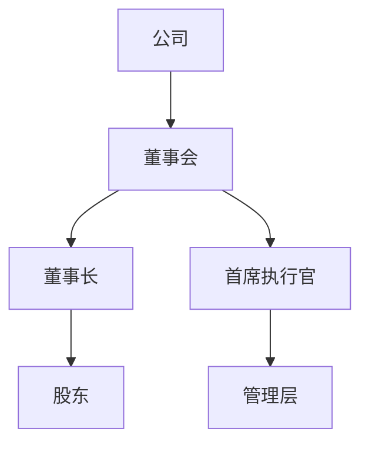
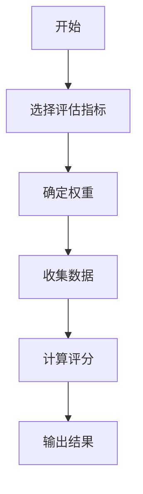
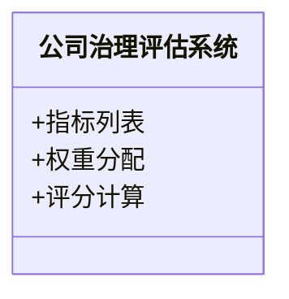
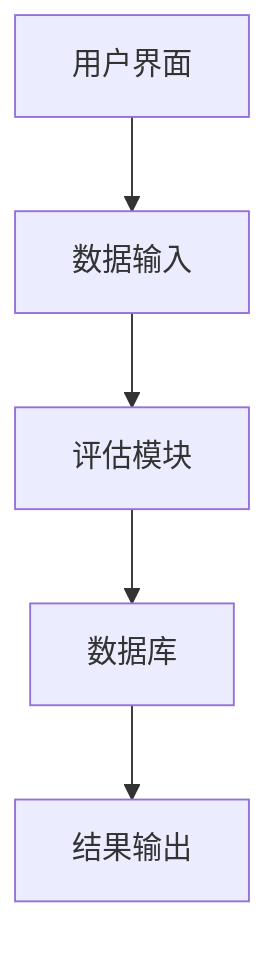

                 


# 马丁·惠特曼的公司治理评估体系

## 关键词：
公司治理，评估体系，马丁·惠特曼，治理结构，股权结构，合规机制，评估算法

## 摘要：
本文系统介绍了马丁·惠特曼的公司治理评估体系，涵盖其背景、核心框架、算法原理、系统设计、项目实战及最佳实践。通过详细分析，读者将掌握该体系的理论与应用，提升公司治理能力。

---

# 第一部分: 马丁·惠特曼的公司治理评估体系概述

## 第1章: 公司治理评估体系的背景与意义

### 1.1 公司治理的基本概念
#### 1.1.1 公司治理的定义与内涵
公司治理是通过明确的制度和机制，确保公司管理层有效运作，平衡股东、管理层和利益相关者的权益。它涉及治理结构、责任分配、决策流程等关键要素。

#### 1.1.2 公司治理的核心要素
公司治理的核心要素包括：
- **治理结构**：董事会、监事会等组织架构的设计。
- **责任分配**：明确股东、董事会、管理层的职责。
- **决策机制**：高效的决策流程和监督机制。
- **透明度与披露**：确保信息的透明和及时披露。
- **合规性**：遵循相关法律法规和行业标准。

#### 1.1.3 公司治理的演变历程
公司治理的演变经历了从简单的股东至上到利益相关者共同治理的转变。随着全球化和复杂化的加剧，治理模式逐渐向更加全面和动态的方向发展。

---

### 1.2 公司治理评估的重要性
#### 1.2.1 评估公司治理的必要性
评估公司治理有助于识别潜在风险，优化治理结构，提升企业绩效。

#### 1.2.2 评估结果对企业价值的影响
良好的公司治理能提升企业信用评级，增强投资者信心，降低融资成本。

#### 1.2.3 全球化背景下的公司治理挑战
全球化背景下，公司治理面临跨国经营、文化差异和法律法规差异等挑战，需要更加灵活和多元化的治理策略。

---

## 第2章: 马丁·惠特曼公司治理评估体系的演进

### 2.1 马丁·惠特曼的学术背景与贡献
#### 2.1.1 马丁·惠特曼的学术成就
马丁·惠特曼是公司治理领域的权威专家，其研究成果广泛应用于学术界和企业界。

#### 2.1.2 惠特曼对公司治理领域的贡献
惠特曼提出的评估体系为全球企业提供了科学的治理标准，推动了公司治理理论的发展。

---

### 2.2 惠特曼评估体系的发展历程
#### 2.2.1 体系的早期版本
早期版本注重董事会结构和高管责任，为后续发展奠定了基础。

#### 2.2.2 不同时期的更新与改进
随着企业环境的变化，惠特曼体系不断优化，增加了利益相关者分析和风险评估模块。

#### 2.2.3 体系的国际化与应用
惠特曼体系在全球范围内得到广泛应用，适用于不同文化和法律环境。

---

## 第3章: 惠特曼公司治理评估体系的核心框架

### 3.1 体系的主要组成部分
#### 3.1.1 治理结构与责任分配
明确董事会、监事会、高管层的职责，确保权力制衡。

#### 3.1.2 股权结构与控制权
分析股权分布，防止控股股东滥用权力。

#### 3.1.3 监管与合规机制
建立内部审计、合规培训和风险预警系统，确保合规性。

---

### 3.2 核心概念与联系
#### 3.2.1 概念属性特征对比表

| 概念     | 属性         | 特征         |
|----------|--------------|--------------|
| 董事会    | 结构化        | 分层管理      |
| 股权结构  | 分散化        | 制衡机制      |
| 监管机制  | 系统性        | 风险控制      |

#### 3.2.2 ER实体关系图


---

# 第二部分: 评估体系的算法与数学模型

## 第4章: 评估体系的算法与数学模型

### 4.1 评估算法概述
#### 4.1.1 评估指标的权重分配
根据指标的重要性和影响力，确定权重。

#### 4.1.2 综合评分计算方法
通过加权平均计算综合评分。

---

### 4.2 数学模型与公式
#### 4.2.1 权重计算公式
$$ 权重_i = \frac{指标_i 的重要性}{\sum 指标_j 的重要性} $$

#### 4.2.2 综合评分公式
$$ 总分 = \sum (权重_i \times 评分_i) $$

---

### 4.3 算法流程图


---

## 第5章: 系统分析与架构设计

### 5.1 系统功能设计
#### 5.1.1 领域模型类图


---

### 5.2 系统架构设计


---

## 第6章: 项目实战

### 6.1 环境安装
安装Python和必要的库，如numpy和pandas。

---

### 6.2 核心代码实现
```python
import numpy as np

# 示例数据
指标 = ['董事会结构', '股权分布', '合规机制']
评分 = [8, 7, 9]

# 计算权重
权重 = np.array([0.4, 0.3, 0.3])

# 计算总分
总分 = np.dot(权重, 评分)
print(总分)
```

---

### 6.3 案例分析与解读
以某公司为例，分析其治理结构，应用代码计算总分，提出改进建议。

---

## 第7章: 最佳实践

### 7.1 小结
惠特曼体系提供了科学的评估方法，帮助企业优化治理结构。

### 7.2 注意事项
- 数据准确性
- 指标选择的合理性
- 结果的可操作性

### 7.3 拓展阅读
建议阅读相关学术论文和行业报告，深入理解公司治理理论。

---

# 作者：AI天才研究院 & 禅与计算机程序设计艺术

