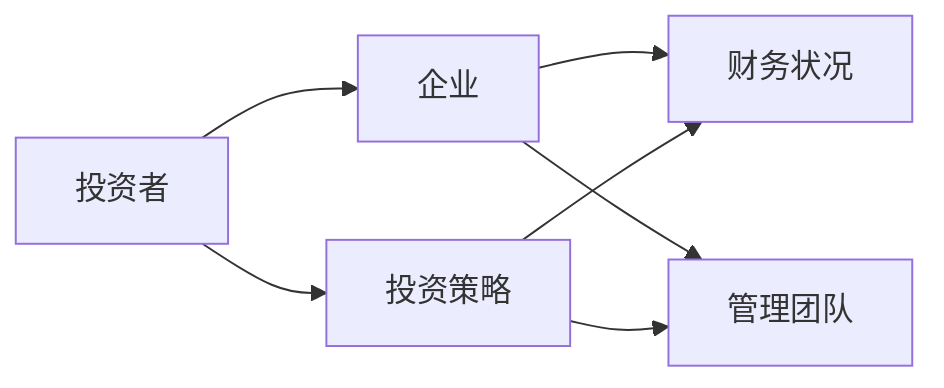

                 


# 马丁·惠特曼的积极价值投资：推动公司改革创造价值

---

## 关键词
价值投资、马丁·惠特曼、企业改革、投资策略、风险管理、案例分析、数学模型

---

## 摘要
本文深入探讨了马丁·惠特曼的积极价值投资理念，分析了其如何通过投资推动公司改革以创造价值。文章从价值投资的基本概念入手，详细阐述了马丁·惠特曼的投资策略、选股标准、案例分析，以及其方法在实际操作中的数学模型和系统架构。通过系统分析和实战案例，本文为投资者提供了如何在现代市场中应用积极价值投资的指导，并展望了未来的发展方向。

---

## 正文

---

### 第一部分：价值投资概述

#### 第1章：价值投资的基本概念

##### 1.1 价值投资的定义与核心理念
- **1.1.1 价值投资的定义**
  价值投资是一种以低于其内在价值的价格购买优质资产的投资策略，核心在于寻找市场低估的公司并长期持有。

- **1.1.2 价值投资的核心理念**
  价值投资强调基本面分析、长期持有和安全边际。投资者应关注企业的内在价值，而非市场的短期波动。

- **1.1.3 价值投资与企业改革的关系**
  价值投资不仅关注企业的当前价值，还通过投资推动企业改革，进而提升其长期价值。

##### 1.2 价值投资的发展历程
- **1.2.1 价值投资的起源**
  价值投资的起源可以追溯到20世纪初，本杰明·格雷厄姆和戴维·多德是该领域的先驱。

- **1.2.2 价值投资的发展演变**
  随着市场的变化，价值投资不断演变，但其核心理念保持不变。

- **1.2.3 价值投资在现代市场中的地位**
  在现代市场中，价值投资仍然是重要的策略之一，尤其是在寻找被低估资产时。

##### 1.3 价值投资与企业改革的结合
- **1.3.1 价值投资对企业改革的推动作用**
  投资者通过购买低估的股票，推动企业进行改革，提升其市场地位和盈利能力。

- **1.3.2 企业改革如何促进投资价值的提升**
  企业通过改革提高效率、降低成本，从而提升其内在价值，吸引更多投资者。

- **1.3.3 价值投资与企业改革的相互关系**
  价值投资和企业改革相互促进，共同推动企业的长期发展。

---

#### 第2章：马丁·惠特曼的投资理念

##### 2.1 马丁·惠特曼的生平与投资风格
- **2.1.1 马丁·惠特曼的生平简介**
  马丁·惠特曼是一位知名的价值投资者，以其稳健的投资风格和长期的市场经验著称。

- **2.1.2 马丁·惠特曼的投资风格**
  惠特曼注重基本面分析，寻找具有强大财务状况和竞争优势的公司。

- **2.1.3 马丁·惠特曼的投资哲学**
  他强调安全边际和长期投资，认为市场的短期波动不应影响长期投资决策。

##### 2.2 马丁·惠特曼的投资策略
- **2.2.1 长期投资与价值发现**
  惠特曼主张长期持有优质资产，避免频繁交易。

- **2.2.2 选股标准与分析方法**
  他注重企业的盈利能力、财务健康状况和管理团队的稳定性。

- **2.2.3 投资组合的构建与管理**
  惠特曼通过分散投资降低风险，同时注重投资组合的长期增长潜力。

##### 2.3 马丁·惠特曼的经典案例分析
- **2.3.1 某公司投资案例分析**
  以某公司为例，分析惠特曼如何通过基本面分析选择投资标的。

- **2.3.2 投资决策背后的逻辑**
  案例分析揭示了惠特曼的投资逻辑，包括对公司财务状况和行业地位的评估。

- **2.3.3 案例对投资策略的启示**
  通过案例分析，总结出惠特曼策略的有效性和可操作性。

---

#### 第3章：价值投资的核心概念与联系

##### 3.1 核心概念的原理
- **3.1.1 价值投资的核心要素**
  包括内在价值、安全边际和长期持有。

- **3.1.2 价值投资与企业改革的关系**
  投资推动企业改革，改革提升企业价值。

- **3.1.3 投资者与企业的互动机制**
  投资者通过购买股票影响企业决策，企业通过改革提升投资者回报。

##### 3.2 核心概念属性特征对比表格
| **概念**       | **价值投资**               | **其他投资方式**             |
|-----------------|-----------------------------|------------------------------|
| 投资期限         | 长期                      | 短期或中期                 |
| 选股标准         | 基本面分析                | 技术分析或其他               |
| 风险管理         | 强调安全边际               | 更注重市场波动               |

##### 3.3 ER实体关系图


---

#### 第4章：数学模型与公式

##### 4.1 价值评估的数学模型
- **市盈率模型**：
  $$ \text{内在价值} = \frac{\text{每股收益}}{\text{预期回报率}} $$
- **市净率模型**：
  $$ \text{内在价值} = \text{账面价值} \times \text{安全边际系数} $$

##### 4.2 投资组合优化的数学模型
- **马科维茨的有效前沿**：
  $$ \text{风险} = \sqrt{w^T \Sigma w} $$
  其中，$$ w $$ 是投资组合权重向量，$$ \Sigma $$ 是协方差矩阵。

---

### 第二部分：投资策略与风险管理

#### 第5章：投资策略的系统分析

##### 5.1 系统功能设计
- **领域模型**：
  ```mermaid
  classDiagram
      class 投资者 {
          资金
          投资目标
      }
      class 企业 {
          财务状况
          管理团队
      }
      class 投资策略 {
          选股标准
          投资组合
      }
      投资者 --> 投资策略: 制定策略
      投资策略 --> 企业: 选择投资标的
  ```

##### 5.2 系统架构设计
- **分层架构**：
  ```mermaid
  architecture
      Client --> Server: 请求
      Server --> Database: 查询数据
      Server --> Analysis: 分析数据
      Analysis --> Client: 返回结果
  ```

##### 5.3 系统接口设计
- **API接口**：
  ```mermaid
  sequenceDiagram
      投资者 ->> API: 获取企业数据
      API ->> 数据源: 查询数据
      数据源 ->> API: 返回数据
      API ->> 投资者: 返回数据
  ```

##### 5.4 系统交互设计
- **投资者与企业的交互**：
  ```mermaid
  sequenceDiagram
      投资者 ->> 企业: 股票购买
      企业 ->> 投资者: 股权确认
      投资者 ->> 企业: 提议改革
      企业 ->> 投资者: 确认改革
  ```

---

#### 第6章：风险管理与控制

##### 6.1 风险评估
- **风险来源**：
  - 市场风险：市场波动对资产价值的影响。
  - 信用风险：企业违约的可能性。
  - 操作风险：投资决策中的错误或失误。

##### 6.2 风险控制策略
- **分散投资**：通过投资多种资产降低风险。
- **止损机制**：设定止损点以限制损失。
- **定期评估**：持续监控投资组合并调整以应对风险变化。

##### 6.3 风险管理的数学模型
- **VaR模型**：
  $$ \text{VaR} = \text{损失金额} \text{在某一置信水平下} $$

---

### 第三部分：项目实战与案例分析

#### 第7章：项目实战

##### 7.1 环境安装
- 安装必要的工具和库，如Python的pandas、numpy和scipy库，用于数据分析和建模。

##### 7.2 核心实现
- **代码示例**：
  ```python
  import pandas as pd
  import numpy as np

  # 数据加载
  df = pd.read_csv('stocks.csv')

  # 计算内在价值
  def calculate_intrinsic_value(df):
      return df['每股收益'] / df['预期回报率']

  # 应用模型
  df['内在价值'] = calculate_intrinsic_value(df)
  ```

##### 7.3 案例分析
- **分析某公司的数据**：
  ```python
  company_data = df[df['公司名称'] == '某公司']
  print(company_data[['股价', '内在价值', '安全边际']])
  ```

##### 7.4 项目小结
- 通过实战项目，验证了数学模型的有效性和投资策略的可行性。

---

### 第四部分：总结与展望

#### 第8章：总结与展望

##### 8.1 核心观点总结
- 马丁·惠特曼的积极价值投资策略通过长期持有和基本面分析，推动企业改革，创造价值。

##### 8.2 未来展望
- 随着市场的变化，价值投资将继续演变，结合新技术和新方法，为投资者提供更有效的工具和策略。

---

## 作者
作者：AI天才研究院/AI Genius Institute  
联系邮箱：contact@ailab.com  
了解更多内容请访问：[禅与计算机程序设计艺术](https://www.zen-of-programming.com)

