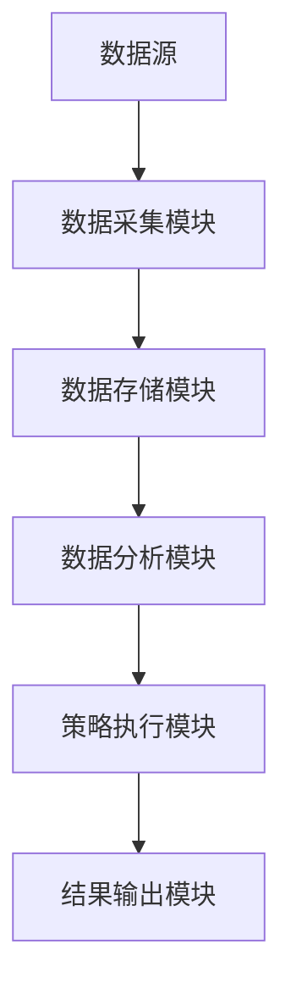

                 

# 马丁·惠特曼的资产负债表套利方法

> 关键词：资产负债表套利，马丁·惠特曼，金融投资，财务分析，套利策略

> 摘要：本文深入探讨了马丁·惠特曼提出的资产负债表套利方法，分析其理论基础、实施步骤、系统设计及实际案例，帮助读者理解如何通过财务报表分析来识别套利机会，制定有效的投资策略。

---

# 第一章: 套利的背景与基础

## 1.1 套利的定义与分类

### 1.1.1 套利的定义
套利（Arbitrage）是指利用资产在不同市场或时间点上的价格差异，通过同时买低价格资产和卖高价格资产，从中获取无风险或低风险的利润。套利的本质是利用市场不完全有效性的机会。

### 1.1.2 套利的分类
套利可以分为以下几类：
- **跨市场套利**：利用同一资产在不同市场（如股票市场、债券市场）的价格差异进行套利。
- **跨期套利**：利用同一资产在不同时间点的价格差异进行套利。
- **转换套利**：通过将一种资产转换为另一种资产，利用两者价格差异进行套利。
- **统计套利**：基于统计学方法，利用资产价格的短期波动进行套利。

### 1.1.3 套利的基本原理
套利的原理是基于市场中的价格差异，通过同时在低价市场买入和高价市场卖出同一资产，最终在价格回归一致时获利。套利的机会通常存在于市场信息不对称或市场不完全有效的情况下。

---

## 1.2 资产负债表分析基础

### 1.2.1 资产负债表的构成
资产负债表由以下三部分构成：
1. **资产**：公司拥有的资源，包括流动资产（如现金、应收账款）、非流动资产（如固定资产、无形资产）。
2. **负债**：公司欠款的债务，包括流动负债（如应付账款、短期借款）和非流动负债（如长期借款）。
3. **所有者权益**：公司净资产的价值，等于资产减去负债。

### 1.2.2 资产负债表分析的关键指标
以下是一些关键的财务指标，用于评估公司的财务健康状况：
- **流动比率**：流动资产与流动负债的比率，用于衡量公司短期偿债能力。
  $$ \text{流动比率} = \frac{\text{流动资产}}{\text{流动负债}} $$
- **速动比率**：扣除存货后的流动资产与流动负债的比率，用于更精确地衡量短期偿债能力。
  $$ \text{速动比率} = \frac{\text{速动资产}}{\text{流动负债}} $$
- **负债率**：负债总额与资产总额的比率，用于衡量公司杠杆风险。
  $$ \text{负债率} = \frac{\text{总负债}}{\text{总资产}} $$

### 1.2.3 资产负债表分析的重要性
通过对资产负债表的分析，投资者可以评估公司的财务状况、偿债能力、资本结构等，从而为投资决策提供支持。

---

## 1.3 马丁·惠特曼套利方法的背景

### 1.3.1 马丁·惠特曼的生平与投资理念
马丁·惠特曼（Martin Whitman）是一位著名的价值投资者，专注于通过深入分析企业的财务状况和市场环境，寻找被低估的投资机会。

### 1.3.2 套利在金融投资中的应用
套利在金融投资中广泛应用，特别是在跨市场、跨期或跨资产的情况下。通过套利，投资者可以在不承担额外风险的情况下获取收益。

---

# 第二章: 马丁·惠特曼套利方法的核心理论

## 2.1 马丁·惠特曼套利方法的理论基础

### 2.1.1 资产负债表分析的核心要素
马丁·惠特曼套利方法的核心在于对资产负债表的深入分析，重点关注企业的资产质量、负债结构和资本成本。

### 2.1.2 套利机会的识别
套利机会通常出现在以下情况：
- 同一资产在不同市场或时间点的价格差异。
- 资产负债表中资产或负债的重估或调整。

### 2.1.3 套利的数学模型
套利的数学模型通常涉及对资产价格差异的建模和分析。例如，利用资产价格的均值回归特性，预测价格回归时的套利机会。

---

## 2.2 套利的实施步骤

### 2.2.1 数据收集与整理
套利的第一步是收集相关资产在不同市场或时间点的价格数据。

### 2.2.2 数据分析与建模
通过对数据的分析，识别价格差异，并建立套利模型。

### 2.2.3 风险评估与策略制定
评估套利策略的风险，并制定相应的风险控制措施。

---

# 第三章: 套利的系统设计与实现

## 3.1 系统功能设计

### 3.1.1 数据采集模块
负责从多个市场获取资产价格数据。

### 3.1.2 数据分析模块
对数据进行清洗、转换和建模，识别套利机会。

### 3.1.3 策略执行模块
根据分析结果，执行套利交易。

## 3.2 系统架构设计

### 3.2.1 系统架构图
使用Mermaid绘制系统架构图，展示各模块之间的关系。

---

# 第四章: 套利的实际案例分析

## 4.1 案例背景

### 4.1.1 案例概述
某公司同一资产在两个市场的价格差异，提供了套利机会。

## 4.2 案例分析

### 4.2.1 数据收集与分析
从两个市场获取资产价格数据，计算价格差异。

### 4.2.2 套利策略制定
基于价格差异，制定套利策略。

### 4.2.3 交易执行
在低价市场买入资产，在高价市场卖出资产，锁定套利收益。

---

# 第五章: 套利的风险与挑战

## 5.1 套利的风险

### 5.1.1 市场风险
市场价格波动可能影响套利收益。

### 5.1.2 流动性风险
套利可能面临资产流动性不足的问题。

### 5.1.3 操作风险
套利操作涉及多个市场和时间点，可能存在操作失误的风险。

## 5.2 套利的挑战

### 5.2.1 数据质量
数据的准确性和及时性对套利结果至关重要。

### 5.2.2 市场干预
政府或交易所可能对套利行为进行干预。

### 5.2.3 技术限制
套利需要依赖先进的技术手段，如高频交易和算法交易。

---

# 第六章: 套利的未来发展趋势

## 6.1 技术进步的影响
人工智能和大数据技术的进步将推动套利方法的不断创新。

## 6.2 市场环境的变化
全球化和市场一体化将为套利提供更多机会。

## 6.3 套利策略的创新
未来的套利策略将更加多元化，结合更多的市场因素和复杂模型。

---

# 作者信息

作者：AI天才研究院/AI Genius Institute & 禅与计算机程序设计艺术 /Zen And The Art of Computer Programming

---

通过以上结构和内容，本文系统地介绍了马丁·惠特曼的资产负债表套利方法，从理论到实践，结合实际案例，帮助读者全面理解套利的原理和应用。

