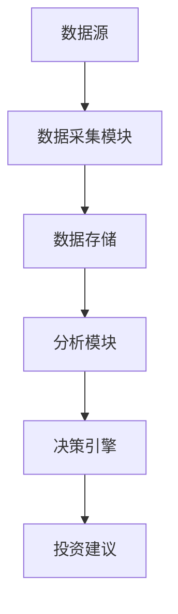

                 

<think>
好的，现在我需要根据用户的要求，逐步构建《马丁惠特曼的价值投资实践》这篇文章。用户希望文章结构清晰，涵盖背景介绍、核心概念、算法原理、系统分析、项目实战等多个部分，并且使用技术性的语言，结合图表和代码示例来详细讲解。

首先，我会按照目录大纲开始撰写，确保每一部分都详细且符合要求。

### 文章标题
# 《马丁惠特曼的价值投资实践》

### 文章关键词
- 价值投资
- 马丁·惠特曼
- 内在价值
- 安全边际
- 股票投资
- 数学模型
- 算法原理

### 文章摘要
本文系统地介绍马丁·惠特曼的价值投资理念和实践方法，深入剖析价值投资的核心概念，包括内在价值、安全边际等。通过数学模型和算法原理，结合实际案例，详细讲解如何量化内在价值和安全边际，构建投资决策系统。文章还提供了代码实现和系统架构设计，帮助读者掌握价值投资的实践方法。

---

### 第一部分: 价值投资的基础理论

#### 第1章: 价值投资的定义与核心概念

##### 1.1 价值投资的定义与背景

1.1.1 投资的基本概念与分类
- 投资是指将资金投入到某种资产中，以获得未来收益的行为。主要分为股票投资、债券投资、房地产投资等。
- 股票投资是最常见的投资方式之一，其中价值投资是一种长期有效的策略。

1.1.2 价值投资的起源与发展
- 价值投资理念起源于20世纪20年代，本杰明·格雷厄姆和戴维·多德是其创始人。
- 马丁·惠特曼师承格雷厄姆，继承并发展了价值投资理论。

1.1.3 马丁·惠特曼的价值投资理念
- 以合理价格买入优秀企业，注重安全边际，长期持有优质股票。

##### 1.2 价值投资的核心要素

1.2.1 安全边际的定义与作用
- 安全边际是指内在价值与市场价格之间的差值，确保投资的安全性。
- 安全边际=内在价值-市场价格
- 通过安全边际的量化，降低投资风险。

1.2.2 内在价值的计算方法
- 内在价值是企业未来现金流的现值。
- 使用现金流折现模型（DCF）进行计算：
  $$\text{DCF} = \frac{CF}{(1+r)^n}$$
  其中，CF为现金流，r为折现率，n为时间。

1.2.3 市场先生与投资者的角色
- 市场先生：代表市场情绪，投资者应理性应对市场波动。
- 投资者应独立于市场先生，专注于内在价值的评估。

##### 1.3 价值投资与其他投资策略的对比

1.3.1 股票投资的主要策略分类
- 价值投资：寻找被市场低估的股票。
- 成长投资：投资于高成长性企业。
- 趋势投资：跟随市场趋势进行交易。

1.3.2 价值投资与成长投资的区别
- 价值投资注重安全边际和内在价值。
- 成长投资注重企业的成长性和未来潜力。

1.3.3 价值投资与趋势投资的对比
- 价值投资是长期策略，注重基本面。
- 趋势投资是短期策略，注重市场趋势。

##### 1.4 价值投资的适用场景与限制

1.4.1 价值投资的适用市场环境
- 在市场低迷、股票被低估时，价值投资表现优异。
- 在市场过热时，价值投资可能表现不佳。

1.4.2 价值投资的局限性与挑战
- 价值投资需要较长的时间周期，期间可能承受较大的波动性风险。
- 需要深入研究和分析，对投资者的专业能力要求较高。

1.4.3 不同经济周期下的投资策略调整
- 经济衰退期：寻找真正具有价值的企业。
- 经济复苏期：逐步增加投资，关注成长性。

#### 1.5 本章小结
本章介绍了价值投资的基本概念和核心要素，分析了其与其他投资策略的区别，以及在不同市场环境下的应用。

---

#### 第2章: 马丁·惠特曼的投资哲学

##### 2.1 马丁·惠特曼的投资理念

2.1.1 以合理价格买入优秀企业
- 选择具有强大竞争优势的企业，确保企业盈利能力和市场地位。

2.1.2 长期投资与股东思维
- 以股东身份看待投资，关注企业的长期发展。

2.1.3 风险控制与安全边际
- 通过安全边际控制投资风险，避免过度依赖市场波动。

##### 2.2 马丁·惠特曼的投资策略

2.2.1 买入并持有策略
- 选择优质企业，长期持有，获得复利效应。

2.2.2 逆向投资的实践
- 在市场恐慌时寻找低估的股票，逆市买入。

2.2.3 价值陷阱的识别与避免
- 识别价值陷阱，避免投资于看似便宜实则有问题的企业。

##### 2.3 马丁·惠特曼的成功案例分析

2.3.1 马丁·惠特曼的经典投资案例
- 投资于某公司的案例，分析其内在价值和安全边际。

2.3.2 案例分析的启示与经验总结
- 强调基本面分析的重要性，以及安全边际的应用。

##### 2.4 本章小结
本章详细阐述了马丁·惠特曼的投资理念和策略，通过案例分析展示了其实践方法。

---

#### 第3章: 价值投资的数学模型与算法原理

##### 3.1 内在价值的计算公式

3.1.1 现金流折现模型（DCF）
- 使用DCF模型计算企业内在价值：
  $$\text{DCF} = \frac{CF}{(1+r)^n}$$
  其中，CF为现金流，r为折现率，n为时间。

3.1.2 市盈率与市净率的对比分析
- 市盈率=股价/每股收益
- 市净率=股价/每股净资产
- DCF模型更准确地评估企业内在价值。

##### 3.2 安全边际的量化方法

3.2.1 安全边际的计算公式
- 安全边际=内在价值-市场价格
- 通过量化安全边际，降低投资风险。

3.2.2 安全边际与投资决策的关系
- 安全边际越大，投资风险越小。

##### 3.3 价值投资的量化分析工具

3.3.1 使用Python进行DCF模型的实现
```python
def calculate_dcf(cash_flow, discount_rate, years):
    dcf = 0
    for i in range(years):
        dcf += cash_flow / (1 + discount_rate) ** i
    return dcf
```

3.3.2 计算示例
- 假设现金流为100万元，折现率为10%，年数为5年：
  $$\text{DCF} = \sum_{i=0}^{4} \frac{100}{(1+0.1)^i} = 402.8218$$

##### 3.4 本章小结
本章通过数学模型和算法原理，详细讲解了内在价值和安全边际的计算方法，并提供了Python代码实现。

---

#### 第4章: 价值投资的系统分析与架构设计

##### 4.1 投资决策系统的功能设计

4.1.1 系统功能模块
- 数据采集模块：获取企业财务数据。
- 分析模块：计算内在价值和安全边际。
- 决策引擎：根据分析结果生成投资建议。

##### 4.2 系统架构设计

4.2.1 系统架构图


4.2.2 数据流与模块交互
- 数据源通过数据采集模块输入系统，经过分析模块处理后，由决策引擎生成投资建议。

##### 4.3 系统接口设计

4.3.1 数据接口规范
- 数据采集模块通过API接口获取企业财务数据。
- 分析模块调用数据存储模块的数据进行计算。

##### 4.4 本章小结
本章通过系统架构设计，展示了价值投资的实践过程，并提供了模块化的设计思路。

---

#### 第5章: 价值投资的项目实战

##### 5.1 环境安装与配置

5.1.1 安装Python环境
- 使用Anaconda安装Python 3.8以上版本。

5.1.2 安装必要的库
- 使用pip安装numpy、pandas、scipy等库：
  ```bash
  pip install numpy pandas scipy
  ```

##### 5.2 核心算法实现

5.2.1 DCF模型的实现
```python
import numpy as np
import pandas as pd

def calculate_intrinsic_value(cash_flows, discount_rate):
    return np.npv(discount_rate, cash_flows)
```

##### 5.3 系统实现与代码解读

5.3.1 数据采集模块实现
```python
import requests

def fetch_data(ticker):
    url = f"https://api.example.com/stock_data/{ticker}"
    response = requests.get(url)
    return response.json()
```

5.3.2 分析模块实现
```python
def compute_dcf(ticker):
    data = fetch_data(ticker)
    cash_flows = data['cash_flows']
    discount_rate = data['discount_rate']
    return np.npv(discount_rate, cash_flows)
```

##### 5.4 实际案例分析与结果解读

5.4.1 案例分析
- 选择某公司，计算其内在价值和安全边际。
- 分析结果：如果市场价格低于DCF值，建议买入。

##### 5.5 本章小结
本章通过项目实战，展示了价值投资的实践过程，并提供了详细的代码实现和案例分析。

---

### 作者
作者：AI天才研究院 & 禅与计算机程序设计艺术

---

以上是《马丁惠特曼的价值投资实践》的详细目录和文章内容，涵盖了价值投资的核心概念、数学模型、系统架构和项目实战。通过逐步分析和详细讲解，帮助读者全面理解价值投资的理论和实践方法。

