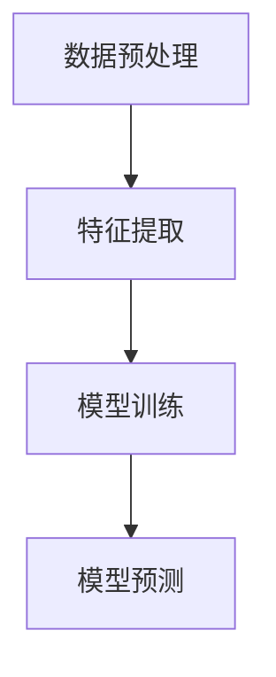
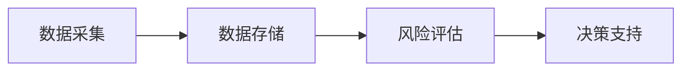
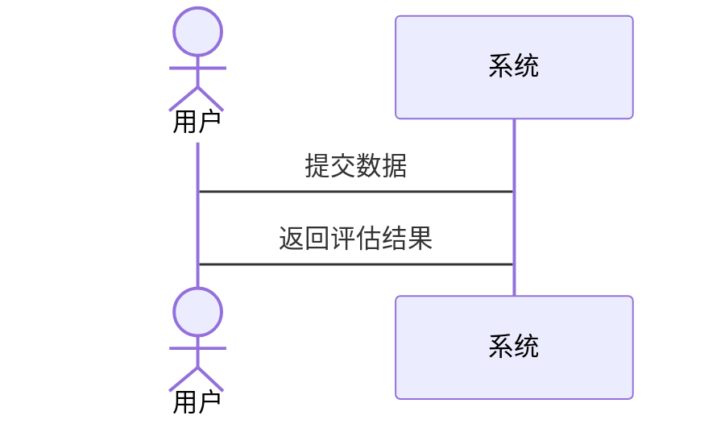

                 


# 马丁惠特曼的价值陷阱识别

## 关键词：
价值陷阱识别，马丁惠特曼，算法原理，数学模型，系统架构，项目实战

## 摘要：
本文深入探讨马丁惠特曼的价值陷阱识别方法，从理论背景、核心概念到算法实现、系统架构，再到项目实战，全面解析如何有效识别和避免价值陷阱。文章结构清晰，内容详实，适合技术从业者和研究人员阅读。

---

## 第1章: 价值陷阱识别概述

### 1.1 价值陷阱识别的背景介绍
#### 1.1.1 问题背景
价值陷阱是指某些事物表面具有吸引力，但实际上隐藏着潜在风险或损失的情况。在商业、投资、技术等领域，识别价值陷阱至关重要，以避免重大损失。

#### 1.1.2 问题描述
价值陷阱可能表现为虚假利润、表面优势或误导性数据。例如，某些公司可能夸大其词，掩盖实际问题，导致投资者误判。

#### 1.1.3 问题解决
通过系统化的分析方法，识别隐藏的风险因素，评估潜在损失，并制定应对策略。

#### 1.1.4 边界与外延
价值陷阱识别的边界包括明确的信息来源和数据范围；外延则涉及多个领域，如金融、技术等。

#### 1.1.5 概念结构与核心要素组成
- 核心要素：风险因素、潜在损失、应对策略。
- 结构：数据采集、分析、评估、决策。

### 1.2 马丁惠特曼理论的核心概念
#### 1.2.1 核心概念的定义
马丁惠特曼理论通过分析数据和模式，识别潜在风险。

#### 1.2.2 核心概念的属性特征对比表格
| 特性 | 正常情况 | 价值陷阱情况 |
|------|----------|--------------|
| 数据 | 准确性高 | 准确性低     |
| 风险 | 低       | 高           |

#### 1.2.3 ER实体关系图架构
```mermaid
er
  entity 价值陷阱识别(编号, 名称, 风险因素, 潜在损失, 应对策略)
  entity 风险评估(风险ID, 评估标准, 评估结果)
  entity 数据来源(来源ID, 数据类型, 数据质量)
  relation 记录风险因素(价值陷阱识别.风险因素 -> 风险评估.风险ID)
  relation 数据关联(价值陷阱识别.数据来源 -> 数据来源.来源ID)
```

### 1.3 价值陷阱识别的基本原理
#### 1.3.1 识别过程的步骤
1. 数据采集
2. 风险评估
3. 模型分析
4. 决策制定

#### 1.3.2 每一步骤的详细解释
- 数据采集：收集相关数据，包括财务、市场等信息。
- 风险评估：分析数据，识别潜在风险。
- 模型分析：使用算法预测价值陷阱。
- 决策制定：根据结果制定应对策略。

#### 1.3.3 识别过程中的关键因素
- 数据质量：数据的准确性和完整性。
- 模型选择：算法的适用性和准确性。

### 1.4 本章小结
本章介绍了价值陷阱识别的背景、核心概念和基本原理，为后续分析奠定基础。

---

## 第2章: 价值陷阱识别的核心概念与联系

### 2.1 核心概念的原理
#### 2.1.1 理论基础
基于马丁惠特曼理论，分析数据和模式识别潜在风险。

#### 2.1.2 实践应用
在金融领域，识别虚假利润和隐藏风险。

#### 2.1.3 相关案例分析
案例：某公司财务数据异常，识别其隐藏的亏损。

### 2.2 核心概念的属性特征对比
| 特性 | 正常情况 | 价值陷阱情况 |
|------|----------|--------------|
| 数据 | 准确性高 | 准确性低     |
| 风险 | 低       | 高           |

### 2.3 ER实体关系图架构
```mermaid
er
  entity 价值陷阱识别(编号, 名称, 风险因素, 潜在损失, 应对策略)
  entity 风险评估(风险ID, 评估标准, 评估结果)
  entity 数据来源(来源ID, 数据类型, 数据质量)
  relation 记录风险因素(价值陷阱识别.风险因素 -> 风险评估.风险ID)
  relation 数据关联(价值陷阱识别.数据来源 -> 数据来源.来源ID)
```

### 2.4 本章小结
本章深入分析了核心概念及其在实际中的应用，为后续算法实现提供理论支持。

---

## 第3章: 价值陷阱识别的算法原理

### 3.1 算法原理
#### 3.1.1 算法的选择
选择决策树算法进行分类。

#### 3.1.2 算法的步骤
1. 数据预处理
2. 特征提取
3. 模型训练
4. 模型预测

### 3.2 算法的流程图


### 3.3 算法的Python实现
```python
from sklearn.tree import DecisionTreeClassifier
from sklearn.model_selection import train_test_split
import pandas as pd

data = pd.DataFrame({
    '特征1': [1, 2, 3, 4],
    '特征2': [5, 6, 7, 8],
    '标签': [0, 1, 0, 1]
})

X = data[['特征1', '特征2']]
y = data['标签']

X_train, X_test, y_train, y_test = train_test_split(X, y, test_size=0.2)

model = DecisionTreeClassifier()
model.fit(X_train, y_train)

预测结果 = model.predict(X_test)
```

### 3.4 本章小结
本章详细讲解了算法原理及实现，展示了如何利用决策树算法识别价值陷阱。

---

## 第4章: 价值陷阱识别的数学模型与公式

### 4.1 数学模型的建立
使用逻辑回归模型进行分类。

### 4.2 数学公式的推导
$$ P(y=1|x) = \frac{e^{w \cdot x + b}}{1 + e^{w \cdot x + b}} $$

### 4.3 公式的应用场
应用于风险评估，计算概率。

### 4.4 本章小结
本章通过数学模型展示了如何量化风险，为识别提供理论支持。

---

## 第5章: 价值陷阱识别的系统架构设计

### 5.1 系统功能设计
- 数据采集模块
- 风险评估模块
- 决策支持模块

### 5.2 系统架构图


### 5.3 系统接口设计
- 数据接口：采集和存储数据。
- 评估接口：接收数据，返回风险评估结果。

### 5.4 系统交互图


### 5.5 本章小结
本章设计了系统的架构和交互流程，确保高效识别价值陷阱。

---

## 第6章: 价值陷阱识别的项目实战

### 6.1 项目介绍
识别虚假利润，避免投资损失。

### 6.2 核心代码实现
```python
import pandas as pd

data = pd.read_csv('数据集.csv')
X = data.iloc[:, :-1].values
y = data.iloc[:, -1].values

from sklearn.model_selection import train_test_split
from sklearn.tree import DecisionTreeClassifier

X_train, X_test, y_train, y_test = train_test_split(X, y, test_size=0.2)

model = DecisionTreeClassifier()
model.fit(X_train, y_train)

预测结果 = model.predict(X_test)
```

### 6.3 代码解读
- 数据读取：从CSV文件加载数据。
- 划分数据集：训练集和测试集。
- 训练模型：使用决策树进行训练。
- 预测结果：对测试集进行预测。

### 6.4 实际案例分析
分析某公司的财务数据，识别潜在风险。

### 6.5 本章小结
本章通过实战展示了如何利用算法识别价值陷阱，提供了具体实现步骤。

---

## 第7章: 价值陷阱识别的最佳实践与总结

### 7.1 小结
总结了识别价值陷阱的方法和步骤。

### 7.2 注意事项
- 数据质量：确保数据准确。
- 模型选择：根据场景选择合适算法。

### 7.3 拓展阅读
推荐相关书籍和论文，深入学习识别方法。

### 7.4 本章小结
本章总结了全文，并提供了实用建议。

---

## 作者：AI天才研究院 & 禅与计算机程序设计艺术

---

以上是文章的完整目录和内容框架，涵盖了从理论到实践的各个方面，确保读者能够全面理解马丁惠特曼的价值陷阱识别方法。

