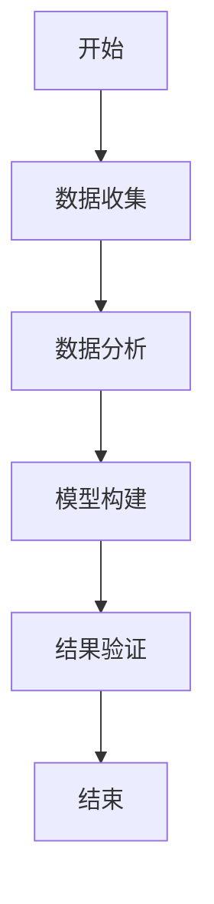
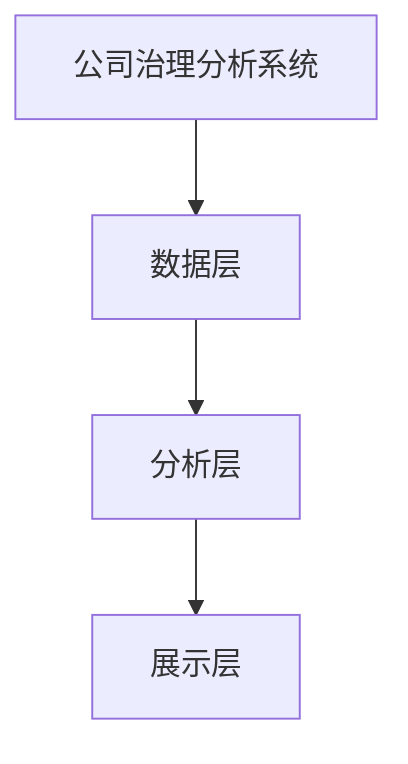

                 


# 马丁惠特曼的公司治理分析

## 关键词：公司治理，马丁·惠特曼，治理结构，治理机制，企业绩效，风险评估

## 摘要：  
马丁·惠特曼是公司治理领域的权威专家，其研究方法和技术分析框架在学术界和企业界具有深远影响。本文将从公司治理的核心概念、数学模型、算法原理、系统架构到实际项目应用，全面分析马丁·惠特曼的公司治理分析方法，帮助读者理解其理论与实践的结合。

---

# 第1章: 公司治理的基本概念与背景

## 1.1 公司治理的定义与核心要素

### 1.1.1 公司治理的定义
公司治理是通过合理分配权力和责任，确保企业有效运作和长期发展的管理过程。其核心目标是实现股东价值最大化，同时兼顾利益相关者权益。

### 1.1.2 公司治理的核心要素
- **治理结构**：包括董事会、监事会、管理层等组织架构。
- **治理机制**：如决策机制、激励机制、监督机制等。
- **治理文化**：企业内部的价值观和道德规范。

### 1.1.3 公司治理的边界与外延
公司治理不仅关注内部管理，还涉及与外部利益相关者的互动，包括股东、债权人、客户、员工和监管机构。

## 1.2 马丁·惠特曼的公司治理分析背景

### 1.2.1 全球化背景下的公司治理挑战
全球化加剧了企业面临的复杂性和不确定性，马丁·惠特曼的研究为应对这些挑战提供了理论支持。

### 1.2.2 马丁·惠特曼的学术贡献与研究方法
马丁·惠特曼通过实证研究和案例分析，提出了一套系统化的企业治理分析框架。

### 1.2.3 公司治理分析的现实意义
帮助企业识别和解决治理问题，提升企业绩效和防范风险。

---

# 第2章: 公司治理的核心概念与联系

## 2.1 公司治理的核心概念原理

### 2.1.1 股东、董事会与管理层的关系
- 股东是所有者，董事会是决策层，管理层是执行层。
- 三者关系需明确，以确保有效制衡。

### 2.1.2 股权结构与控制权分配
- 股权分散可能导致决策低效，股权集中可能引发控制权滥用。
- 通过合理的股权结构设计，平衡各方利益。

### 2.1.3 公司治理的外部环境影响
- 法律法规、市场环境、文化因素等外部因素影响公司治理效果。

## 2.2 核心概念属性特征对比表

| 概念       | 属性         | 特征                   |
|------------|--------------|------------------------|
| 股东        | 权益         | 所有权和收益权         |
| 董事会      | 职能         | 制定战略和监督执行     |
| 管理层      | 职责         | 执行战略和日常运营     |

## 2.3 公司治理的ER实体关系图

```mermaid
erDiagram
    actor 股东 {
        key string 股东ID
        string 股东姓名
        string 持股比例
    }
    actor 董事会 {
        key string 董事会ID
        string 董事会成员
        string 董事会决策
    }
    actor 管理层 {
        key string 管理层ID
        string 管理层职位
        string 管理层职责
    }
    股东 --> 董事会 : 选举董事会成员
    董事会 --> 管理层 : 赋予管理层权力
```

---

# 第3章: 公司治理分析的算法原理

## 3.1 公司治理分析的流程与方法



## 3.2 算法实现与代码示例

### 代码3.1 公司治理分析算法实现（Python）

```python
def company_governance_analysis(data):
    # 数据预处理
    cleaned_data = data.dropna()
    # 数据分析
    import pandas as pd
    import numpy as np
    # 计算企业绩效指标
    performance_index = cleaned_data['收入'] / cleaned_data['成本']
    # 风险评估
    risk_assessment = np.std(performance_index)
    return risk_assessment

# 示例数据
data = {
    '收入': [100, 200, 300],
    '成本': [50, 100, 150]
}
print(company_governance_analysis(data))
```

## 3.3 算法原理的数学模型与公式

### 3.3.1 企业绩效评估模型

$$
\text{企业绩效} = \frac{\text{收入} - \text{成本}}{\text{收入}}
$$

### 3.3.2 风险评估模型

$$
\text{风险值} = \sqrt{\sum_{i=1}^{n} (x_i - \bar{x})^2}
$$

---

# 第4章: 公司治理的系统分析与架构设计

## 4.1 问题场景介绍

### 4.1.1 公司治理分析的典型场景
- 企业内部治理问题诊断
- 治理结构优化设计

### 4.1.2 系统目标与功能需求
- 数据采集与处理
- 模型构建与分析
- 结果展示与报告生成

## 4.2 系统架构设计



---

# 第5章: 公司治理分析的项目实战

## 5.1 环境安装与配置

### 5.1.1 开发环境搭建
- 安装Python和相关库（pandas, numpy）

### 5.1.2 数据来源与准备
- 数据集：企业财务数据、治理结构数据

## 5.2 核心代码实现

### 代码5.1 公司治理分析核心代码

```python
import pandas as pd
import numpy as np

def calculate_performance(data):
    return data['收入'] / data['成本']

def calculate_risk(performances):
    return np.std(performances)

# 数据加载
data = pd.DataFrame({
    '收入': [100, 200, 300],
    '成本': [50, 100, 150]
})

performance = calculate_performance(data)
risk = calculate_risk(performance)
print(f"企业绩效: {performance}")
print(f"风险评估: {risk}")
```

---

# 第6章: 最佳实践与小结

## 6.1 最佳实践 Tips

### 6.1.1 数据收集与处理
- 确保数据的完整性和准确性

### 6.1.2 模型优化与调参技巧
- 多次实验和验证，选择最优模型

## 6.2 项目小结与展望

### 6.2.1 项目总结
通过系统分析和项目实战，掌握了马丁·惠特曼的公司治理分析方法。

### 6.2.2 未来研究方向
结合更多因素，优化公司治理分析模型。

---

# 附录: 参考文献与拓展阅读

---

作者：AI天才研究院/AI Genius Institute & 禅与计算机程序设计艺术 /Zen And The Art of Computer Programming

---

这篇文章详细讲解了马丁·惠特曼的公司治理分析方法，从理论到实践，帮助读者全面理解公司治理的核心概念和应用方法。

