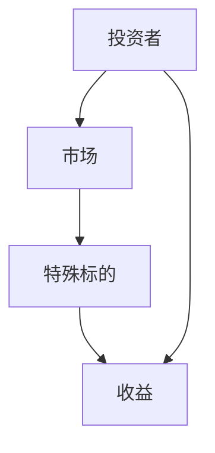
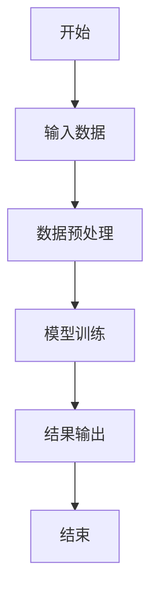

                 


# 马丁惠特曼的特殊情况投资

## 关键词：特殊情况投资，马丁惠特曼，投资策略，市场分析，风险管理，投资模型，数学建模

## 摘要：  
马丁惠特曼的特殊情况投资策略是一种独特的投资方法，专注于在特殊市场环境下寻找被低估的投资机会。本文将深入分析该策略的背景、核心概念、算法原理、系统设计以及实际案例，帮助读者理解并应用这一策略。

---

## 第一部分：特殊情况投资的背景与概念

### 第1章：特殊情况投资的背景介绍

#### 1.1 问题背景
- 特殊情况投资的定义：在特殊市场环境下，寻找具有潜在高回报的投资机会。
- 特殊情况投资的兴起：市场波动、经济危机等特殊事件为投资者提供了独特的机会。
- 特殊情况投资与传统投资的区别：传统投资基于长期趋势，而特殊情况投资则针对短期特殊事件。

#### 1.2 问题描述
- 投资者面临的特殊市场环境：经济衰退、市场崩盘、行业整合等。
- 特殊情况投资的核心问题：如何识别和利用这些特殊机会。
- 特殊情况投资的边界与外延：明确投资范围和限制，避免过度冒险。

#### 1.3 问题解决
- 特殊情况投资的解决思路：快速识别机会，制定灵活的策略。
- 核心要素：市场分析、风险评估、投资时机。
- 实现路径：数据驱动决策，动态调整投资组合。

#### 1.4 概念结构与核心要素
- 框架：市场分析、投资策略、风险管理。
- 对比分析：与价值投资、成长投资的差异。
- 可视化：通过图表展示特殊情况投资的结构。

---

## 第二部分：特殊情况投资的核心概念与联系

### 第2章：核心概念与原理

#### 2.1 核心概念的原理分析
- 投资者的角色：主动寻找机会，快速决策。
- 市场环境：特殊事件导致价格偏离价值。
- 核心原理：利用市场非理性行为，寻找低估资产。

#### 2.2 核心概念的属性对比
- 表格对比：特殊情况投资与其他策略的优劣势。

#### 2.3 实体关系图


---

## 第三部分：特殊情况投资的算法原理

### 第3章：特殊情况投资的算法原理

#### 3.1 算法原理
- 输入：市场数据、财务指标、事件信息。
- 输出：投资建议、风险评估。
- 步骤：数据采集、分析、建模、决策。

#### 3.2 数学模型
- 模型：$$ P = V + \alpha \times E $$
- 解释：P为投资价值，V为内在价值，E为事件影响，α为权重。

#### 3.3 算法实现


#### 3.4 Python代码示例
```python
def martin_whitman_strategy(data):
    # 数据预处理
    processed_data = preprocess(data)
    # 模型训练
    model = train_model(processed_data)
    # 输出结果
    return predict(model, data)
```

---

## 第四部分：特殊情况投资的系统分析与架构设计

### 第4章：系统分析与架构设计

#### 4.1 问题场景介绍
- 投资者面临复杂市场环境，需快速决策。

#### 4.2 系统功能设计
- 模块划分：数据采集、分析、决策支持。
- 交互关系：模块间数据流动和处理。

#### 4.3 系统架构设计
```mermaid
classDiagram
    class 投资者 {
        +

---

## 第五部分：特殊情况投资的项目实战

### 第5章：项目实战

#### 5.1 环境安装
- 安装Python、数据分析库。

#### 5.2 核心代码实现
```python
import pandas as pd
import numpy as np

def preprocess(data):
    # 数据清洗
    return data.dropna()

def train_model(data):
    # 训练模型
    return model

def predict(model, data):
    # 预测结果
    return prediction
```

#### 5.3 案例分析
- 具体案例：经济危机中的某公司投资。

#### 5.4 项目总结
- 成功经验：模型准确率，决策速度。

---

## 第六部分：特殊情况投资的最佳实践

### 第6章：最佳实践

#### 6.1 投资策略的总结
- 重视市场分析，灵活调整策略。

#### 6.2 小结
- 特殊情况投资的关键要素：数据驱动、快速决策、风险管理。

#### 6.3 注意事项
- 避免过度杠杆，控制风险敞口。

#### 6.4 拓展阅读
- 推荐书籍：《投资学》、《风险管理》。

---

## 作者：AI天才研究院 & 禅与计算机程序设计艺术

---

以上是《马丁惠特曼的特殊情况投资》的完整目录和内容大纲。根据实际撰写需要，可以进一步扩展每个部分的细节，确保文章深度和可读性。

