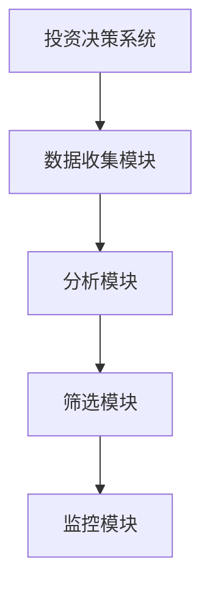
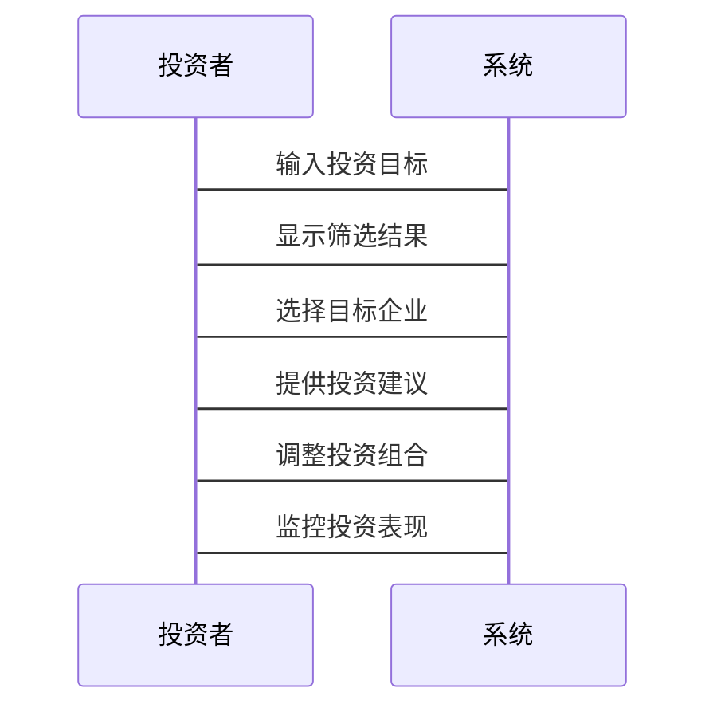

                 


# 专注型价值投资：集中持股策略

> **关键词**：专注型投资，价值投资，集中持股，马里奥·加贝利，投资策略  
> **摘要**：本文深入探讨了马里奥·加贝利的专注型价值投资策略，分析了其核心理念、方法和实际应用。通过数学模型、系统架构和实战案例，帮助读者理解如何通过集中持股实现长期稳定的收益。

---

## 第一部分：专注型价值投资的背景与基础

### 第1章：价值投资的起源与发展

#### 1.1 价值投资的基本概念

- **1.1.1 投资的基本定义**  
  投资是指将资金投入到能够产生收益的资产中，以实现财富增值。投资的类型多种多样，包括股票、债券、房地产等。其中，股票投资因其较高的收益潜力和灵活性，成为众多投资者的首选。

- **1.1.2 价值投资的定义与核心理念**  
  价值投资是由本杰明·格雷厄姆提出的投资策略，强调以低于内在价值的价格买入优质股票，并长期持有。其核心理念是寻找市场低估的公司，通过安全边际实现稳定收益。  
  $$ \text{安全边际} = \text{内在价值} - \text{市场价格} $$  

- **1.1.3 马里奥·加贝利的专注型投资策略**  
  马里奥·加贝利是价值投资领域的知名投资者，他将格雷厄姆的理论发扬光大，提出了专注型投资策略。该策略强调集中持股，即只投资于少数优质企业，长期持有，以获得超额收益。

#### 1.2 价值投资的历史发展

- **1.2.1 价值投资的起源**  
  价值投资的起源可以追溯到20世纪初，格雷厄姆和多德在《证券分析》一书中首次系统阐述了这一理念。他们提出了寻找“烟蒂股”（即被市场忽视的低估值股票）的方法。

- **1.2.2 马里奥·加贝利的贡献**  
  加贝利在继承格雷厄姆理论的基础上，进一步发展了专注型投资策略。他强调选择具有强大竞争优势和良好治理结构的企业，并长期持有，避免频繁交易。

- **1.2.3 专注型投资的现状与趋势**  
  随着市场的变化，专注型投资在近年来重新受到关注。尤其是在市场波动加剧的情况下，集中持股策略的优势更加明显。越来越多的投资者开始关注企业的内在价值，而非短期市场波动。

---

## 第二部分：专注型价值投资的核心概念

### 第2章：专注型投资的原理与优势

#### 2.1 专注型投资的定义

- **2.1.1 专注型投资的定义**  
  专注型投资是指将投资组合集中在少数优质企业上，通常不超过10只股票。这种策略的核心在于深度研究和长期持有，以获得企业的长期增长收益。

- **2.1.2 专注型投资的核心要素**  
  专注型投资的核心要素包括：  
  1. **集中持股**：将资金集中在少数优质企业上，提高投资收益的潜力。  
  2. **长期持有**：避免频繁交易，降低交易成本，同时获得企业的长期增长收益。  
  3. **深度研究**：对目标企业进行深入的财务分析和行业研究，确保投资决策的准确性。

#### 2.2 专注型投资的原理

- **2.2.1 集中持股的逻辑**  
  集中持股的核心逻辑在于通过深度研究，选择那些具有强大竞争优势和持续盈利能力的企业。集中投资可以减少组合的风险，同时放大优质企业的收益。

- **2.2.2 长期持有的优势**  
  长期持有可以避免短期市场波动的影响，同时获得企业的长期增长收益。此外，长期持有还可以减少交易成本，提高投资组合的整体收益。

- **2.2.3 低风险投资的策略**  
  专注型投资通过选择优质企业，降低投资组合的整体风险。同时，集中持股策略还可以通过持有少数优质企业，避免分散投资中可能出现的低效配置问题。

#### 2.3 专注型投资与分散投资的对比

- **2.3.1 分散投资的优缺点**  
  分散投资的优点在于通过投资多种资产或股票，降低投资组合的整体风险。其缺点在于可能分散投资收益，难以获得单个优质企业的超额收益。

- **2.3.2 专注型投资的优缺点**  
  专注型投资的优点在于集中资金于优质企业，提高收益潜力；缺点在于风险较高，需要对目标企业进行深入研究。

- **2.3.3 选择合适的投资策略**  
  投资者应根据自身的风险承受能力、投资目标和市场环境选择合适的投资策略。专注型投资适合长期投资者，而分散投资则适合风险厌恶型投资者。

---

## 第三部分：专注型价值投资的策略分析

### 第3章：如何选择优质企业

#### 3.1 企业的基本面分析

- **3.1.1 企业财务状况的分析**  
  企业财务状况的分析包括对企业盈利能力、财务健康状况和成长能力的评估。常用指标包括净利润率、资产负债率和ROE（净资产收益率）。

- **3.1.2 企业的盈利能力**  
  盈利能力是衡量企业财务健康状况的重要指标。常用的指标包括净利润、毛利率和净利率。

- **3.1.3 企业的成长性**  
  企业的成长性是指企业未来增长的潜力。常用的指标包括收入增长率和净利润增长率。

#### 3.2 估值指标的计算

- **3.2.1 市盈率（P/E）的计算与应用**  
  市盈率是股票价格与每股收益的比率。$$ \text{市盈率} = \frac{\text{股票价格}}{\text{每股收益}} $$  
  低市盈率通常意味着股票价格被低估，但高市盈率并不一定意味着股票被高估。

- **3.2.2 市净率（P/B）的计算与应用**  
  市净率是股票价格与每股净资产的比率。$$ \text{市净率} = \frac{\text{股票价格}}{\text{每股净资产}} $$  
  低市净率通常意味着股票价格被低估。

- **3.2.3 股息率的计算与应用**  
  股息率是每股股息与股票价格的比率。$$ \text{股息率} = \frac{\text{每股股息}}{\text{股票价格}} $$  
  高股息率通常意味着股票具有较高的收益潜力。

#### 3.3 行业分析与企业选择

- **3.3.1 行业分析的基本方法**  
  行业分析包括对行业发展趋势、竞争格局和市场容量的分析。投资者应选择那些具有广阔市场前景和良好竞争格局的行业。

- **3.3.2 选择优质行业的标准**  
  优质行业通常具有较高的市场进入壁垒、稳定的市场需求和良好的行业盈利能力。

- **3.3.3 企业竞争优势的评估**  
  企业竞争优势包括成本优势、品牌优势、技术优势和市场优势等。投资者应选择那些具有持续竞争优势的企业。

---

## 第四部分：数学模型与公式

### 第4章：价值投资的数学模型

#### 4.1 市盈率模型

- **4.1.1 市盈率的定义与公式**  
  市盈率是股票价格与每股收益的比率。$$ \text{市盈率} = \frac{\text{股票价格}}{\text{每股收益}} $$  
  低市盈率通常意味着股票价格被低估。

- **4.1.2 市盈率的应用实例**  
  假设某公司的股票价格为50元，每股收益为5元，则市盈率为10倍。如果行业平均市盈率为15倍，则该公司的股票价格可能被低估。

- **4.1.3 市盈率的局限性**  
  市盈率的局限性在于它没有考虑企业的财务状况和行业特点。例如，金融行业通常具有较高的市盈率，而制造业可能具有较低的市盈率。

#### 4.2 市净率模型

- **4.2.1 市净率的定义与公式**  
  市净率是股票价格与每股净资产的比率。$$ \text{市净率} = \frac{\text{股票价格}}{\text{每股净资产}} $$  
  低市净率通常意味着股票价格被低估。

- **4.2.2 市净率的应用实例**  
  假设某公司的股票价格为30元，每股净资产为15元，则市净率为2倍。如果行业平均市净率为3倍，则该公司的股票价格可能被低估。

- **4.2.3 市净率的局限性**  
  市净率的局限性在于它没有考虑企业的盈利能力和发展潜力。例如，成长型企业可能具有较高的市净率，但其未来盈利能力可能较高。

#### 4.3 股息率模型

- **4.3.1 股息率的定义与公式**  
  股息率是每股股息与股票价格的比率。$$ \text{股息率} = \frac{\text{每股股息}}{\text{股票价格}} $$  
  高股息率通常意味着股票具有较高的收益潜力。

- **4.3.2 股息率的应用实例**  
  假设某公司的股息率为5%，股票价格为20元，则每股股息为1元。如果行业平均股息率为3%，则该公司的股票具有较高的收益潜力。

- **4.3.3 股息率的局限性**  
  股息率的局限性在于它没有考虑企业的财务状况和行业特点。例如，高科技行业可能股息率较低，但其未来增长潜力较大。

---

## 第五部分：系统分析与架构设计

### 第5章：投资决策系统的架构设计

#### 5.1 问题场景介绍

- 投资者需要通过系统化的方法选择优质企业，制定投资策略，并监控投资组合的表现。

#### 5.2 系统功能设计

- **数据收集模块**：收集企业的财务数据、市场数据和行业数据。
- **分析模块**：计算估值指标，评估企业的内在价值。
- **筛选模块**：根据筛选条件选择优质企业。
- **监控模块**：实时监控投资组合的表现，及时调整投资策略。

#### 5.3 系统架构设计



#### 5.4 系统接口设计

- 数据接口：与财务数据提供商和市场数据提供商对接。
- 用户接口：提供用户友好的界面，方便投资者进行操作。

#### 5.5 系统交互设计



---

## 第六部分：项目实战

### 第6章：专注型投资的实战案例

#### 6.1 环境安装

- **Python环境**：安装Python 3.8及以上版本。
- **数据收集工具**：使用Yahoo Finance API或Financial Modeling Prep API。
- **数据分析工具**：安装Pandas、NumPy和Matplotlib。

#### 6.2 系统核心实现源代码

```python
import pandas as pd
import numpy as np

def calculate_value_indicators(df):
    # 计算市盈率
    df['PE'] = df['Price'] / df['Earnings Per Share']
    # 计算市净率
    df['PB'] = df['Price'] / df['Book Value Per Share']
    # 计算股息率
    df['Dividend Yield'] = df['Dividends Per Share'] / df['Price']
    return df

# 示例数据
data = {
    'Company': ['Apple', 'Microsoft', 'Amazon'],
    'Price': [150, 300, 100],
    'Earnings Per Share': [4.5, 12.5, 3.5],
    'Book Value Per Share': [10, 20, 5],
    'Dividends Per Share': [0.85, 1.5, 0.2]
}

df = pd.DataFrame(data)
result = calculate_value_indicators(df)
print(result)
```

#### 6.3 代码应用解读与分析

- 代码功能：计算企业的市盈率、市净率和股息率。
- 数据分析：根据计算结果，选择市盈率低于行业平均水平且股息率较高的企业。

#### 6.4 实际案例分析

- **案例选择**：以苹果公司为例，分析其财务状况和投资价值。
- **财务分析**：苹果公司具有较高的净利润率和ROE，且市盈率低于行业平均水平。
- **投资建议**：建议投资者长期持有苹果公司股票，享受其成长收益。

#### 6.5 项目小结

- 通过系统化的方法选择优质企业，制定投资策略，并监控投资组合的表现，可以提高投资成功的概率。

---

## 第七部分：最佳实践与小结

### 第7章：专注型投资的注意事项

#### 7.1 投资心态与纪律

- **保持耐心**：专注型投资需要长期持有，避免短期波动的干扰。
- **严格纪律**：遵守投资计划，避免情绪化决策。

#### 7.2 风险管理

- **分散投资**：虽然专注型投资强调集中持股，但投资者仍需分散投资于不同行业和企业。
- **定期评估**：定期评估投资组合的表现，及时调整投资策略。

#### 7.3 持续学习与改进

- **学习行业动态**：关注行业趋势和企业动态，及时调整投资策略。
- **反思与总结**：定期反思投资决策，总结经验教训，改进投资方法。

#### 7.4 拓展阅读

- **经典书籍**：阅读本杰明·格雷厄姆的《证券分析》和彼得·林奇的《投资最重要的简单真理》。
- **投资网站**：关注价值投资网站和论坛，获取最新的投资信息。

---

## 第八部分：小结与展望

### 第8章：专注型投资的核心思想

- 专注型投资是一种集中持股、长期持有的投资策略，强调选择优质企业。
- 投资者应通过深入研究和系统化的方法，选择具有持续竞争优势和良好财务状况的企业。
- 专注型投资需要耐心和纪律，避免短期波动的干扰。

### 第9章：未来展望

- 随着市场的变化，专注型投资将更加注重企业的可持续发展和长期价值。
- 未来，投资者需要更加关注企业的社会责任和环境影响，选择具有可持续发展能力的企业。

---

## 作者信息

**作者**：AI天才研究院/AI Genius Institute & 禅与计算机程序设计艺术/Zen And The Art of Computer Programming

---

以上是《马里奥·加贝利的专注型价值投资：集中持股策略》的技术博客文章的完整大纲和内容。文章通过背景介绍、核心概念、数学模型、系统设计和实战案例，全面解析了专注型价值投资的策略和方法。

