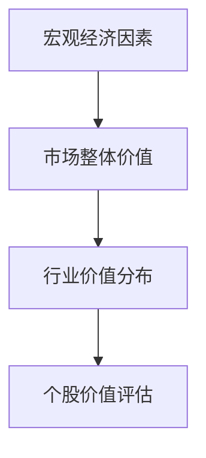
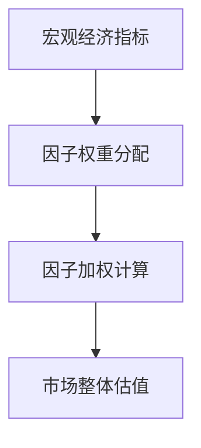
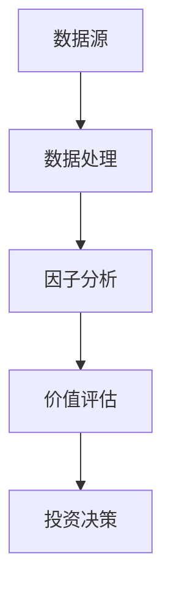

                 


# 马里奥·加贝利的全球宏观价值投资

> 关键词：全球宏观价值投资，马里奥·加贝利，投资策略，风险管理，估值方法，投资哲学

> 摘要：本文深入探讨了马里奥·加贝利在全球宏观价值投资领域的理论与实践，从核心概念、算法原理到系统架构，再到项目实战，全面解析了宏观价值投资的精髓。文章通过详细的案例分析和数学模型，帮助读者理解如何在全球宏观经济环境中寻找价值投资的机会，并通过系统化的方法进行投资决策。

---

# 第一部分：宏观价值投资的背景与核心理念

## 第1章：宏观价值投资的背景与定义

### 1.1 宏观价值投资的定义与核心概念
#### 1.1.1 宏观价值投资的定义
宏观价值投资是一种以宏观经济分析为基础，结合市场整体价值和行业估值水平的投资策略。其核心在于通过分析宏观经济指标、行业趋势和市场情绪，寻找被低估或被高估的投资标的。

#### 1.1.2 宏观价值投资的核心理念
- **价值发现**：通过分析市场整体估值和行业估值水平，寻找价格低于内在价值的资产。
- **风险管理**：在宏观层面控制投资组合的系统性风险，避免因市场波动导致的重大损失。
- **长期投资**：宏观价值投资注重长期趋势，而非短期价格波动。

#### 1.1.3 宏观价值投资的边界与外延
- **边界**：宏观价值投资的边界在于宏观经济环境的可预测性和数据的可获得性。
- **外延**：从宏观视角出发，可以扩展到跨国投资、资产配置和风险管理等领域。

### 1.2 宏观价值投资的历史与发展
#### 1.2.1 宏观价值投资的起源
宏观价值投资的起源可以追溯到20世纪70年代，当时投资者开始关注宏观经济指标对市场整体估值的影响。

#### 1.2.2 宏观价值投资的发展历程
- **早期阶段**：以基本面分析为基础，结合宏观经济指标进行投资决策。
- **量化阶段**：引入量化模型，通过因子分析和大数据技术优化投资策略。
- **现代阶段**：结合人工智能和机器学习技术，提升投资决策的精准度和效率。

#### 1.2.3 宏观价值投资的现状与趋势
当前，宏观价值投资正在向智能化、自动化方向发展，越来越多的投资者开始利用大数据和AI技术进行宏观分析和投资决策。

### 1.3 宏观价值投资与其他投资策略的对比
#### 1.3.1 宏观价值投资与基本面投资的区别
- **基本面投资**：侧重于个股的财务数据和行业分析。
- **宏观价值投资**：侧重于宏观经济指标和市场整体估值。

#### 1.3.2 宏观价值投资与技术分析的对比
- **技术分析**：侧重于价格走势和图表模式。
- **宏观价值投资**：侧重于宏观经济指标和市场估值。

#### 1.3.3 宏观价值投资与量化投资的联系与区别
- **量化投资**：侧重于数学模型和算法交易。
- **宏观价值投资**：结合宏观分析和量化模型，注重长期价值发现。

---

## 第2章：宏观价值投资的核心概念与联系

### 2.1 宏观价值投资的核心概念原理
#### 2.1.1 宏观经济分析的核心要素
- **GDP增长率**：反映宏观经济的整体活力。
- **通胀水平**：影响市场估值和货币政策。
- **利率水平**：影响债券收益率和资产配置。

#### 2.1.2 价值评估的关键指标
- **市盈率（P/E）**：衡量股票的相对估值。
- **市净率（P/B）**：衡量股票的资产价值。
- **股息率**：衡量股票的分红能力。

#### 2.1.3 宏观与微观的结合点
- 宏观经济分析为投资决策提供方向，微观分析为具体标的提供估值依据。

### 2.2 宏观价值投资的核心概念属性对比表
| **概念**       | **基本面投资** | **技术分析** | **量化投资** |
|----------------|----------------|---------------|---------------|
| 侧重领域       | 个股基本面     | 价格走势     | 数学模型      |
| 分析方法       | 财务报表分析   | 图表模式      | 算法交易      |
| 投资策略       | 价值发现      | 价格预测      | 系统化交易    |

### 2.3 宏观价值投资的ER实体关系图


---

## 第3章：宏观价值投资的算法原理与数学模型

### 3.1 宏观价值投资的算法原理
#### 3.1.1 宏观因子模型的构建
- **因子选择**：选取影响市场估值的核心宏观经济指标，如GDP增长率、通胀水平、利率水平等。
- **因子权重**：根据历史数据和市场波动性，确定各因子的权重。

#### 3.1.2 宏观经济指标的权重分配
- **权重计算**：通过回归分析或主成分分析，确定各宏观经济指标的权重。
- **权重调整**：根据市场变化动态调整因子权重。

#### 3.1.3 宏观价值评估的算法流程


### 3.2 宏观价值投资的数学模型与公式
#### 3.2.1 宏观价值指数的计算公式
$$ V = \sum_{i=1}^{n} w_i \times F_i $$
其中，$w_i$ 是因子 $F_i$ 的权重，$n$ 是因子的总数。

#### 3.2.2 宏观价值评估的回归模型
$$ y = \beta_0 + \beta_1 x_1 + \beta_2 x_2 + \dots + \beta_k x_k + \epsilon $$
其中，$y$ 是市场整体估值，$x_i$ 是宏观经济指标，$\beta_i$ 是回归系数，$\epsilon$ 是误差项。

### 3.3 宏观价值投资的算法实现
#### 3.3.1 宏观因子模型的Python实现
```python
import pandas as pd
import numpy as np
from sklearn.linear_model import LinearRegression

# 假设 factors 是宏观经济指标数据，labels 是市场整体估值数据
model = LinearRegression()
model.fit(factors, labels)
weights = model.coef_
```

#### 3.3.2 宏观价值评估的因子加权计算
```python
def macro_value(factors, weights):
    return np.dot(factors, weights)
```

---

## 第4章：宏观价值投资的系统分析与架构设计

### 4.1 宏观价值投资的系统架构
#### 4.1.1 系统功能设计
- **数据采集**：收集宏观经济指标、市场数据和行业信息。
- **因子分析**：对宏观经济指标进行因子分析，确定因子权重。
- **价值评估**：根据因子模型计算市场整体估值。
- **投资决策**：根据估值结果制定投资策略。

#### 4.1.2 系统架构图


---

## 第5章：宏观价值投资的项目实战

### 5.1 项目背景与目标
- **项目背景**：分析全球宏观经济环境，寻找被低估的资产。
- **项目目标**：构建宏观价值投资模型，优化投资组合。

### 5.2 环境配置与数据采集
- **环境配置**：安装Python、Pandas、NumPy等工具。
- **数据采集**：从公开数据源获取宏观经济指标和市场数据。

### 5.3 核心代码实现
```python
import pandas as pd
import numpy as np

# 数据处理
data = pd.read_csv('macro_factors.csv')
factors = data[['GDP增长率', '通胀水平', '利率水平']]
labels = data['市场整体估值']

# 因子分析
from sklearn.decomposition import PCA
pca = PCA(n_components=3)
principal_components = pca.fit_transform(factors)

# 价值评估
from sklearn.linear_model import LinearRegression
model = LinearRegression()
model.fit(principal_components, labels)
predicted_values = model.predict(principal_components)
```

### 5.4 案例分析与结果解读
- **案例分析**：假设我们分析了2023年的宏观经济数据，发现市场整体估值被低估。
- **结果解读**：根据模型预测，建议增加对低估资产的投资。

---

## 第6章：宏观价值投资的最佳实践与注意事项

### 6.1 投资计划的制定
- **目标设定**：明确投资目标和风险承受能力。
- **资产配置**：根据宏观经济分析结果，合理分配资产。

### 6.2 风险管理的技巧
- **分散投资**：避免过度集中于某一资产或行业。
- **动态调整**：根据市场变化及时调整投资策略。

### 6.3 持续学习与改进
- **跟踪市场变化**：定期回顾投资组合的表现。
- **优化模型**：根据新数据和市场变化，优化投资模型。

---

## 第7章：总结与展望

### 7.1 本章总结
- 宏观价值投资是一种以宏观经济分析为基础的投资策略，通过分析市场整体估值和行业趋势，寻找被低估的资产。
- 本文从背景、核心概念、算法原理到系统设计和项目实战，全面解析了宏观价值投资的精髓。

### 7.2 未来展望
- 随着人工智能和大数据技术的发展，宏观价值投资将更加智能化和自动化。
- 投资者需要不断学习和适应市场变化，才能在全球宏观经济环境中获得长期稳定的收益。

---

作者：AI天才研究院/AI Genius Institute & 禅与计算机程序设计艺术 /Zen And The Art of Computer Programming

