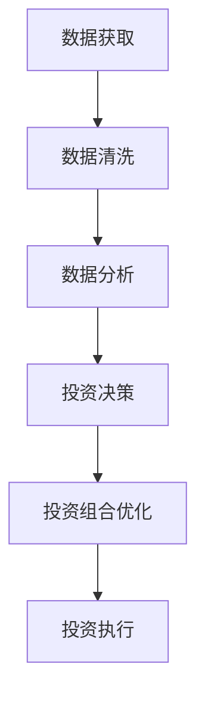

                 


# 马里奥·加贝利的焦点价值投资：集中持股的艺术

## 关键词：马里奥·加贝利、焦点价值投资、集中持股、价值投资、投资策略、投资组合优化

## 摘要：本文介绍马里奥·加贝利的焦点价值投资理念，分析其集中持股的策略，结合数学模型和实际案例，详细阐述价值投资的核心概念、算法原理、系统架构及项目实战。

---

## 第一部分：价值投资的背景与基础

### 第1章：价值投资的起源与核心理念

#### 1.1 价值投资的起源

- **1.1.1 价值投资的定义**
  价值投资是一种以内在价值为导向的投资策略，强调购买被市场低估的资产，长期持有，等待其价值回归。

- **1.1.2 价值投资的核心理念**
  - **长期主义**：投资不是交易，而是持有优质资产，分享企业长期增长。
  - **安全边际**：买入价格低于内在价值，以降低风险。
  - **基本面分析**：通过分析企业的财务状况、行业地位和竞争优势，评估其内在价值。

- **1.1.3 马里奥·加贝利的投资风格**
  加贝利以其激进的价值投资风格闻名，专注于买入被市场忽视或低估的股票，长期持有，集中投资，追求超额收益。

#### 1.2 焦点价值投资的定义与特点

- **1.2.1 焦点价值投资的定义**
  焦点价值投资是一种强调集中投资、精选个股的价值投资策略，核心在于通过深入研究，找到少数具有持续竞争优势且被市场低估的企业，进行重仓投资。

- **1.2.2 焦点投资的核心特征**
  - **高度集中**：投资组合通常不超过10只股票，甚至更少，单只股票仓位可超过50%。
  - **长期持有**：坚持长期持有优质资产，避免频繁交易。
  - **精选个股**：通过深入的基本面分析，筛选出具有强大竞争优势和合理估值的公司。

- **1.2.3 集中持股的优势与风险**
  - **优势**：通过集中投资，降低交易成本，提高投资收益；聚焦优质企业，享受其长期增长。
  - **风险**：投资组合波动性大，市场下跌时损失可能更严重；个股风险集中，单一只股票的波动可能影响整体投资组合。

#### 1.3 价值投资的哲学与心理

- **1.3.1 投资者的心理特征**
  价值投资者通常具有逆向思维，能够在市场恐慌时保持冷静，在市场狂热时保持理性。

- **1.3.2 马里奥·加贝利的投资哲学**
  - **买入并持有**：加贝利认为，市场短期是投票器，长期是称重机，投资应该关注企业的内在价值，而不是市场的短期波动。
  - **寻找市场的非理性**：通过研究市场忽视的行业或公司，寻找被低估的投资机会。
  - **长期视角**：投资不是一朝一夕的交易，而是长期的伙伴关系，与优秀企业共同成长。

- **1.3.3 投资决策中的情绪管理**
  价值投资需要强大的心理素质，尤其是在市场恐慌或狂热时，能够坚持自己的投资原则，避免被市场情绪左右。

---

## 第二部分：焦点价值投资的核心概念与联系

### 第2章：价值投资的核心概念

#### 2.1 价值投资的哲学与方法

- **2.1.1 价值投资的哲学基础**
  价值投资基于“价格与价值分离”的理念，认为市场短期可能会出现价格与价值的偏离，而投资的目的是以合理的价格买入优质的资产，等待其价值回归。

- **2.1.2 价值投资的方法论**
  - **基本面分析**：通过分析企业的财务报表、行业地位、竞争优势等因素，评估其内在价值。
  - **安全边际**：买入价格低于内在价值，以降低投资风险。
  - **分散与集中**：与传统分散投资不同，焦点价值投资强调集中持股，但通过严格筛选优质资产，降低组合风险。

- **2.1.3 价值投资的核心要素**
  - **内在价值**：资产的真实价值，不受市场波动影响。
  - **安全边际**：买入价格与内在价值的差距，提供风险缓冲。
  - **竞争优势**：企业相对于竞争对手的独特优势，决定其长期盈利能力。

#### 2.2 焦点投资与分散投资的对比

- **2.2.1 焦点投资的优缺点**
  - **优点**：
    - **高收益潜力**：通过集中投资优质资产，获得超越市场的回报。
    - **简化决策**：减少分散投资中需要处理的信息量，提高决策效率。
    - **降低交易成本**：较少的交易次数和持仓数量，降低交易费用和税务负担。
  - **缺点**：
    - **高波动性**：集中投资可能导致投资组合波动较大，承受更大的短期风险。
    - **单一风险**：如果集中投资的个股出现重大问题，可能导致投资组合大幅亏损。
    - **需要更高的研究能力**：集中投资要求对所选个股有深入的研究和理解，否则容易出现重大失误。

- **2.2.2 分散投资的优缺点**
  - **优点**：
    - **降低风险**：通过分散投资，降低单一资产的风险，使投资组合更加稳健。
    - **平滑波动**：分散投资有助于平滑市场波动，降低投资组合的波动性。
    - **风险可控**：在面对市场危机时，分散投资可以有效降低整体损失。
  - **缺点**：
    - **收益受限**：分散投资可能难以捕捉到个别优质资产的超额收益。
    - **复杂性**：需要管理更多的资产和信息，增加了决策的复杂性。
    - **交易成本增加**：分散投资通常需要更多的交易次数，增加了交易成本和税务负担。

- **2.2.3 两种投资策略的适用场景**
  - **焦点投资**：适用于市场中存在显著低估机会，且投资者具备深入研究能力和较高风险承受能力的情况。
  - **分散投资**：适用于市场整体估值较高，或投资者风险承受能力较低的情况。

---

## 第三部分：焦点价值投资的算法原理

### 第3章：价值投资的数学模型与公式

#### 3.1 价值投资的内在价值计算

- **3.1.1 内在价值的定义**
  内在价值是指资产在未来现金流的现值，不受市场短期波动影响的真实价值。

- **3.1.2 内在价值的计算公式**
  内在价值可以通过多种方法计算，其中最常见的方法是使用现金流折现模型（DCF）。

  **公式：**
  $$ V = \frac{CF_1}{(1+r)^1} + \frac{CF_2}{(1+r)^2} + \dots + \frac{CF_n}{(1+r)^n} + \frac{TV}{(1+r)^n} $$
  其中：
  - \( CF_i \) 是第i年的自由现金流
  - \( r \) 是折现率
  - \( TV \) 是终值，即第n年后的残值或持续价值

- **3.1.3 内在价值的评估方法**
  - **DCF模型**：通过预测未来现金流并折现，计算资产的内在价值。
  - **相对估值法**：通过比较资产与可比资产的估值指标（如市盈率、市净率等）来评估其价值。

#### 3.2 投资组合优化的数学模型

- **3.2.1 投资组合优化的定义**
  投资组合优化是指在给定的风险水平下，寻找能够提供最高预期收益的投资组合，或者在给定收益下，寻找风险最小的投资组合。

- **3.2.2 投资组合优化的数学公式**
  Markowitz的有效前沿理论是投资组合优化的基础，其目标是最大化收益，同时最小化风险。

  **公式：**
  $$ \text{Minimize } \sigma^2 \text{ subject to } \mu \geq \text{目标收益} $$

  其中：
  - \( \sigma^2 \) 是投资组合的方差（风险）
  - \( \mu \) 是投资组合的预期收益

- **3.2.3 投资组合优化的实现方法**
  - **均值-方差优化**：通过调整资产的权重，找到最优风险收益组合。
  - **风险平价**：将风险在不同资产之间分配，以实现风险的均衡。

---

## 第四部分：焦点价值投资的系统分析与架构设计

### 第4章：投资决策系统的架构设计

#### 4.1 投资决策系统的组成

- **4.1.1 数据获取模块**
  - 从多个数据源获取实时或历史数据，包括股票价格、财务报表、行业分析等。
- **4.1.2 数据分析模块**
  - 对获取的数据进行清洗、整理和分析，包括基本面分析、估值分析、竞争分析等。
- **4.1.3 投资决策模块**
  - 基于分析结果，生成投资决策，如买入、卖出或持有。

#### 4.2 投资决策系统的流程图



---

## 第五部分：焦点价值投资的项目实战

### 第5章：焦点价值投资的实战案例

#### 5.1 实战环境的搭建

- **5.1.1 环境配置**
  - 操作系统：Windows 10 或 macOS 12
  - Python 版本：3.8 或更高
  - 需要安装的库：pandas、numpy、yfinance、plotly

  ```bash
  pip install pandas numpy yfinance plotly
  ```

- **5.1.2 数据源的选择**
  - 股票数据：Yahoo Finance API
  - 财务报表：Yahoo Finance 或其他金融数据源

- **5.1.3 工具的安装**
  - 安装Jupyter Notebook或VS Code的Jupyter扩展，用于数据分析和可视化。

#### 5.2 投资组合的构建与优化

- **5.2.1 数据的获取与处理**
  ```python
  import pandas as pd
  import yfinance as yf

  # 下载股票数据
  df = yf.download(['AAPL', 'MSFT', 'GOOGL'], start='2020-01-01', end='2023-01-01')
  df.head()
  ```

- **5.2.2 投资组合的构建**
  ```python
  import numpy as np

  # 计算每只股票的平均收益率和标准差
  def calculate_return_and_volatility(stock_data):
      returns = stock_data.pct_change().dropna()
      return returns.mean() * 100, returns.std()

  aapl_return, aapl_volatility = calculate_return_and_volatility(df['AAPL'])
  msft_return, msft_volatility = calculate_return_and_volatility(df['MSFT'])
  googl_return, googl_volatility = calculate_return_and_volatility(df['GOOGL'])

  # 构建投资组合
  weights = np.array([0.4, 0.4, 0.2])
  portfolio_return = np.sum(weights * [aapl_return, msft_return, googl_return])
  portfolio_volatility = np.sqrt(np.dot(weights, np.dot(np.array([aapl_volatility, msft_volatility, googl_volatility]).T, np.array([aapl_volatility, msft_volatility, googl_volatility]))))
  ```

- **5.2.3 投资组合的优化**
  ```python
  import scipy.optimize as optimize

  # 定义目标函数
  def objective(weights, returns, volatility):
      return -np.sum(weights * returns)  # 最小化目标函数，这里取负数是为了使用minimize函数求最大值

  # 定义约束条件
  constraints = [
      {'type': 'eq', 'fun': lambda w: np.sum(w) - 1},  # 权重之和为1
      {'type': 'ineq', 'fun': lambda w: w - 0}  # 权重不能为负数
  ]

  # 使用SLSQP求解器进行优化
  result = optimize.minimize(objective, np.array([1/3, 1/3, 1/3]), args=(returns, volatility), method='SLSQP', constraints=constraints)

  # 输出优化结果
  print("优化后的权重：", result.x)
  print("最大化的预期收益：", -objective(result.x, returns, volatility))
  ```

---

## 第六部分：焦点价值投资的最佳实践与总结

### 第6章：投资中的注意事项与拓展阅读

#### 6.1 投资中的注意事项

- **风险管理**：无论采用何种投资策略，风险管理都是投资成功的关键。焦点价值投资虽然强调集中持股，但也需要设定止损点或止盈点，以控制投资风险。
- **持续学习**：市场环境不断变化，投资者需要持续学习，更新自己的知识库，以应对新的挑战和机会。
- **长期视角**：价值投资需要耐心和时间，投资者需要保持长期视角，避免短期波动的干扰。

#### 6.2 拓展阅读与学习资源

- **推荐书籍**
  - 《The Intelligent Investor》——本杰明·格雷厄姆
  - 《The Warren Buffett Way》——查理·芒格
  - 《Focus: The Focused Investor's Guide to Finding集中持股的非凡收益》——马里奥·加贝利
- **网络资源**
  - Investopedia：提供丰富的投资知识和工具。
  - Seeking Alpha：专业的投资分析和见解。
  - QuantInst：量化投资工具和资源。

#### 6.3 小结

马里奥·加贝利的焦点价值投资策略强调集中投资优质资产，通过深入的基本面分析，寻找市场低估的机会，长期持有，等待价值回归。这种策略虽然风险较高，但通过精选个股和严格的风险管理，可以实现超越市场的收益。

---

## 作者：AI天才研究院/AI Genius Institute & 禅与计算机程序设计艺术/Zen And The Art of Computer Programming

---

本文通过详细阐述马里奥·加贝利的焦点价值投资理念，结合数学模型和实际案例，帮助读者理解并掌握这一投资策略的核心思想和实践方法。希望读者能够在投资实践中灵活运用这些知识，实现长期稳健的投资收益。

