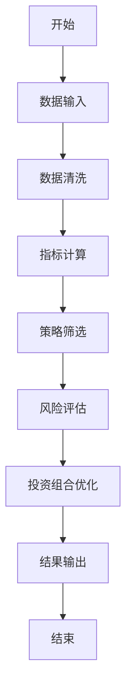

                 


# 高股息策略：构建稳定现金流的投资组合

## 关键词：高股息策略、股息率、投资组合、现金流、风险管理

## 摘要：
高股息策略是一种通过投资高股息率股票来实现稳定现金流的投资方法。本文将深入探讨高股息策略的核心概念、数学模型、筛选方法以及风险管理，帮助投资者构建一个稳定且可持续的现金流投资组合。通过分析股息率、股息增长、股息支付率等关键指标，结合系统架构设计和实际案例，本文将为投资者提供一套科学的投资策略。

---

# 第一部分：高股息策略的背景与核心概念

## 第1章：高股息策略的定义与背景

### 1.1 高股息策略的定义

#### 1.1.1 高股息策略的核心概念
高股息策略是指通过投资股息收益率较高的股票，以获得稳定的现金流收入。这种方法特别适合那些追求长期稳定收益的投资者，尤其是对冲基金、机构投资者和个人投资者。

#### 1.1.2 高股息策略的历史发展
高股息策略的历史可以追溯到20世纪初。随着股票市场的成熟，投资者开始意识到股息收入的重要性。尤其是在市场波动较大的时期，高股息股票往往表现更为稳定。

#### 1.1.3 高股息策略的适用场景
高股息策略适用于以下场景：
- 长期投资：追求稳定的现金流收入。
- 防御性投资：在市场下跌时，高股息股票通常表现较好。
- 资产配置：作为投资组合的一部分，平衡风险和收益。

### 1.2 高股息策略的优势与劣势

#### 1.2.1 高股息策略的优势
- 稳定的现金流：高股息股票通常来自盈利稳定的大公司，能够持续支付股息。
- 抗跌性：在市场下跌时，高股息股票往往表现相对稳定。

#### 1.2.2 高股息策略的劣势
- 低增长性：高股息股票通常属于成熟企业，增长潜力有限。
- 利率风险：当市场利率上升时，高股息股票的吸引力可能下降。

#### 1.2.3 高股息策略的适用人群
- 长期投资者：追求稳定的现金流收入。
- 风险厌恶型投资者：希望在市场波动中保持稳定性。
- 资产保值者：希望通过股息收入实现资产增值。

---

## 第2章：高股息策略的核心概念

### 2.1 高股息策略的关键指标

#### 2.1.1 股息率
股息率是衡量一只股票股息收益的重要指标，计算公式为：
$$股息率 = \frac{每股股息}{股价} \times 100\%$$

#### 2.1.2 股息增长
股息增长是指公司每年支付的股息金额的增加幅度。高股息增长通常意味着公司盈利能力和股息支付能力较强。

#### 2.1.3 股息支付率
股息支付率是公司股息支付总额与净利润的比率，计算公式为：
$$股息支付率 = \frac{股息支付总额}{净利润} \times 100\%$$

### 2.2 高股息策略的核心要素

#### 2.2.1 公司基本面分析
公司基本面分析包括：
- 盈利能力：净利润率、ROE（净资产收益率）。
- 偿债能力：资产负债率、流动比率。
- 现金流状况：经营活动现金流净额。

#### 2.2.2 行业分析
行业分析包括：
- 行业周期：行业处于成长期还是成熟期。
- 行业竞争格局：行业内主要竞争对手的情况。
- 行业政策：政府对行业的政策支持或限制。

#### 2.2.3 市场周期分析
市场周期分析包括：
- 市场整体走势：牛市、熊市。
- 利率水平：市场利率上升通常会降低高股息股票的吸引力。
- 通货膨胀：通货膨胀会侵蚀股息的实际购买力。

---

## 第3章：高股息策略的数学模型与公式

### 3.1 高股息策略的核心公式

#### 3.1.1 股息率计算公式
$$股息率 = \frac{每股股息}{股价} \times 100\%$$

#### 3.1.2 股息支付率计算公式
$$股息支付率 = \frac{股息支付总额}{净利润} \times 100\%$$

#### 3.1.3 现金流分析公式
$$现金流 = \text{经营活动现金流} + \text{投资活动现金流} + \text{筹资活动现金流}$$

### 3.2 高股息策略的数学模型

#### 3.2.1 股票估值模型
$$股票价值 = \frac{股息}{折现率}$$

#### 3.2.2 现金流折现模型
$$股票价值 = \sum_{t=1}^{n} \frac{\text{现金流}_t}{(1 + r)^t}$$

#### 3.2.3 股息增长模型
$$股票价值 = \frac{D_1}{r - g}$$
其中：
- \(D_1\) 是第一年的股息。
- \(r\) 是折现率。
- \(g\) 是股息增长率。

---

## 第4章：高股息策略的系统分析与架构设计

### 4.1 高股息策略的系统架构

#### 4.1.1 系统功能模块
- 股票筛选模块：根据股息率、股息支付率等指标筛选高股息股票。
- 数据分析模块：对股票的历史数据进行分析，评估其股息支付能力和稳定性。
- 风险评估模块：评估投资组合的市场风险、流动性风险等。
- 投资组合优化模块：根据风险偏好和收益目标优化投资组合。

### 4.2 高股息策略的系统流程图



### 4.3 高股息策略的系统接口设计

#### 4.3.1 数据接口
- 股票数据获取接口：从数据源获取股票的历史数据。
- 数据清洗接口：对获取的数据进行清洗和预处理。

#### 4.3.2 策略接口
- 股票筛选接口：根据股息率、股息支付率等指标筛选高股息股票。
- 投资组合优化接口：根据风险偏好和收益目标优化投资组合。

---

# 第二部分：高股息策略的筛选与分析

## 第5章：高股息股票的筛选标准

### 5.1 高股息股票的筛选标准

#### 5.1.1 股息率
股息率是筛选高股息股票的核心指标。通常，股息率超过5%的股票被认为是高股息股票。

#### 5.1.2 股息支付率
股息支付率是衡量公司股息支付能力的重要指标。通常，股息支付率在20%到80%之间的股票较为合理。

#### 5.1.3 财务健康状况
财务健康状况包括：
- 盈利能力：净利润率、ROE。
- 偿债能力：资产负债率、流动比率。
- 现金流状况：经营活动现金流净额。

### 5.2 高股息股票的筛选流程

#### 5.2.1 数据收集
从数据源获取股票的历史数据，包括股价、股息、净利润等。

#### 5.2.2 数据清洗
对获取的数据进行清洗，剔除异常值和缺失值。

#### 5.2.3 指标计算
计算股息率、股息支付率等关键指标。

#### 5.2.4 筛选股票
根据筛选标准筛选出符合条件的高股息股票。

#### 5.2.5 投资组合优化
根据风险偏好和收益目标优化投资组合。

---

## 第6章：高股息策略的风险管理与优化

### 6.1 高股息策略的风险管理

#### 6.1.1 市场风险
市场风险是指市场整体波动对投资组合的影响。高股息股票通常在市场下跌时表现相对稳定，但仍然存在市场风险。

#### 6.1.2 利率风险
当市场利率上升时，高股息股票的吸引力可能下降，导致股价下跌。

#### 6.1.3 流动性风险
高股息股票通常流动性较好，但某些小盘股可能流动性较差。

### 6.2 高股息策略的优化

#### 6.2.1 分散投资
通过分散投资降低单一股票的风险。

#### 6.2.2 定期再平衡
定期调整投资组合，确保股息收入稳定增长。

#### 6.2.3 监测与调整
定期监测股票的财务状况和市场环境，及时调整投资组合。

---

## 第7章：高股息策略的实际应用与案例分析

### 7.1 高股息策略的实际应用

#### 7.1.1 股票筛选
以A股市场为例，筛选股息率超过5%且股息支付率在20%到80%之间的股票。

#### 7.1.2 投资组合构建
根据风险偏好和收益目标，构建投资组合。

### 7.2 高股息策略的案例分析

#### 7.2.1 案例一：某高股息股票的投资分析
- 公司基本面分析：公司盈利稳定，股息支付能力强。
- 市场环境分析：市场利率上升，高股息股票吸引力下降。

#### 7.2.2 案例二：投资组合优化
- 投资组合构成：筛选出10只高股息股票，按照风险偏好分配权重。
- 投资组合表现：定期调整投资组合，确保股息收入稳定增长。

---

## 第8章：高股息策略的系统实现与代码示例

### 8.1 环境安装与配置

#### 8.1.1 数据获取
使用Python的pandas库从Yahoo Finance获取股票数据。

#### 8.1.2 数据清洗
使用pandas库清洗数据，剔除异常值和缺失值。

#### 8.1.3 指标计算
计算股息率、股息支付率等关键指标。

### 8.2 核心代码实现

#### 8.2.1 数据获取与清洗
```python
import pandas as pd
import yfinance as yf

# 获取数据
data = yf.download(tickers='AAPL', period='5y')

# 数据清洗
data = data['Adj Close'].resample('D').last().dropna()
```

#### 8.2.2 指标计算
```python
# 计算股息率
data['Dividend Yield'] = (data['dividend'].fillna(0) / data['Adj Close']) * 100

# 计算股息支付率
data['Dividend Payout Ratio'] = (data['dividend'].fillna(0) / data['netincome'].fillna(0)) * 100
```

#### 8.2.3 股票筛选
```python
# 筛选股息率大于5%且股息支付率在20%到80%之间的股票
selected_stocks = data[(data['Dividend Yield'] > 5) & (20 <= data['Dividend Payout Ratio'] <= 80)]
```

---

## 第9章：高股息策略的最佳实践与注意事项

### 9.1 长期投资的重要性
长期投资是实现高股息策略的关键，因为股息收入需要时间积累。

### 9.2 风险管理的重要性
尽管高股息股票相对稳定，但仍然需要进行风险管理，分散投资是降低风险的有效方法。

### 9.3 定期再平衡的必要性
定期调整投资组合，确保股息收入稳定增长，同时根据市场环境变化进行优化。

### 9.4 持续学习与优化
市场环境不断变化，投资者需要持续学习，优化投资策略。

---

## 结语

高股息策略是一种有效的投资方法，能够为投资者提供稳定的现金流收入。通过科学的筛选、分析和管理，投资者可以在市场波动中保持稳定性，并实现长期的资产增值。

---

## 作者：AI天才研究院/AI Genius Institute & 禅与计算机程序设计艺术 /Zen And The Art of Computer Programming

