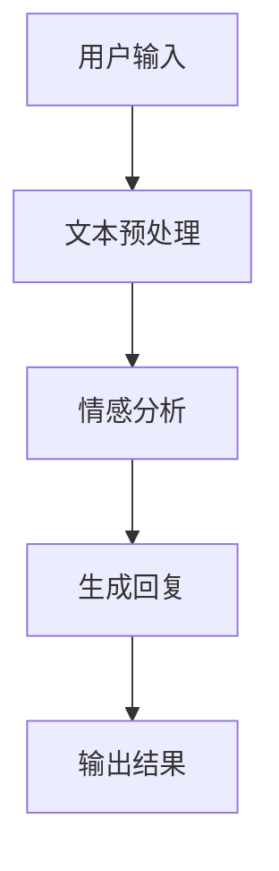
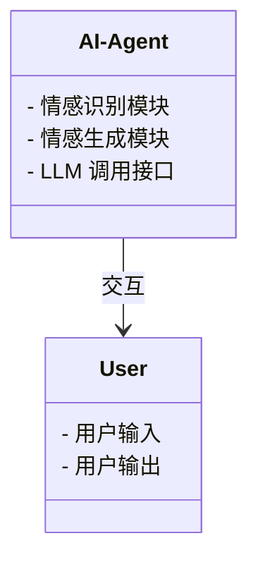
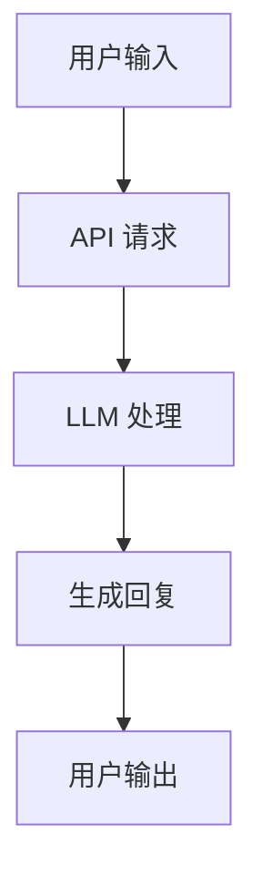
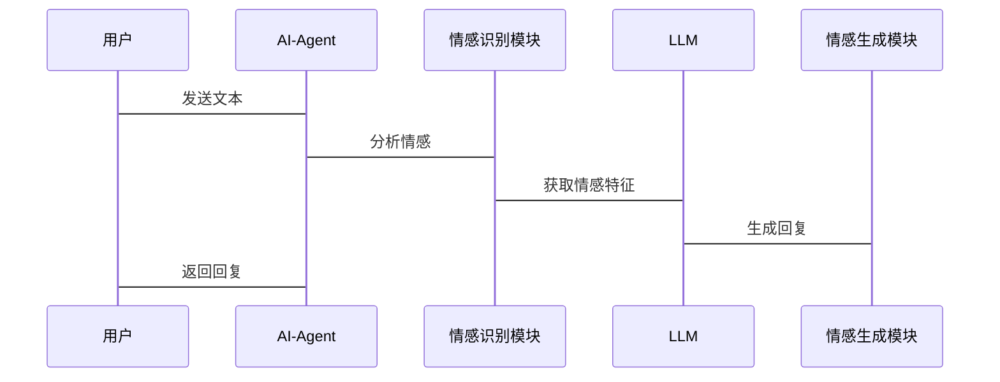

                 


# AI Agent 的情感调节：利用 LLM 进行情绪管理

## 关键词：AI Agent，情感调节，LLM，大语言模型，情绪管理，自然语言处理

## 摘要：  
随着人工智能技术的不断发展，AI Agent 在各个领域的应用越来越广泛。然而，AI Agent 在与人类交互过程中，如何理解和调节情感成为了关键问题。本文将探讨如何利用大语言模型（LLM）实现情感调节，从而提升人机交互的体验。文章将从背景介绍、核心概念、算法原理、系统设计、项目实战等多方面展开，深入分析情感调节的实现方法，并提供具体的代码实现和案例分析。

---

# 第一部分：背景介绍

## 第1章：AI Agent 的基本概念

### 1.1 AI Agent 的定义与分类  
AI Agent 是指具有自主决策能力和交互能力的智能体，能够根据环境信息做出响应。它可以分为简单反射型、基于模型的反射型、目标驱动型和实用驱动型四种类型。AI Agent 广泛应用于智能助手、机器人、自动驾驶等领域。

### 1.2 情感调节的必要性  
在人机交互中，情感调节是实现更自然、更人性化交互的关键。通过情感调节，AI Agent 可以更好地理解用户的情绪状态，并做出相应的反馈，从而提升用户体验。

### 1.3 大语言模型（LLM）的相关知识  
大语言模型（LLM）是一种基于深度学习的自然语言处理模型，具有强大的文本生成和理解能力。LLM 可以通过上下文理解用户的情感，并生成相应的回复。

---

# 第二部分：核心概念与联系

## 第2章：情感调节的核心原理  

### 2.1 情感识别与分析  
情感识别是通过分析文本内容，判断用户的情感倾向（如正面、负面、中性）。基于 LLM 的情感分析方法具有高准确率和灵活性。

### 2.2 情感生成与调节  
情感生成是指根据用户的情感状态，生成相应的文本回复，以调节用户的情绪。基于 LLM 的情感生成可以通过条件控制来实现。

### 2.3 情感调节与 LLM 的结合  
LLM 在情感调节中的优势在于其强大的文本理解和生成能力。通过结合情感识别和生成，可以实现更加智能和人性化的情感调节。

---

# 第三部分：算法原理讲解

## 第3章：基于 LLM 的情感调节算法  

### 3.1 情感调节算法的流程  
1. 输入文本处理：对用户的输入文本进行预处理，提取情感特征。  
2. 情感分析：使用 LLM 分析文本的情感倾向。  
3. 情感生成：根据分析结果生成相应的回复。  
4. 输出结果：返回生成的文本回复。  

### 3.2 情感调节算法的实现  



### 3.3 情感调节的数学模型  

情感评分公式：$$score = \sum_{i=1}^{n} w_i x_i$$  
其中，$w_i$ 是情感特征的权重，$x_i$ 是对应的特征值。

---

# 第四部分：系统分析与架构设计

## 第4章：系统设计与实现  

### 4.1 系统功能设计  



### 4.2 系统架构设计  



### 4.3 系统交互流程  



---

# 第五部分：项目实战

## 第5章：基于 LLM 的情感调节系统实现  

### 5.1 开发环境与工具  
- Python 3.8+  
- LLM 模型：如 GPT-3 或其他开源模型  
- 开发框架：如 Flask 或 FastAPI  

### 5.2 核心代码实现  

```python
def emotional_regulation_system():
    user_input = input("请输入您的文本：")
    # 文本预处理
    processed_text = preprocess(user_input)
    # 情感分析
    emotion = analyze_emotion(processed_text)
    # 情感生成
    response = generate_response(emotion)
    print(response)

def preprocess(text):
    # 文本清洗和分词
    pass

def analyze_emotion(text):
    # 使用 LLM 分析情感
    pass

def generate_response(emotion):
    # 根据情感生成回复
    pass

if __name__ == "__main__":
    emotional_regulation_system()
```

---

# 第六部分：最佳实践与小结

## 第6章：总结与展望  

### 6.1 总结  
本文详细探讨了利用 LLM 进行情感调节的方法，从理论到实践，全面介绍了情感调节的核心原理和实现方法。

### 6.2 注意事项  
在实际应用中，需要注意数据隐私、模型训练成本以及用户体验等问题。

### 6.3 未来展望  
未来，随着 LLM 技术的不断进步，情感调节将更加智能化和个性化。

---

# 作者：AI天才研究院/AI Genius Institute & 禅与计算机程序设计艺术 /Zen And The Art of Computer Programming

---

这篇文章系统地介绍了 AI Agent 的情感调节方法，结合了理论分析和实际代码实现，帮助读者全面理解如何利用 LLM 进行情绪管理。

