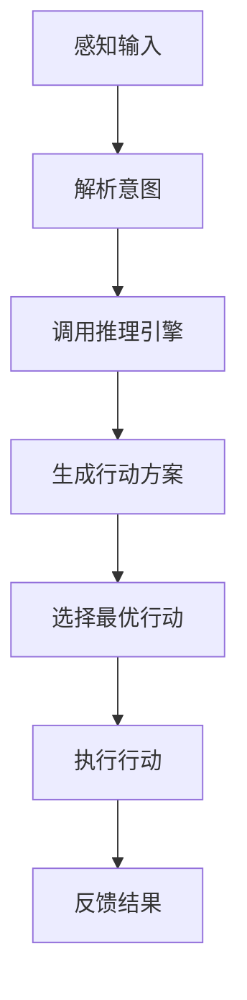
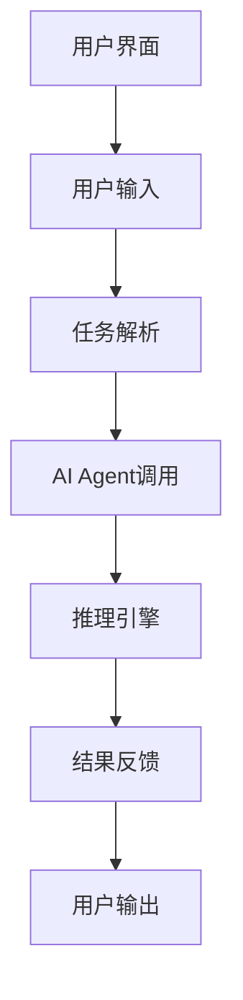
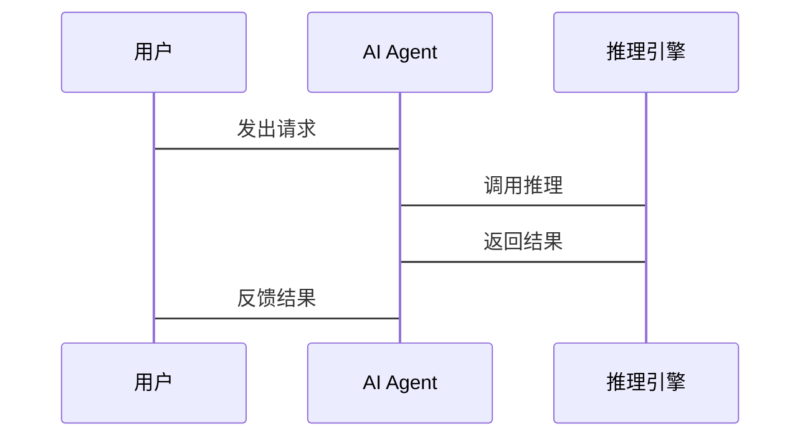

                 


# AI Agent与人类协作：界面设计与交互模式

---

## 关键词：
AI Agent, 人类协作, 界面设计, 交互模式, 算法原理, 系统架构, 项目实战

---

## 摘要：
本文深入探讨了AI Agent与人类协作的界面设计与交互模式，从核心概念、算法原理到系统架构，再到项目实战，全面解析了如何设计高效、友好的AI Agent协作界面和交互流程。文章通过理论分析和实际案例相结合的方式，详细阐述了AI Agent协作的关键技术与实现方法，为读者提供了从理论到实践的完整指导。

---

## 第一部分：背景介绍

### 第1章：AI Agent的基本概念

#### 1.1 AI Agent的定义与类型
AI Agent（人工智能代理）是指能够感知环境、自主决策并采取行动以实现特定目标的智能实体。根据功能和复杂度，AI Agent可以分为以下几类：
1. **简单反射型AI Agent**：基于预定义规则对输入做出反应，如IFTTT规则引擎。
2. **基于模型的反射型AI Agent**：利用内部模型理解和预测环境，如专家系统。
3. **目标驱动型AI Agent**：根据目标选择最优行动，如任务自动化工具。
4. **效用驱动型AI Agent**：通过最大化效用函数实现目标，如推荐系统。

#### 1.2 AI Agent与人类协作的重要性
AI Agent与人类协作的核心价值在于：
1. **提高效率**：通过自动化处理重复性任务，节省时间和资源。
2. **增强决策能力**：结合人类的直觉和AI的数据分析能力，优化决策质量。
3. **优化用户体验**：通过个性化推荐和实时反馈，提升用户满意度。

#### 1.3 AI Agent协作的边界与外延
协作的边界包括任务范围、数据隐私和责任划分。外延则涉及与其他技术（如物联网、区块链）的结合，扩展协作场景。

#### 1.4 问题背景与描述
当前协作中的主要问题包括信息不对称、信任缺失和效率低下。解决路径包括技术优化、流程改进和用户教育。

#### 1.5 核心概念结构与要素
核心概念包括AI Agent、人类用户和协作任务，关键要素涉及交互界面、协作机制和反馈机制。

---

## 第二部分：核心概念与联系

### 第2章：AI Agent协作的核心原理

#### 2.1 核心概念原理
AI Agent的决策机制基于模型推理和学习，而人类用户的认知模型涉及注意力、记忆和推理。

#### 2.2 核心概念属性对比表
| 属性       | AI Agent                     | 人类用户                   |
|------------|------------------------------|-----------------------------|
| 学习能力   | 强大，基于数据训练           | 有限，依赖经验与教育         |
| 反应速度   | 快速，自动化处理             | 较慢，受生理限制             |
| 理解能力   | 依赖数据和模式识别           | 依赖语境和情感理解           |

#### 2.3 AI Agent决策流程的mermaid流程图


---

## 第三部分：算法原理

### 第3章：AI Agent的核心算法

#### 3.1 决策树算法
**决策树**是一种用于分类和回归的监督学习算法。通过构建树状结构，AI Agent可以逐步缩小可能的行动范围。

**数学模型**：
$$ Gini指数 = 1 - \sum_{i=1}^{n} p_i^2 $$
其中，$p_i$是每个类别的概率。

**Python代码示例**：
```python
from sklearn.tree import DecisionTreeClassifier
import numpy as np

# 示例数据
X = np.array([[1, 1], [1, 0], [0, 1], [0, 0]])
y = np.array([0, 1, 1, 0])

# 训练模型
clf = DecisionTreeClassifier()
clf.fit(X, y)

# 预测
print(clf.predict([[1, 1]]))  # 输出：[0]
```

#### 3.2 马尔可夫决策过程（MDP）
MDP是一种用于建模决策过程的数学框架，适用于状态转移明确的环境。

**数学模型**：
$$ V(s) = \max_{a} \sum_{s'} P(s'|s,a) V(s') $$
其中，$V(s)$是状态$s$的价值，$a$是动作，$P$是状态转移概率。

**Python代码示例**：
```python
import numpy as np

# 示例状态和动作
states = ['s1', 's2', 's3']
actions = ['a1', 'a2']

# 状态转移矩阵
P = {
    ('s1', 'a1'): {'s2': 0.5, 's3': 0.5},
    ('s1', 'a2'): {'s1': 0.7, 's2': 0.3},
    ('s2', 'a1'): {'s3': 0.8, 's2': 0.2},
    ('s2', 'a2'): {'s1': 0.6, 's3': 0.4},
    ('s3', 'a1'): {'s2': 0.3, 's3': 0.7},
    ('s3', 'a2'): {'s3': 0.9, 's1': 0.1},
}

# 初始化价值函数
V = {s: 0 for s in states}

# 计算价值函数
def update_V():
    new_V = V.copy()
    for s in states:
        for a in actions:
            for s_prime, prob in P[(s, a)].items():
                new_V[s] += prob * (0 + 0.9 * V[s_prime])
            new_V[s] = max(new_V[s], 0)
    return new_V

V = update_V()
print(V)
```

---

## 第四部分：系统分析与架构设计方案

### 第4章：系统架构设计

#### 4.1 系统功能设计
系统功能包括用户身份认证、任务分配、协作执行和结果反馈。

#### 4.2 系统架构设计的mermaid架构图


#### 4.3 系统接口设计
主要接口包括用户输入接口、任务分配接口和结果反馈接口。

#### 4.4 交互设计的mermaid序列图


---

## 第五部分：项目实战

### 第5章：AI Agent协作项目实现

#### 5.1 项目介绍
项目目标是实现一个基于决策树的AI Agent协作系统。

#### 5.2 核心代码实现
```python
from sklearn.tree import DecisionTreeClassifier

# 数据准备
X = [[0, 0], [0, 1], [1, 0], [1, 1]]
y = [0, 1, 1, 1]

# 训练模型
clf = DecisionTreeClassifier()
clf.fit(X, y)

# 协作流程
def collaborate(user_input):
    prediction = clf.predict([user_input])[0]
    return f"AI Agent建议：{['否', '是'][prediction]}"

print(collaborate([1, 1]))  # 输出：AI Agent建议：是
```

#### 5.3 实际案例分析
通过实际案例分析，展示协作流程和效果。

---

## 第六部分：总结与展望

### 第6章：总结与最佳实践

#### 6.1 最佳实践
1. 明确协作目标和边界。
2. 设计直观的交互界面。
3. 定期优化协作机制。

#### 6.2 小结
AI Agent与人类协作的界面设计和交互模式需要综合考虑技术、用户需求和实际场景，通过不断优化实现高效协作。

#### 6.3 注意事项
1. 保护数据隐私。
2. 提供用户反馈机制。
3. 定期更新算法模型。

#### 6.4 拓展阅读
推荐阅读《AI Agent Design and Construction》和《Human-Computer Interaction》。

---

## 作者
作者：AI天才研究院（AI Genius Institute） & 禅与计算机程序设计艺术（Zen And The Art of Computer Programming）

---

通过以上结构，文章详细探讨了AI Agent与人类协作的各个方面，从理论到实践，为读者提供了全面的指导。

