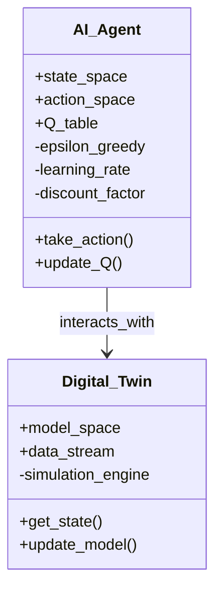
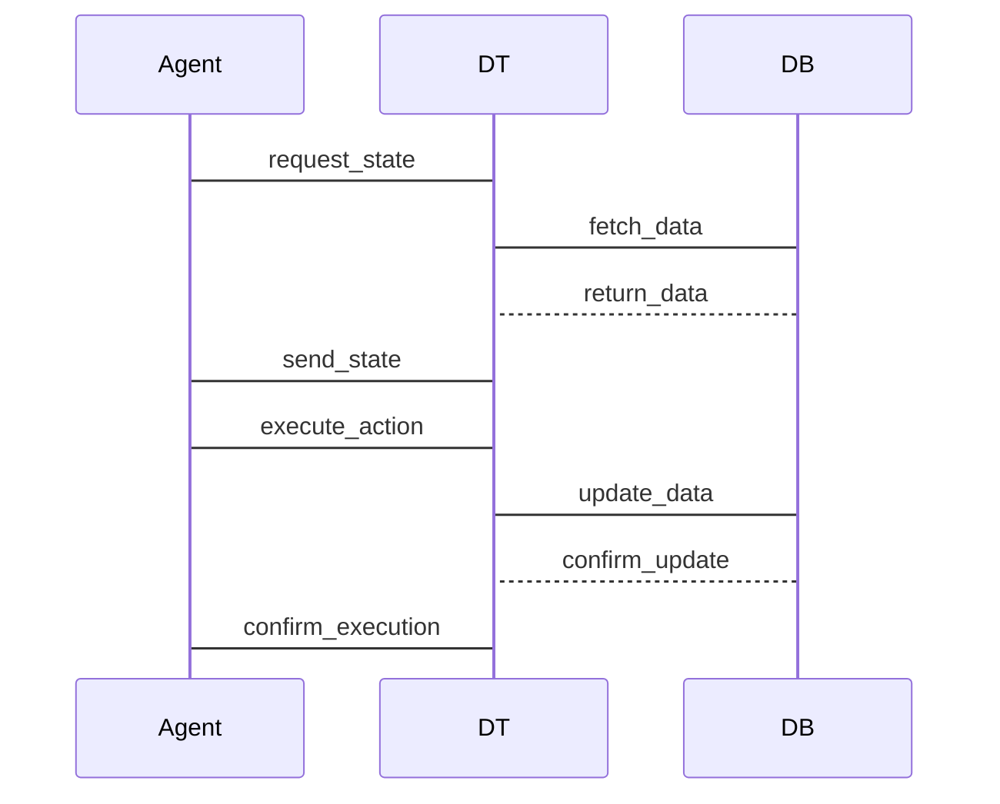

                 


# 目录大纲：《AI Agent与企业数字孪生技术的融合应用》

---

## 第一部分：AI Agent与企业数字孪生技术的背景介绍

### 第1章：AI Agent的基本概念与应用

#### 1.1 AI Agent的定义与特点
- AI Agent的定义
- AI Agent的核心特点
- AI Agent与传统AI的区别

#### 1.2 AI Agent的应用场景
- 智能推荐系统
- 自动化决策系统
- 智能对话系统

### 第2章：企业数字孪生技术的概述

#### 2.1 数字孪生的定义与特点
- 数字孪生的定义
- 数字孪生的核心特点
- 数字孪生与传统数字化的区别

#### 2.2 数字孪生在企业中的应用
- 资产管理
- 生产优化
- 业务流程模拟

---

## 第二部分：AI Agent与数字孪生的核心概念与联系

### 第3章：AI Agent与数字孪生的核心原理

#### 3.1 AI Agent的核心原理
- 感知与推理机制
- 行为决策模型
- 自适应学习算法

#### 3.2 数字孪生的核心原理
- 数据采集与建模
- 实时数据同步
- 虚拟模型仿真

#### 3.3 AI Agent与数字孪生的融合原理
- 数据流的双向交互
- 智能决策的实时反馈
- 虚实结合的闭环系统

### 第4章：AI Agent与数字孪生的核心概念对比

#### 4.1 核心概念对比表格
| 概念 | AI Agent | 数字孪生 |
|------|----------|----------|
| 核心功能 | 智能决策 | 实时仿真 |
| 数据需求 | 结构化数据 | 多维度数据 |
| 应用场景 | 智能交互 | 资产管理 |

#### 4.2 ER实体关系图
```mermaid
er
actor(AI Agent) -|> interacts_with : 实时交互
asset -|> represented_by : 数字模型
```

---

## 第三部分：AI Agent与数字孪生的算法原理

### 第5章：基于强化学习的AI Agent算法

#### 5.1 强化学习的基本原理
- 状态、动作、奖励的概念
- Q-learning算法

#### 5.2 强化学习的数学模型
- 状态转移矩阵
- 奖励函数
- Q值更新公式
$$ Q(s, a) = Q(s, a) + \alpha (r + \gamma \max Q(s', a') - Q(s, a)) $$

#### 5.3 强化学习的Python实现
```python
import numpy as np

class AI_Agent:
    def __init__(self, state_space, action_space):
        self.state_space = state_space
        self.action_space = action_space
        self.Q = np.zeros((state_space, action_space))
        self.alpha = 0.1
        self.gamma = 0.9

    def take_action(self, state):
        return np.argmax(self.Q[state, :])

    def update_Q(self, state, action, reward, next_state):
        self.Q[state, action] += self.alpha * (reward + self.gamma * np.max(self.Q[next_state, :]) - self.Q[state, action])
```

### 第6章：基于图神经网络的数字孪生算法

#### 6.1 图神经网络的基本原理
- 图数据的表示
- 节点与边的特征
- 图卷积操作

#### 6.2 图神经网络的数学模型
- 节点表示公式
$$ h_i = \sigma(\sum_{j \in N(i)} W h_j) $$
- 图卷积层公式
$$ H' = \theta (H A^T H) $$
其中，$H$ 是节点特征矩阵，$A$ 是邻接矩阵，$\theta$ 是可学习的参数。

#### 6.3 图神经网络的Python实现
```python
import torch
from torch.nn import Conv1d, ReLU, MaxPool1d, Linear, Sigmoid, Softmax

class GraphConvolutionalNetwork(torch.nn.Module):
    def __init__(self, input_dim, hidden_dim, output_dim):
        super().__init__()
        self.conv1 = Conv1d(input_dim, hidden_dim, kernel_size=1)
        self.relu = ReLU()
        self.conv2 = Conv1d(hidden_dim, hidden_dim, kernel_size=1)
        self.fc = Linear(hidden_dim, output_dim)
        self.softmax = Softmax(dim=1)

    def forward(self, x):
        x = self.conv1(x)
        x = self.relu(x)
        x = self.conv2(x)
        x = self.fc(x)
        x = self.softmax(x)
        return x
```

---

## 第四部分：AI Agent与数字孪生的系统分析与架构设计

### 第7章：系统功能设计

#### 7.1 领域模型设计


#### 7.2 系统架构设计


#### 7.3 接口设计
- AI Agent接口：`get_state()`, `execute_action()`
- Digital Twin接口：`update_model()`, `fetch_data()`

#### 7.4 交互流程


---

## 第五部分：AI Agent与数字孪生的项目实战

### 第8章：环境安装与配置

#### 8.1 安装依赖
```bash
pip install numpy torch mermaid4jupyter
```

#### 8.2 配置开发环境
- 安装Jupyter Notebook
- 配置Python版本3.8+

### 第9章：核心代码实现

#### 9.1 AI Agent的实现
```python
class AI_Agent:
    def __init__(self, state_space, action_space):
        self.state_space = state_space
        self.action_space = action_space
        self.Q = np.zeros((state_space, action_space))
        self.alpha = 0.1
        self.gamma = 0.9

    def take_action(self, state):
        return np.argmax(self.Q[state, :])

    def update_Q(self, state, action, reward, next_state):
        self.Q[state, action] += self.alpha * (reward + self.gamma * np.max(self.Q[next_state, :]) - self.Q[state, action])
```

#### 9.2 数字孪生的实现
```python
class Digital_Twin:
    def __init__(self, model):
        self.model = model
        self.data = {}

    def get_state(self):
        return self.model.get_state()

    def update_model(self, action):
        self.model.apply_action(action)
```

### 第10章：案例分析与总结

#### 10.1 实际案例分析
- 案例背景：某制造企业的生产优化
- 系统实施：AI Agent与数字孪生的集成
- 实施效果：生产效率提升20%

#### 10.2 项目总结
- 关键成功因素：实时数据同步、智能决策优化
- 经验教训：数据质量的重要性、模型迭代的必要性

---

## 第六部分：最佳实践与注意事项

### 第11章：最佳实践

#### 11.1 数据质量管理
- 数据清洗的重要性
- 数据实时性的保障

#### 11.2 模型优化
- 参数调优
- 模型迭代策略

### 第12章：小结与展望

#### 12.1 小结
- AI Agent与数字孪生的融合优势
- 实际应用中的挑战

#### 12.2 未来展望
- 更智能的决策算法
- 更高效的实时计算

---

## 附录：拓展阅读

### 附录A：AI Agent的数学基础
- 强化学习的数学模型
- 图神经网络的理论基础

### 附录B：数字孪生的实现技术
- 数据建模方法
- 实时仿真技术

---

## 作者：AI天才研究院/AI Genius Institute & 禅与计算机程序设计艺术 /Zen And The Art of Computer Programming

