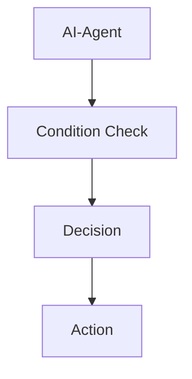
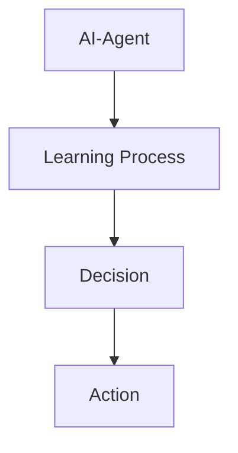
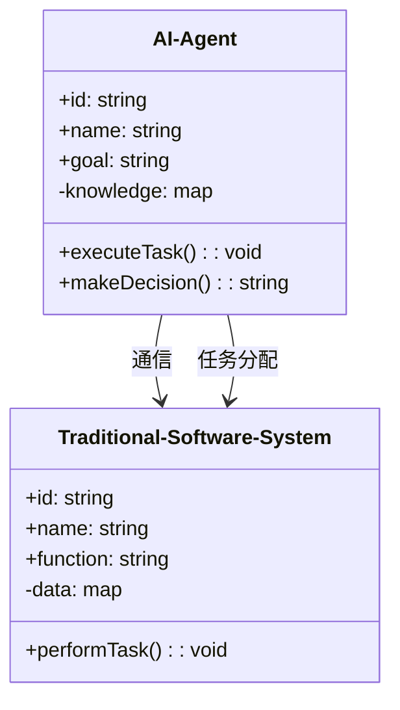

                 


# AI Agent与传统软件系统的协同工作

> **关键词**：AI Agent、传统软件系统、协同工作、算法原理、系统架构、项目实战

> **摘要**：本文深入探讨AI Agent与传统软件系统的协同工作，从基本概念、协同机制、算法原理、数学模型、系统架构到项目实战，全面分析AI Agent如何与传统软件系统协同，实现更高效的系统设计与应用。

---

## 正文

### 第一章：AI Agent的基本概念与特点

#### 1.1 AI Agent的定义与核心要素

AI Agent（人工智能代理）是指能够感知环境、自主决策并执行任务的智能实体。与传统软件系统相比，AI Agent具有以下核心要素：

- **智能性**：能够理解、学习和推理。
- **自主性**：无需外部干预，自主完成任务。
- **反应性**：能够实时感知环境并做出反应。
- **目标导向性**：所有行为都以实现特定目标为导向。

#### 1.2 传统软件系统的特征

传统软件系统通常基于确定性逻辑，具有以下特征：

- **确定性**：输入与输出之间有明确的对应关系。
- **静态性**：功能和行为在设计阶段固定。
- **可预测性**：系统行为可以被预先计算和预测。

#### 1.3 AI Agent与传统软件系统的协同需求

AI Agent与传统软件系统的协同需求主要体现在以下几个方面：

- **信息共享**：AI Agent需要从传统系统中获取数据，传统系统也需要AI Agent的决策结果。
- **任务分配**：根据任务特点，AI Agent与传统系统协同完成任务。
- **行为协调**：确保两者的动作同步，避免冲突。

---

### 第二章：AI Agent与传统软件系统的协同原理

#### 2.1 协同工作的核心概念

协同工作是指AI Agent与传统软件系统通过通信和协作，共同完成特定任务的过程。其核心概念包括：

- **通信机制**：AI Agent与传统系统之间信息传递的方式。
- **任务分配**：根据系统特点分配任务。
- **行为协调**：确保双方行为一致。

#### 2.2 协同工作的属性特征对比

以下是AI Agent与传统软件系统的属性特征对比：

| **属性**       | **AI Agent**          | **传统软件系统**        |
|-----------------|-----------------------|--------------------------|
| **智能性**       | 高                   | 低                       |
| **自主性**       | 高                   | 低                       |
| **反应性**       | 高                   | 低                       |
| **目标导向性**   | 高                   | 低                       |
| **复杂性**       | 高                   | 中                       |
| **灵活性**       | 高                   | 低                       |

#### 2.3 协同工作的ER实体关系图

以下是一个AI Agent与传统软件系统协同工作的实体关系图：

```mermaid
er
    actor AI-Agent {
        id: string
        name: string
        goal: string
    }
    actor Traditional-Software-System {
        id: string
        name: string
        function: string
    }
    entity Task {
        id: string
        description: string
        status: string
    }
    entity Communication-Mechanism {
        id: string
        type: string
        channel: string
    }
    AI-Agent --> Task: 分配
    Traditional-Software-System --> Task: 执行
    AI-Agent --> Communication-Mechanism: 使用
    Traditional-Software-System --> Communication-Mechanism: 使用
```

---

### 第三章：AI Agent与传统软件系统的协同算法

#### 3.1 基于规则的协同算法

**算法原理**：基于规则的协同算法通过预定义的规则来实现任务分配和行为协调。规则通常包括条件和动作。

**Mermaid流程图**：



**Python代码实现**：

```python
# 定义规则库
rules = [
    {'condition': 'task复杂度 < 中等', 'action': '分配给传统系统'},
    {'condition': 'task复杂度 >= 中等', 'action': '由AI Agent执行'}
]

# 协同算法
def协同算法(task):
    for rule in rules:
        if eval(rule['condition']):
            return rule['action']
    return '默认分配'

# 示例
task = {'复杂度': '中等'}
result = 协同算法(task)
print(result)
```

**代码解读**：上述代码定义了一个基于规则的协同算法，根据任务复杂度决定由AI Agent还是传统系统执行。

---

#### 3.2 基于学习的协同算法

**算法原理**：基于学习的协同算法通过强化学习或深度学习等技术，从经验中学习最优的协同策略。

**Mermaid流程图**：



**Python代码实现**：

```python
import numpy as np
import random

# 定义Q-learning参数
alpha = 0.1
gamma = 0.9

# 状态和动作空间
states = ['高复杂度', '中等复杂度', '低复杂度']
actions = ['分配给传统系统', '由AI Agent执行']

# Q表初始化
Q = {s: {a: 0 for a in actions} for s in states}

def 协同算法(state):
    max_action = max(Q[state], key=lambda k: Q[state][k])
    return max_action

# 示例
state = '中等复杂度'
result = 协同算法(state)
print(result)
```

**代码解读**：上述代码实现了一个简单的Q-learning算法，用于学习最优的协同策略。

---

### 第四章：AI Agent与传统软件系统的数学模型

#### 4.1 基于概率推理的数学模型

**贝叶斯定理**：用于计算在给定条件下某个事件的概率。

$$ P(A|B) = \frac{P(B|A) \cdot P(A)}{P(B)} $$

**应用示例**：假设任务分配给传统系统的概率为0.8，任务复杂度高的概率为0.3，那么在任务复杂度高的条件下，任务分配给传统系统的概率为：

$$ P(A|B) = \frac{0.8 \cdot 0.3}{0.3} = 0.8 $$

---

#### 4.2 基于强化学习的数学模型

**Q-learning算法**：用于学习最优策略。

$$ Q(s, a) = Q(s, a) + \alpha \cdot [r + \gamma \cdot \max Q(s', a') - Q(s, a)] $$

**应用示例**：假设当前状态为“高复杂度”，动作“分配给传统系统”获得奖励r=1，未来状态为“完成任务”，则：

$$ Q(高复杂度, 分配给传统系统) = Q(高复杂度, 分配给传统系统) + 0.1 \cdot [1 + 0.9 \cdot \max Q(完成任务, *) - Q(高复杂度, 分配给传统系统)] $$

---

### 第五章：AI Agent与传统软件系统的系统架构

#### 5.1 问题场景介绍

以智能客服系统为例，AI Agent负责处理复杂问题，传统系统负责执行标准操作。

#### 5.2 系统功能设计

**领域模型**：



#### 5.3 系统架构设计

**系统架构图**：


---

### 第六章：项目实战

#### 6.1 环境安装

安装Python和相关库：

```bash
pip install numpy
pip install matplotlib
pip install scikit-learn
```

#### 6.2 系统核心实现源代码

**基于规则的协同算法实现**：

```python
def协同算法(task, rules):
    for rule in rules:
        if eval(rule['condition']):
            return rule['action']
    return '默认分配'

# 示例
rules = [
    {'condition': 'task复杂度 < 中等', 'action': '分配给传统系统'},
    {'condition': 'task复杂度 >= 中等', 'action': '由AI Agent执行'}
]

task = {'复杂度': '高'}
result = 协同算法(task, rules)
print(result)
```

#### 6.3 代码解读与分析

上述代码实现了一个简单的基于规则的协同算法，根据任务复杂度决定由AI Agent还是传统系统执行。

---

### 第七章：总结与展望

#### 7.1 最佳实践

- **小结**：AI Agent与传统软件系统的协同工作能够显著提高系统效率和智能化水平。
- **注意事项**：在实际应用中，需注意数据安全和算法的可解释性。
- **未来展望**：随着AI技术的进步，AI Agent与传统系统的协同将更加智能化和无缝化。

---

**作者**：AI天才研究院/AI Genius Institute & 禅与计算机程序设计艺术 /Zen And The Art of Computer Programming

