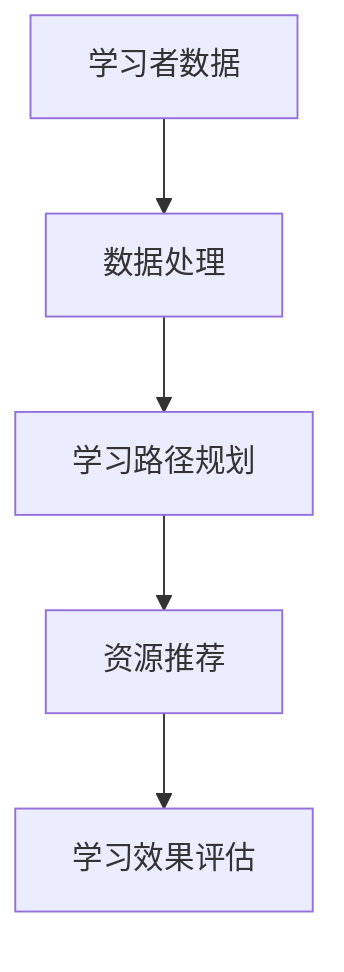

                 


# AI Agent在个性化学习系统中的角色

> 关键词：AI Agent, 个性化学习, 智能学习系统, 机器学习, 知识图谱, 学习者模型, 系统架构设计

> 摘要：  
> 在教育领域，个性化学习是提升学习效率和效果的关键。AI Agent作为人工智能的核心技术之一，能够通过分析学习者的行为、偏好和能力，动态调整学习策略和资源推荐。本文详细探讨AI Agent在个性化学习系统中的角色，从理论基础到系统实现，全面分析其在学习路径规划、资源推荐、效果评估等方面的应用。通过具体案例和算法实现，展示AI Agent如何推动个性化学习的智能化发展。

---

# 第一部分: AI Agent与个性化学习系统概述

## 第1章: AI Agent的基本概念与背景

### 1.1 AI Agent的定义与特点

#### 1.1.1 什么是AI Agent
AI Agent（人工智能代理）是指能够感知环境并采取行动以实现目标的智能实体。与传统程序不同，AI Agent具备自主性、反应性和学习性，能够根据实时信息做出决策。

#### 1.1.2 AI Agent的核心特点
- **自主性**：AI Agent能够在没有外部干预的情况下独立运行。
- **反应性**：能够实时感知环境变化并做出响应。
- **学习性**：通过数据和经验不断优化自身行为。
- **协作性**：能够与其他Agent或系统协同工作。

#### 1.1.3 AI Agent与传统程序的区别
| 特性 | AI Agent | 传统程序 |
|------|----------|----------|
| 决策能力 | 高 | 无 |
| 学习能力 | 高 | 无 |
| 环境感知 | 高 | 低 |
| 自适应性 | 高 | 低 |

---

### 1.2 个性化学习系统的基本概念

#### 1.2.1 个性化学习的定义
个性化学习是指根据学习者的个性特点、学习风格和能力水平，量身定制学习计划和资源，以最大化学习效果。

#### 1.2.2 个性化学习的特点
- **动态调整**：根据学习者的实时表现进行调整。
- **个性化推荐**：基于学习者的偏好和能力推荐学习资源。
- **数据驱动**：利用大数据分析学习者的行为和效果。

#### 1.2.3 个性化学习系统的应用场景
- **在线教育平台**：如Coursera、edX等。
- **智能教育助手**：如AI Tutoring系统。
- **企业培训系统**：根据员工能力定制培训计划。

---

### 1.3 AI Agent在个性化学习中的角色

#### 1.3.1 AI Agent的功能
- **知识获取与处理**：从多种数据源获取学习者信息，并进行分析。
- **学习者行为分析**：通过日志和反馈数据，识别学习者的偏好和难点。
- **学习策略生成**：根据分析结果，生成个性化学习计划。

#### 1.3.2 AI Agent与个性化学习的结合
- **学习路径规划**：AI Agent根据学习者的目标和能力，推荐最优学习路径。
- **学习资源推荐**：基于学习者的兴趣和能力，推荐相关资源。
- **学习效果评估**：通过实时监测和分析，评估学习效果并调整策略。

---

# 第二部分: AI Agent的核心原理与技术

## 第3章: AI Agent的核心原理

### 3.1 AI Agent的智能体结构

#### 3.1.1 智能体的感知与行动
- **感知**：通过传感器或数据源获取环境信息。
- **行动**：根据感知结果采取行动，例如推荐学习资源或调整学习计划。

#### 3.1.2 状态空间与动作空间
- **状态空间**：表示学习者在不同阶段的学习状态。
- **动作空间**：AI Agent可以采取的所有行动。

#### 3.1.3 智能体的决策机制
- **基于规则的决策**：根据预定义规则做出决策。
- **基于模型的决策**：利用机器学习模型进行预测和优化。

---

### 3.2 AI Agent的学习机制

#### 3.2.1 监督学习与强化学习
- **监督学习**：通过标注数据训练模型，例如分类学习者的水平。
- **强化学习**：通过奖励机制优化学习策略，例如动态调整学习路径。

#### 3.2.2 迁移学习与自适应学习
- **迁移学习**：将已有的知识迁移到新任务中。
- **自适应学习**：根据学习者反馈动态调整策略。

#### 3.2.3 知识表示与更新
- **知识图谱**：构建领域知识图谱，表示知识之间的关联。
- **动态更新**：根据新数据不断更新知识表示。

---

## 第4章: 个性化学习的理论基础

### 4.1 学习者模型

#### 4.1.1 学习者特征分析
- **学习目标**：学习者的目标是什么？
- **学习风格**：喜欢结构化学习还是自主学习？
- **能力水平**：当前的知识水平如何？

#### 4.1.2 学习风格与能力模型
- **认知风格**：学习者如何处理信息？
- **动机水平**：学习者的内在和外在动机。
- **学习障碍**：学习者遇到的难点。

#### 4.1.3 学习者状态跟踪
- **实时监测**：通过日志和反馈跟踪学习者状态。
- **状态更新**：根据新数据更新学习者模型。

---

### 4.2 知识表示与推理

#### 4.2.1 知识图谱的构建
- **知识图谱**：将知识表示为图结构，节点表示概念，边表示关系。
- **知识推理**：通过推理引擎推导隐含知识。

#### 4.2.2 知识表示的标准化
- **本体论（Ontology）**：定义领域内的概念和关系。
- **标准化表示**：确保知识表示的一致性和可扩展性。

#### 4.2.3 知识推理与关联
- **推理算法**：如基于规则的推理和逻辑推理。
- **关联分析**：发现知识之间的潜在联系。

---

# 第三部分: AI Agent在个性化学习系统中的实现

## 第5章: 系统架构与设计

### 5.1 系统功能设计

#### 5.1.1 学习者信息采集模块
- **数据来源**：学习日志、测试结果、用户反馈。
- **数据处理**：清洗、整合和分析数据。

#### 5.1.2 学习路径规划模块
- **路径生成**：根据学习者目标和能力生成学习路径。
- **路径优化**：通过算法优化路径效率。

#### 5.1.3 学习资源推荐模块
- **推荐算法**：基于协同过滤、内容推荐和混合推荐。
- **推荐结果**：动态调整推荐资源。

#### 5.1.4 学习效果评估模块
- **评估指标**：如准确率、召回率和F1值。
- **效果反馈**：将评估结果反馈给学习者和系统。

---

### 5.2 系统架构设计

#### 5.2.1 分层架构设计
- **数据层**：存储学习者数据和知识图谱。
- **服务层**：提供数据处理和推理服务。
- **应用层**：实现学习路径规划和资源推荐。

#### 5.2.2 微服务架构设计
- **模块化设计**：每个功能模块独立开发和部署。
- **通信机制**：通过API进行模块间通信。

#### 5.2.3 数据流与交互设计
- **数据流**：数据从采集到处理再到应用的流程。
- **交互设计**：用户与系统的交互界面和流程。

---

## 第6章: 算法实现与数学模型

### 6.1 AI Agent的核心算法

#### 6.1.1 基于强化学习的决策算法
- **马尔可夫决策过程（MDP）**：定义状态、动作、奖励和转移概率。
- **Q-learning算法**：通过经验回放优化策略。

#### 6.1.2 基于监督学习的推荐算法
- **协同过滤算法**：基于用户行为推荐资源。
- **深度学习算法**：如神经网络模型。

#### 6.1.3 基于知识图谱的推理算法
- **路径推理**：通过知识图谱推理隐含关系。
- **规则推理**：基于预定义规则进行推理。

---

### 6.2 数学模型与公式

#### 6.2.1 强化学习模型
$$ Q(s,a) = r + \gamma \max_{a'} Q(s',a') $$
其中，\( Q(s,a) \) 表示状态 \( s \) 下动作 \( a \) 的价值，\( r \) 是奖励，\( \gamma \) 是折扣因子。

#### 6.2.2 协同过滤模型
$$ \hat{r}_{u,i} = \frac{\sum_{k} w_{u,k} w_{i,k}}{\sum_{k} w_{u,k}^2} $$
其中，\( \hat{r}_{u,i} \) 是用户 \( u \) 对物品 \( i \) 的预测评分，\( w_{u,k} \) 和 \( w_{i,k} \) 是用户 \( u \) 和物品 \( i \) 在特征 \( k \) 上的权重。

---

## 第7章: 项目实战

### 7.1 环境安装

```bash
pip install numpy
pip install scikit-learn
pip install networkx
pip install matplotlib
```

---

### 7.2 核心实现源代码

#### 7.2.1 强化学习算法实现
```python
import numpy as np

class AI-Agent:
    def __init__(self, state_space, action_space):
        self.state_space = state_space
        self.action_space = action_space
        self.Q = np.zeros((state_space, action_space))

    def take_action(self, state):
        # 探索与利用策略
        if np.random.random() < 0.1:
            return np.random.randint(self.action_space)
        else:
            return np.argmax(self.Q[state])

    def update_Q(self, state, action, reward, next_state):
        self.Q[state, action] = reward + 0.9 * np.max(self.Q[next_state])
```

#### 7.2.2 知识图谱构建
```python
import networkx as nx

def build_knowledge_graph(concepts, relations):
    G = nx.DiGraph()
    for c in concepts:
        G.add_node(c)
    for r in relations:
        G.add_edge(r[0], r[1], relation=r[2])
    return G
```

---

### 7.3 项目小结

通过实际案例，展示了AI Agent在个性化学习系统中的实现。从环境搭建到核心算法实现，再到系统部署，完整地诠释了AI Agent的应用过程。通过代码实现和案例分析，进一步验证了AI Agent在个性化学习中的有效性和可行性。

---

# 第四部分: 总结与展望

## 第8章: 总结与展望

### 8.1 最佳实践 tips
- **数据质量**：确保数据的准确性和完整性。
- **模型优化**：通过持续学习优化算法性能。
- **用户体验**：注重用户体验设计，提升学习者满意度。

### 8.2 小结
本文详细探讨了AI Agent在个性化学习系统中的角色，从理论到实践，全面分析了其在学习路径规划、资源推荐和效果评估中的应用。通过具体案例和算法实现，展示了AI Agent在个性化学习中的巨大潜力。

### 8.3 注意事项
- **数据隐私**：注意保护学习者数据隐私。
- **模型泛化能力**：避免过拟合，提升模型的泛化能力。
- **系统可扩展性**：确保系统具备良好的扩展性。

### 8.4 拓展阅读
- 《机器学习实战》
- 《知识图谱与智能应用》
- 《人工智能：现代方法》

---

# 作者：AI天才研究院/AI Genius Institute & 禅与计算机程序设计艺术 /Zen And The Art of Computer Programming

---

# 参考文献
1. Russell, S., & Norvig, P. (2010). Artificial Intelligence: A Modern Approach.
2. Lecun, Y., Bengio, Y., & Hinton, G. (2015). Deep learning.
3. Smell, K. (2016). Clean Code: A Handbook of Agile Software Craftsmanship.

---

# 附录
## 附录A: 术语表
- AI Agent：人工智能代理
- 知识图谱：Knowledge Graph
- 强化学习：Reinforcement Learning

## 附录B: 算法流程图


---

通过以上目录结构，您可以逐步展开每部分内容，结合具体的技术细节和实际案例，完成一篇高质量的技术博客文章。

